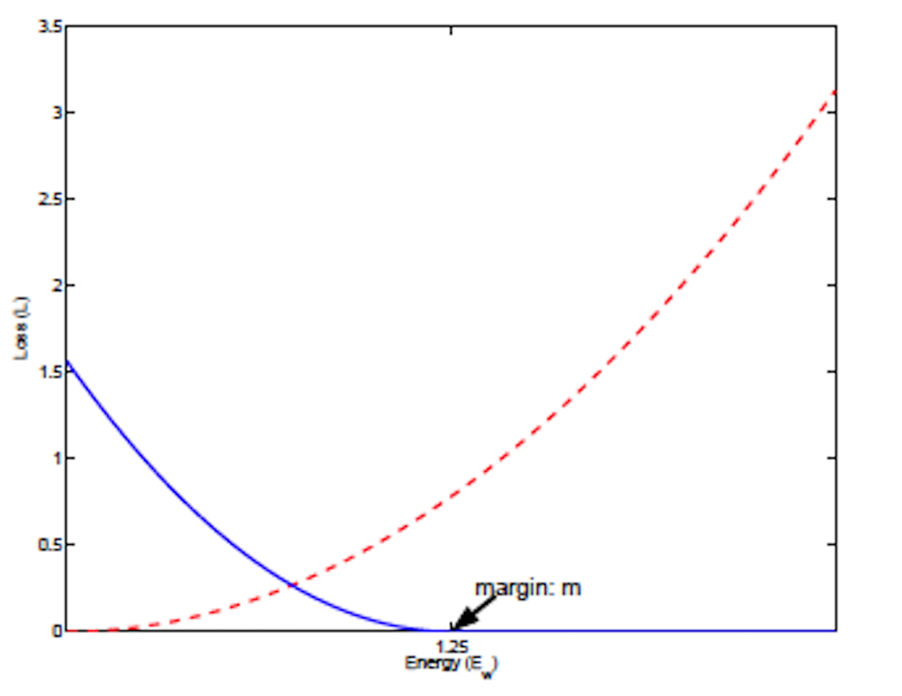

# 4.5.8 分类项-对比损失（Contrastive Loss）

**迭代公式：**

$$
{\displaystyle 
 \begin{aligned}
   D_i &= | prediction_i| \\
   Loss &= \frac{1}{N} \sum_{i=1}^N(y_i \cdot D_i^2 + (1 - y_i) \cdot max(0,\ m - D_i)^2) \\
 \end{aligned}
}
$$

**图像（蓝线 Pred，红线 True）：**

<center>
<figure>
   
    <figcaption>
      <p>图 4.5.8-1 Contrastive Loss 函数图</p>
   </figcaption>
</figure>
</center>

**特性：**

1. 基于投影平面角度，降维分离样本类型
2. $$m$$ 项代表被认为相似的确认半径
3. 样本相似则 $$y_i = 1$$ ，样本不相似则 $$y_i = 0$$ 
4. 增大类间差异并且减小类内差异，损失函数值最小时，两者达到均衡点
5. 当样本不相似时，预测距离在 $$D_w < m$$ 的范围内，模型会试图增大不相似样本点之间的距离
6. 越接近样本情况，损失越小
7. 光滑（smooth），适合优化算法
8. 非指数计算，算力消耗相对较低

**对比损失（Contrastive Loss）** 函数是在 2006 年，由 R.Hadsell、S.Chopra、Y.LeCun 在论文《通过学习不变映射进行降维运算》[\[14\]][ref]  中 ，提出的一种用来解决样本集中数据聚集过于密集，而导致的 **退化解（Degenerate Solutions）** 问题。

这种通过降维来寻找合适投影角度，来得到比较优秀的分离聚类的分类损失函数的想法，首次经过合理的论证，并进入广泛大众的视野。为后续 Triplet Loss、N-pair Loss 等，类似的通过分离特性来进行处理的损失函数，打下了基础。

对比损失中，输入的 $$y_i$$ 指的是选取样本点 $$S_i$$ 和某个类型标签的接近程度。
同理， $$prediction_i$$ 则是模型预测的该样本 $$S_i$$ 距离指定类型标签的结果。

为什么将之前通用的样本的类型概率数据，转为距离描述呢？这是因为，对比损失是通过 **确认半径（Margin）** 来得到优化的。对比损失函数结果越小，越认为当前权重所对应训练结果越接近实际情况。而方法对于预测距离小于确认半径的数据，取用 $$max(0,\ m - D_i)^2$$ 拉高了损失函数的结果，达到淘汰分类的效果。

## **Contrastive Loss 算子化**

利用 C 语言实现对算子的封装，有：

```C
#include <math.h>
#include <stdio.h>

double contrastive_loss(double *y_true, double *y_pred, int size, double margin) {
  double sum = 0;
  for (int i = 0; i < size; i++) {
    double distance = y_pred[i];
    sum += y_true[i] * pow(distance, 2) +
           (1 - y_true[i]) * pow(fmax(0, margin - distance), 2);
  }
  return sum / size;
}

int main() {
  int size = 3;
  double y_true[] = {0.5, 0.75, 1.0}; // single sample base 'cat' 'puppy' 'dog'
  double y_pred[] = {0.6, 0.8, 0.9};  // single sample pred 'cat' 'puppy' 'dog'
  // int num_classes = 3;
  double margin = 0.2;
  double loss_value = contrastive_loss(y_true, y_pred, size, margin);
  printf("The contrastive loss is %f\n", loss_value);
  return 0;
}
```

运行验证可得到结果：

```C
The contrastive loss is 0.1250000
```


[ref]: References_4.md