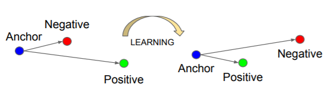

# 4.5.9 分类项-三元损失（Triplet Loss）

**迭代公式：**

$$
{\displaystyle 
 \begin{aligned}
   Dn_i &= \sqrt{|| negative_i   - y_i||^2} \\
   Dp_i &= \sqrt{|| positive_i \ - y_i||^2} \\
   Loss &=  \frac{1}{N} \sum_{i=1}^N \max( \ 0, \  {Dp_i} - {Dn_i} + m \ ) \\
 \end{aligned}
}
$$

**图像（蓝线 Pred，红线 True）：**

<center>
<figure>
   
    <figcaption>
      <p>图 4.5.8-1 Contrastive Loss 函数图</p>
   </figcaption>
</figure>
</center>

**特性：**

1. 使具有相同标签的样本（positive）之间的距离，尽量接近
2. 使具有不同标签的样本（negative）之间的距离，尽量远离
3. 要求输入 3 个分类样本子集：相似正样本集、相反负样本集、原样本对照集，并行训练
4. 以 $$m$$ 项代表被认为相似的确认半径，Loss 最小则理论上 Dn->m, Dp->0
5. 越接近样本情况，损失越小
6. 光滑（smooth），适合优化算法
7. 非指数计算，算力消耗相对较低

**三元损失（Triplet Loss）** 函数来自于论文《FaceNet: A Unified Embedding for Face Recognition and Clustering》中 [\[15\]][ref] ，提出的通过拆分 **三元组（Triplet）** ，选取正负样本与原样本进行差异化处理，来让预测值趋近于原样本而远离负样本的一种损失函数。

**三元组（Triplet）** 来自于输入分批的卷积神经网络（CNN）结果，我们需要将输入样本分为三类，在每一时代（Epoch）中都进行相同神经网络隐藏层权重（Wights）影响下的结果计算。累计 **单次样本** 的损失计算（Loss），以求得分批的损失函数（Cost Function）输出评分。

## **Triplet Loss 的使用**

介于三元组损失提出最初目的，是为了进行人脸识别（FD [Face Detection]），我们因此取用人脸样本集举例。类似于人脸样本集，一般由 $$P$$ 位不同人的 $$D$$ 张该人不同脸的图片样本组成的，样本总量 $$P \cdot D$$ 大小的数据集。

以此为基础，三元组损失要求的三种样本分类子集分别是：

- **相似正样本集（Positives）** ，由同人不同脸组成的 $$D -1$$ 大小子集
- **相反负样本集（Negatives）** ，由不同人不同脸组成的 $$(P-1) \cdot (D -1)$$ 大小子集
- **原样本对照集（Anchors）** ，由不同人同脸（选一校订）组成的 $$P$$ 大小子集

这三类子集，在数据分批后，会被分为相同批数并组合为一批数据，作为单次迭代输入数据，参与训练。我们仍然采用角标 $$[_i]$$ 来表示分批，那么有：

$$
{batch\_size} = (D_i-1) + (P_i-1)(D_i-1)+P_i = D_iP_i
$$

则，在分批数据参与一次批计算后，最终会构成 $${batch\_size} $$ 大小的一组 **嵌入集（Embeddings）** ，被我们用来计算损失函数（Loss）的实际处理对象。

最终，计算损失后的三元组，**按照质量** 来划分，可以分为三个类别：

- **易辨三元组（easy triplets）** ，可以使得 loss 基本趋近于 0 的类型
- **难辩三元组（hard triplets）** ，有 Dn < Dp 的三元组，一定会误判，尽量避免
- **模糊三元组（semi-hard triplets）** ，有 Dp < Dn < Dp + m，这是我们重点训练的类型

可见，如果构成的三元组一上来就是易辨三元组，那只能证明模型训练参数的启动配置，使模型陷入了过拟合。通常，我们希望每一时代（Epoch）被计算的三元组都具有一定的模糊特性，而方便权重更新。因此，**模糊三元组（semi-hard triplets）才是迭代的选择** 。

那么怎么评估当前的三元组，是否是模糊三元组呢？

其实很简单，通过当前正样本集所占有效样本的百分比，就能大致估算是否属于模糊类型。记正样本集百分比为 $${fraction\_positive}$$ ，则有：

$$
{\displaystyle 
 \begin{aligned}
   {fraction\_positive} &= \frac{num\_positive}{num\_available} \\
                        &= \frac{count( loss > 0)}{count(vector)} \\
 \end{aligned}
}
$$

我们一般取 $${fraction\_positive} > 0.2$$ 认为是一次有效训练中的模糊三元组数据。

三元损失在对比损失的基础上更近一步，引入了正负样本概念，来使得分类预测结果更加聚集，且使分类间能够更加远离。本身计算并不算非常复杂，因此可以用在如人脸识别、车辆识别等模型的移动端迁移上。但是，三元损失只是在对比损失上引入正负概念，实际处理过程中，每次只能对比一个负样本而忽略了其他的非关联性。这样就很容易造成迭代结果陷入不稳定（在多个距离相近但实际不同的负样本间抖动），或者局部最优解。

## **Triplet Loss 算子化**

利用 C 语言实现对算子的封装，有：

```C
#include <math.h>
#include <stdbool.h>
#include <stdio.h>

#define BATCH_SIZE 10     // Batch_size = Samples_of_Person x Data/Person
#define VECTOR_SIZE 128   // Extract output layer Feature vector's dimissions
#define DEVIDE_SAFE 1e-12 // protect when gridant at 0 will be to lage

// Pairwise Distance Calculation
void pairwise_distance(double embeddings[BATCH_SIZE][VECTOR_SIZE],
                       double distances[BATCH_SIZE][BATCH_SIZE], bool squared) {
  for (int i = 0; i < BATCH_SIZE; i++) {
    for (int j = 0; j < BATCH_SIZE; j++) {
      double dot_product = 0.0;
      double square_norm_i = 0.0;
      double square_norm_j = 0.0;

      for (int k = 0; k < VECTOR_SIZE; k++) {
        dot_product += embeddings[i][k] * embeddings[j][k];
        square_norm_i += embeddings[i][k] * embeddings[i][k];
        square_norm_j += embeddings[j][k] * embeddings[j][k];
      }

      distances[i][j] = square_norm_i - (2.0 * dot_product) + square_norm_j;

      if (!squared) {
        if (distances[i][j] < 0.0) {
          distances[i][j] = 0.0;
        } else {
          distances[i][j] = sqrt(distances[i][j]);
        }
      }
    }
  }
}

// Get Triplet Mask
void get_triplet_mask(int labels[BATCH_SIZE],
                      bool mask[BATCH_SIZE][BATCH_SIZE][BATCH_SIZE]) {
  for (int i = 0; i < BATCH_SIZE; i++) {
    for (int j = 0; j < BATCH_SIZE; j++) {
      for (int k = 0; k < BATCH_SIZE; k++) {
        // indices_equal
        bool i_not_j = (i == j);
        bool i_not_k = (i == k);
        bool j_not_k = (j == k);
        bool distinct_indices = (i_not_j && i_not_k && j_not_k);

        // label_equal
        bool i_equal_j = (labels[i] == labels[j]);
        bool i_equal_k = (labels[i] == labels[k]);
        bool valid_labels = (i_equal_j && !i_equal_k);

        // mask depends on both
        mask[i][j][k] = (distinct_indices && valid_labels);
      }
    }
  }
}

// Batch All Triplet Loss
double triplet_loss(int labels[BATCH_SIZE],
                    double embeddings[BATCH_SIZE][VECTOR_SIZE], double margin,
                    bool squared, double *fraction_positives) {

  // So, this only caused once per epoch for certain storage space
  double pairwise_distances[BATCH_SIZE][BATCH_SIZE];
  bool triplets_avail_masks[BATCH_SIZE][BATCH_SIZE][BATCH_SIZE];

  // Pairwise distance calculation
  pairwise_distance(embeddings, pairwise_distances, squared);

  // Get triplet mask
  get_triplet_mask(labels, triplets_avail_masks);

  // Triplet loss calculation
  int num_positive = 0;
  int num_validate = 0;
  double triplet_cost = 0.0;
  {
    for (int i = 0; i < BATCH_SIZE; i++) {     // i for Anchor
      for (int j = 0; j < BATCH_SIZE; j++) {   // j for positive
        for (int k = 0; k < BATCH_SIZE; k++) { // k for negative
          double current_mask = triplets_avail_masks[i][j][k];
          double current_loss =
              fmax(0, current_mask * (pairwise_distances[i][j] -
                                      pairwise_distances[i][k] + margin));
          triplet_cost += current_loss;

          // Calculate number of positive triplets and valid triplets
          if (current_loss > 0) {
            num_positive++;
          }
          if (current_mask > 0) {
            num_validate++;
          }
        }
      }
    }
    // Calculate fraction of positive triplets
    *fraction_positives = (double)num_positive / ((double)num_validate + DEVIDE_SAFE);
    return triplet_cost / (double)(num_positive + DEVIDE_SAFE);
  }
}

int main() {
  // Example input (fulfill to BATCH_SIZE x VECTOR_SIZE)
  // Use Random labels and embeddings for testing
  // Use three classes as different type, to generate labels
  int labels[BATCH_SIZE];
  double embeddings[BATCH_SIZE][VECTOR_SIZE];
  for (int i = 0; i < BATCH_SIZE; i++) {
    labels[i] = rand() % 3;
    for (int j = 0; j < VECTOR_SIZE; j++) {
      embeddings[i][j] = (double)rand() / (double)RAND_MAX;
    }
  }

  double margin = 0.2;
  double fraction_positives = 0.0;
  double triplet_cost_value = triplet_loss(labels, embeddings, margin, false, &fraction_positives);
  printf("The triplet loss is %f with positives %f \n", triplet_cost_value, fraction_positives);
  return 0;
}
```

运行验证可得到结果：

```C
The triplet loss is 0.266667 with positives 0.300000
```

虽然看上去比较复杂，然而在实际执行过程中， **一个时代（Epoch）只会执行一次三元组损失的计算** ，而空间复杂度上，仅额外增加了距离矩阵和遮罩的共 $$O({batch\_size}^2 + {batch\_size}^3)$$ 的空间大小。是完全可以接受的。

代码中，我们所使用的 **遮罩（Mask）矩阵** ，实际上相当于将原论文中对三元组的三分类计算，用遮罩来代替了有效处理流程。这样做可行的基本原因，在于距离矩阵本身，在以整体分批不做区别输入的情况下，仍旧可以用全体分批包含样本的欧式距离，构成 $${batch\_size} \times {batch\_size}$$ 大小的差异矩阵，记为 $$M_{dist}$$ 。以人脸检测为例，同人物同一张样本脸的情况，就相当于 $$M_{dist}$$ 的对角线位置。而对角线两侧的数据，则涵盖了同人不同脸、不同人的两种类型。

如此，计算所得 $$M_{dist}$$ 实际就包含和三元组的三分类计算中，不同分类的 **所有距离类型** 。与此同时，最终损失函数的计算，是要叠加所有分类独立计算的单次损失的。进而，让我们有机会通过遮罩矩阵就能直接规划不同分类情况，应该取用哪一个距离值，来直接获取当次损失值叠加。如果记遮罩矩阵为 $$M_{mask}$$ ，那么三元损失有工程公式：

$$
{\displaystyle 
 \begin{aligned}
   Loss &=  M_{dist} \cdot M_{mask} \\
 \end{aligned}
}
$$

而既然是矩阵乘法，除了本书例子中采用的纯 C 语言实现外，也可以通过 GPU 算子来实现进一步加速。类似于 CUDA 算子，或部分成熟的推理引擎（如 Keras、py-Touch 等）就是这样处理的。

从这个例子就能看出， **有效的工程化能够极大提升算法的训练效率，减小耗时。**

这即是工程师在此处的关键作用。


[ref]: References_4.md