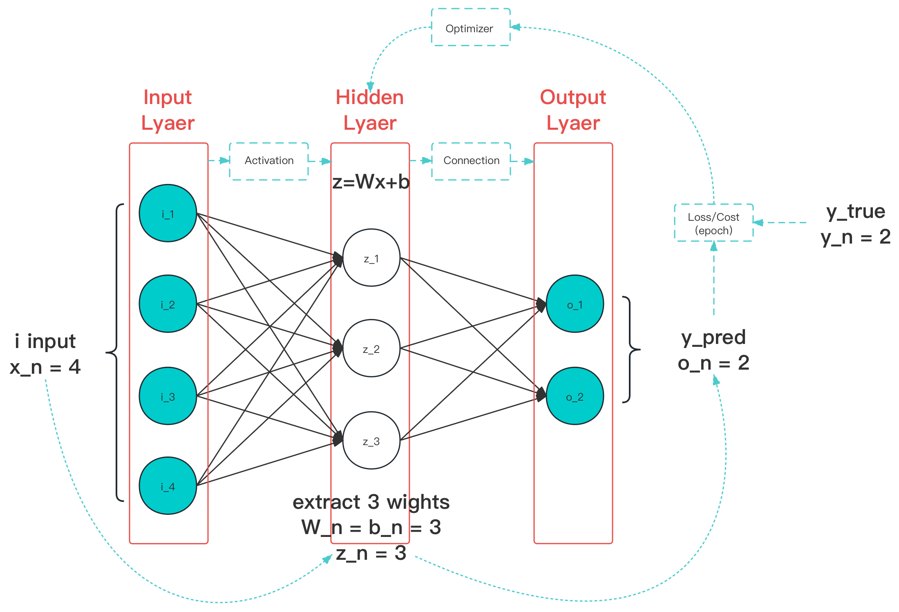

# 4.6 优化算法/优化器（Optimizer）

**优化算法（Optimize Function）** 是一种更快实现权重更新的处理办法。常用优化算法能够根据梯度方向和一些其他的关键信息，对当前权重作出更有效率的更新，降低训练所需要的迭代次数，同时提高模型鲁棒性。根据其相对固定的作用位置，在工程中，部署优化算法的 **关键单一组件** ，被称为 **优化器（Optimizer）** 。

<figure>
   
    <figcaption>
      
图 4.6-1 优化器作用阶段（图中蓝色线条）示意图

   </figcaption>
</figure>

优化器起作用于 **隐藏层（Hidden Layer）** 的训练中特征权重的加速迭代，所以生效阶段在每一 **时代（Epoch）** 后，完成 **损失函数（Cost）** 计算的 **结算位置** 。

[ref]: References_4.md