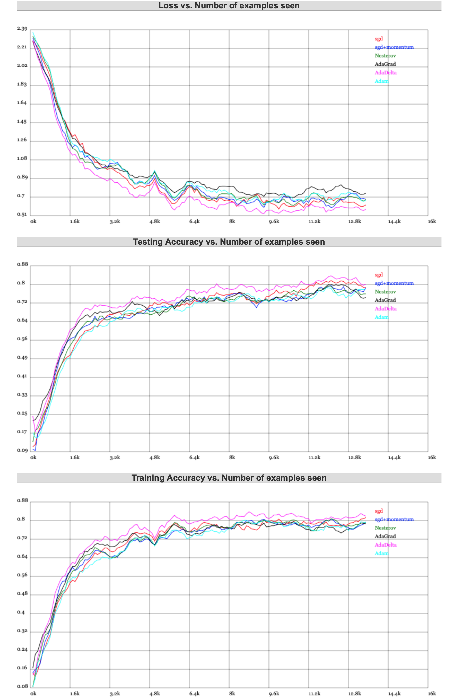

# 4.6.5 优化算法对比与使用建议

这里引用一下特斯拉人工智能主管 **[安德烈·卡尔帕蒂（Andrej Karpathy）](https://github.com/karpathy)** 的 在线 Demo（使用的是 pytouch） ，来做一下演示。

我们需要将脚本改成如下（增加 Adam）：

```python
// lets use an example fully-connected 2-layer ReLU net
var layer_defs = [];
layer_defs.push({type:'input', out_sx:24, out_sy:24, out_depth:1});
layer_defs.push({type:'fc', num_neurons:20, activation:'relu'});
layer_defs.push({type:'fc', num_neurons:20, activation:'relu'});
layer_defs.push({type:'softmax', num_classes:10});

// below fill out the trainer specs you wish to evaluate, and give them names for legend
var LR = 0.01;   // learning rate
var BS = 8;      // batch size
var L2 = 0.001;  // L2 weight decay
nets = [];
trainer_defs = [];
trainer_defs.push({learning_rate:10*LR, method: 'sgd', momentum: 0.0, batch_size:BS, l2_decay:L2});
trainer_defs.push({learning_rate:LR, method: 'sgd', momentum: 0.9, batch_size:BS, l2_decay:L2});
trainer_defs.push({learning_rate:LR, method: 'nesterov', momentum: 0.9, batch_size:BS, l2_decay:L2});
trainer_defs.push({learning_rate:LR, method: 'adagrad', eps: 1e-6, batch_size:BS, l2_decay:L2});
trainer_defs.push({learning_rate:1.0, method: 'adadelta', eps: 1e-6, ro:0.95, batch_size:BS, l2_decay:L2});
trainer_defs.push({learning_rate:LR, method: 'adam', eps: 1e-6, betas:[0.9, 0.999], batch_size:BS, l2_decay:L2});

// names for all trainers above
legend = ['sgd', 'sgd+momentum', 'Nesterov', 'AdaGrad', 'AdaDelta', 'Adam'];
```

在运行一小段时间后（大概 11 k 经处理样本左右），有如下的结果：

<center>
<figure>
   
</figure>
</center>

<br>

感兴趣的读者，可以自行前往地址：

https://cs.stanford.edu/people/karpathy/convnetjs/demo/trainers.html

观看更为直观的展示。

通过对比，我们也发现了问题。针对震荡优化的几个算法，在速度上不太有优势；而针对强弱重点的算法，又不是太稳定。

**但 Adam 综合表现始终良好，证明了其优秀的可用性。**

至此，我们可以得出大致结论：

- **如果数据稠密**，实际上简单的算法就能得到鲁棒性很好的结果。参考使用 标准动量 的 SGD/BGD/MBGD + Momentum 。加动量既可以保证相对快的训练速度，也可以一定程度避免局部最小值。

- **如果数据稀疏**，因为需要对关键特征点进行提取，所以需要用一些自适应算法。对于简单凸性和相对不复杂的数据，可以采用 L1、L2正则化 + 组合分桶。而复杂一些的，就需要采用Adagrad, Adadelta, RMSprop, Adam 等方式了。

- **如果关键参数更多的出现在运算后期**，即梯度稀疏一定程度后，则Adam 比 RMSprop 效果会好。这时 Adam 明显是最好的选择。

按照这样的策略，灵活且合理的选取优化器。


[ref]: References_4.md