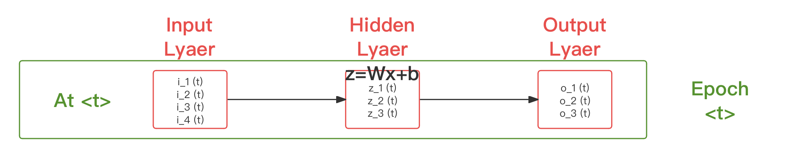
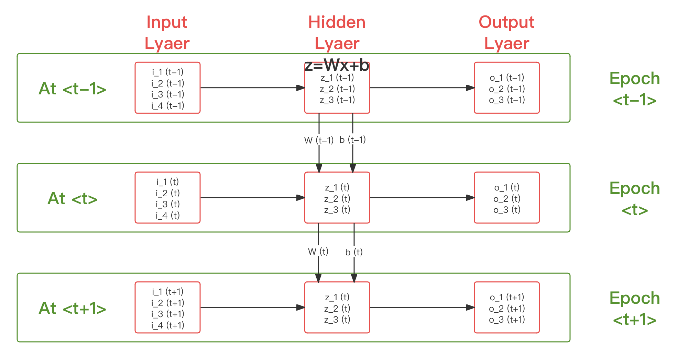
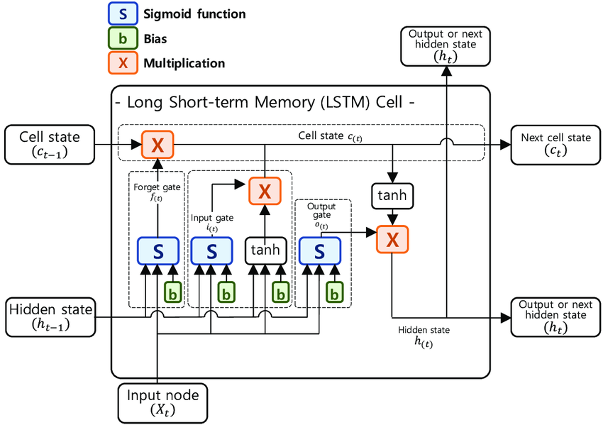
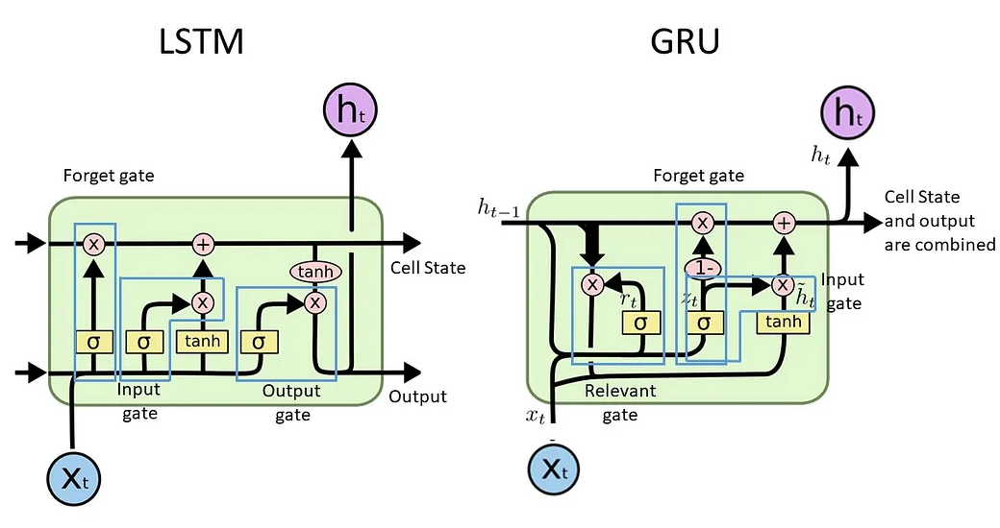

# 4.7.2 循环神经网络（RNN [Recurrent Neural Network]）

**循环神经网络（RNN [Recurrent Neural Network]）**，是指为了应对序列数据类型而专门设计的一种，具有一定程度 **长期记忆（Long Term Memory）** 和 **短期记忆（Short Term Memory）** 能力的神经网络模型类型。即然被称为“循环”神经网络，则循环在整个 RNN 流水线过程中，起到了至关重要的作用。
	
那么，具体时如何“循环”的呢？这一点需要从网络的权重更新细节说起。

## **RNN 自 MLP 的改进**

在前文中，我们认识了朴素神经网络的代表多层感知器（MLP）。并通过分析 输入层、隐藏层、输出层，了解了具体的推理过程。一个典型的三层 MLP ，有如下展示（**[见 4.2](Docs_4_2.md)**）：

<figure>
   
    <figcaption>
      
图 4.7.2-1 经典层分类在简单神经网络中位置示意图（切片）

   </figcaption>
</figure>

取图例所示，记时代 $$t$$ 时，有输入 $$\vec{i} = [i_1,\ i_2,\ i_3,\ i_4]$$ , 隐藏层存在变化 $$\vec{z} = W \cdot \vec{i} + \vec{b}$$ 使输出为 $$\vec{z} = [z_1,\ z_2,\ z_3]$$ ，而输出层在接收处理 $$\vec{z}$$ 后得当次迭代结果为 $$\vec{o} = [o_1,\ o_2]$$ 。则上图就有时代 $$t$$ 的简化表示：

<figure>
   
    <figcaption>
      
图 4.7.2-2 经典层分类在简单神经网络中位置简化图（切片）

   </figcaption>
</figure>

在 MLP 中，每一个时代（Epoch）的权重更新过程，都不会受到前一个时代的影响，并且也未影响即将参与训练的后一个时代。这种现象，被称为 **“无记忆”（No-Memory）**，即每一次权重更新只和当前时代的训练有关。

为了解决这个问题，1982 年，**约翰·霍普菲尔德 (John Hopfield)** 基于 **威廉·伦茨（Wilhelm Lenz, 1888 - 1957）** 和 **恩斯特·伊辛（Ernst Ising, 1990 - 1998）** 等人提出的 **伦茨-伊辛模型（Lanz-Ising Model）** 思想 ，改善了基础 MLP ，创建了首个被称为 **“霍普菲尔德网络模型（HN [Hopfield Network]）”** 的类现代 RNN 神经网络，用于处理时序优化。该模型试图在神经元间引入趋势关联性，来实现一定程度的短期记忆。虽然是相当有开创性的工作，但由于需要保存较多变元受控影响参数过多，且由于核内只采用了 Tanh 简单引入非线性，却无其他处理，从而存在 **梯度消失（Vanishing Gradient）**，导致不太具有工程优势。

受到启发，**塞普·霍克雷特（Sepp Hochreiter）** 和 **尤尔根·施密特胡伯 (Jürgen Schmidhuber）** 于 1991 年提出了 **长短期记忆（LSTM [Long Short-Term Memory]）** 模型 [\[20\]][ref] ，通过简化迭代参数到隐藏层神经元结构内，引入了具有一定程度时间性的权重 $$W(t)$$ 和偏移 $$b(t)$$ ，代替了原有单步权重 $$W$$ 和偏移 $$b$$ 。相比 HN 的独立时序权重影响参数， LSTM 相当于用相对复杂结构，替换原 $$\vec{z} = W \cdot \vec{i} + \vec{b}$$ 在时序上的单步计算的方式，而非在式子本身上施加额外干预。

假设我们三个时代，分别是 $$t - 1$$ 、 $$t$$ 、 $$t + 1$$ ，那么改进后的 LSTM 有：

<figure>
   
    <figcaption>
      
图 4.7.2-3 长短期记忆（LSTM）网络结构类比 MLP 的时序关联性示意图

   </figcaption>
</figure>

如此，使得权重和偏移也参与到了迭代中，进而通过两者在时序上的传递，实现了过往训练结果的历史传递。并同时，减小了非样本量的人为干扰。

而 LSTM 也不出意料，成为了 RNN 模型的 **经典代表**。当下我们所谈论的 RNN 结构，基本都可归类为 LSTM 的变体。

## **RNN 元胞（Cell）**

显然，原有通过分层（Layer）来对神经网络过程区分的方式，是不足以描述 RNN 在时间上的复杂过程的。而从时序角度来看，**每个时代（Epoch）的一次迭代过程**，都可以被抽象为重复且工程独立的计算模块。于是， RNN 中，我们将单个传统层级神经网络（NN）在时刻 $$t$$ 的一次 **完整计算**，称为位于 $$t$$ 的 **RNN 元胞（Cell）**。如图 4.7.2-3 中绿色框体内的部分。

同时，LSTM 也对单元内的传统网络部分进行了进一步精简，取消了层中神经元（Neuron）的固定状态，并打破了层的阈限，采用 **计算节点（Node）** 的泛化称谓，分化解构了层和层内的结构性与功能性。这种更接近现代电子电路设计的处理方式，也是为何 RNN 类型网络会更容易被 **硬件化（Hardwareization）** 的主要原因。

对于 **RNN 元胞（Cell）**，有些文献中将其译为神经元，这从仿生学角度来说无可厚非。但以神经网络命名歧义上讲，会发现并不合适。因此，本书参照早期机器学习（ML）的 **元胞自动机** 和 **受限玻尔兹曼机（RBM）** 中，对元胞（Cell）的定义，来代称 RNN 原文献对 Cell 的表述。**两者在概念和作用上都更为接近，是以为更贴切的意译。** 另外，RNN 计算节点（Node），其实就是 MPL 意义上的节点（**[见 4.2](Docs_4_2.md)**），只是在功能上存在从 RNN 角度出发的独特分类。为做区别，我们称之为 **RNN 节点（RNN-Node）**。

## **RNN 节点（RNN-Node）**

回到正题，怎么理解 RNN 节点（RNN-Node）呢？

**RNN 节点（RNN-Node）** 即为 RNN 中，对算子（Operator）进行最小粒度能力整合的 **基本组成** 成分。相较于层本身的双重特性来说，单元更加强调自身的功能性，并将自身的结构性完全交由元胞结构设计来表示。而从单元功能来说，主要分为两种：

- **门（Gate）节点**，用来控制元胞内外特征，对元胞影响的单核运算，根据功能有多种子类；
- **层（Layer）节点**，遵循 MLP 标准层内神经元特性的类层功能组件；

因此，层（Layer）节点，其实就是朴素神经网络中的层（Layer）。而各类 门（Gate）节点 和 各个节点间的数据流组合方式，即元胞驱动公式（Cell Formula），才是 RNN 元胞结构上的独特之处。

<figure>
   
    <figcaption>
      
图 4.7.2-4 长短期记忆（LSTM）的三连元胞结构图（即绿框内实际情况）<a href="References_4.md">[20]</a>

   </figcaption>
</figure>

上图中，紫色部分即为 门（Gate）节点，而黄色部分则为 层（Layer）节点。箭头代表数据流向。工程上，通常将门节点和门的前一级输入，共同作为门来表示。这在工程导向的数据驱动流程图上就有所体现。

想要明确三者间的关系，就需要结合实际模型来理解。这里我们仍基于 LSTM 来说明。

## **RNN 长短期记忆（LSTM）模型**

在图 4.7.2-4 中，我们仅从宏观的角度，用类 MLP 的便于承接的方式说明 RNN 的时序性。而 LSTM 真正元胞内的流程，是如下所示（数据驱动流程图）：

<figure>
   
    <figcaption>
      
图 4.7.2-5 长短期记忆（LSTM）的元胞结构详情 <a href="References_4.md">[21]</a>

   </figcaption>
</figure>

其中，

- 以 $$t$$ 代表迭代时代；
- 以 $$c$$ 代表 **元胞状态（Cell State）** 向量，代表元胞长期记忆内的高维特征；
- 以 $$h$$ 代表 **隐藏状态（Hidden State）** 向量，代表元胞短期记忆内的高维特征；
- 以 $$f$$ 代表 **遗忘门（Forget Gate）** 输出，遗忘门用于随机或策略（训练）的丢弃前一级输入；
- 以 $$i$$ 代表 **输入门（Input Gate）** 输出，输入门控制（训练）需被长期记忆的高维特征；
- 以 $$o$$ 代表 **输出门（Output Gate）** 输出，输出门控制（训练）需被短期记忆的高维特征；
- 以 $$X$$ 代表元胞的输入特征，即对 RNN 而言经样本预处理后的输入；
- 以 $$O$$ 代表元胞的输出特征，可见 $$t$$ 时有 $$O_t = h_t$$ ，即 **LSTM 输出为当前元胞隐藏状态向量** ；

由此，我们引申出了 LSTM 的 **元胞驱动公式（Cell Formula）** ：

$$
{\displaystyle 
 \begin{aligned}
   Input:
   &\quad X_t \\
   Gate:
   &\begin{cases}
     i_t &= Sigmod(X_t \cdot B^i \ +\ h_{t-1} \cdot W^i ) \\
     f_t &= Sigmod(X_t \cdot B^f \ +\ h_{t-1} \cdot W^f ) \\
     o_t &= Sigmod(X_t \cdot B^o \ +\ h_{t-1} \cdot W^o ) 
   \end{cases} \\
   Cell\ State:
   &\begin{cases}
     c_t &= Sigmod(f_t \otimes c_{t-1} \ +\ i_t \otimes \hat{c}_t ) \\
     \hat{c}_t &= Tanh(X_t \cdot B^g \ +\ h_{t-1} \cdot W^g ) 
   \end{cases} \\
   Hidden\ State:
   &\quad h_t = Tanh(c_t) \otimes o_t \\
   Output:
   &\quad O_t = h_t \\
 \end{aligned}
}
$$

式子中，
**权重（Weight）** 和 **偏移（Bias）** 分别为 $$W$$ 和 $$B$$ 采用 **矩阵形式表示**。 
而 $$\{W^i,\ W^f,\ W^o,\ W^g \}$$ 和 $$\{B^i,\ B^f,\ B^o,\ B^g \}$$ ，则分别代表着 **遗忘门（Forget Gate）** 、 **输入门（Input Gate）** 、 **输出门（Output Gate）** 和 **基本元（Standard Neuron）** 的权重和偏移。它们都将参与 RNN 训练中的迭代，即我们要训练的对象。

我们将这种权重 $$W$$ 和偏移 $$B$$ 参与训练，并在时序上以相反于时间流向传递（指从后时间节点的观察角度）历史锚点的方式，称为 **随时间反向传播（BPTT [Back Propagation Through Time]）**。而我们在前文中所介绍的 **反向传播（BP [Back Propagation]）**，在这种意义下，则为 **当期反向传播（BPIE [Back Propagation In Epoch]）**。BPTT 考虑了时间的影响，相当于引入时序概念的升级版 BP（即 BPIE）。也正是这样，BPTT 仍然具有 BP 的一切相关特性，同时却额外的具有了历史因素 ，谨慎二者差异。

这就是一个 LSTM 的 RNN 元胞的基本构成了。除了 LSTM 外，还有各种改进类型，如：引入了 “窥视孔连接（Peephole）”的 Peephole-LSTM，采用了门循环控制单元（GRU [Gated Recurrent Unit]）的 GRU-LSTM 等。这些变体所改进的皆是 LSTM 的内部流结构，有了现在的基础，读者亦可独立了解了。此处给出对比图例，以简单供参考：

<figure>
   
    <figcaption>
      
图 4.7.2-6 LSTM 与 GRU-LSTM 的元胞结构对比

   </figcaption>
</figure>

那么 RNN 有哪些适合的优势场景呢？

## **RNN 的常见场景**

考虑到 RNN 的特点，RNN 类模型最为擅长的基本在于需要考虑时间关联性的场景。

目前上，工业界对 RNN 的运用已经涵盖了：

- 自然语言处理（NLP），如：文本分析（智能输入法）、机器翻译、语音助手等；
- 音视频生成，如：音乐生成、视频生成、合成编辑、自动裁剪等；
- 时序预测，如：股票分析、气象预测、医疗诊断等；

不过随着 Transformer 的兴起，RNN 在 NLP 领域的地位早已面临着极大挑战（自 2018 年 BERT 达成 SOTA 以来）。2023 年中的 Google Bard（BERT，GPT-3，Transformer） 大战 OpenAI ChatGPT-4（ChatGPT-4，Transformer） ，以 Bard 的糟糕（相对）表现失败告终。最终又进一步促成了 Google 加速推进了另一个用 Transformer 做为主体的  Gemini 大语言模型（LLM）发布，来扳回颜面。

而这精彩纷呈的大语言模型大战中，采用 RNN 作为骨架的 OpenAI Jukebox（12B 参数）和 EleutherAI GPT-NeoX（20B 参数），甚至没有激起水花。可见一斑。

如果 RNN 在短期内没有进一步突破，可见 Transformer 会逐步取而代之。但这，并不意味着 RNN 会退出历史舞台。技术永远都是博弈的过程，在人工智能的终极命题被解决前，无人能够断言。

需要注意的是，**RNN 从始至终意图解决的都是“记忆”问题，而非 CNN 所解决的“提取”问题**。两者 **并不冲突**，甚至还可以适度融合，即组合形成 CNN+RNN 融合模型（Hybrid Model）。由 CNN 的特征提取（FE）子网得倒高级特征，再经过 RNN 代替原 CNN 的特征选择（FS）子网和结果输出（RO）子网，实现对高级特征的时间敏感训练。

[ref]: References_4.md