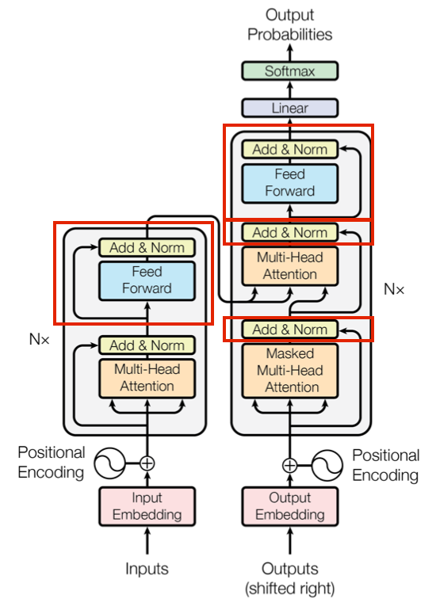
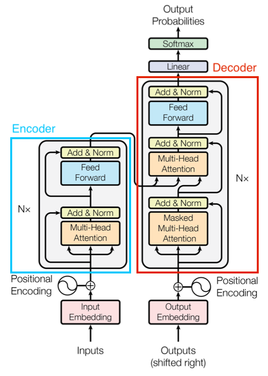

# 4.7.3 自注意力网络（Transformer）

**自注意力网络（Transformer）** 是一种基于自注意力机制（Self-Attention）的深度神经网络结构分类。最初的设计原型来自于 2015 年由 **约书亚·本吉奥（Yoshua Bengio，1964～Present）** 有关神经网络翻译模型优化而提出的设想 [\[22\]][ref] 。

本吉奥 通过引入一种模拟生物在感知、学习、思考过程中自然而然产生的，主被动关注关键点的生理机制，来解决传统 机器学习（ML）**编码器-解码器（Encoder-Decoder）** 翻译模型（Translation Models）的 **长句压缩固定长度（Fixed-Length）** 特征，导致潜层语意缺失的问题。这种模拟方式，能够将长句（Long Sequence）中的信息，抽象为固定长度（Fixed-Length）向量的集合，**而非** 以单一向量的形式进行后续相关语意分解工作。

基于该研究，Google AI 实验室终于在 2017 年以 《Attention Is All You Need》[\[23\]][ref] 一文，确定了基本的网络结构设计。
从此，开启了 Transformer 类型网络的快速发展之路。

## **Transformer 核心成分 & 核心机制**

**自注意力机制（Self-Attention）** 是 Transformer 的 **核心机制** 。而 **Transformer 网络结构** ，则是与自注意力机制提取特征 **配套** ，用于达成转译目的（不一定非要是语言）的整个编解码器 **系统作业流水线** 。

<center>
<figure>
   
    <figcaption>
      <p>图 4.7.3-1 Transformer 网络结构 <a href="References_4.md">[23]</a></p>
   </figcaption>
</figure>
</center>

Transformer 在结构中，参考了 RNN 和早期 自编解码网络系统的特点，采用 **时序上以串行元胞（Cell），而单次迭代中编解码（Encoder-Decoder）并行（Parallelization）** 的方式，结合两者各自所长。

如此设计的原因，一方面来自于 Transformer 意图改善 RNN 对 **序列到序列（Seq2Seq）** 任务的处理能力。这便要求，其本身对输入样本的高级特征提取，能够拆解直接关联性，但却又可以保留更高维度潜藏的逻辑信息。另一方面，注意力机制只能提炼解构关联性特征，但我们需要的结果却是对原有输入的另一种未改变原意的表述，决定了必须有编解码类似的结构（至少目前为止）对高级特征进行非对称的压缩和还原。

自注意力机制，保证了前一点。整体结构，保证了后一点。而 **注意力单元（Attention Unit）** ，则是用于完成自注意力处理的组成框架的一部分（图中橙色）。

根据最精简实现，

从 **注意力单元（Attention Unit）** 上，Transformer 包括了两个分步主成分：

- **放缩点积注意力（SDPA）** ，用于完成对于一次 Transformer 输入的单一注意力筛选；
- **多头注意力（MHA）** ，通过对放缩点积的平行组合，完成对同一输入的多点注意力检测；

从 **网络结构（Network Structure）** 上，Transformer 包括了两个主体模块：

- **编码器（Encoder）模块** ，用于完成对样本输入的高级特征提取；
- **解码器（Decoder）模块** ，用于完成对样本输入的转译结果输出；

通俗来说，以人做类比，两者一个属于 Transformer 的“灵魂”，一个属于 Transformer 的“身躯”。从宏观角度，是互为一体的存在。这与前两节 CNN 、RNN 里，结构占相对主导地位（即框架为改进的关键）的情况有所不同。而是皆有突破。

正是这样，Transformer 才称为深度学习领域，在模型结构基本方法论上，近年来相对具有较大革新突破的工具。

刚刚我们提到的注意力单元，是对自注意力机制的实现。从上可知，Transformer 基本的一切都是围绕其运转的。那么，什么是自注意力机制（Self-Attention）呢？

## **自注意力机制（Self-Attention）**

**自注意力机制（Self-Attention）** 是 Transformer 中，一种目的用于模拟生物注意力的数学量化范式。是 **一类方法的方法论** 。

想要能够区分轻重，最容易想到的方式便是加权了。因此，在 Transformer 中，对注意力的数值定义便是：

**对输入序列元素，根据输入查询元素键值对，以求动态计算加权平均值的权重。**

所以，我们计算注意力，需要的输入数据序列就必须包含三个重要的信息维度，分别是：

- **查询信息，即查询（Query）** ，代表当前输入具有可能被关注（查询）的意义表征；
- **关键信息，即键值（Keys）** ，代表当前输入在查询（Query）下可能提供的信息特征；
- **标值信息，即取值（Values）** ，代表与键值（Key）关联的量化查询积分；

最终，由三者共同借由算法组成 **输出特征（Output Fratures）** ，即 **加权平均值的权重** ，作为 Transformer 的神经网络内高级特征。

<center>
<figure>
   
    <figcaption>
      <p>图 4.7.3-2 Transformer 的输入转换过程 <a href="References_4.md">[23]</a></p>
   </figcaption>
</figure>
</center>

显然，虽然键值和取值可以按照 **传统键值对（Key-Value Pair）** 形式直接配对（当然也可以有复杂映射实现）。但从查询到键值还需要有一定转换方式，通过它来实现将查询可能的关注点，分散到对应的键值上，从而构成可以计算的结果。这个转换方式，就是 **评分函数（Score Function）** 。

一般而言，评分函数可分为两类：

- **简单评分函数（Simple Scorer）** ，此类以单步函数来完成粗糙的映射，如直接 Sigmod
- **复杂评分函数（Complex Scorer）** ，此类用朴素神经网络或模型来完成映射，如 MLP 评分

而现有大部分 Transformer 中，采用的都是第二个类型的实现。包括基础 Transformer 的 SDPA 和 MHA 在内，皆属于此类。

当评分函数确定后，每个查询都能拆解到键值上，并获取对应积分了。此时，就需要由 **输出函数（Output Function）** 来将各个部分组合成最终的高级特征向量进行输出。

假设，

- 以 $$Q$$ 代表查询，
- 以 $$Seq$$ 表示输入序列，
- 以角标 $$[_i]$$ 代表所处输入序列 $$Seq$$ 的位置，有 $$i$$ 处键值 $$K$$ 取积分 $$V$$ ，
- 以 $$Out$$ 代表经过注意力筛选后，的高级特征向量，
- 记评分函数为 $$f_{score}$$ ，输出函数为 $$f_{out}$$ 

则有：

$$
{\displaystyle 
 \begin{aligned}
   w_i &= \frac{f_{score}(K_i,\ Q)}{\sum{f_{score}(K_i,\ Q)}} \\
   Out &= \sum{f_{out}(w_i \cdot V_i)} \\
 \end{aligned}
}
$$

如此，我们便得到了 **注意力量化公式** 。实际上，这种按序列计算的过程，常被直接 **以矩阵运算代替** 。公式的意义更多在于原理描述。即，自注意力机制工程化的指导过程。依照上式，便可以通过构建评分函数和输出函数，来设计 Transformer 里的注意力单元了。

经典 Transformer 中，将这一步分为了两个组成。

## **放缩点积注意力（SDPA [Scaled Dot-Product Attention]）**

**放缩点积注意力（SDPA [Scaled Dot-Product Attention]）** 被用于计算单点注意力，即只生成一个注意力高级特征输出。

<center>
<figure>
   
    <figcaption>
      <p>图 4.7.3-2 Transformer 的 SDPA 单元 <a href="References_4.md">[23]</a></p>
   </figcaption>
</figure>
</center>

如图，红框部分便是 SDPA 的评分函数，而蓝框部分则为 SDPA 的输出函数。

我们记一个输入序列，其序列长度为 $$T$$ 而查询维度为 $$d$$ 。这里需要解释一下，什么是序列长度和查询维度。我们举个例子，如果有一条查询为 $$\vec{Q} = [[0.12,\ 3.57],\ [0.71,\ 1.14],\ [0.95,\ 0.63]]$$ ，那么我们就称 **单条查询的维度** 为 $$d=2$$ ，而 **总共有长度** 为 $$T=3$$ 条查询。即 **查询维度就是一条查询所包含的参数数目** ，而 **序列长度就是单次输入样本包含查询的数目** 。

当 $$d$$ 确定，对于长度 $$T$$ 的输入数据序列，就有 查询 $$Q \in \mathbb{R}^{T \times d}$$ 、 键值 $$K \in \mathbb{R}^{T \times d}$$ 、 取值 $$V \in \mathbb{R}^{T \times d}$$  ，即三者都是 $$T \times d$$ 大小的矩阵。则 SDPA 的 **评分函数（Score Function）** 有如下表示：

$$
{\displaystyle 
 \begin{aligned}
   f_{score}(K,\ Q) = softmax \left( \frac{Q \cdot K^T}{\sqrt{d}} \right) \\
 \end{aligned}
}
$$

而输出时采用的 **输出函数（Output Function）** ，就是一个取值与评分结果的矩阵点积（Dot-Product），这也是 SDPA 名称的原因。即：

$$
{\displaystyle 
 \begin{aligned}
   f_{out} &(f_{score},\ V) = f_{score} \cdot V \\
   Output &= softmax \left( \frac{Q \cdot K^T}{\sqrt{d}} \right) \cdot V \\
 \end{aligned}
}
$$

过程中 $$\tfrac{1}{\sqrt{d}}$$ 即 **缩放因子（Scale Factor）** 。而 Mask 操作是可选的，一般过程中作用于 $$f_{score}$$ 的 SoftMax 操作之前，已经完成点积和缩放的 $$\left( \tfrac{Q \cdot K^T}{\sqrt{d}} \right)$$ 这个 $$T \times T$$ 大小的矩阵。通过屏蔽部分数据或进行简单过滤，来进一步加工交给 Softmax 的输入。

实际操作时，可以在 **编码器（Encoder）** 阶段引入 Mask 层来做 **部分参数优化** ，加速训练。而 **解码器（Decoder）** 需要用 Mask 来做 **零值处理** 。即，将 $$\left( \tfrac{Q \cdot K^T}{\sqrt{d}} \right)$$ 结果中的部分数据标记为 0 或极小值（如 1e-12 ，避免权重消失），**组成不完整数据** 。

在经过一系列运算后，根据矩阵点乘的特性，最终输出为具有 $$Output \in \mathbb{R}^{T \times d}$$ 的大小的 **单次注意力张量（Tensor）** 。

不过，我们想要的是有多个关注点的高维特征，单个注意力无法满足要求。
这就需要 MHA 了。

## **多头注意力（MHA [Multi-Head Attention]）**

**多头注意力（MHA [Multi-Head Attention]）** 是对多个单头注意力，即放缩点积注意力（SDPA），**处理的加权复合** 。

千万需要小心的是，正是在 MHA 中，我们引入了真正用于 **持久训练** 的迭代用权重参数，构成参数矩阵参与模型训练。

<center>
<figure>
   
    <figcaption>
      <p>图 4.7.3-3 Transformer 的 MHA 单元与 SDPA 单元的关系</p>
   </figcaption>
</figure>
</center>

如图，蓝色气泡内便是 SDPA 单元。在图例中，由 $$h$$ 个 SDPA 单元，经过链接层（Concat 为简写），和线性归一化（目的是为了保证输入输出等大），构成了最终 MHA 的输出。

所以，从另一个角度来看，链接层函数就相当于 MHA 的评分函数，线性归一化则是输出函数。而 MHA 真正意义上的输入，即每个 SDPA 输入的集合。有：

<center>
<figure>
   
    <figcaption>
      <p>图 4.7.3-3 Transformer 的 MHA 单元 <a href="References_4.md">[23]</a></p>
   </figcaption>
</figure>
</center>

上方即为 MHA 在 Transformer 中的基本算子表示。红框部分便是 MHA 的评分函数，而蓝框部分则为 MHA 的输出函数。可见，评分函数和输出函数的概念，也是相对于被选择作为参考的单元本身而言的。

我们仍然取一个输入序列（MHA 和 SDPA 都是对同一序列的操作，仅目标输出不同），其序列长度为 $$T$$ 而查询维度为 $$d$$ 。

记当前一个 MHA 总共有 $$h$$ 个 SDPA 单元，每个单元按照顺序，由角标 $$[_i]$$ 表示序号。则，对于顺序 $$i$$ 的 SDPA 单元输入，有查询 $$Q_i \in \mathbb{R}^{T \times d}$$ 、 键值 $$K_i \in \mathbb{R}^{T \times d}$$ 、 取值 $$V_i \in \mathbb{R}^{T \times d}$$ ，即三者都是 $$T \times d$$ 大小的矩阵。并有经过 SDPA 处理后的输出 $$Output_i \in \mathbb{R}^{T \times d}$$ ，简记为 $$O_i \in \mathbb{R}^{T \times d}$$ 交付链接。

由于采用了多组 SDPA 组合，我们不再能以固定形式，确定每个 SDPA 输入的重要程度。因此，需要对每个构成 MHA 的 SDPA 算子的输入 $$[Q_i,\ K_i,\ V_i]$$ 进行确权，来通过训练得到实际 MHA 的输入的初始关注点。

介于这一点，我们对每一组顺序  的 SDPA 单元输入进行加权。引入 **输入权重（Input Wights）** ，根据加权对象，分为 $$i$$ 组查询权重 $$W^Q_i \in \mathbb{R}^{d \times T}$$ 、 $$i$$ 组键值权重 $$W^K_i \in \mathbb{R}^{d \times T}$$ 、 $$i$$ 组取值权重 $$W^V_i \in \mathbb{R}^{d \times T}$$ 。 注意，**加权需要用和加权对象维度转置（Transpose）的矩阵** 。

加权后，顺序 $$i$$ 的 SDPA 算子的输入就变为了 $$[Q_i \cdot W^Q_i,\ K_i \cdot W^K_i,\ V_i \cdot W^V_i]$$ 。同时，这也是为什么 MHA 中，Q、K、V 需要经过一次线性归一化。即目的是为了保证每一组的输入在样本值上的价值等同。

调整后，**MHA 的 SDPA 计算公式** 化为：

$$
{\displaystyle 
 \begin{aligned}
   O_i &= softmax \left( \frac{Q_iW^Q_i \cdot (K_iW^K_i)^T}{\sqrt{d}} \right) \cdot V_iW^V_i \\
       &= SDPA(Q_i W^Q_i,\ K_i W^K_i,\ V_i W^V_i) \\
 \end{aligned}
}
$$

使得 MHA 的评分函数（Score Function）有如下表示：

$$
{\displaystyle 
 \begin{aligned}
   f_{score}(K,\ Q, \ V) = Concat \left( O_1,\ O_2,\ \cdots \ ,\ O_i \right) \\
 \end{aligned}
}
$$

其中，**连接函数（Concat [Connection Function]）是简单全链接** 。即，将每一个 SDPA 的输出 $$O_i$$ 顺序拼接，构成 $$(FC =\sum O_i )\in \mathbb{R}^{T \times dh}$$ 的输出。 

而输出时采用的输出函数（Output Function），存在迭代的 **目的权重（Target Wight）** 矩阵 $$W^O \in \mathbb{R}^{hd \times T}$$ ，以权重代表注意力积分并参与训练（即动态的积分）。有：

$$
{\displaystyle 
 \begin{aligned}
   f_{out} &(f_{score},\ W^O) = linear(f_{score} \cdot W^O) \\
   Output &= linear(Concat \left( O_1,\ O_2,\ \cdots \ ,\ O_i \right) \cdot W^O) \\
 \end{aligned}
}
$$

其中，**线性归一化算子（Linear）** 其实同 MHA 的 SDPA 输入线性归一化一样，目的在于归一化 MHA 的输出以取得我们想要的多关注点高维特征，并同时让输出保持与输入相同的维度大小。即，通过 $$linear(f_{score} \cdot W^O)$$ ，让原本 $$(f_{score} \cdot W^O) \in \mathbb{R}^{T \times dh}$$ 大小的数据，通过以 $$T \times d$$ 大小分块，分为 $$h$$ 块叠加求均值，来使最终输出的 $$Output \in \mathbb{R}^{T \times d}$$ 大小。

所以，MHA 的完整处理公式为：

$$
{\displaystyle 
 \begin{aligned}
   f_{out} &(f_{score},\ W^O) = linear(f_{score} \cdot W^O) \\
   linear &(f_{score} \cdot W^O) = \sum^h \frac{(f_{score} \cdot W^O)_i}{\sum (f_{score} \cdot W^O)_i} \\
   Output &= linear(Concat \left( O_1,\ O_2,\ \cdots \ ,\ O_i \right) \cdot W^O) \\
 \end{aligned}
}
$$

至此，特征提取完毕。

**由 MHA 的输出 $$Output \in \mathbb{R}^{T \times d}$$ 和权重矩阵 $$[W^O,\ \sum [W^Q_i,\ W^K_i,\ W^V_i] ]$$ ，参与到 Transformer 训练的内部过程。**

## **Transformer 的辅助处理单元**

在正式开始 Transformer 的网络结构讲解前。我们还需要了解一下，自注意力网络（Transformer）中的 **其它辅助机制** 。

在经典结构中，Transformer 除了使用自注意力来完成特征提取外，还使用了由 ResNet 提出在当时已经相对成熟的 **残差连接（Residual Connection）** 技术，并使用简单 **前馈控制（Feed Forward）** 来修正 MHA 特征，提供非线性和引入深层次的 **隐藏权重（Hidden Wight）** 参与训练。

<center>
<figure>
   
    <figcaption>
      <p>图 4.7.3-4 Transformer 辅助机制作用位置</p>
   </figcaption>
</figure>
</center>

图中红框的部分，即为这两个机制起作用的位置。一般，在 Transformer 中，将其分别称为 **前馈控制单元（FFU [Feed Forward Unit]）** 和 **加和标准化单元（ANU [Add & Norm Unit]）** 。

记两者的输入为 $$X$$ ，输出为 $$\hat{X}$$ 。

大部分情况下前馈控制单元的输入 $$X$$ 都为 MHA 的输出，即 $$X = MHA_{Output} \in \mathbb{R}^{T \times d}$$ 但也有例外。加和标准化单元则需要两个输入。不过，在这两个单元的处理中，我们为了保证输入前后特征张量（Tensor）的一致性，要求不论 FFU 还是 ANU，都必须实现输入输出大小相等。

所以，在整个 Transformer 中，FFU 和 ANU 都有 $$X,\hat{X} \in \mathbb{R}^{T \times d}$$ 。

而两者的 **驱动公式（Core Formula）**，则为：

$$
{\displaystyle 
 \begin{aligned}
   FFU:
   &\begin{cases}
     Input  &: \ X \\
     Output &: \ \hat{X} = ReLU(X \cdot W_1 + B_1) \cdot W_2 + B_2  
   \end{cases} \\
   ANU:
   &\begin{cases}
     Input  &: \ X_1,\ X_2 \\
     Output &: \ \hat{X} = Norm(X_1 + X_2) 
   \end{cases} \\
 \end{aligned}
}
$$

每一个 FFU 都能为我们引入一套权重 $$W = [{W_1}^{T \times d},\ {W_2}^{T \times d}]$$ 和偏移 $$B= [{B_1}^{T \times d},\ {B_2}^{T \times d}]$$ 参与训练。而 ANU 则负责通过 **归一化（Normalization）** 将样本数据映射到一定范围区间内，保证前级输出的统一尺度衡量，加速模型收敛。

所有原件准备就绪，Transformer 网络结构就非常容易理解了。

## **Transformer 网络结构**

在本节开始时提到，自注意力网络（Transformer）从结构角度分为编码器（Encoder）和 解码器（Decoder）。两者在整体上分别对同一个序列（Sequence）进行不同处理。


<center>
<figure>
   
    <figcaption>
      <p>图 4.7.3-5 Transformer 编解码器示意图</p>
   </figcaption>
</figure>
</center>

如图，蓝框内部分即编码器（Encoder）的构成，红框内部分则是解码器（Decoder）。

**编码器（Encoder）** 接收正常顺序的序列，如：“I am eating an apple” 经过 **位子编码（Positional Encoding）** ，再以特征工程提炼出的 $$[Q,\ K,\ V]$$ 。

之后，交由 MHA 提取高级特征，并将提取的高级特征经过一次 ANU 归一化。最终，归一化的高级特征通过 FFU 加隐藏的核心权重和偏移，再次经由一次 ANU 归一化，完成当前时代的编码部分处理。记编码器的输出为 $$O_{enc}$$ ，显然 $$O_{enc}$$ 有 $$T \times d$$ 大小。

<br>

**解码器（Decoder）** 接收被标记过的序列，如：“I am eating an apple” 经过标记（Shifted Right）变为 “\</s\> I am eating an apple” ，再由特征工程提炼出的 $$[Q,\ K,\ V]$$ 输入。

**标记（Shifted Right）** 的作用是为了区分每一个序列的起点，例子里我们采用的是 “\</s\>” ，当然也可以用其他标志。
之后，交由 **加遮罩（Mask）的 MHA** 提取高级特征，并 ANU 归一化。这里的 **遮罩** ，就是前文中提到的 SDPA 的可选 Mask 操作，即解码器对 $$\left( \tfrac{Q \cdot K^T}{\sqrt{d}} \right)$$ 的零值处理。简单的 Mask 有：

$$
{\displaystyle 
 \begin{aligned}
  &Mask =   
  \begin{bmatrix} 
    & 0 \   ,   & 1 \ ,   & 1 \ , \cdots,\   & 1 \\
    & 0 \   ,   & 0 \ ,   & 1 \ , \cdots,\   & 1 \\
    & 0 \   ,   & 0 \ ,   & 0 \ , \cdots,\   & 1 \\
    & \vdots,   & \vdots \ ,   & \vdots \ , \cdots,\   & \vdots \\
    & 0 \   ,   & 0 \ ,   & 0 \ , \cdots,\   & 0 \\
  \end{bmatrix}_{T \times d} \\ 
 \end{aligned}
}
$$

即 $$mask \left( \tfrac{Q \cdot K^T}{\sqrt{d}} \right)$$ 只保留右上角数据，完成解码器对输入的第一次注意力操作。

接下来，解码器会接受编码器的同序列输出 $$O_{enc}$$ ，作为一组键值 $$[K = O_{enc},\ V = O_{enc}]$$ 组合，并用前一级 MHA 的 ANU 归一化结果作为查询 $$Q$$ ，合并为一组 $$[Q,\ K = O_{enc},\ V = O_{enc}]$$ 作为第二个 MHA 的输入。

第二个 MHA 进行常规的 **无 Mask** 注意力过程。将第二个 MHA 的输出交由 FFU 加隐藏的核心权重和偏移。在 ANU 归一化后，作为解码器的最终输出。
记解码器的输出为 $$O_{dec}$$ ，同样有 $$T \times d$$ 大小。

<br>

或许有心的读者已经注意到，在图例中，编解码器的核心流水线旁边都有一个数量标记 $$N$$ 。这意味着每个编解码都是由 $$N$$ 个这样的流水线构成的。目的是为了将 **长序列（Long Sequence）** ，拆分为顺序的单个 **单词（Word）** ，即 **短序列（Short Sequence）** ，顺序的输入处理。我们将编解码各自的一条完整流水线，称为 **编码层（Encoding Layer）** 和 **解码层（Decoding Layer）** 。

那么，以解码器输入 “\</s\> I am eating an apple” 为例。经过分割后，就变成了：

```
0 - "</s>"
1 - "I"
2 - "am"
3 - "eating"
4 - "an"
5 - "apple"
```

总共 6 个短句。分别交由 6 个解码层处理。最终的输出也按照解码层的顺序，进行顺序拼接。相当于每一个解码层的 $$T=1$$ 。而拼接后的结果仍然是 $$T \times d$$ 。

这样既保证了模型本身的一定范围实时感知，也解放了模型本身的训练处理机能。在 2017 经典 Transformer 中，建议取 $$N=6$$ ，平衡效率。

## **Transformer 的输出 & 训练迭代**

其实，经过之上的一系列工作，最终编码器的输出 $$O_{dec}$$ ，还需要经过一次 **线性归一化（Linear Normalization）** ，再通过 SoftMax 输出概率预测结果 $$P$$ 。预测 $$P$$ 的大小为 $$T \times 1$$ 是一组概率数组。

这个输出，才是最终参与模型迭代，用于损失函数的结果。

那么，Transformer 采用的损失函数是什么呢？

即然最终操作的对象是概率值，那么不难想到本质仍然属于分类（Classification）。
因此，Transformer 通常采用 **交叉熵损失（Cross Entropy Loss）** 。即我们在损失函数一节中，提到过的：

$$
{\displaystyle 
 \begin{aligned}
   Loss = \frac{1}{N} \sum_{i=1}^N [\sum_{j=1}^k -y_j \cdot log(prediction_j)]_i \\
 \end{aligned}
}
$$

同理，也可以考虑改用其他的分类项损失。

随后的过程就是深度学习网络（DNN）的通用过程了，用优化算法加速权重迭代。并持续训练，直到模型达成收敛指标。

而部署后，预测结果 $$P$$ 所关联的词汇，就是最终输出。

## **Transformer 的常见场景**

自注意力网络（Transformer）在诞生之后，大部分都被运用在 NLP 由其是 LLM 领域。

目前上，工业界对 Transformer 的运用已经涵盖了：

- 自然语言处理（NLP），如：文本分析（智能输入法）、机器翻译、语音助手等；
- 音视频生成，如：音乐生成、视频生成、合成编辑、自动裁剪等；

而配合其他网络结构，如 CNN 的原样本特征提取能力，Transformer 在图形处理上也被大量运用，涵盖了：

- 图像分类，如：手势识别、动作识别、人脸识别等；
- 图像分割，如：背景分离、智能抠图、轮廓融合等；
- 语义分割，如：物体分类、车辆检测等；
- 语音识别，如：文本转译、同声传录、情感分析等；
- 时序预测，如：股票分析、气象预测、医疗诊断等；

可以说，Transformer 几乎体现在各种方面。

至此，随着经典模型结构 自注意力网络（Transformer）介绍完毕，基本理论知识也完成了初步的梳理。

从下一章开始，我们将正式步入音视频处理的实践工程领域。


[ref]: References_4.md