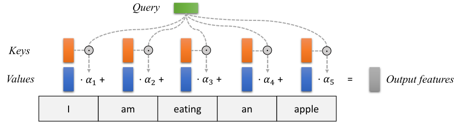
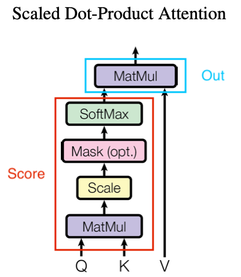

# 4.7.3 自注意力网络（Transformer）

**自注意力网络（Transformer）** 是一种基于自注意力机制（Self-Attention）的深度神经网络结构分类。最初的设计原型来自于 2015 年由 **约书亚·本吉奥（Yoshua Bengio，1964～Present）** 有关神经网络翻译模型优化而提出的设想 [\[22\]][ref] 。

本吉奥 通过引入一种模拟生物在感知、学习、思考过程中自然而然产生的，主被动关注关键点的生理机制，来解决传统 机器学习（ML）**编码器-解码器（Encoder-Decoder）** 翻译模型（Translation Models）的 **长句压缩固定长度（Fixed-Length）** 特征，导致潜层语意缺失的问题。这种模拟方式，能够将长句（Long Sequence）中的信息，抽象为固定长度（Fixed-Length）向量的集合，**而非** 以单一向量的形式进行后续相关语意分解工作。

基于该研究，Google AI 实验室终于在 2017 年以 《Attention Is All You Need》[\[23\]][ref] 一文，确定了基本的网络结构设计。
从此，开启了 Transformer 类型网络的快速发展之路。

## **Transformer 网络结构 & 核心机制**

**自注意力机制（Self-Attention）** 是 Transformer 的 **核心机制** 。而 **Transformer 网络结构** ，则是与自注意力机制提取特征 **配套** ，用于达成转译目的（不一定非要是语言）的整个编解码器 **系统作业流水线** 。

<figure>
   
    <figcaption>
      
图 4.7.3-1 Transformer 网络结构 <a href="References_4.md">[23]</a>

   </figcaption>
</figure>

Transformer 在结构中，参考了 RNN 和早期 自编解码网络系统的特点，采用 **时序上以串行元胞（Cell），而单次迭代中编解码（Encoder-Decoder）并行（Parallelization）** 的方式，结合两者各自所长。

如此设计的原因，一方面来自于 Transformer 意图改善 RNN 对 **序列到序列（Seq2Seq）** 任务的处理能力。这便要求，其本身对输入样本的高级特征提取，能够拆解直接关联性，但却又可以保留更高维度潜藏的逻辑信息。另一方面，注意力机制只能提炼解构关联性特征，但我们需要的结果却是对原有输入的另一种未改变原意的表述，决定了必须有编解码类似的结构（至少目前为止）对高级特征进行非对称的压缩和还原。

自注意力机制，保证了前一点。整体结构，保证了后一点。而 **注意力单元（Attention Unit）** ，则是用于完成自注意力处理的组成框架的一部分（图中橙色）。

根据最精简实现，

从 **注意力单元（Attention Unit）** 上，Transformer 包括了两个分步主成分：

- **放缩点积注意力（SDPA）** ，用于完成对于一次 Transformer 输入的单一注意力筛选；
- **多头注意力（MHA）** ，通过对放缩点积的平行组合，完成对同一输入的多点注意力检测；

从 **网络结构（Network Structure）** 上，Transformer 包括了两个主体模块：

- **编码器（Encoder）模块** ，用于完成对样本输入的高级特征提取；
- **解码器（Decoder）模块** ，用于完成对样本输入的转译结果输出；

通俗来说，以人做类比，两者一个属于 Transformer 的“灵魂”，一个属于 Transformer 的“身躯”。从宏观角度，是互为一体的存在。这与前两节 CNN 、RNN 里，结构占相对主导地位（即框架为改进的关键）的情况有所不同。而是皆有突破。

正是这样，Transformer 才称为深度学习领域，在模型结构基本方法论上，近年来相对具有较大革新突破的工具。

刚刚我们提到的注意力单元，是对自注意力机制的实现。从上可知，Transformer 基本的一切都是围绕其运转的。那么，什么是自注意力机制（Self-Attention）呢？

## **自注意力机制（Self-Attention）**

**自注意力机制（Self-Attention）** 是 Transformer 中，一种目的用于模拟生物注意力的数学量化范式。是 **一类方法的方法论** 。

想要能够区分轻重，最容易想到的方式便是加权了。因此，在 Transformer 中，对注意力的数值定义便是：

**对输入序列元素，根据输入查询元素键值对，以求动态计算加权平均值的权重。**

所以，我们计算注意力，需要的输入数据序列就必须包含三个重要的信息维度，分别是：

- **查询信息，即查询（Query）** ，代表当前输入具有可能被关注（查询）的意义表征；
- **关键信息，即键值（Keys）** ，代表当前输入在查询（Query）下可能提供的信息特征；
- **标值信息，即取值（Values）** ，代表与键值（Key）关联的量化查询积分；

最终，由三者共同借由算法组成 **输出特征（Output Fratures）** ，即 **加权平均值的权重** ，作为 Transformer 的神经网络内高级特征。

<figure>
   
    <figcaption>
      
图 4.7.3-2 Transformer 的输入转换过程 <a href="References_4.md">[23]</a>

   </figcaption>
</figure>

显然，虽然键值和取值可以按照 **传统键值对（Key-Value Pair）** 形式直接配对（当然也可以有复杂映射实现）。但从查询到键值还需要有一定转换方式，通过它来实现将查询可能的关注点，分散到对应的键值上，从而构成可以计算的结果。这个转换方式，就是 **评分函数（Score Function）** 。

一般而言，评分函数可分为两类：

- **简单评分函数（Simple Scorer）** ，此类以单步函数来完成粗糙的映射，如直接 Sigmod
- **复杂评分函数（Complex Scorer）** ，此类用朴素神经网络或模型来完成映射，如 MLP 评分

而现有大部分 Transformer 中，采用的都是第二个类型的实现。包括基础 Transformer 的 SDPA 和 MHA 在内，皆属于此类。

当评分函数确定后，每个查询都能拆解到键值上，并获取对应积分了。此时，就需要由 **输出函数（Output Function）** 来将各个部分组合成最终的高级特征向量进行输出。

假设，

- 以 $$Q$$ 代表查询，
- 以 $$Seq$$ 表示输入序列，
- 以角标 $$[_i]$$ 代表所处输入序列 $$Seq$$ 的位置，有 $$i$$ 处键值 $$K$$ 取积分 $$V$$ ，
- 以 $$Out$$ 代表经过注意力筛选后，的高级特征向量，
- 记评分函数为 $$f_{score}$$ ，输出函数为 $$f_{out}$$ 

则有：

$$
{\displaystyle 
 \begin{aligned}
   w_i &= \frac{f_{score}(K_i,\ Q)}{\sum{f_{score}(K_i,\ Q)}} \\
   Out &= \sum{f_{out}(w_i \cdot V_i)} \\
 \end{aligned}
}
$$

如此，我们便得到了 **注意力量化公式** 。实际上，这种按序列计算的过程，常被直接 **以矩阵运算代替** 。公式的意义更多在于原理描述。即，自注意力机制工程化的指导过程。依照上式，便可以通过构建评分函数和输出函数，来设计 Transformer 里的注意力单元了。

经典 Transformer 中，将这一步分为了两个组成。

## **放缩点积注意力（SDPA [Scaled Dot-Product Attention]）**

**放缩点积注意力（SDPA [Scaled Dot-Product Attention]）** 被用于计算单点注意力，即只生成一个注意力高级特征输出。

<figure>
   
    <figcaption>
      
图 4.7.3-2 Transformer 的 SDPA 单元 <a href="References_4.md">[23]</a>

   </figcaption>
</figure>

如图，红框部分便是 SDPA 的评分函数，而蓝框部分则为 SDPA 的输出函数。

[ref]: References_4.md