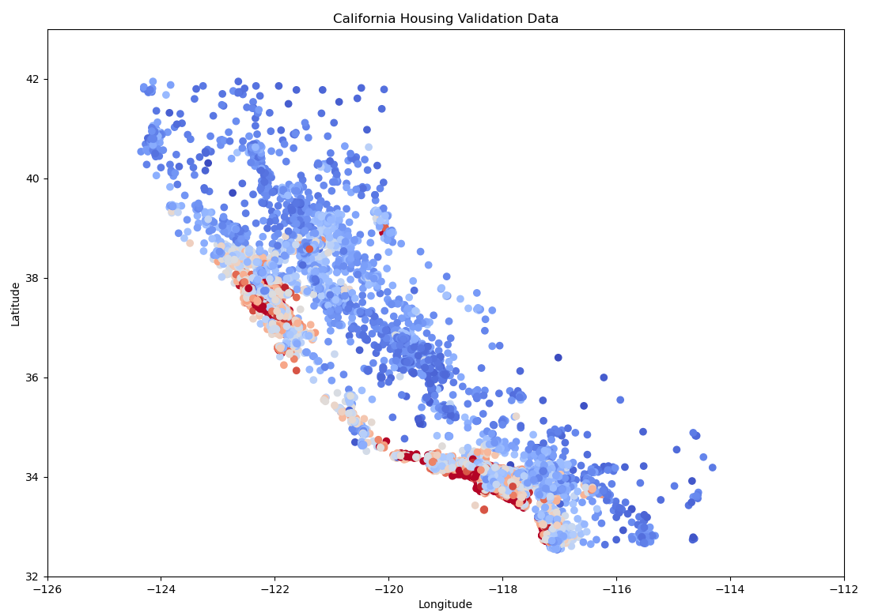
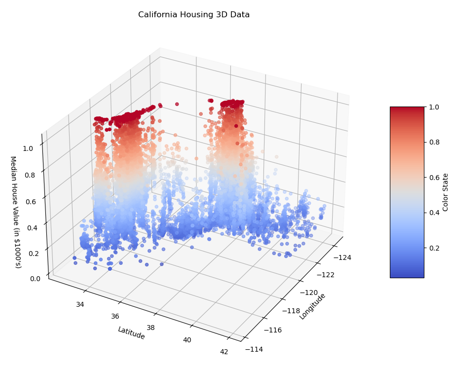

# 5.1.1 常用数学库（Numpy、Pandas、Mateplotlib）

工程里对 **数据分析和科学计算** 的过程中，常用数学库是不可或缺的工具。这些库不仅提供了高效的数据处理能力，还为我们提供了 **丰富的数学函数** 和 **可视化工具**。其中，最为重要的库有三个，即 **Numpy**、**Pandas**、**Mateplotlib**，分别对应 \[ **基础计算**、**数理统计**、**图表绘制** \] 的需求。

## **Numpy（Numerical Python）**

**Numpy（Numerical Python）** 是 **用于科学计算的基础库**，提供了针对 **N 维数组/张量 及其 衍生类型 生命周期方法的结构化封装**，和用于 **协助处理这些数组/张量的丰富函数库**。这使得我们可以通过其进行快速的矩阵运算和其他数学操作，而不必再单独定义实现某些通用的算法。例如前文提到的傅立叶变换，其变体，或其逆变换（FFT、DFT、IDFT etc.）。除此之外，Numpy 还包含了线性代数、统计函数、随机数生成等功能模块，是数据分析和机器学习的基础工具之一。

#### 主要功能：

1. 提供基础数据结构（ndarray）和数据类型（dtype），作为  N 维数组/张量 数据载体
2. 完善的基础数学函数库，包括 基础统计、线性代数、傅立叶变换、随机数生成
3. 广泛的扩展数学函数库，包括 金融函数、伽马函数等 于特殊函数库中（numpy.special）
4. 相对完善的内存管理和索引体系，并支持内存映射能力，即可处理超出内存大小数据集
5. 提供完整的数据交互体系，在数据结构化、字符串操作、I/O 操作上与其他库有 **较高兼容**

#### 基础库（np.）的常用函数（简，仅列出名称）：

1. 算术运算：[add](https://numpy.org/doc/stable/reference/generated/numpy.add.html), [subtract](https://numpy.org/doc/stable/reference/generated/numpy.subtract.html), [multiply](https://numpy.org/doc/stable/reference/generated/numpy.multiply.html), [divide](https://numpy.org/doc/stable/reference/generated/numpy.divide.html), [power](https://numpy.org/doc/stable/reference/generated/numpy.power.html), [mod](https://numpy.org/doc/stable/reference/generated/numpy.mod.html), [remainder](https://numpy.org/doc/stable/reference/generated/numpy.remainder.html)
2. 比较运算：[greater](https://numpy.org/doc/stable/reference/generated/numpy.greater.html), [greater_equal](https://numpy.org/doc/stable/reference/generated/numpy.greater_equal.html), [less](https://numpy.org/doc/stable/reference/generated/numpy.less.html), [less_equal](https://numpy.org/doc/stable/reference/generated/numpy.less_equal.html), [equal](https://numpy.org/doc/stable/reference/generated/numpy.equal.html), [not_equal](https://numpy.org/doc/stable/reference/generated/numpy.not_equal.html)
3. 逻辑运算：[logical_and](https://numpy.org/doc/stable/reference/generated/numpy.logical_and.html), [logical_or](https://numpy.org/doc/stable/reference/generated/numpy.logical_or.html), [logical_not](https://numpy.org/doc/stable/reference/generated/numpy.logical_not.html), [logical_xor](https://numpy.org/doc/stable/reference/generated/numpy.logical_xor.html)
4. 基本统计：[mean](https://numpy.org/doc/stable/reference/generated/numpy.mean.html), [median](https://numpy.org/doc/stable/reference/generated/numpy.median.html), [std](https://numpy.org/doc/stable/reference/generated/numpy.std.html), [var](https://numpy.org/doc/stable/reference/generated/numpy.var.html), [min](https://numpy.org/doc/stable/reference/generated/numpy.amin.html), [max](https://numpy.org/doc/stable/reference/generated/numpy.amax.html), [sum](https://numpy.org/doc/stable/reference/generated/numpy.sum.html), [cumsum](https://numpy.org/doc/stable/reference/generated/numpy.cumsum.html), [prod](https://numpy.org/doc/stable/reference/generated/numpy.prod.html), [cumprod](https://numpy.org/doc/stable/reference/generated/numpy.cumprod.html)
5. 排序搜索：[sort](https://numpy.org/doc/stable/reference/generated/numpy.sort.html), [argsort](https://numpy.org/doc/stable/reference/generated/numpy.argsort.html), [argmax](https://numpy.org/doc/stable/reference/generated/numpy.argmax.html), [argmin](https://numpy.org/doc/stable/reference/generated/numpy.argmin.html), [searchsorted](https://numpy.org/doc/stable/reference/generated/numpy.searchsorted.html)
6. 三角函数：[sin](https://numpy.org/doc/stable/reference/generated/numpy.sin.html), [cos](https://numpy.org/doc/stable/reference/generated/numpy.cos.html), [tan](https://numpy.org/doc/stable/reference/generated/numpy.tan.html), [arcsin](https://numpy.org/doc/stable/reference/generated/numpy.arcsin.html), [arccos](https://numpy.org/doc/stable/reference/generated/numpy.arccos.html), [arctan](https://numpy.org/doc/stable/reference/generated/numpy.arctan.html), [arctan2](https://numpy.org/doc/stable/reference/generated/numpy.arctan2.html)
7. 双曲函数：[sinh](https://numpy.org/doc/stable/reference/generated/numpy.sinh.html), [cosh](https://numpy.org/doc/stable/reference/generated/numpy.cosh.html), [tanh](https://numpy.org/doc/stable/reference/generated/numpy.tanh.html), [arcsinh](https://numpy.org/doc/stable/reference/generated/numpy.arcsinh.html), [arccosh](https://numpy.org/doc/stable/reference/generated/numpy.arccosh.html), [arctanh](https://numpy.org/doc/stable/reference/generated/numpy.arctanh.html)
8. 指数对数：[exp](https://numpy.org/doc/stable/reference/generated/numpy.exp.html), [expm1](https://numpy.org/doc/stable/reference/generated/numpy.expm1.html), [log](https://numpy.org/doc/stable/reference/generated/numpy.log.html), [log10](https://numpy.org/doc/stable/reference/generated/numpy.log10.html), [log2](https://numpy.org/doc/stable/reference/generated/numpy.log2.html), [log1p](https://numpy.org/doc/stable/reference/generated/numpy.log1p.html)
9. 矩阵运算：[dot](https://numpy.org/doc/stable/reference/generated/numpy.dot.html), [vdot](https://numpy.org/doc/stable/reference/generated/numpy.vdot.html), [inner](https://numpy.org/doc/stable/reference/generated/numpy.inner.html), [outer](https://numpy.org/doc/stable/reference/generated/numpy.outer.html), [matmul](https://numpy.org/doc/stable/reference/generated/numpy.matmul.html)
10. 直方图：[histogram](https://numpy.org/doc/stable/reference/generated/numpy.histogram.html), [histogram2d](https://numpy.org/doc/stable/reference/generated/numpy.histogram2d.html), [histogramdd](https://numpy.org/doc/stable/reference/generated/numpy.histogramdd.html)
11. 多项式（**需依托 np.poly1d 多项式类**）：[poly](https://numpy.org/doc/stable/reference/generated/numpy.poly.html), [polyval](https://numpy.org/doc/stable/reference/generated/numpy.polyval.html), [polyfit](https://numpy.org/doc/stable/reference/generated/numpy.polyfit.html), [roots](https://numpy.org/doc/stable/reference/generated/numpy.roots.html), [polyder](https://numpy.org/doc/stable/reference/generated/numpy.polyder.html), [polyint](https://numpy.org/doc/stable/reference/generated/numpy.polyint.html)

#### 线性代数扩展（np.linalg.）的常用函数（简，仅列出名称）：

1. 矩阵分解：[cholesky](https://numpy.org/doc/stable/reference/generated/numpy.linalg.cholesky.html), [qr](https://numpy.org/doc/stable/reference/generated/numpy.linalg.qr.html), [svd](https://numpy.org/doc/stable/reference/generated/numpy.linalg.svd.html)
2. 求逆和解线性方程组：[inv](https://numpy.org/doc/stable/reference/generated/numpy.linalg.inv.html), [pinv](https://numpy.org/doc/stable/reference/generated/numpy.linalg.pinv.html), [solve](https://numpy.org/doc/stable/reference/generated/numpy.linalg.solve.html)
3. 特征值和特征向量：[eig](https://numpy.org/doc/stable/reference/generated/numpy.linalg.eig.html), [eigh](https://numpy.org/doc/stable/reference/generated/numpy.linalg.eigh.html), [eigvals](https://numpy.org/doc/stable/reference/generated/numpy.linalg.eigvals.html), [eigvalsh](https://numpy.org/doc/stable/reference/generated/numpy.linalg.eigvalsh.html)
4. 矩阵范数（L1/L2/inf）：[norm](https://numpy.org/doc/stable/reference/generated/numpy.linalg.norm.html)
5. 矩阵行列式和秩：[det](https://numpy.org/doc/stable/reference/generated/numpy.linalg.det.html), [matrix_rank](https://numpy.org/doc/stable/reference/generated/numpy.linalg.matrix_rank.html)

#### 傅立叶变换扩展（np.fft.）的常用函数（简，仅列出名称）：

1. 一维傅里叶变换：[fft](https://numpy.org/doc/stable/reference/generated/numpy.fft.fft.html), [ifft](https://numpy.org/doc/stable/reference/generated/numpy.fft.ifft.html)
2. 二维傅里叶变换：[fft2](https://numpy.org/doc/stable/reference/generated/numpy.fft.fft2.html), [ifft2](https://numpy.org/doc/stable/reference/generated/numpy.fft.ifft2.html)
3. 多维傅里叶变换：[fftn](https://numpy.org/doc/stable/reference/generated/numpy.fft.fftn.html), [ifftn](https://numpy.org/doc/stable/reference/generated/numpy.fft.ifftn.html)
4. 一维快速傅立叶法：[rfft](https://numpy.org/doc/stable/reference/generated/numpy.fft.rfft.html), [irfft](https://numpy.org/doc/stable/reference/generated/numpy.fft.irfft.html)
5. 一维亥姆霍兹变换：[hfft](https://numpy.org/doc/stable/reference/generated/numpy.fft.hfft.html), [ihfft](https://numpy.org/doc/stable/reference/generated/numpy.fft.ihfft.html)

#### 随机数生成扩展（np.random.）的常用函数（简，仅列出名称）：

1. 简单随机：[rand](https://numpy.org/doc/stable/reference/random/generated/numpy.random.rand.html), [randn](https://numpy.org/doc/stable/reference/random/generated/numpy.random.randn.html), [randint](https://numpy.org/doc/stable/reference/random/generated/numpy.random.randint.html), [choice](https://numpy.org/doc/stable/reference/random/generated/numpy.random.choice.html)
2. 概率分布：[normal](https://numpy.org/doc/stable/reference/random/generated/numpy.random.normal.html), [uniform](https://numpy.org/doc/stable/reference/random/generated/numpy.random.uniform.html), [binomial](https://numpy.org/doc/stable/reference/random/generated/numpy.random.binomial.html), [poisson](https://numpy.org/doc/stable/reference/random/generated/numpy.random.poisson.html), [exponential](https://numpy.org/doc/stable/reference/random/generated/numpy.random.exponential.html), [beta](https://numpy.org/doc/stable/reference/random/generated/numpy.random.beta.html), [gamma](https://numpy.org/doc/stable/reference/random/generated/numpy.random.gamma.html), [chisquare](https://numpy.org/doc/stable/reference/random/generated/numpy.random.chisquare.html)
3. 乱序函数：[shuffle](https://numpy.org/doc/stable/reference/random/generated/numpy.random.shuffle.html), [permutation](https://numpy.org/doc/stable/reference/random/generated/numpy.random.permutation.html)
4. 随机种子：[seed](https://numpy.org/doc/stable/reference/random/generated/numpy.random.seed.html)

其他如 **特殊函数扩展（np.special.）** 等，在具体使用时，可自行前往 **[官网档案馆](https://numpy.org/doc/)** 查阅。

## **Pandas（Python Data Analysis Library）**

**Pandas（Python Data Analysis Library）** 是 **用于数据操作和分析的强大工具库**，提供了针对 **数理统计服务** 的 **高效格式类型和相关统计分析工具**，在处理 **结构化数据** 方面具有巨大优势。尤其是对于 **表格类数据** 的处理。我们可以通过其 **DataFrame** 和 **Series** 这两个核心类型，轻松的获取 **经数组化后能提供给 Numpy 处理的数据集**。进而允许我们更方便地进行数据的清洗、修改和分析操作。此外，对于科学统计类的时间序列数据，Pandas 亦能完美解析到需要使用的格式。是辅助我们进行统计工作和数据预处理的利器。

#### 主要功能：

1. 高效的 **数据结构**（即，DataFrame 、Series 和 两者关联方法）
2. 丰富的 **时序结构**（即，DatetimeIndex, Timedelta, Period 时刻/时间/时差）
3. 丰富的 **数据清洗**、**数据转换**、**数据标准化** 能力
4. 支持 **多种格式 I/O 操作**，如 CSV、Excel、SQL、JSON 等 **通用格式类型**
5. 提供诸如时间序列数据的索引、切片、重采样、滚动窗口等，时间序列数据处理能力
6. 提供对 缺失值、异常值、重复数据 等问题数据的，检测、填充、转换、过滤能力

#### 基础库（pd.）的常用函数（简，仅列出名称）：

1. 数据结构：[&lt;Series&gt;](https://pandas.pydata.org/pandas-docs/stable/reference/api/pandas.Series.html), [&lt;DataFrame&gt;](https://pandas.pydata.org/pandas-docs/stable/reference/api/pandas.DataFrame.html), [&lt;Index&gt;](https://pandas.pydata.org/pandas-docs/stable/reference/api/pandas.Index.html)
2. 时序结构：[&lt;DatetimeIndex&gt;](https://pandas.pydata.org/pandas-docs/stable/reference/api/pandas.DatetimeIndex.html), [&lt;Timedelta&gt;](https://pandas.pydata.org/pandas-docs/stable/reference/api/pandas.Timedelta.html), [&lt;Period&gt;](https://pandas.pydata.org/pandas-docs/stable/reference/api/pandas.Period.html)
3. 数据创建：[read_csv](https://pandas.pydata.org/pandas-docs/stable/reference/api/pandas.read_csv.html), [read_excel](https://pandas.pydata.org/pandas-docs/stable/reference/api/pandas.read_excel.html), [read_sql](https://pandas.pydata.org/pandas-docs/stable/reference/api/pandas.read_sql.html), [read_json](https://pandas.pydata.org/pandas-docs/stable/reference/api/pandas.read_json.html), [read_html](https://pandas.pydata.org/pandas-docs/stable/reference/api/pandas.read_html.html), [read_clipboard](https://pandas.pydata.org/pandas-docs/stable/reference/api/pandas.read_clipboard.html), [read_parquet](https://pandas.pydata.org/pandas-docs/stable/reference/api/pandas.read_parquet.html), [read_feather](https://pandas.pydata.org/pandas-docs/stable/reference/api/pandas.read_feather.html), [read_orc](https://pandas.pydata.org/pandas-docs/stable/reference/api/pandas.read_orc.html), [read_sas](https://pandas.pydata.org/pandas-docs/stable/reference/api/pandas.read_sas.html), [read_spss](https://pandas.pydata.org/pandas-docs/stable/reference/api/pandas.read_spss.html), [read_stata](https://pandas.pydata.org/pandas-docs/stable/reference/api/pandas.read_stata.html), [read_hdf](https://pandas.pydata.org/pandas-docs/stable/reference/api/pandas.read_hdf.html), [read_pickle](https://pandas.pydata.org/pandas-docs/stable/reference/api/pandas.read_pickle.html)
4. 数据导出：[to_csv](https://pandas.pydata.org/pandas-docs/stable/reference/api/pandas.DataFrame.to_csv.html), [to_excel](https://pandas.pydata.org/pandas-docs/stable/reference/api/pandas.DataFrame.to_excel.html), [to_sql](https://pandas.pydata.org/pandas-docs/stable/reference/api/pandas.DataFrame.to_sql.html), [to_json](https://pandas.pydata.org/pandas-docs/stable/reference/api/pandas.DataFrame.to_json.html), [to_html](https://pandas.pydata.org/pandas-docs/stable/reference/api/pandas.DataFrame.to_html.html), [to_clipboard](https://pandas.pydata.org/pandas-docs/stable/reference/api/pandas.DataFrame.to_clipboard.html), [to_parquet](https://pandas.pydata.org/pandas-docs/stable/reference/api/pandas.DataFrame.to_parquet.html), [to_feather](https://pandas.pydata.org/pandas-docs/stable/reference/api/pandas.DataFrame.to_feather.html), [to_orc](https://pandas.pydata.org/pandas-docs/stable/reference/api/pandas.DataFrame.to_orc.html), [to_sas](https://pandas.pydata.org/pandas-docs/stable/reference/api/pandas.DataFrame.to_sas.html), [to_spss](https://pandas.pydata.org/pandas-docs/stable/reference/api/pandas.DataFrame.to_spss.html), [to_stata](https://pandas.pydata.org/pandas-docs/stable/reference/api/pandas.DataFrame.to_stata.html), [to_hdf](https://pandas.pydata.org/pandas-docs/stable/reference/api/pandas.DataFrame.to_hdf.html), [to_pickle](https://pandas.pydata.org/pandas-docs/stable/reference/api/pandas.DataFrame.to_pickle.html)
5. 数据变换：[assign](https://pandas.pydata.org/pandas-docs/stable/reference/api/pandas.DataFrame.assign.html), [drop](https://pandas.pydata.org/pandas-docs/stable/reference/api/pandas.DataFrame.drop.html), [rename](https://pandas.pydata.org/pandas-docs/stable/reference/api/pandas.DataFrame.rename.html), [pivot](https://pandas.pydata.org/pandas-docs/stable/reference/api/pandas.DataFrame.pivot.html), [pivot_table](https://pandas.pydata.org/pandas-docs/stable/reference/api/pandas.pivot_table.html), [melt](https://pandas.pydata.org/pandas-docs/stable/reference/api/pandas.melt.html), [stack](https://pandas.pydata.org/pandas-docs/stable/reference/api/pandas.DataFrame.stack.html), [unstack](https://pandas.pydata.org/pandas-docs/stable/reference/api/pandas.DataFrame.unstack.html), [get_dummies](https://pandas.pydata.org/pandas-docs/stable/reference/api/pandas.get_dummies.html)
6. 数据聚合：[groupby](https://pandas.pydata.org/pandas-docs/stable/reference/api/pandas.DataFrame.groupby.html), [agg](https://pandas.pydata.org/pandas-docs/stable/reference/api/pandas.DataFrame.agg.html), [aggregate](https://pandas.pydata.org/pandas-docs/stable/reference/api/pandas.DataFrame.aggregate.html), [transform](https://pandas.pydata.org/pandas-docs/stable/reference/api/pandas.DataFrame.transform.html), [apply](https://pandas.pydata.org/pandas-docs/stable/reference/api/pandas.DataFrame.apply.html), [rolling](https://pandas.pydata.org/pandas-docs/stable/reference/api/pandas.DataFrame.rolling.html), [expanding](https://pandas.pydata.org/pandas-docs/stable/reference/api/pandas.DataFrame.expanding.html), [resample](https://pandas.pydata.org/pandas-docs/stable/reference/api/pandas.DataFrame.resample.html)
7. 数据清洗：[isnull](https://pandas.pydata.org/pandas-docs/stable/reference/api/pandas.isnull.html), [notnull](https://pandas.pydata.org/pandas-docs/stable/reference/api/pandas.notnull.html), [dropna](https://pandas.pydata.org/pandas-docs/stable/reference/api/pandas.DataFrame.dropna.html), [fillna](https://pandas.pydata.org/pandas-docs/stable/reference/api/pandas.DataFrame.fillna.html), [replace](https://pandas.pydata.org/pandas-docs/stable/reference/api/pandas.DataFrame.replace.html), [interpolate](https://pandas.pydata.org/pandas-docs/stable/reference/api/pandas.DataFrame.interpolate.html), [duplicated](https://pandas.pydata.org/pandas-docs/stable/reference/api/pandas.DataFrame.duplicated.html), [drop_duplicates](https://pandas.pydata.org/pandas-docs/stable/reference/api/pandas.DataFrame.drop_duplicates.html)
8. 数据合并：[merge](https://pandas.pydata.org/pandas-docs/stable/reference/api/pandas.merge.html), [concat](https://pandas.pydata.org/pandas-docs/stable/reference/api/pandas.concat.html), [join](https://pandas.pydata.org/pandas-docs/stable/reference/api/pandas.DataFrame.join.html), [append](https://pandas.pydata.org/pandas-docs/stable/reference/api/pandas.DataFrame.append.html)
9. 选择过滤：[loc](https://pandas.pydata.org/pandas-docs/stable/reference/api/pandas.DataFrame.loc.html), [iloc](https://pandas.pydata.org/pandas-docs/stable/reference/api/pandas.DataFrame.iloc.html), [at](https://pandas.pydata.org/pandas-docs/stable/reference/api/pandas.DataFrame.at.html), [iat](https://pandas.pydata.org/pandas-docs/stable/reference/api/pandas.DataFrame.iat.html), [ix](https://pandas.pydata.org/pandas-docs/stable/reference/api/pandas.DataFrame.ix.html)
10. 基本统计：[mean](https://pandas.pydata.org/pandas-docs/stable/reference/api/pandas.DataFrame.mean.html), [median](https://pandas.pydata.org/pandas-docs/stable/reference/api/pandas.DataFrame.median.html), [std](https://pandas.pydata.org/pandas-docs/stable/reference/api/pandas.DataFrame.std.html), [var](https://pandas.pydata.org/pandas-docs/stable/reference/api/pandas.DataFrame.var.html), [min](https://pandas.pydata.org/pandas-docs/stable/reference/api/pandas.DataFrame.min.html), [max](https://pandas.pydata.org/pandas-docs/stable/reference/api/pandas.DataFrame.max.html), [sum](https://pandas.pydata.org/pandas-docs/stable/reference/api/pandas.DataFrame.sum.html), [cumsum](https://pandas.pydata.org/pandas-docs/stable/reference/api/pandas.DataFrame.cumsum.html), [prod](https://pandas.pydata.org/pandas-docs/stable/reference/api/pandas.DataFrame.prod.html), [cumprod](https://pandas.pydata.org/pandas-docs/stable/reference/api/pandas.DataFrame.cumprod.html), [describe](https://pandas.pydata.org/pandas-docs/stable/reference/api/pandas.DataFrame.describe.html)

#### 数据结构扩展（pd.Series, pd.DataFrame）的辅助方法（简，仅列出名称）：

1. Series 方法：[append](https://pandas.pydata.org/pandas-docs/stable/reference/api/pandas.Series.append.html), [drop](https://pandas.pydata.org/pandas-docs/stable/reference/api/pandas.Series.drop.html), [drop_duplicates](https://pandas.pydata.org/pandas-docs/stable/reference/api/pandas.Series.drop_duplicates.html), [dropna](https://pandas.pydata.org/pandas-docs/stable/reference/api/pandas.Series.dropna.html), [fillna](https://pandas.pydata.org/pandas-docs/stable/reference/api/pandas.Series.fillna.html), [replace](https://pandas.pydata.org/pandas-docs/stable/reference/api/pandas.Series.replace.html), [interpolate](https://pandas.pydata.org/pandas-docs/stable/reference/api/pandas.Series.interpolate.html), [isnull](https://pandas.pydata.org/pandas-docs/stable/reference/api/pandas.Series.isnull.html), [notnull](https://pandas.pydata.org/pandas-docs/stable/reference/api/pandas.Series.notnull.html), [unique](https://pandas.pydata.org/pandas-docs/stable/reference/api/pandas.Series.unique.html), [value_counts](https://pandas.pydata.org/pandas-docs/stable/reference/api/pandas.Series.value_counts.html), [apply](https://pandas.pydata.org/pandas-docs/stable/reference/api/pandas.Series.apply.html), [map](https://pandas.pydata.org/pandas-docs/stable/reference/api/pandas.Series.map.html), [astype](https://pandas.pydata.org/pandas-docs/stable/reference/api/pandas.Series.astype.html), [copy](https://pandas.pydata.org/pandas-docs/stable/reference/api/pandas.Series.copy.html), [shift](https://pandas.pydata.org/pandas-docs/stable/reference/api/pandas.Series.shift.html), [diff](https://pandas.pydata.org/pandas-docs/stable/reference/api/pandas.Series.diff.html), [pct_change](https://pandas.pydata.org/pandas-docs/stable/reference/api/pandas.Series.pct_change.html), [rank](https://pandas.pydata.org/pandas-docs/stable/reference/api/pandas.Series.rank.html), [sort_values](https://pandas.pydata.org/pandas-docs/stable/reference/api/pandas.Series.sort_values.html), [sort_index](https://pandas.pydata.org/pandas-docs/stable/reference/api/pandas.Series.sort_index.html)

2. DataFrame 方法：[append](https://pandas.pydata.org/pandas-docs/stable/reference/api/pandas.DataFrame.append.html), [drop](https://pandas.pydata.org/pandas-docs/stable/reference/api/pandas.DataFrame.drop.html), [drop_duplicates](https://pandas.pydata.org/pandas-docs/stable/reference/api/pandas.DataFrame.drop_duplicates.html), [dropna](https://pandas.pydata.org/pandas-docs/stable/reference/api/pandas.DataFrame.dropna.html), [fillna](https://pandas.pydata.org/pandas-docs/stable/reference/api/pandas.DataFrame.fillna.html), [replace](https://pandas.pydata.org/pandas-docs/stable/reference/api/pandas.DataFrame.replace.html), [interpolate](https://pandas.pydata.org/pandas-docs/stable/reference/api/pandas.DataFrame.interpolate.html), [isnull](https://pandas.pydata.org/pandas-docs/stable/reference/api/pandas.DataFrame.isnull.html), [notnull](https://pandas.pydata.org/pandas-docs/stable/reference/api/pandas.DataFrame.notnull.html), [pivot](https://pandas.pydata.org/pandas-docs/stable/reference/api/pandas.DataFrame.pivot.html), [pivot_table](https://pandas.pydata.org/pandas-docs/stable/reference/api/pandas.pivot_table.html), [melt](https://pandas.pydata.org/pandas-docs/stable/reference/api/pandas.melt.html), [stack](https://pandas.pydata.org/pandas-docs/stable/reference/api/pandas.DataFrame.stack.html), [unstack](https://pandas.pydata.org/pandas-docs/stable/reference/api/pandas.DataFrame.unstack.html), [get_dummies](https://pandas.pydata.org/pandas-docs/stable/reference/api/pandas.get_dummies.html), [merge](https://pandas.pydata.org/pandas-docs/stable/reference/api/pandas.merge.html), [concat](https://pandas.pydata.org/pandas-docs/stable/reference/api/pandas.concat.html), [join](https://pandas.pydata.org/pandas-docs/stable/reference/api/pandas.DataFrame.join.html), [groupby](https://pandas.pydata.org/pandas-docs/stable/reference/api/pandas.DataFrame.groupby.html), [agg](https://pandas.pydata.org/pandas-docs/stable/reference/api/pandas.DataFrame.agg.html), [aggregate](https://pandas.pydata.org/pandas-docs/stable/reference/api/pandas.DataFrame.aggregate.html), [transform](https://pandas.pydata.org/pandas-docs/stable/reference/api/pandas.DataFrame.transform.html), [apply](https://pandas.pydata.org/pandas-docs/stable/reference/api/pandas.DataFrame.apply.html), [rolling](https://pandas.pydata.org/pandas-docs/stable/reference/api/pandas.DataFrame.rolling.html), [expanding](https://pandas.pydata.org/pandas-docs/stable/reference/api/pandas.DataFrame.expanding.html), [resample](https://pandas.pydata.org/pandas-docs/stable/reference/api/pandas.DataFrame.resample.html), [sort_values](https://pandas.pydata.org/pandas-docs/stable/reference/api/pandas.DataFrame.sort_values.html), [sort_index](https://pandas.pydata.org/pandas-docs/stable/reference/api/pandas.DataFrame.sort_index.html), [rank](https://pandas.pydata.org/pandas-docs/stable/reference/api/pandas.DataFrame.rank.html), [describe](https://pandas.pydata.org/pandas-docs/stable/reference/api/pandas.DataFrame.describe.html), [corr](https://pandas.pydata.org/pandas-docs/stable/reference/api/pandas.DataFrame.corr.html), [cov](https://pandas.pydata.org/pandas-docs/stable/reference/api/pandas.DataFrame.cov.html), [hist](https://pandas.pydata.org/pandas-docs/stable/reference/api/pandas.DataFrame.hist.html), [boxplot](https://pandas.pydata.org/pandas-docs/stable/reference/api/pandas.DataFrame.boxplot.html), [plot](https://pandas.pydata.org/pandas-docs/stable/reference/api/pandas.DataFrame.plot.html)

#### 时间序列扩展（pd.DatetimeIndex, pd.Timedelta, pd.Period）的辅助方法（简）：

1. DatetimeIndex 方法：[to_pydatetime](https://pandas.pydata.org/pandas-docs/stable/reference/api/pandas.DatetimeIndex.to_pydatetime.html), [to_period](https://pandas.pydata.org/pandas-docs/stable/reference/api/pandas.DatetimeIndex.to_period.html), [to_series](https://pandas.pydata.org/pandas-docs/stable/reference/api/pandas.DatetimeIndex.to_series.html), [to_frame](https://pandas.pydata.org/pandas-docs/stable/reference/api/pandas.DatetimeIndex.to_frame.html), [normalize](https://pandas.pydata.org/pandas-docs/stable/reference/api/pandas.DatetimeIndex.normalize.html), [strftime](https://pandas.pydata.org/pandas-docs/stable/reference/api/pandas.DatetimeIndex.strftime.html), [snap](https://pandas.pydata.org/pandas-docs/stable/reference/api/pandas.DatetimeIndex.snap.html), [shift](https://pandas.pydata.org/pandas-docs/stable/reference/api/pandas.DatetimeIndex.shift.html), [tz_convert](https://pandas.pydata.org/pandas-docs/stable/reference/api/pandas.DatetimeIndex.tz_convert.html), [tz_localize](https://pandas.pydata.org/pandas-docs/stable/reference/api/pandas.DatetimeIndex.tz_localize.html), [floor](https://pandas.pydata.org/pandas-docs/stable/reference/api/pandas.DatetimeIndex.floor.html), [ceil](https://pandas.pydata.org/pandas-docs/stable/reference/api/pandas.DatetimeIndex.ceil.html), [round](https://pandas.pydata.org/pandas-docs/stable/reference/api/pandas.DatetimeIndex.round.html)
2. Timedelta 方法：[total_seconds](https://pandas.pydata.org/pandas-docs/stable/reference/api/pandas.Timedelta.total_seconds.html), [to_pytimedelta](https://pandas.pydata.org/pandas-docs/stable/reference/api/pandas.Timedelta.to_pytimedelta.html), [components](https://pandas.pydata.org/pandas-docs/stable/reference/api/pandas.Timedelta.components.html), [is_leap_year](https://pandas.pydata.org/pandas-docs/stable/reference/api/pandas.Timestamp.is_leap_year.html)
3. Period 方法：[asfreq](https://pandas.pydata.org/pandas-docs/stable/reference/api/pandas.Period.asfreq.html), [start_time](https://pandas.pydata.org/pandas-docs/stable/reference/api/pandas.Period.start_time.html), [end_time](https://pandas.pydata.org/pandas-docs/stable/reference/api/pandas.Period.end_time.html), [to_timestamp](https://pandas.pydata.org/pandas-docs/stable/reference/api/pandas.Period.to_timestamp.html), [strftime](https://pandas.pydata.org/pandas-docs/stable/reference/api/pandas.Period.strftime.html)

<br>

这些方法和结构类型，涵盖了数据创建、选择、过滤、变换、聚合、清洗、合并、时间序列处理以及数据输入输出等多个方面，进而使得 Pandas 成为了数据科学和数据分析领域的基础工具，亦被广泛应用于数据清洗、数据变换、数据分析、数据可视化等任务。

不过，在 **可视化方面**，我们一般不会使用 Pandas 自身的绘制模块所提供的绘图功能，而是采用更为专业的 Matplotlib 库协助获取结果。**实际上 Pandas 自身的绘制模块（pd.plotting.）在过程方面，也是采用的 Matplotlib 做为绘制执行器**。调用绘图模块，仅仅是调用了封装好的绘制流而已，而这并不是 Pandas 所擅长的部分。

其他如 **日期类型扩展（pd.DateOffset）** 等，在具体使用时，可自行前往 **[官网档案馆](https://pandas.pydata.org/docs/)** 查阅。

## **Matplotlib**

**Matplotlib（Mathematics Python Plotting Library**）是基于 Python 语言开发，**专用于数据图形化的高级图表绘制库**。在数据科学、工程、金融、统计等领域有着广泛的应用。通过库所包含的各种核心及辅助模块，我们能够轻松的 **将经由 Numpy 和 Pandas 处理后的数据，以静态、动态 或 交互式图的方式展示出来**。它提供了 **丰富的绘图功能**，可以被用于生成各种类型的图表，如折线图、柱状图、散点图、直方图等。而灵活的 API 设计，则允许我们在自定义图表的各个方面，进行相对自由的定制。因此，其成为了工程中 **首选的数据可视化工具**，帮助我们更为 **直观地展示数据分析** 的结果。

#### 主要功能：

1. 支持包括 折线图、柱状图、热力图、3D 复合等，**丰富的绘图类型**
2. **高可定制化** 的展示细节，包括 图例、命名、注释、线条、样式等几乎所有图表元素
3. **高可交互性** 的图表操作，且与 **大部分不同平台的 GUI 库（如 Qt、wxWidgets）兼容**
4. 多种输出格式支持，如 PNG、PDF、SVG 等
5. 与主流科学计算库（如 Numpy、Pandas、SciPy 等）的 **无缝集成**

#### 基础库（matplotlib.pyplot. as plt.）的常用函数（简，仅列出名称）：

1. 图形容器：[&lt;Figure&gt;](https://matplotlib.org/stable/api/figure_api.html#matplotlib.figure.Figure), [&lt;Axes&gt;](https://matplotlib.org/stable/api/axes_api.html#matplotlib.axes.Axes), [&lt;Axes3D&gt;](https://matplotlib.org/stable/api/toolkits/mplot3d.html#mpl_toolkits.mplot3d.Axes3D)
2. 样式类型：略（如 [&lt;FontProperties&gt;](https://matplotlib.org/stable/api/font_manager_api.html#matplotlib.font_manager.FontProperties) 等，有关样式有较多扩展库，详见官方文档）
3. 创建图形和子图：[figure](https://matplotlib.org/stable/api/_as_gen/matplotlib.pyplot.figure.html), [subplot](https://matplotlib.org/stable/api/_as_gen/matplotlib.pyplot.subplot.html), [subplots](https://matplotlib.org/stable/api/_as_gen/matplotlib.pyplot.subplots.html), [add_subplot](https://matplotlib.org/stable/api/figure_api.html#matplotlib.figure.Figure.add_subplot), [subplots_adjust](https://matplotlib.org/stable/api/_as_gen/matplotlib.pyplot.subplots_adjust.html)
4. 图形导入：[imread](https://matplotlib.org/stable/api/_as_gen/matplotlib.pyplot.imread.html), [imshow](https://matplotlib.org/stable/api/_as_gen/matplotlib.pyplot.imshow.html)
5. 绘图函数：[plot](https://matplotlib.org/stable/api/_as_gen/matplotlib.pyplot.plot.html), [scatter](https://matplotlib.org/stable/api/_as_gen/matplotlib.pyplot.scatter.html), [bar](https://matplotlib.org/stable/api/_as_gen/matplotlib.pyplot.bar.html), [barh](https://matplotlib.org/stable/api/_as_gen/matplotlib.pyplot.barh.html), [hist](https://matplotlib.org/stable/api/_as_gen/matplotlib.pyplot.hist.html), [pie](https://matplotlib.org/stable/api/_as_gen/matplotlib.pyplot.pie.html), [boxplot](https://matplotlib.org/stable/api/_as_gen/matplotlib.pyplot.boxplot.html), [errorbar](https://matplotlib.org/stable/api/_as_gen/matplotlib.pyplot.errorbar.html), [fill](https://matplotlib.org/stable/api/_as_gen/matplotlib.pyplot.fill.html), [fill_between](https://matplotlib.org/stable/api/_as_gen/matplotlib.pyplot.fill_between.html), [stackplot](https://matplotlib.org/stable/api/_as_gen/matplotlib.pyplot.stackplot.html), [stem](https://matplotlib.org/stable/api/_as_gen/matplotlib.pyplot.stem.html), [step](https://matplotlib.org/stable/api/_as_gen/matplotlib.pyplot.step.html)
6. 图形属性：[title](https://matplotlib.org/stable/api/_as_gen/matplotlib.pyplot.title.html), [xlabel](https://matplotlib.org/stable/api/_as_gen/matplotlib.pyplot.xlabel.html), [ylabel](https://matplotlib.org/stable/api/_as_gen/matplotlib.pyplot.ylabel.html), [xlim](https://matplotlib.org/stable/api/_as_gen/matplotlib.pyplot.xlim.html), [ylim](https://matplotlib.org/stable/api/_as_gen/matplotlib.pyplot.ylim.html), [xticks](https://matplotlib.org/stable/api/_as_gen/matplotlib.pyplot.xticks.html), [yticks](https://matplotlib.org/stable/api/_as_gen/matplotlib.pyplot.yticks.html), [grid](https://matplotlib.org/stable/api/_as_gen/matplotlib.pyplot.grid.html), [legend](https://matplotlib.org/stable/api/_as_gen/matplotlib.pyplot.legend.html), [text](https://matplotlib.org/stable/api/_as_gen/matplotlib.pyplot.text.html), [annotate](https://matplotlib.org/stable/api/_as_gen/matplotlib.pyplot.annotate.html)
7. 图形样式：[style.use](https://matplotlib.org/stable/api/_as_gen/matplotlib.style.use.html), [set_cmap](https://matplotlib.org/stable/api/_as_gen/matplotlib.pyplot.set_cmap.html), [get_cmap](https://matplotlib.org/stable/api/_as_gen/matplotlib.pyplot.get_cmap.html), [colormaps](https://matplotlib.org/stable/api/_as_gen/matplotlib.pyplot.colormaps.html)
8. 线条样式：[set_linestyle](https://matplotlib.org/stable/api/_as_gen/matplotlib.lines.Line2D.set_linestyle.html), [set_linewidth](https://matplotlib.org/stable/api/_as_gen/matplotlib.lines.Line2D.set_linewidth.html), [set_color](https://matplotlib.org/stable/api/_as_gen/matplotlib.lines.Line2D.set_color.html), [set_marker](https://matplotlib.org/stable/api/_as_gen/matplotlib.lines.Line2D.set_marker.html), [set_markersize](https://matplotlib.org/stable/api/_as_gen/matplotlib.lines.Line2D.set_markersize.html)
9. 文本样式：[set_fontsize](https://matplotlib.org/stable/api/_as_gen/matplotlib.text.Text.set_fontsize.html), [set_fontweight](https://matplotlib.org/stable/api/_as_gen/matplotlib.text.Text.set_fontweight.html), [set_fontstyle](https://matplotlib.org/stable/api/_as_gen/matplotlib.text.Text.set_fontstyle.html), [set_fontname](https://matplotlib.org/stable/api/_as_gen/matplotlib.text.Text.set_fontname.html)
10. 布局样式：[tight_layout](https://matplotlib.org/stable/api/_as_gen/matplotlib.pyplot.tight_layout.html), [subplots_adjust](https://matplotlib.org/stable/api/_as_gen/matplotlib.pyplot.subplots_adjust.html), [get_current_fig_manager](https://matplotlib.org/stable/api/_as_gen/matplotlib.pyplot.get_current_fig_manager.html)
11. 交互工具：[ginput](https://matplotlib.org/stable/api/_as_gen/matplotlib.pyplot.ginput.html), [waitforbuttonpress](https://matplotlib.org/stable/api/_as_gen/matplotlib.pyplot.waitforbuttonpress.html), [connect](https://matplotlib.org/stable/api/_as_gen/matplotlib.pyplot.connect.html), [disconnect](https://matplotlib.org/stable/api/_as_gen/matplotlib.pyplot.disconnect.html)
12. 事件处理：[mpl_connect](https://matplotlib.org/stable/api/_as_gen/matplotlib.pyplot.connect.html), [mpl_disconnect](https://matplotlib.org/stable/api/_as_gen/matplotlib.pyplot.disconnect.html)
13. 图形保存：[savefig](https://matplotlib.org/stable/api/_as_gen/matplotlib.pyplot.savefig.html)

#### 颜色映射（matplotlib.cm. as cm.）的常用函数（简，仅列出名称）：

1. 映射对象（颜色映射结构）：[&lt;ScalarMappable&gt;](https://matplotlib.org/stable/api/cm_api.html#matplotlib.cm.ScalarMappable)
2. 映射注册与获取：[get_cmap](https://matplotlib.org/stable/api/cm_api.html#matplotlib.cm.get_cmap), [register_cmap](https://matplotlib.org/stable/api/cm_api.html#matplotlib.cm.register_cmap)
3. 常用映射：[viridis](https://matplotlib.org/stable/tutorials/colors/colormaps.html#viridis), [plasma](https://matplotlib.org/stable/tutorials/colors/colormaps.html#plasma), [inferno](https://matplotlib.org/stable/tutorials/colors/colormaps.html#inferno), [magma](https://matplotlib.org/stable/tutorials/colors/colormaps.html#magma)

#### 图形容器（plt.Figure, plt.Axes）的常用函数（简，仅列出名称）：

1. Figure 方法：[add_subplot](https://matplotlib.org/stable/api/figure_api.html#matplotlib.figure.Figure.add_subplot), [add_axes](https://matplotlib.org/stable/api/figure_api.html#matplotlib.figure.Figure.add_axes), [subplots](https://matplotlib.org/stable/api/_as_gen/matplotlib.pyplot.subplots.html), [subplots_adjust](https://matplotlib.org/stable/api/_as_gen/matplotlib.pyplot.subplots_adjust.html), [savefig](https://matplotlib.org/stable/api/_as_gen/matplotlib.pyplot.savefig.html), [clf](https://matplotlib.org/stable/api/_as_gen/matplotlib.pyplot.clf.html), [gca](https://matplotlib.org/stable/api/_as_gen/matplotlib.pyplot.gca.html), [tight_layout](https://matplotlib.org/stable/api/_as_gen/matplotlib.pyplot.tight_layout.html), [subplots_adjust](https://matplotlib.org/stable/api/_as_gen/matplotlib.pyplot.subplots_adjust.html), [get_current_fig_manager](https://matplotlib.org/stable/api/_as_gen/matplotlib.pyplot.get_current_fig_manager.html)
2. Axes 方法：[plot](https://matplotlib.org/stable/api/_as_gen/matplotlib.axes.Axes.plot.html), [scatter](https://matplotlib.org/stable/api/_as_gen/matplotlib.axes.Axes.scatter.html), [bar](https://matplotlib.org/stable/api/_as_gen/matplotlib.axes.Axes.bar.html), [barh](https://matplotlib.org/stable/api/_as_gen/matplotlib.axes.Axes.barh.html), [hist](https://matplotlib.org/stable/api/_as_gen/matplotlib.axes.Axes.hist.html), [pie](https://matplotlib.org/stable/api/_as_gen/matplotlib.axes.Axes.pie.html), [boxplot](https://matplotlib.org/stable/api/_as_gen/matplotlib.axes.Axes.boxplot.html), [errorbar](https://matplotlib.org/stable/api/_as_gen/matplotlib.axes.Axes.errorbar.html), [fill](https://matplotlib.org/stable/api/_as_gen/matplotlib.axes.Axes.fill.html), [fill_between](https://matplotlib.org/stable/api/_as_gen/matplotlib.axes.Axes.fill_between.html), [stackplot](https://matplotlib.org/stable/api/_as_gen/matplotlib.axes.Axes.stackplot.html), [stem](https://matplotlib.org/stable/api/_as_gen/matplotlib.axes.Axes.stem.html), [step](https://matplotlib.org/stable/api/_as_gen/matplotlib.axes.Axes.step.html), [set_title](https://matplotlib.org/stable/api/_as_gen/matplotlib.axes.Axes.set_title.html), [set_xlabel](https://matplotlib.org/stable/api/_as_gen/matplotlib.axes.Axes.set_xlabel.html), [set_ylabel](https://matplotlib.org/stable/api/_as_gen/matplotlib.axes.Axes.set_ylabel.html), [set_xlim](https://matplotlib.org/stable/api/_as_gen/matplotlib.axes.Axes.set_xlim.html), [set_ylim](https://matplotlib.org/stable/api/_as_gen/matplotlib.axes.Axes.set_ylim.html), [set_xticks](https://matplotlib.org/stable/api/_as_gen/matplotlib.axes.Axes.set_xticks.html), [set_yticks](https://matplotlib.org/stable/api/_as_gen/matplotlib.axes.Axes.set_yticks.html), [grid](https://matplotlib.org/stable/api/_as_gen/matplotlib.axes.Axes.grid.html), [legend](https://matplotlib.org/stable/api/_as_gen/matplotlib.axes.Axes.legend.html), [text](https://matplotlib.org/stable/api/_as_gen/matplotlib.axes.Axes.text.html), [annotate](https://matplotlib.org/stable/api/_as_gen/matplotlib.axes.Axes.annotate.html), [cla](https://matplotlib.org/stable/api/_as_gen/matplotlib.axes.Axes.cla.html), [twinx](https://matplotlib.org/stable/api/_as_gen/matplotlib.axes.Axes.twinx.html), [twiny](https://matplotlib.org/stable/api/_as_gen/matplotlib.axes.Axes.twiny.html), [set_aspect](https://matplotlib.org/stable/api/_as_gen/matplotlib.axes.Axes.set_aspect.html), [set_facecolor](https://matplotlib.org/stable/api/_as_gen/matplotlib.axes.Axes.set_facecolor.html)

#### 3D 绘图（mpl_toolkits.mplot3d.）的常用函数（简，仅列出名称）：

1. 3D 图形容器：[&lt;Axes3D&gt;](https://matplotlib.org/stable/api/toolkits/mplot3d.html#mpl_toolkits.mplot3d.Axes3D)
2. 3D 图形属性：[set_xlabel](https://matplotlib.org/stable/api/toolkits/mplot3d.html#mpl_toolkits.mplot3d.Axes3D.set_xlabel), [set_ylabel](https://matplotlib.org/stable/api/toolkits/mplot3d.html#mpl_toolkits.mplot3d.Axes3D.set_ylabel), [set_zlabel](https://matplotlib.org/stable/api/toolkits/mplot3d.html#mpl_toolkits.mplot3d.Axes3D.set_zlabel), [set_xlim](https://matplotlib.org/stable/api/toolkits/mplot3d.html#mpl_toolkits.mplot3d.Axes3D.set_xlim), [set_ylim](https://matplotlib.org/stable/api/toolkits/mplot3d.html#mpl_toolkits.mplot3d.Axes3D.set_ylim), [set_zlim](https://matplotlib.org/stable/api/toolkits/mplot3d.html#mpl_toolkits.mplot3d.Axes3D.set_zlim), [view_init](https://matplotlib.org/stable/api/toolkits/mplot3d.html#mpl_toolkits.mplot3d.Axes3D.view_init)
3. 常用通用方法：[text](https://matplotlib.org/stable/api/toolkits/mplot3d.html#mpl_toolkits.mplot3d.Axes3D.text), [annotate](https://matplotlib.org/stable/api/toolkits/mplot3d.html#mpl_toolkits.mplot3d.Axes3D.annotate), [grid](https://matplotlib.org/stable/api/toolkits/mplot3d.html#mpl_toolkits.mplot3d.Axes3D.grid), [legend](https://matplotlib.org/stable/api/toolkits/mplot3d.html#mpl_toolkits.mplot3d.Axes3D.legend), [set_aspect](https://matplotlib.org/stable/api/toolkits/mplot3d.html#mpl_toolkits.mplot3d.Axes3D.set_aspect), [set_facecolor](https://matplotlib.org/stable/api/toolkits/mplot3d.html#mpl_toolkits.mplot3d.Axes3D.set_facecolor)

其他如 **描绘效果扩展（matplotlib.patheffects）** 等，在具体使用时，可自行前往 **[官网档案馆](https://matplotlib.org/stable/users/index.html)** 查阅。

<br>

三个关键基础库介绍完毕，那么现在，让我们用它们做些简单的数据练习。

---

## **简单练习：用 常用数学库 完成 加州房地产信息统计**

为了更贴近数据处理中所面临的真实情况，我们这里使用 Google 开源的 **[加利福尼亚州模拟房地产统计信息](https://download.mlcc.google.cn/mledu-datasets/california_housing_train.csv)**，作为数据源。

练习事例按照标准工程工作流进行。

#### 第一步，确立已知信息：

1. 数据来源：房地产统计 CSV 格式（.csv）表 <a href="../../Examples/california_housing_train.csv" target="_blank">\[本地文件\]</a>
2. 处理环境：依赖 <常用数学库>，Python 脚本执行
3. 工程目标：<br>
   1) 根据数据获取 **归一化后的房价**，并以经纬度为横纵坐标，颜色表示处理结果 **<2D+3D>** <br>
   2) 根据数据获取 **人均占有房间数**，并以经纬度为横纵坐标，颜色表示处理结果 **<3D>**

#### 第二步，准备执行环境：

检测是否已经安装了 **Python** 和 **pip（对应 Python 版本 2.x）** 或 **pip3（对应 Python 版本 3.x）** 包管理器：

```bash
	python --version
	pip --version
```

若 Python 和 pip 不存在，则需要去 Python 官网（https://www.python.org/downloads/） 下载对应当前主机平台的安装文件。而 pip 的安装（如果未随安装包安装的话），需要先准备安装脚本。

```bash	
	# Windows
	curl -o %TEMP%\get-pip.py https://bootstrap.pypa.io/get-pip.py

	# MacOS & Linux
	curl -o /tmp/get-pip.py https://bootstrap.pypa.io/get-pip.py
```

之后，执行如下命令安装：

```bash
	# Windows
	python -m ensurepip --upgrade
	python %TEMP%\get-pip.py

	# MacOS & Linux
	python -m ensurepip --upgrade
	python /tmp/get-pip.py
```

但这样的分平台执行方式，不够简单。所以，我们考虑将 **整个 pip 安装过程封装成一个面向全平台的 Python 脚本**，如果需要安装时，直接运行该脚本即可。而脚本需要做的事，是检测 pip 未安装的情况下，执行对应当前 Python 版本的 pip 安装过程。有：

```python
import os
import subprocess
import sys
import tempfile
import urllib.request


def is_pip_installed():
    try:
        subprocess.run([sys.executable, "-m", "pip", "--version"], check=True, stdout=subprocess.PIPE,
                       stderr=subprocess.PIPE)
        return True
    except subprocess.CalledProcessError:
        return False


def download_get_pip(temp_dir):
    url = "https://bootstrap.pypa.io/get-pip.py"
    file_path = os.path.join(temp_dir, "get-pip.py")
    print(f"Downloading {url} to {file_path}...")
    urllib.request.urlretrieve(url, file_path)
    return file_path


def run_get_pip(file_path):
    print(f"Running {file_path}...")
    subprocess.run([sys.executable, file_path], check=True)


def main():
    if is_pip_installed():
        print("pip is already installed.")
    else:
        # Create a temporary directory
        with tempfile.TemporaryDirectory() as temp_dir:
            # Download get-pip.py
            file_path = download_get_pip(temp_dir)

            # Run get-pip.py
            run_get_pip(file_path)


if __name__ == "__main__":
    main()
```

将上方的脚本保存为 **<a href="../../Examples/env_prepare/install_pip.py" target="_blank">install_pip.py</a>** 文件。我们只需要 **将该脚本拷贝到相应平台，并执行脚本** 即可：

```bash
	python install_pip.py
```

同理，对于案例中需要使用到的 Numpy、Pandas、Matplotlib 三库。我们也采用自动化脚本进行检测和安装。创建脚本 **<a href="../../Examples/env_prepare/install_math_libs.py" target="_blank">install_math_libs.py</a>** 如下：

```python
import subprocess
import sys


def is_package_installed(package_name):
    try:
        subprocess.run([sys.executable, "-m", "pip", "show", package_name], check=True, stdout=subprocess.PIPE,
                       stderr=subprocess.PIPE)
        return True
    except subprocess.CalledProcessError:
        return False


def install_package(package_name):
    print(f"Installing {package_name}...")
    subprocess.run([sys.executable, "-m", "pip", "install", package_name], check=True)
    subprocess.run([sys.executable, "-m", "pip", "show", package_name], check=True)


def main():
    packages = ["numpy", "pandas", "matplotlib"]

    for package in packages:
        if is_package_installed(package):
            print(f"{package} is already installed.")
        else:
            install_package(package)
            print(f"{package} has been installed.")


if __name__ == "__main__":
    main()
```

随后，使用 Python 执行脚本：

```bash
	python install_math_libs.py
```

如果包已安装，则会输出 **"package_name is already installed."**。如果包未安装，则会安装该包并输出 **"package_name has been installed."**，并显示包的详细信息。

到此，完成基础库的环境准备工作。

#### 第三步，数据预处理：

现在，我们正式进入事例的工作流。

随后的步骤，我们建立 **<a href="../../Examples/practice_1_mathetics_libs_using.py" target="_blank">practice_1_mathetics_libs_using.py</a>** 脚本后，在其中处理。

首先，在新建脚本的头部添加：

```python
import math
import numpy as np
import pandas as pd
import matplotlib.pyplot as plt
import matplotlib.cm as cm
import matplotlib.gridspec as gridspec
from mpl_toolkits.mplot3d import Axes3D
```

导入工程使用的核心库。

根据 **<工程目标>** ，我们需要的目标可视化数据，来自于对 CSV 表中数据做简单处理所得。因此，首先应将表中有效数据提取出来，有：

```python
california_housing_dataframe = pd.read_csv(
    "https://download.mlcc.google.cn/mledu-datasets/california_housing_train.csv", sep=",")
california_housing_dataframe = california_housing_dataframe.reindex(
    np.random.permutation(california_housing_dataframe.index)
)
```

其中，**california_housing_dataframe.reindex 的目的是打乱 样本数据 的行顺序**。用以确保数据在后续处理和分析过程中是 **随机的**，有助于避免因数据顺序带来的偏差。

我们的两个目标关键数据，分别为 **“归一化后的房价”** 和 **“人均占有房间数”**，而这两个量并不在原表中。需根据 california_housing_dataframe 已有数据，通过 **计算获取** 这两个值。而为了区别用处起见（例如，后续我们需要用 “人均占有房间数” 作为回归特征，来建立其与 “归一化后的房价” 的线性回归模型），我们定义两个方法，分别用于 **生成补充 “人均占有房间数” 的新特征表**，和 **只有遴选特征计算得到 “归一化后的房价” 的靶向特征**：

```python
def preprocess_features(data):
    """
    Preprocess the input features from the data.

    Args:
        data (pd.DataFrame): The input data containing various features.

    Returns:
        pd.DataFrame: A DataFrame containing the selected and processed features.
    """
    selected_features = data[
        ["latitude",
         "longitude",
         "housing_median_age",
         "total_rooms",
         "total_bedrooms",
         "population",
         "households",
         "median_income"]
    ]
    processed_features = selected_features.copy()
    processed_features["rooms_per_person"] = (
            data["total_rooms"] / data["population"]
    )
    return processed_features


def preprocess_targets(data, need_normalize):
    """
    Preprocess the target values from the data.

    Args:
        data (pd.DataFrame): The input data containing the target values.
        need_normalize: Whether to normalize the output median_house_value

    Returns:
        pd.DataFrame: A DataFrame containing the processed target values.
    """
    output_targets = pd.DataFrame()
    output_targets['median_house_value_is_high'] = (
        (data['median_house_value'] > 265000).astype(float)
    )
    output_targets["median_house_value"] = (
            data["median_house_value"] / 1000.0
    )
    if need_normalize:
        output_targets["median_house_value"] /= output_targets["median_house_value"].max()
    return output_targets
```

通过 preprocess_features 方法，建立包含 rooms_per_person 信息的新 pd.DataFrame 用于 <目标-2> 和 **补充替换** 原 california_housing_dataframe 数据的作用，而作为基础信息使用。通过 preprocess_targets 方法，建立**只有** median_house_value 信息的新 pd.DataFrame 用于处理 <目标-1>。

调用两个方法，并取 CSV 表的头部 17000 个数据作为有效数据，有：

```python
total_examples = preprocess_features(california_housing_dataframe.head(17000))
total_targets = preprocess_targets(california_housing_dataframe.head(17000), True)
print("total::\n")
print(total_examples.describe())
print(total_targets.describe())
```

其中，**total_examples 即新特征表，total_targets 即靶向特征**。获得预处理完毕的数据，可以开始进行绘制了。

#### 第四步，结果可视化：

当下我们已经取得了需要的数据内容，只用通过 Matplotlib 将数据展示即可。由于 <工程目标> 中存在 <2D\3D> 两种图样类型。为了方便起见，我们依然采用封装的形式，**将对应类型图表的绘制流程函数化使用**。有：

```python
def ploting_2d_histogram(examples, targets):
    """
    Plot a 2D histogram of the examples and targets.

    Args:
        examples (pd.DataFrame): The input features to plot.
        targets (pd.DataFrame): The target values to plot.

    Returns:
        None
    """
    # Create a new figure with a specified size
    plt.figure(figsize=(13.00, 9.00))

    # Add a 2D subplot to the figure
    plt.subplot(1, 1, 1)

    # Set the title and labels for the 2D plot
    plt.title("California Housing Validation Data")
    plt.xlabel("Longitude")
    plt.ylabel("Latitude")
    plt.autoscale(False)
    plt.ylim([32, 43])
    plt.xlim([-126, -112])

    # Create a 2D scatter plot
    plt.scatter(
        examples["longitude"],
        examples["latitude"],
        cmap="coolwarm",
        c=targets
    )

    # Display the plot
    plt.show()


def ploting_3d_histogram(examples, targets, z_label):
    """
    Plot a 3D histogram of the examples and targets.

    Args:
        examples (pd.DataFrame): The input features to plot.
        targets (pd.DataFrame): The target values to plot.
        z_label (string): The Z-Label descriptions

    Returns:
        None
    """
    # Create a new figure with a specified size
    fig = plt.figure(figsize=(13.00, 9.00))

    # Add a 3D subplot to the figure
    ax = fig.add_subplot(111, projection='3d')

    # Set the title and labels for the 3D plot
    ax.set_title("California Housing 3D Data")
    ax.set_xlabel("Longitude")
    ax.set_ylabel("Latitude")
    ax.set_zlabel(z_label)

    # Create a 3D scatter plot
    scatter = ax.scatter(
        examples["longitude"],
        examples["latitude"],
        targets,
        c=targets,
        cmap="coolwarm"
    )

    # Add a color bar which maps values to colors
    cbar = fig.colorbar(scatter, ax=ax, shrink=0.5, aspect=5)
    cbar.set_label('Color State')

    # <3D special>: Set initial view angle
    ax.view_init(elev=30, azim=30)

    # Display the plot
    plt.show()
```

而在完成函数化后，绘制的过程就很简单了，直接调用方法即可：

```python
ploting_2d_histogram(total_examples, total_targets["median_house_value"])
ploting_3d_histogram(total_examples, total_targets["median_house_value"], "Median House Value (in $1000's)")
ploting_3d_histogram(total_examples, total_examples["rooms_per_person"], "Rooms/Person")
```

最终，通过 Python 执行 **<a href="../../Examples/practice_1_mathetics_libs_using.py" target="_blank">practice_1_mathetics_libs_using.py</a>** 脚本，就能得到想要的结果了。执行成功会获得 3 张图表：

<center>
<figure>
   
    <figcaption>
      <p>图 5-1 模拟加利福利亚房价中位值 2D 热力图</p>
   </figcaption>
</figure>
</center>


<center>
<figure>
   
    <figcaption>
      <p>图 5-2 模拟加利福利亚区域房价中位值 3D 热力图</p>
   </figcaption>
</figure>
</center>


<center>
<figure>
   
    <figcaption>
      <p>图 5-3 模拟加利福利亚人均占有房间数 3D 热力图</p>
   </figcaption>
</figure>
</center>


至此，对基础库的练习完毕。


[ref]: References_5.md