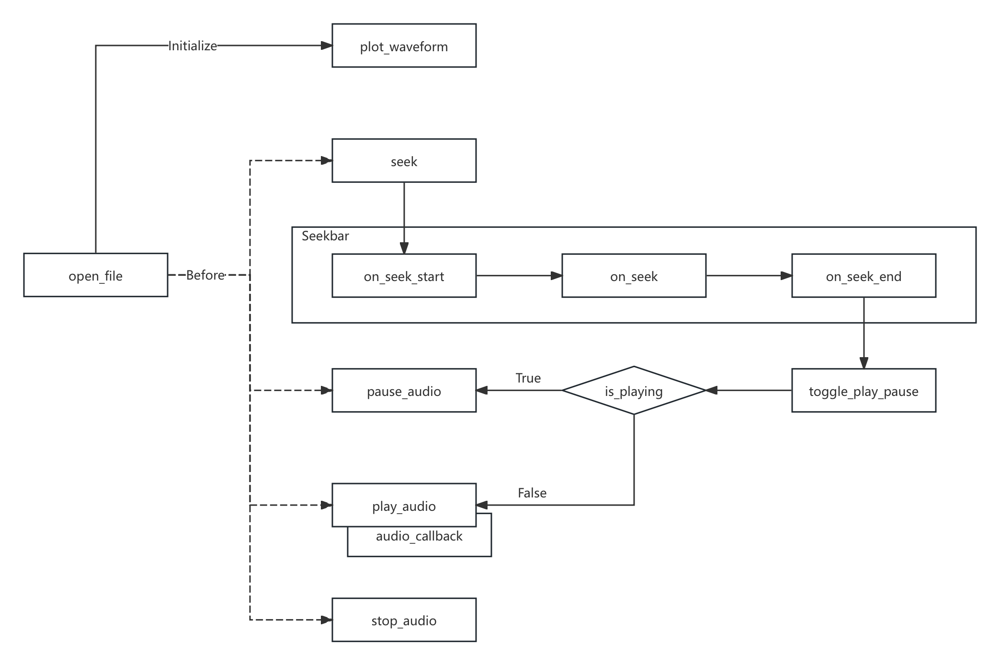
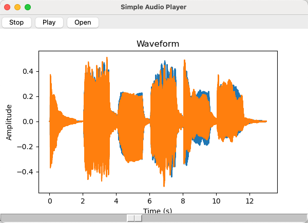

# 5.1.2 音频分析库（SoundFile、PyAudio、Librosa、Aubio）

在完成对基础库的熟悉后，我们接下来需要做的就是对工程中，音视频分析的相关核心功能库的学习。以音频分析库为切入点。

如果期望对 **一段音频（或音频流）进行解读**，根据我们已有的认知，将当前的音频数据从封装的音频格式，还原为采样模拟信号对应的 **PCM 数字信号载体** 只是第一步。该操作是后续所有工作的起点。

而音频格式在前文已有介绍，分为 **[三大类别](../../../Chapter_1/Language/cn/Docs_1_6.md)**，即 **[无压缩编码格式](../../../Chapter_1/Language/cn/Docs_1_6_2.md)**、**[无损压缩编码格式](../../../Chapter_1/Language/cn/Docs_1_6_3.md)**、**[有损压缩编码格式](../../../Chapter_1/Language/cn/Docs_1_6_4.md)**。虽然能通过一些针对 **某单个类型** 或 **类型族** 的 **音频编解码库** 来做解码工作，但我们在分析过程中，更希望能够通过 **简单而统一** 的方式，排除掉格式本身细部的工程干扰。使我们能够更关注于对 **音频所含有信息本身** 的分析。

既然如此，为何不直接使用大名鼎鼎的 FFMpeg 来完成从 **编解码到分析**，甚至是 **重排**、**编辑** 等操作呢？

其中的关键就在于，FFMpeg 虽然功能强大，但在以 **实时处理**、**数据集成**、**特征提取** 等为主要应用场景的音频分析情况下，FFMpeg 并不具备足够的优势。更不用提 **Python 的使用环境** 和 **对断点调试临时插值**，与 **基础库的高度兼容** 方面的要求了（尤其对 **模型训练时**，提取的数据能够 **直接被训练过程使用** 的这一点）。

所以，音频分析场景，除非只需要当前音视频数据的 **元信息（Metadata）**，即 **头部信息（Header）**，一般会采用以下这些库来进行。至于 **FFMpeg** ，在实际使用中会把其核心能力局限于 **编解码** 和 **转码** 的范围里，虽然 **其核心库** 和 **辅助插件** 是包含了包括滤镜在内的多种功能的，但通常我们只会以 **最简形式接入**。这一部分，伴随着网络推拉流协议和更贴近于规格的编解码协议库（如 x264 等），将在本系列书籍的进阶篇中细讲。此处暂不做更进一步的讨论。

现在，让焦点回到音频分析库上。常用的音频分析库主要有四个，为 **SoundFile**、**PyAudio**、**Librosa**、**Aubio**，分别对应 \[ **音频文件读写**、**音频流数据的输入输出**、**工程乐理分析**、**实时音频处理** \] 的需求。

## **SoundFile（Python Sound File）**

**SoundFile（PySoundFile [Python Sound File]）** 是一个 **用于读写音频文件的 Python 库**，主要被用于解码（或者编码）常用的 **音频格式文件** [\[4\]][ref] 。例如前文介绍过的 **WAV**、**AIFF**、**FLAC** 等大多数常见音频格式，SoundFile 都已完整支持。并且，通过 SoundFile 取出的音频数据，可以和其他音频分析库（如 Librosa、Aubio 等）和科学计算库（如 Numpy、SciPy 等）配合使用。

实际上，SoundFile 核心能力来自于 **C开源库 Libsndfile**，正是 Libsndfile 为它 **提供了多种音频文件格式的支撑**。而 PySoundFile 则可以看做是 Libsndfile 这个 C语言库的 Python 套接访问入口。因此，如果我们在常规工程中存在对音频文件的读写需求，不妨考虑采用 Libsndfile 来处理，它的官网位于 [http://www.mega-nerd.com/libsndfile/](http://www.mega-nerd.com/libsndfile) ，含有该库的相关技术参数。

#### 主要功能：

1. 支持 **WAV**、**AIFF**、**FLAC**、**OGG** 等多种常见 **音频文件格式**，适用于 **广泛的** 音频读写需求
2. **支持长音频处理**，提供快速读写大文件的功能，并可用于临时性的（分块）流式处理
3. 提供 **高可定制化的 API**，允许用户自定义音频处理流程和数据操作，适合快速分析
4. 允许以不同的数据格式（如浮点型、整型）读取和写入音频数据，及 **基本元数据访问**
5. 与主流科学计算库（如 Numpy、Pandas、SciPy 等）的 **无缝集成**
6. **单一的文件操作专精库**，不存在多个子模块，仅有有限但明确的 API 入口

#### 基础库（sf.）的常用函数（简，仅列出名称）：

1. 数据结构：
   [&lt;SoundFile&gt;](https://python-soundfile.readthedocs.io/en/0.11.0/#soundfile.SoundFile)
2. 关联文件：
   [open](https://python-soundfile.readthedocs.io/en/0.11.0/#soundfile.open)
3. 音频读写：
   [read](https://python-soundfile.readthedocs.io/en/0.11.0/#soundfile.read), 
   [write](https://python-soundfile.readthedocs.io/en/0.11.0/#soundfile.write)
4. 基本信息：
   [info](https://python-soundfile.readthedocs.io/en/0.11.0/#soundfile.info)

#### 核心类（sf.SoundFile 即 [&lt;SoundFile&gt;](https://python-soundfile.readthedocs.io/en/0.11.0/#soundfile.SoundFile)）的常用函数（简，仅列出名称）：

1. 基础参数：
   [samplerate](https://python-soundfile.readthedocs.io/en/0.11.0/#soundfile.SoundFile.samplerate), 
   [channels](https://python-soundfile.readthedocs.io/en/0.11.0/#soundfile.SoundFile.channels), 
   [format](https://python-soundfile.readthedocs.io/en/0.11.0/#soundfile.SoundFile.format), 
   [subtype](https://python-soundfile.readthedocs.io/en/0.11.0/#soundfile.SoundFile.subtype), 
   [endian](https://python-soundfile.readthedocs.io/en/0.11.0/#soundfile.SoundFile.endian), 
   [frames](https://python-soundfile.readthedocs.io/en/0.11.0/#soundfile.SoundFile.frames)
2. 帧位索引：
   [seek](https://python-soundfile.readthedocs.io/en/0.11.0/#soundfile.SoundFile.seek), 
   [tell](https://python-soundfile.readthedocs.io/en/0.11.0/#soundfile.SoundFile.tell)
3. 数据访问：
   [read](https://python-soundfile.readthedocs.io/en/0.11.0/#soundfile.SoundFile.read), 
   [write](https://python-soundfile.readthedocs.io/en/0.11.0/#soundfile.SoundFile.write), 
   [read_frames](https://python-soundfile.readthedocs.io/en/0.11.0/#soundfile.SoundFile.read_frames), 
   [write_frames](https://python-soundfile.readthedocs.io/en/0.11.0/#soundfile.SoundFile.write_frames)
4. 分块读写：
   [buffer_read](https://python-soundfile.readthedocs.io/en/0.11.0/#soundfile.SoundFile.buffer_read), 
   [buffer_write](https://python-soundfile.readthedocs.io/en/0.11.0/#soundfile.SoundFile.buffer_write)

由上可知，SoundFile 本身的调用极其简便，但已满足完整的音频文件读写需求。开源项目位于 **[Github:bastibe/python-soundfile](https://github.com/bastibe/python-soundfile)**。使用细节，可自行前往 **[官方档案馆查阅](https://python-soundfile.readthedocs.io/en/0.11.0/)**。

## **PyAudio（Python Audio）**

**PyAudio（Python Audio）** 是音频分析中 **常用的音频输入输出操作库**，即 **音频 I/O 库** [\[5\]][ref] 。换句话说，它提供了一组工具和函数，使得开发者可以在项目的 Python 程序中，利用 PyAudio 已有的函数接口，**快速进行音频的流式（这里指本地流）录制和输出**。同 SoundFile 一样，PyAudio 依赖于底层 **C语言库 PortAudio** 的帮助，而其内核 PortAudio 库实则为一个 **专精于多种操作系统上运行（即跨 Windows、MacOS、Linux 平台）的底层音频输入输出（I/O）库**。

所以，与 SoundFile 注重于对音频文件（即本地音频流结果）的操作不同，PyAudio 或者说 PortAudio 的操作重点，在于 **处理对 “实时” 音频流的捕获和析出**。实时音频流，是能够被连续处理传输的音频数据，例如采样自麦克风输入模数转换后的持续不断的数字信号，或者取自播放音频的连续到来分块数据，即 **过程中音频数据**。

由此，音频分析中常用 PyAudio 来完成对被分析音频的 **“启停转播”（Play/Stop/Seek/Pause）**，所谓 **音频本地流控（LASC [Local Audio Stream Control]）**。

#### 主要功能：

1. 专业音频本地流控 Python 库，支持实时音频流的捕获和播放，适合 **实时音频处理任务**
2. 稳定的 **跨平台兼容性**，完整覆盖主流操作系统，包括 Windows、macOS 和 Linux
3. 灵活的 **音频流配置**，提供多种配置选项，如采样率、通道数、样本格式、缓冲区大小等
4. 提供 **接入式回调**，支持使用回调函数处理音频数据，适合低延迟的实时音频分析
5. 与主流科学计算库 和 其他音频库（如 SoundFile）的 **无缝集成**
6. **单一的音频本地流读写专精库**，不存在多个子模块，仅有有限但明确的 API 入口

#### 基础库（pyaudio.）由于特殊的套接设计，仅用于创建 &lt;PyAudio&gt; 即 PortAudio 实例：

1. 数据结构：
   [&lt;PyAudio&gt;](https://people.csail.mit.edu/hubert/pyaudio/docs/#pyaudio.PyAudio)、
   [&lt;Stream&gt;](https://people.csail.mit.edu/hubert/pyaudio/docs/#pyaudio.Stream)
2. 创建实例：
   [PyAudio](https://people.csail.mit.edu/hubert/pyaudio/docs/#pyaudio.PyAudio)

#### 核心类（pyaudio.PyAudio 即 [&lt;PyAudio&gt;](https://people.csail.mit.edu/hubert/pyaudio/docs/#pyaudio.PyAudio) 设备实例）的常用函数（简，仅列出名称）：

1. 销毁实例：
   [terminate](https://people.csail.mit.edu/hubert/pyaudio/docs/#pyaudio.PyAudio.terminate)
2. 联音频流：
   [open](https://people.csail.mit.edu/hubert/pyaudio/docs/#pyaudio.PyAudio.open) （返回 [&lt;Stream&gt;](https://people.csail.mit.edu/hubert/pyaudio/docs/#pyaudio.Stream) 实例，通过 stream_callback 参数配置回调）
3. 设备查询：
   [get_device_count](https://people.csail.mit.edu/hubert/pyaudio/docs/#pyaudio.PyAudio.get_device_count), 
   [get_device_info_by_index](https://people.csail.mit.edu/hubert/pyaudio/docs/#pyaudio.PyAudio.get_device_info_by_index), 
   [get_host_api_count](https://people.csail.mit.edu/hubert/pyaudio/docs/#pyaudio.PyAudio.get_host_api_count), 
   [get_default_input_device_info](https://people.csail.mit.edu/hubert/pyaudio/docs/#pyaudio.PyAudio.get_default_input_device_info), 
   [get_default_output_device_info](https://people.csail.mit.edu/hubert/pyaudio/docs/#pyaudio.PyAudio.get_default_output_device_info), 
   [get_host_api_info_by_index](https://people.csail.mit.edu/hubert/pyaudio/docs/#pyaudio.PyAudio.get_host_api_info_by_index), 
   [get_device_info_by_host_api_device_index](https://people.csail.mit.edu/hubert/pyaudio/docs/#pyaudio.PyAudio.get_device_info_by_host_api_device_index)
4. 参数查验：
   [get_sample_size](https://people.csail.mit.edu/hubert/pyaudio/docs/#pyaudio.PyAudio.get_sample_size), 
   [is_format_supported](https://people.csail.mit.edu/hubert/pyaudio/docs/#pyaudio.PyAudio.is_format_supported)

#### 核心类的（pyaudio.Stream 即 [&lt;Stream&gt;](https://people.csail.mit.edu/hubert/pyaudio/docs/#pyaudio.Stream) 音频流实例）的常用函数（简，仅列出名称）：

1. 音频流启停：
   [start_stream](https://people.csail.mit.edu/hubert/pyaudio/docs/#pyaudio.Stream.start_stream), 
   [stop_stream](https://people.csail.mit.edu/hubert/pyaudio/docs/#pyaudio.Stream.stop_stream)
2. 音频流关闭：
   [close](https://people.csail.mit.edu/hubert/pyaudio/docs/#pyaudio.Stream.close)（注意，&lt;Stream&gt; 的 open 状态来自于设备实例，亦是其初始状态）
3. 流状态检测：
   [is_active](https://people.csail.mit.edu/hubert/pyaudio/docs/#pyaudio.Stream.is_active), 
   [is_stopped](https://people.csail.mit.edu/hubert/pyaudio/docs/#pyaudio.Stream.is_stopped)
4. 流数据读写：
   [read](https://people.csail.mit.edu/hubert/pyaudio/docs/#pyaudio.Stream.read), 
   [write](https://people.csail.mit.edu/hubert/pyaudio/docs/#pyaudio.Stream.write)

余下使用细节，可自行前往 **[项目官网](https://people.csail.mit.edu/hubert/pyaudio)** ，或 **[官方档案馆查阅](https://people.csail.mit.edu/hubert/pyaudio/docs/)**。

<br>

上述关键函数已包含 PyAudio 的 **几乎全部调用**，但并没有列出 PyAudio 回调格式。这是因为，这一部分正是 PyAudio 分析适用性的关键。在具体使用中，**PyAudio 回调** 的设定方式，和回调各参数意义与取值，是我们留意的重点。

参考 PyAudio 0.2.14 当前最新版，**回调的设置方式和格式都是固定的**，有：

```python
def callback(in_data, frame_count, time_info, in_status):
    # 在此处处理音频数据（例如，进行实时分析或处理）
    return (out_data, out_status)

p = pyaudio.PyAudio()
stream = p.open(
                format=p.get_format_from_width(2),
                channels=1 if sys.platform == 'darwin' else 2,
                rate=44100,
                input=True,
                output=True,
                stream_callback=callback
)
```

其中，**callback(in_data, frame_count, time_info, status)** 即 **回调传入**，包含四个关键参：

- **in_data** 为 **音频数据的输入流**，通常配合 **np.frombuffer(in_data, dtype=np.int16)** 读取数据
- **frame_count** 为 **输入流当前数据对应音频帧数**，即当前 **in_data** 数据覆盖的 **帧数**
- **time_info** 是一个包含了 **三个设备相关时间戳** 的 **数据字典**，有参数（注意表述）：
    - **input_buffer_adc_time** 表示 **输入音频数据被 ADC 处理时的时间戳（如果适用）**
    - **output_buffer_dac_time** 表示 **输出音频数据被 DAC 处理时的时间戳（如果适用）**
    - **current_time** 表示 当前时间，即 **当前调用触发时的系统时间戳**
- **in_status** 是 **记录当前输入回调时，流状态的枚举类标识**。可取三个状态常量，分别是：
    - **pyaudio.paContinue** 表示 **流继续**，即恢复播放和正常播放时的状态，也是默认状态
    - **pyaudio.paComplete** 表示 **流完成**，即代指当前输入流数据为最末尾的一组
    - **pyaudio.paAbort** 表示 **流中止**，即立刻停止时触发，一般为紧急关流或异常情况

在 **callback 处理完毕后**，回调要求以 **return (out_data, out_status)** 的 **格式返回**。同样：

- **out_data** 为 **音频数据的输出流**，根据协定好的音频 PCM 位数对应的格式输出，**一般同输入**
- **out_status** 是 **记录当前输出的状态**，同 **in_status** 的可取值一致，**一般同 in_status 不变**

配置好 callback 后，我们该如何使用呢？只需要于 **&lt;PyAudio&gt;** 实例调用 open 开启流 **&lt;Stream&gt;** 实体时，以 **stream_callback=callback** 将 **函数句柄以参数传入** 即可生效。而这里的 callback 也可 **根据具体情况修改命名**，比如 audio_analyze_callback 。

随之就可以在回调中，完成分析作业了。

## **Librosa**

**Librosa** 是一个功能强大且易于使用的 **音频/乐理（工程）科学分析原生 Python 库**，成体系的提供了用于 **音频特征提取**、**节拍节奏分析**、**音高（工程）估计**、**音频效果器（滤波、特效接口）** 等处理的算法实现。其设计理念来自于 SciPy 2015 年的第十四届 Python 科学大会中，有关音频处理、音频潜藏信息提取与分析快捷化的讨论 [\[6\]][ref] 。因此，在设计之初就完全采用了，与其他科学计算库（如 NumPy、SciPy）和可视化库（主要指 Matplotlib）的 **无缝集成**。而极强的分析能力和可操作性（工程层面），使 Librosa 成为了我们做 **音频分析与操作时的重要工具**。

**必须熟练掌握。**

#### 主要功能：

1. **临时处理友好**，提供简便的方法，在必要时做临时读取和写入音频文件，支持多种格式
2. **快速时频转换**，提供短时傅里叶变换（STFT）、常规Q变换（CQT）等，方便时频域分析
3. **音频特征提取**，支持对梅尔频率倒谱系数（MFCC）、色度特征、频谱对比度等特征提取
4. **节拍节奏分析**，具有节拍跟踪、起音检测等，音乐（工程）分析能力
5. **分割与重采样**，提供音频分割与重采样工具，便于快速分析对比
6. **调音与音频特效**，具有音高估计和调音功能，并支持音频时间伸缩和音高变换等音频效果
7. 当然还有最重要的【无缝集成】特性

#### 基础库（librosa.）的常用函数（简，仅列出名称）：

1. 音频加载：
   [load](https://librosa.org/doc/main/generated/librosa.load.html), 
   [stream](https://librosa.org/doc/main/generated/librosa.stream.html)
2. 音频生成：
   [clicks](https://librosa.org/doc/main/generated/librosa.clicks.html), 
   [tone](https://librosa.org/doc/main/generated/librosa.tone.html), 
   [chirp](https://librosa.org/doc/main/generated/librosa.chirp.html)
3. 简化分析：
   [to_mono](https://librosa.org/doc/main/generated/librosa.to_mono.html), 
   [resample](https://librosa.org/doc/main/generated/librosa.resample.html), 
   [get_duration](https://librosa.org/doc/main/generated/librosa.get_duration.html), 
   [get_samplerate](https://librosa.org/doc/main/generated/librosa.get_samplerate.html)
4. 时频分析：
   [stft](https://librosa.org/doc/main/generated/librosa.stft.html), 
   [istft](https://librosa.org/doc/main/generated/librosa.istft.html), 
   [reassigned_spectrogram](https://librosa.org/doc/main/generated/librosa.reassigned_spectrogram.html), 
   [cqt](https://librosa.org/doc/main/generated/librosa.cqt.html), 
   [icqt](https://librosa.org/doc/main/generated/librosa.icqt.html), 
   [hybrid_cqt](https://librosa.org/doc/main/generated/librosa.hybrid_cqt.html), 
   [pseudo_cqt](https://librosa.org/doc/main/generated/librosa.pseudo_cqt.html), 
   [vqt](https://librosa.org/doc/main/generated/librosa.vqt.html), 
   [iirt](https://librosa.org/doc/main/generated/librosa.iirt.html), 
   [fmt](https://librosa.org/doc/main/generated/librosa.fmt.html), 
   [magphase](https://librosa.org/doc/main/generated/librosa.magphase.html)
5. 时域校准：
   [autocorrelate](https://librosa.org/doc/main/generated/librosa.autocorrelate.html), 
   [lpc](https://librosa.org/doc/main/generated/librosa.lpc.html), 
   [zero_crossings](https://librosa.org/doc/main/generated/librosa.zero_crossings.html), 
   [mu_compress](https://librosa.org/doc/main/generated/librosa.mu_compress.html), 
   [mu_expand](https://librosa.org/doc/main/generated/librosa.mu_expand.html)
6. 谐波分析：
   [interp_harmonics](https://librosa.org/doc/main/generated/librosa.interp_harmonics.html), 
   [salience](https://librosa.org/doc/main/generated/librosa.salience.html), 
   [f0_harmonics](https://librosa.org/doc/main/generated/librosa.f0_harmonics.html), 
   [phase_vocoder](https://librosa.org/doc/main/generated/librosa.phase_vocoder.html)
7. 相位校准：
   [griffinlim](https://librosa.org/doc/main/generated/librosa.griffinlim.html), 
   [griffinlim_cqt](https://librosa.org/doc/main/generated/librosa.griffinlim_cqt.html)
8. 响度单位换算：
   [amplitude_to_db](https://librosa.org/doc/main/generated/librosa.amplitude_to_db.html), 
   [db_to_amplitude](https://librosa.org/doc/main/generated/librosa.db_to_amplitude.html), 
   [power_to_db](https://librosa.org/doc/main/generated/librosa.power_to_db.html), 
   [db_to_power](https://librosa.org/doc/main/generated/librosa.db_to_power.html), 
   [perceptual_weighting](https://librosa.org/doc/main/generated/librosa.perceptual_weighting.html), 
   [frequency_weighting](https://librosa.org/doc/main/generated/librosa.frequency_weighting.html), 
   [multi_frequency_weighting](https://librosa.org/doc/main/generated/librosa.multi_frequency_weighting.html), 
   [A_weighting](https://librosa.org/doc/main/generated/librosa.A_weighting.html), 
   [B_weighting](https://librosa.org/doc/main/generated/librosa.B_weighting.html), 
   [C_weighting](https://librosa.org/doc/main/generated/librosa.C_weighting.html), 
   [D_weighting](https://librosa.org/doc/main/generated/librosa.D_weighting.html), 
   [pcen](https://librosa.org/doc/main/generated/librosa.pcen.html)
9. 时轴单位换算：
   [frames_to_samples](https://librosa.org/doc/main/generated/librosa.frames_to_samples.html), 
   [frames_to_time](https://librosa.org/doc/main/generated/librosa.frames_to_time.html), 
   [samples_to_frames](https://librosa.org/doc/main/generated/librosa.samples_to_frames.html), 
   [samples_to_time](https://librosa.org/doc/main/generated/librosa.samples_to_time.html), 
   [time_to_frames](https://librosa.org/doc/main/generated/librosa.time_to_frames.html), 
   [time_to_samples](https://librosa.org/doc/main/generated/librosa.time_to_samples.html), 
   [blocks_to_frames](https://librosa.org/doc/main/generated/librosa.blocks_to_frames.html), 
   [blocks_to_samples](https://librosa.org/doc/main/generated/librosa.blocks_to_samples.html), 
   [blocks_to_time](https://librosa.org/doc/main/generated/librosa.blocks_to_time.html)
10. 频率单位换算：
   [hz_to_note](https://librosa.org/doc/main/generated/librosa.hz_to_note.html), 
   [hz_to_midi](https://librosa.org/doc/main/generated/librosa.hz_to_midi.html), 
   [hz_to_svara_h](https://librosa.org/doc/main/generated/librosa.hz_to_svara_h.html), 
   [hz_to_svara_c](https://librosa.org/doc/main/generated/librosa.hz_to_svara_c.html), 
   [hz_to_fjs](https://librosa.org/doc/main/generated/librosa.hz_to_fjs.html), 
   [midi_to_hz](https://librosa.org/doc/main/generated/librosa.midi_to_hz.html), 
   [midi_to_note](https://librosa.org/doc/main/generated/librosa.midi_to_note.html), 
   [midi_to_svara_h](https://librosa.org/doc/main/generated/librosa.midi_to_svara_h.html), 
   [midi_to_svara_c](https://librosa.org/doc/main/generated/librosa.midi_to_svara_c.html), 
   [note_to_midi](https://librosa.org/doc/main/generated/librosa.note_to_midi.html), 
   [note_to_svara_h](https://librosa.org/doc/main/generated/librosa.note_to_svara_h.html), 
   [note_to_svara_c](https://librosa.org/doc/main/generated/librosa.note_to_svara_c.html), 
   [hz_to_mel](https://librosa.org/doc/main/generated/librosa.hz_to_mel.html), 
   [hz_to_octs](https://librosa.org/doc/main/generated/librosa.hz_to_octs.html), 
   [mel_to_hz](https://librosa.org/doc/main/generated/librosa.mel_to_hz.html), 
   [octs_to_hz](https://librosa.org/doc/main/generated/librosa.octs_to_hz.html), 
   [A4_to_tuning](https://librosa.org/doc/main/generated/librosa.A4_to_tuning.html), 
   [tuning_to_A4](https://librosa.org/doc/main/generated/librosa.tuning_to_A4.html)
11. 基底频率生成：
   [fft_frequencies](https://librosa.org/doc/main/generated/librosa.fft_frequencies.html), 
   [cqt_frequencies](https://librosa.org/doc/main/generated/librosa.cqt_frequencies.html), 
   [mel_frequencies](https://librosa.org/doc/main/generated/librosa.mel_frequencies.html), 
   [tempo_frequencies](https://librosa.org/doc/main/generated/librosa.tempo_frequencies.html), 
   [fourier_tempo_frequencies](https://librosa.org/doc/main/generated/librosa.fourier_tempo_frequencies.html)
12. 乐理乐谱工具：
   [key_to_notes](https://librosa.org/doc/main/generated/librosa.key_to_notes.html),
   [key_to_degrees](https://librosa.org/doc/main/generated/librosa.key_to_degrees.html),
   [mela_to_svara](https://librosa.org/doc/main/generated/librosa.mela_to_svara.html),
   [mela_to_degrees](https://librosa.org/doc/main/generated/librosa.mela_to_degrees.html),
   [thaat_to_degrees](https://librosa.org/doc/main/generated/librosa.thaat_to_degrees.html),
   [list_mela](https://librosa.org/doc/main/generated/librosa.list_mela.html),
   [list_thaat](https://librosa.org/doc/main/generated/librosa.list_thaat.html),
   [fifths_to_note](https://librosa.org/doc/main/generated/librosa.fifths_to_note.html),
   [interval_to_fjs](https://librosa.org/doc/main/generated/librosa.interval_to_fjs.html),
   [interval_frequencies](https://librosa.org/doc/main/generated/librosa.interval_frequencies.html),
   [pythagorean_intervals](https://librosa.org/doc/main/generated/librosa.pythagorean_intervals.html),
   [plimit_intervals](https://librosa.org/doc/main/generated/librosa.plimit_intervals.html)
13. 乐理音高音调：
   [pyin](https://librosa.org/doc/main/generated/librosa.pyin.html),
   [yin](https://librosa.org/doc/main/generated/librosa.yin.html),
   [estimate_tuning](https://librosa.org/doc/main/generated/librosa.estimate_tuning.html),
   [pitch_tuning](https://librosa.org/doc/main/generated/librosa.pitch_tuning.html),
   [piptrack](https://librosa.org/doc/main/generated/librosa.piptrack.html)
14. 适配杂项：
   [samples_like](https://librosa.org/doc/main/generated/librosa.samples_like.html),
   [times_like](https://librosa.org/doc/main/generated/librosa.times_like.html),
   [get_fftlib](https://librosa.org/doc/main/generated/librosa.get_fftlib.html),
   [set_fftlib](https://librosa.org/doc/main/generated/librosa.set_fftlib.html)

#### 图表显示扩展（librosa.display.）的常用函数（简，仅列出名称，依赖于 Matplotlib）：

1. 数据可视化：
   [specshow](https://librosa.org/doc/main/generated/librosa.display.specshow.html), 
   [waveshow](https://librosa.org/doc/main/generated/librosa.display.waveshow.html)
2. 坐标轴设置：
   [TimeFormatter](https://librosa.org/doc/main/generated/librosa.display.TimeFormatter.html),
   [NoteFormatter](https://librosa.org/doc/main/generated/librosa.display.NoteFormatter.html),
   [SvaraFormatter](https://librosa.org/doc/main/generated/librosa.display.SvaraFormatter.html), 
   [FJSFormatter](https://librosa.org/doc/main/generated/librosa.display.FJSFormatter.html), 
   [LogHzFormatter](https://librosa.org/doc/main/generated/librosa.display.LogHzFormatter.html), 
   [ChromaFormatter](https://librosa.org/doc/main/generated/librosa.display.ChromaFormatter.html), 
   [ChromaSvaraFormatter](https://librosa.org/doc/main/generated/librosa.display.ChromaSvaraFormatter.html), 
   [ChromaFJSFormatter](https://librosa.org/doc/main/generated/librosa.display.ChromaFJSFormatter.html), 
   [TonnetzFormatter](https://librosa.org/doc/main/generated/librosa.display.TonnetzFormatter.html)
3. 适配杂项：
   [cmap](https://librosa.org/doc/main/generated/librosa.display.cmap.html), 
   [AdaptiveWaveplot](https://librosa.org/doc/main/generated/librosa.display.AdaptiveWaveplot.html)

#### 音频特征提取（librosa.feature.）的常用函数（简，仅列出名称）：

1. 工程频谱特征：
   [chroma_stft](https://librosa.org/doc/main/generated/librosa.feature.chroma_stft.html), 
   [chroma_cqt](https://librosa.org/doc/main/generated/librosa.feature.chroma_cqt.html), 
   [chroma_cens](https://librosa.org/doc/main/generated/librosa.feature.chroma_cens.html), 
   [chroma_vqt](https://librosa.org/doc/main/generated/librosa.feature.chroma_vqt.html), 
   [melspectrogram](https://librosa.org/doc/main/generated/librosa.feature.melspectrogram.html), 
   [mfcc](https://librosa.org/doc/main/generated/librosa.feature.mfcc.html), 
   [rms](https://librosa.org/doc/main/generated/librosa.feature.rms.html), 
   [spectral_centroid](https://librosa.org/doc/main/generated/librosa.feature.spectral_centroid.html), 
   [spectral_bandwidth](https://librosa.org/doc/main/generated/librosa.feature.spectral_bandwidth.html), 
   [spectral_contrast](https://librosa.org/doc/main/generated/librosa.feature.spectral_contrast.html), 
   [spectral_flatness](https://librosa.org/doc/main/generated/librosa.feature.spectral_flatness.html), 
   [spectral_rolloff](https://librosa.org/doc/main/generated/librosa.feature.spectral_rolloff.html), 
   [poly_features](https://librosa.org/doc/main/generated/librosa.feature.poly_features.html), 
   [tonnetz](https://librosa.org/doc/main/generated/librosa.feature.tonnetz.html), 
   [zero_crossing_rate](https://librosa.org/doc/main/generated/librosa.feature.zero_crossing_rate.html)
2. 乐理节奏特征：
   [tempo](https://librosa.org/doc/main/generated/librosa.beat.tempo.html), 
   [tempogram](https://librosa.org/doc/main/generated/librosa.feature.tempogram.html), 
   [fourier_tempogram](https://librosa.org/doc/main/generated/librosa.feature.fourier_tempogram.html), 
   [tempogram_ratio](https://librosa.org/doc/main/generated/librosa.feature.tempogram_ratio.html)
3. 特征计算：
   [delta](https://librosa.org/doc/main/generated/librosa.feature.delta.html), 
   [stack_memory](https://librosa.org/doc/main/generated/librosa.feature.stack_memory.html)
4. 反向逆推：
   [inverse.mel_to_stft](https://librosa.org/doc/main/generated/librosa.feature.inverse.mel_to_stft.html), 
   [inverse.mel_to_audio](https://librosa.org/doc/main/generated/librosa.feature.inverse.mel_to_audio.html), 
   [inverse.mfcc_to_mel](https://librosa.org/doc/main/generated/librosa.feature.inverse.mfcc_to_mel.html), 
   [inverse.mfcc_to_audio](https://librosa.org/doc/main/generated/librosa.feature.inverse.mfcc_to_audio.html)

#### 起音检测扩展（librosa.onset.）的常用函数（简，仅列出名称）：

1. 峰值检测：
   [onset_detect](https://librosa.org/doc/main/generated/librosa.onset.onset_detect.html)
2. 小值回溯：
   [onset_backtrack](https://librosa.org/doc/main/generated/librosa.onset.onset_backtrack.html)
3. 强度统计：
   [onset_strength](https://librosa.org/doc/main/generated/librosa.onset.onset_strength.html), 
   [onset_strength_multi](https://librosa.org/doc/main/generated/librosa.onset.onset_strength_multi.html)

#### 节拍节奏扩展（librosa.beat.）的常用函数（简，仅列出名称）：

1. 节拍追踪：
   [beat_track](https://librosa.org/doc/main/generated/librosa.beat.beat_track.html)
2. 主位脉冲：
   [plp](https://librosa.org/doc/main/generated/librosa.beat.plp.html)

#### 语谱分解扩展（librosa.decompose.）的常用函数（简，仅列出名称）：

1. 特征矩阵分解：
   [decompose](https://librosa.org/doc/main/generated/librosa.decompose.decompose.html)
2. 源分离滤波：
   [hpss](https://librosa.org/doc/main/generated/librosa.decompose.hpss.html), 
   [nn_filter](https://librosa.org/doc/main/generated/librosa.decompose.nn_filter.html)

#### 音频效果器扩展（librosa.effects.）的常用函数（简，仅列出名称）：

1. 谐波乐源分离：
   [hpss](https://librosa.org/doc/main/generated/librosa.effects.hpss.html), 
   [harmonic](https://librosa.org/doc/main/generated/librosa.effects.harmonic.html), 
   [percussive](https://librosa.org/doc/main/generated/librosa.effects.percussive.html)
2. 时间伸缩：
   [time_stretch](https://librosa.org/doc/main/generated/librosa.effects.time_stretch.html)
3. 时序混音：
   [remix](https://librosa.org/doc/main/generated/librosa.effects.remix.html)
4. 音高移动：
   [pitch_shift](https://librosa.org/doc/main/generated/librosa.effects.pitch_shift.html)
5. 信号操控：
   [trim](https://librosa.org/doc/main/generated/librosa.effects.trim.html), 
   [split](https://librosa.org/doc/main/generated/librosa.effects.split.html), 
   [preemphasis](https://librosa.org/doc/main/generated/librosa.effects.preemphasis.html), 
   [deemphasis](https://librosa.org/doc/main/generated/librosa.effects.deemphasis.html)

#### 时域分割扩展（librosa.segment.）的常用函数（简，仅列出名称）：

1. 自相似性：
   [cross_similarity](https://librosa.org/doc/main/generated/librosa.segment.cross_similarity.html), 
   [path_enhance](https://librosa.org/doc/main/generated/librosa.segment.path_enhance.html)
2. 重复矩阵：
   [recurrence_matrix](https://librosa.org/doc/main/generated/librosa.segment.recurrence_matrix.html), 
   [lag_to_recurrence](https://librosa.org/doc/main/generated/librosa.segment.lag_to_recurrence.html)
3. 延迟矩阵：
   [timelag_filter](https://librosa.org/doc/main/generated/librosa.segment.timelag_filter.html), 
   [recurrence_to_lag](https://librosa.org/doc/main/generated/librosa.segment.recurrence_to_lag.html)
4. 时域聚类：
   [agglomerative](https://librosa.org/doc/main/generated/librosa.segment.agglomerative.html), 
   [subsegment](https://librosa.org/doc/main/generated/librosa.segment.subsegment.html)

#### 顺序模型扩展（librosa.sequence.）的常用函数（简，仅列出名称）：

1. 顺序对齐：
   [dtw](https://librosa.org/doc/main/generated/librosa.sequence.dtw.html), 
   [rqa](https://librosa.org/doc/main/generated/librosa.sequence.rqa.html)
2. 维特比（Viterbi）解码：
   [viterbi](https://librosa.org/doc/main/generated/librosa.sequence.viterbi.html), 
   [viterbi_discriminative](https://librosa.org/doc/main/generated/librosa.sequence.viterbi_discriminative.html), 
   [viterbi_binary](https://librosa.org/doc/main/generated/librosa.sequence.viterbi_binary.html)
3. 状态转移矩阵：
   [transition_uniform](https://librosa.org/doc/main/generated/librosa.sequence.transition_uniform.html), 
   [transition_loop](https://librosa.org/doc/main/generated/librosa.sequence.transition_loop.html), 
   [transition_cycle](https://librosa.org/doc/main/generated/librosa.sequence.transition_cycle.html), 
   [transition_local](https://librosa.org/doc/main/generated/librosa.sequence.transition_local.html)

#### 跨库通用扩展（librosa.util.）的常用函数（简，仅列出名称）：

1. 数组转换：
   [frame](https://librosa.org/doc/main/generated/librosa.util.frame.html), 
   [pad_center](https://librosa.org/doc/main/generated/librosa.util.pad_center.html), 
   [expand_to](https://librosa.org/doc/main/generated/librosa.util.expand_to.html), 
   [fix_length](https://librosa.org/doc/main/generated/librosa.util.fix_length.html), 
   [fix_frames](https://librosa.org/doc/main/generated/librosa.util.fix_frames.html), 
   [index_to_slice](https://librosa.org/doc/main/generated/librosa.util.index_to_slice.html), 
   [softmask](https://librosa.org/doc/main/generated/librosa.util.softmask.html), 
   [stack](https://librosa.org/doc/main/generated/librosa.util.stack.html), 
   [sync](https://librosa.org/doc/main/generated/librosa.util.sync.html), 
   [axis_sort](https://librosa.org/doc/main/generated/librosa.util.axis_sort.html), 
   [normalize](https://librosa.org/doc/main/generated/librosa.util.normalize.html), 
   [shear](https://librosa.org/doc/main/generated/librosa.util.shear.html), 
   [sparsify_rows](https://librosa.org/doc/main/generated/librosa.util.sparsify_rows.html), 
   [buf_to_float](https://librosa.org/doc/main/generated/librosa.util.buf_to_float.html), 
   [tiny](https://librosa.org/doc/main/generated/librosa.util.tiny.html)
2. 条件匹配：
   [match_intervals](https://librosa.org/doc/main/generated/librosa.util.match_intervals.html), 
   [match_events](https://librosa.org/doc/main/generated/librosa.util.match_events.html)
3. 统计运算：
   [localmax](https://librosa.org/doc/main/generated/librosa.util.localmax.html), 
   [localmin](https://librosa.org/doc/main/generated/librosa.util.localmin.html), 
   [peak_pick](https://librosa.org/doc/main/generated/librosa.util.peak_pick.html), 
   [nils](https://librosa.org/doc/main/generated/librosa.util.nils.html), 
   [cyclic_gradient](https://librosa.org/doc/main/generated/librosa.util.cyclic_gradient.html), 
   [dtype_c2r](https://librosa.org/doc/main/generated/librosa.util.dtype_c2r.html), 
   [dtype_r2c](https://librosa.org/doc/main/generated/librosa.util.dtype_r2c.html), 
   [count_unique](https://librosa.org/doc/main/generated/librosa.util.count_unique.html), 
   [is_unique](https://librosa.org/doc/main/generated/librosa.util.is_unique.html), 
   [abs2](https://librosa.org/doc/main/generated/librosa.util.abs2.html), 
   [phasor](https://librosa.org/doc/main/generated/librosa.util.phasor.html)
4. 输入评估：
   [valid_audio](https://librosa.org/doc/main/generated/librosa.util.valid_audio.html), 
   [valid_int](https://librosa.org/doc/main/generated/librosa.util.valid_int.html), 
   [valid_intervals](https://librosa.org/doc/main/generated/librosa.util.valid_intervals.html), 
   [is_positive_int](https://librosa.org/doc/main/generated/librosa.util.is_positive_int.html)
5. 本库样例：
   [example](https://librosa.org/doc/main/generated/librosa.util.example.html), 
   [example_info](https://librosa.org/doc/main/generated/librosa.util.example_info.html), 
   [list_examples](https://librosa.org/doc/main/generated/librosa.util.list_examples.html), 
   [find_files](https://librosa.org/doc/main/generated/librosa.util.find_files.html), 
   [cite](https://librosa.org/doc/main/generated/librosa.util.cite.html)

具体使用细节，可自行前往项目 **[官方档案馆查阅](https://librosa.org/doc/latest/index.html)** 。

<br>

Librosa 在音频方面，涵盖了大多数基本的科学分析手段，足够一般工程使用。

但在 **数据科学方面** 和 **集成性** 的高度倾注，也让 Librosa 的 **实时性相对有所降低**（本质为复杂度和精度上升，所伴随算力消耗的升高）。可若此时我们对误差有相对较高的容忍度，且更**希望音频处理足够实时和高效时**，就得采用 Aubio 库来达成这一点了。**Aubio 和 Librosa 的特性相反，是满足这种情况有效补充手段。**

## **Aubio**

**Aubio** 是主要用于 **音乐信息检索（MIR [Music Information Retrieval]）** 的 **跨平台轻量级分析库**。设计之初就是期望实时进行 MIR 使 **Aubio 采用了 C语言 作为库的核心语言**。不过，因其已在自身的开源项目中，实现了 Python 的套接调用入口 [\[7\]][ref] ，我们仍然可以在 Python 中使用。

功能性方面，Aubio 和 Librosa 在音频浅层信息处理上，如果排除效率因素，则几乎不相上下。但 Aubio 的处理效率，不论从整体架构还是本位支撑上，都着实比 Librosa 更加高效。

因此，在音频分析领域，对于类似 **‘音高检测’ 等以实时性作为主要求的分析点**，我们常采用 Aubio 而不是 Librosa 处理。而对于 梅尔频率倒谱系数（MFCC）之类的科学分析，则多数用 Librosa 解决，虽然 Aubio 也有此功能。除此外，科学分析不以 Aubio 合并解决的另一原因，还在于 Aubio 对主流科学计算库的兼容程度，要略逊 Librosa 一筹，并向当局限。即有利有弊。

此外，**相比 Librosa，Aubio 仅能提供相对基础的分析**。

#### 主要功能：

1. **实时处理能力**，面向低延迟的音频处理能力，专为快速高效设计
2. **专精通用检测**，提供 节拍检测、起音检测、音符分割等通用基础音频分析
3. **简易实时效果**，提供快速重采样、过滤、归一化能力，**只能实现部分简易效果**
4. **跨平台支持**，可以在主流操作系统（Windows、macOS、Linux）上运行
5. **有限集成性**，提供 Python 入口，虽不完美兼容计算库，但仍可有效利用实时特性
6. **受局限的调用方式，但官方提供了很多样例，学习门槛较低**

#### 基础库（aubio.）对常用过程的类封装（简，仅列出名称）：

1. 数据读写：
   [&lt;Source&gt;](https://aubio.readthedocs.io/en/latest/py_io.html#aubio.source)、
   [&lt;Sink&gt;](https://aubio.readthedocs.io/en/latest/py_io.html#aubio.sink)
2. 乐理分析：
   [&lt;Pitch&gt;](https://aubio.readthedocs.io/en/latest/py_analysis.html#aubio.pitch)、
   [&lt;Tempo&gt;](https://aubio.readthedocs.io/en/latest/py_analysis.html#aubio.tempo)、
   [&lt;Onset&gt;](https://aubio.readthedocs.io/en/latest/py_analysis.html#aubio.onset)、
   [&lt;Notes&gt;](https://aubio.readthedocs.io/en/latest/py_analysis.html#aubio.notes)、
3. 频谱分析：
   [&lt;DCT&gt;](https://aubio.readthedocs.io/en/latest/py_spectral.html#aubio.dct)、
   [&lt;FFT&gt;](https://aubio.readthedocs.io/en/latest/py_spectral.html#aubio.fft)、
   [&lt;MFCC&gt;](https://aubio.readthedocs.io/en/latest/py_spectral.html#aubio.mfcc)、
   [&lt;FilterBank&gt;](https://aubio.readthedocs.io/en/latest/py_spectral.html#aubio.filterbank)、
   [&lt;SpecDesc&gt;](https://aubio.readthedocs.io/en/latest/py_spectral.html#aubio.specdesc)、
   [&lt;PVOC&gt;](https://aubio.readthedocs.io/en/latest/py_spectral.html#aubio.pvoc)
4. 简易滤波：
   [&lt;DigitalFilter&gt;](https://aubio.readthedocs.io/en/latest/py_temporal.html#aubio.digital_filter)

#### 一些常用过程封装的常用操作简示（非所有，仅列出名称）：
1. 音高 **&lt;Pitch&gt;** 相关：\[entity\](\[source\]), \[entity\].set_unit, \[entity\].set_tolerance
2. 节奏 **&lt;Tempo&gt;** 相关：\[entity\](\[source\]), \[entity\].get_bpm
3. 起音 **&lt;Onset&gt;** 检测：\[entity\](\[source\]), \[entity\].set_threshold
4. 音频写入 **&lt;Sink&gt;** 类：
   [\[entity\].close](https://aubio.readthedocs.io/en/latest/py_io.html#aubio.sink.close)
5. 音频读取 **&lt;Source&gt;** 类：
   [\[entity\].seek](https://aubio.readthedocs.io/en/latest/py_io.html#aubio.source.seek), 
   [\[entity\].close](https://aubio.readthedocs.io/en/latest/py_io.html#aubio.source.close)

官方样例，可从 **[项目官网](https://github.com/aubio/aubio)** 获取，而各个封装结构内的 **额外参数配置/获取方式**，可查阅 **[官方档案馆查阅](https://aubio.readthedocs.io/en/latest/)** 。

<br>

由于是 C语言库，其 Python 套接后的使用形式，也 **相对更接近 C 的使用习惯**。所以，Aubio 的的过程类，**在创建实体时就需要传入配置参数**，如下例：

```python
# 创建音频源读取实例
source = aubio.source('example.wav', 44100, 512)

# 创建音频写入实例
sink = aubio.sink('output.wav', 44100, 1)

# 创建音高检测实例
pitch_o = aubio.pitch("yin", 1024, 512, 44100)
pitch_o.set_unit("Hz")
pitch_o.set_silence(-40)

# 创建节拍检测实例
tempo_o = aubio.tempo("default", 1024, 512, 44100)

# 创建起音检测实例
onset_o = aubio.onset("default", 1024, 512, 44100)

# 创建音调检测实例
notes_o = aubio.notes("default", 1024, 512, 44100)

# 创建离散余弦变换实例
dct_o = aubio.cqt(16)

# 创建快速傅里叶变换实例
fft_o = aubio.fft(1024)

# 创建梅尔频率倒谱系数实例
mfcc_o = aubio.mfcc(40, 1024, 44100)

# 创建滤波器组实例
filterbank_o = aubio.filterbank(40, 1024)

# 创建频谱描述符实例
specdesc_o = aubio.specdesc(aubio.specdesc_type.centroid, 1024)

# 创建相位声码器实例
pvoc_o = aubio.pvoc(1024, 512)
```

上述过程中，我们进行了一些配置，基本涵盖了 Aubio 在 Python 上的 **大部分经常被使用到的实用功能** 。以上例中的配置，对创建的实体意义进行说明，有：
- **音频读取（&lt;Source&gt;）**：读取 example.wav，采样率 44100 Hz，每次读取 512 帧
- **音频写入（&lt;Sink&gt;）**：写入 output.wav，采样率 44100 Hz，单声道
- **音高检测（&lt;Pitch&gt;）**：yin 算法，窗口 1024/跳频 512/采样率 44100 Hz，静音阈 -40 dB
- **节拍检测（&lt;Tempo&gt;）**：使用默认算法，窗口 1024，跳频 512，采样率 44100 Hz
- **起音检测（&lt;Onset&gt;）**：使用默认算法，窗口 1024，跳频 512，采样率 44100 Hz
- **音调检测（&lt;Notes&gt;）**：使用默认音集，窗口 1024，跳频 512，采样率 44100 Hz
- **离散余弦变换（&lt;DCT&gt;）**：离散余弦变换，以 16 个由短至长余弦周期构成解集（见前文）
- **快速傅里叶变换（&lt;FFT&gt;）**：快速傅里叶变换，窗口 1024
- **梅尔频率倒谱系数（&lt;MFCC&gt;）**：提取 MFCC，梅尔带 40，窗口 1024，采样率 44100 Hz
- **滤波器组（&lt;FilterBank&gt;）**：分解为 40 个频率带，窗口 1024
- **频谱描述符（&lt;SpecDesc&gt;）**：提取频谱描述符，计算频谱流，窗口 1024
- **相位声码器（&lt;PVOC&gt;）**：配置相位声码器，窗口 1024/每次取 512 个样本 **（即跳频 512）**

而其使用时的方式，由于是以 **\_\_call\_\_** 的 Python 调用实现的，有：

```python
# 读取音频数据并处理
while True:
    samples, read = source()
    
    # 音高检测
    pitch = pitch_o(samples)[0]
    print(f"Detected pitch: {pitch} Hz")
    
    # 节拍检测
    is_beat = tempo_o(samples)
    if is_beat:
        print(f"Beat detected at {source.positions}")
    
    # 起音检测
    is_onset = onset_o(samples)
    if is_onset:
        print(f"Onset detected at {source.positions}")
    
   # 音调检测
    notes = notes_o(samples)
    print(f"Detected notes: {notes}")

    # 离散余弦变换
    dct_data = dct_o(samples)
    print(f"DCT Data: {dct_data}")

    # 快速傅里叶变换
    fft_data = fft_o(samples)
    print(f"FFT Data: {fft_data}")
       
    # 提取梅尔频率倒谱系数
    mfcc_data = mfcc_o(samples)
    print(f"MFCC Data: {mfcc_data}")
    
    # 滤波处理
    filtered_data = filterbank_o(samples)
    print(f"Filtered Data: {filtered_data}")
    
    # 提取频谱描述符
    specdesc_data = specdesc_o(samples)
    print(f"Spectral Descriptor: {specdesc_data}")
    
   # 使用 pvoc 对象处理样本
    spec = pvoc_o(samples)
    spectrogram.append(spec)
   
    # 写入音频数据
    sink(samples, read)
    
    if read < 512:
        break

# 将结果转换为 NumPy 数组
spectrogram = np.array([s for s in spectrogram])
```

即，直接用创建并配置好的对应功能实体，循环取 **&lt;Source&gt;** 获取的 **采样片段 samples** 传入，就可以得到检测处理结果了。可见，Aubio 的使用非常的 **“面向过程”**，创建出的实体，与其说是 “对象”，不如说是对 **“过程的封装”**。

从 Aubio 的设计体现出了，其作为库的有限调用方式，**并没有为使用者提供基于调用侧的功能扩展入口**。

所以，除实时处理外，Aubio 的能力有限。只适合作为 **补充手段** 应用于分析中。

<br>

四个关键音频库介绍完毕，那么现在，让我们用它们做些简单的实践。

---

## **简单练习：用 常用音频库 完成 带有实时频响图的音频播放器**

为了相对可能的便利，我们需要让这个练习用播放器有一个 UI 界面，且能根据需要的自主选择音频文件。而 **波形图（Waveform）** 就是整个音频所有频段在 **波形切面（TLS）** 叠加后的投影。

对于界面，我们需要引入 **Tkinter** 库来协助进行绘制。Tkinter 是 Python 标准模块其中之一，专用于创建图形用户界面（GUI）的工具，提供了一系列简易的按钮、图表、交互组件和标准布局。这里只需了解即可。

练习事例按照标准工程工作流进行。

#### 第一步，确立已知信息：

1. 数据来源：用户自选的 "*.wav *.flac *.mp3" 音频格式文件（如需可自行在源码中拓展）
2. 处理环境：依赖 <常用数学库>、<常用音频库>，Python 脚本执行
3. 工程目标：
    1) 提供一个具有 GUI 的简易音频格式文件播放器，自选择播放音频文件，可控播放/暂停
    2) 图形界面显示选定音频文件的波形图，并提供 Seekbar 可进行 Seek 操作

#### 第二步，准备执行环境：

检测是否已经安装了 **Python** 和 **pip（对应 Python 版本 2.x）** 或 **pip3（对应 Python 版本 3.x）** 包管理器。此步骤同我们在 **[&lt;常用数学库&gt; 的练习](Docs_5_1_1.md)** 中的操作一致，执行脚本即可：

```bash
	python install_pip.py
	python install_math_libs.py
```

完成对 **Python 环境** 的准备和 **<常用数学库>** 的安装。具体脚本实现，可回顾上一节。

同理，对于 **<常用音频库>** 的准备工作，我们也按照脚本方式进行流程化的封装。创建自动化脚本 **<a href="../../Examples/env_prepare/install_acoustic_libs.py" target="_blank">install_acoustic_libs.py</a>** 如下：

```python
import subprocess
import sys
import platform


def is_package_installed(package_name):
    try:
        subprocess.run([sys.executable, "-m", "pip", "show", package_name], check=True, stdout=subprocess.PIPE,
                       stderr=subprocess.PIPE)
        return True
    except subprocess.CalledProcessError:
        return False


def install_package(package_name):
    print(f"Installing {package_name}...")
    subprocess.run([sys.executable, "-m", "pip", "install", package_name], check=True)
    subprocess.run([sys.executable, "-m", "pip", "show", package_name], check=True)

def is_portaudio_installed():
    try:
        if platform.system() == "Darwin":  # macOS
            result = subprocess.run(["brew", "list", "portaudio"], check=True, stdout=subprocess.PIPE, stderr=subprocess.PIPE)
        elif platform.system() == "Linux":
            result = subprocess.run(["dpkg", "-s", "portaudio19-dev"], check=True, stdout=subprocess.PIPE, stderr=subprocess.PIPE)
        else:
            return True  # Assume portaudio is handled manually on other platforms
        return result.returncode == 0
    except subprocess.CalledProcessError:
        return False

def install_portaudio():
    if platform.system() == "Darwin":  # macOS
        print("Installing portaudio using Homebrew...")
        subprocess.run(["brew", "install", "portaudio"], check=True)
    elif platform.system() == "Linux":
        print("Installing portaudio using APT...")
        subprocess.run(["sudo", "apt-get", "install", "-y", "portaudio19-dev"], check=True)
    else:
        print("Please install portaudio manually for your platform.")
        sys.exit(1)

def main():
    packages = ["soundfile", "pyaudio", "librosa"]

    for package in packages:
        if package == "pyaudio":
            if not is_portaudio_installed():
                install_portaudio()
            if is_package_installed(package):
                print(f"{package} is already installed.")
            else:
                install_package(package)
                print(f"{package} has been installed.")
        else:
            if is_package_installed(package):
                print(f"{package} is already installed.")
            else:
                install_package(package)
                print(f"{package} has been installed.")


if __name__ == "__main__":
    main()
```

此处有个流程上的关键，即 PyAudio 依赖于 PortAudio 库提供的 **音频输入输出设备拨接**。我们需要在安装 PyAudio 前，**先行安装 PortAudio** 以保证 PyAudio 的正常执行，否则会报如下的 **IO访问错误**：

```bash
    OSError: [Errno -9986] Internal PortAudio error
```

PyAudio 的安装过程由于 **未配置对 PortAudio 的强依赖标注**，且 **PortAudio 并未提供 pip 的可用包**。因此，不会在 pip 包管理安装过程中，自行获取前置库。需要我们 **手动在脚本中完成 检测 与 安装**。

随后，使用 Python 执行脚本：

```bash
	python install_acoustic_libs.py
```

如果包已安装，则会输出 **"[基础音频库] is already installed."**。如果包未安装，则会安装该包并输出 **"[基础音频库] has been installed."**，并显示包的详细信息。

到此，完成音频库的环境准备工作。

为什么建议 **采用执行脚本的形式**，对需要的库进行准备流水封装呢？因为这是一个非常好的习惯。而随着工作的积累，相关的 **工具库快速部署脚本会逐步的累积**，形成足够支撑大部分情况的 **一键部署工具集**。在这过程中，工程师 **可以养成对环境准备以流水线方式处理的逻辑链**，使之后再遇到新的情况时，也能快速的理清思维，便于减轻维护工作压力。

#### 第三步，搭建音频播放器：

由于只是个简易播放器，我们选择在单一文件中实现所有基本功能。

首先，需要思考一下，必要包含于 GUI 的交互组件都有哪些。有：
1. **停止（Stop）**：用于在音频开始播放后，停止播放并重置音频到起始位置；
2. **播放/暂停（Play/Pause）**：用于控制音频的播放，与过程中暂停；
3. **打开（Open）**：用于满足选择要播放的音频格式文件；
4. **进度条（Seekbar）**：用于提供 Seek 功能，并实时显示播放进度

而纯粹的用于显示展示于 GUI 的组件，只有：	
1. **波形图（Waveform）**：在 “打开” 选择音频文件后，显示该音频波形图；

至此，我们获得了此播放器的基本交互逻辑。

<center>
<figure>
   
    <figcaption>
      <p>图 5-4 简易音频播放器的交互逻辑关系示意图</p>
   </figcaption>
</figure>
</center>

根据上图交互关系，**将每一个节点作为函数封装**，就能轻松完成相关实现了。编写代码：

```python
import tkinter as tk
from tkinter import filedialog
import numpy as np
import soundfile as sf
import pyaudio
import threading
import queue
import matplotlib.pyplot as plt
from matplotlib.backends.backend_tkagg import FigureCanvasTkAgg

class AudioPlayer:
    def __init__(self, root):
        self.root = root
        self.root.title("Simple Audio Player")

        # Initialize pyaudio
        self.pyaudio_instance = pyaudio.PyAudio()

        # Create control buttons frame
        self.control_frame = tk.Frame(self.root)
        self.control_frame.pack(side=tk.TOP, fill=tk.X)

        self.stop_button = tk.Button(self.control_frame, text="Stop", command=self.stop_audio)
        self.stop_button.pack(side=tk.LEFT)

        self.play_pause_button = tk.Button(self.control_frame, text="Play", command=self.toggle_play_pause)
        self.play_pause_button.pack(side=tk.LEFT)

        self.open_button = tk.Button(self.control_frame, text="Open", command=self.open_file)
        self.open_button.pack(side=tk.LEFT)

        self.playing = False
        self.audio_data = None
        self.fs = None
        self.current_frame = 0
        self.stream = None

        # Create matplotlib figure and axes for waveform display
        self.fig, self.ax_waveform = plt.subplots(figsize=(6, 3.6))
        self.canvas = FigureCanvasTkAgg(self.fig, master=self.root)
        self.canvas.get_tk_widget().pack(side=tk.TOP, fill=tk.BOTH, expand=1)

        # Create progress bar
        self.progress_frame = tk.Frame(self.root)
        self.progress_frame.pack(side=tk.TOP, fill=tk.X)
        self.progress_bar = tk.Scale(self.progress_frame, from_=0, to=1000, orient=tk.HORIZONTAL, showvalue=0)
        self.progress_bar.pack(fill=tk.X, expand=True)

        # Timer to update waveform line
        self.update_interval = 1  # milliseconds

        # Create thread event to stop update thread
        self.update_thread_event = threading.Event()

        # Queue for inter-thread communication
        self.queue = queue.Queue()

        # Flag variable to detect if the progress bar is being dragged
        self.is_seeking = False
        self.was_playing = False  # Mark the playback state when seeking

        # Bind events
        self.progress_bar.bind("<Button-1>", self.on_seek_start)
        self.progress_bar.bind("<ButtonRelease-1>", self.on_seek_end)
        self.progress_bar.bind("<B1-Motion>", self.on_seek)

        # Start thread to update progress bar
        self.root.after(self.update_interval, self.update_progress_bar)

    def open_file(self):
        file_path = filedialog.askopenfilename(filetypes=[("Audio Files", "*.wav *.flac *.mp3")])
        if file_path:
            self.audio_data, self.fs = sf.read(file_path, dtype='float32')
            self.current_frame = 0
            duration = len(self.audio_data) / self.fs
            self.progress_bar.config(to=duration * 1000)  # Set the maximum value of the progress bar to the audio duration in milliseconds
            self.play_pause_button.config(text="Play")
            self.playing = False
            self.plot_waveform()

    def toggle_play_pause(self):
        if self.playing:
            self.play_pause_button.config(text="Play")
            self.playing = False
            self.pause_audio()
            self.update_thread_event.set()  # Stop update thread
        else:
            self.play_pause_button.config(text="Pause")
            self.playing = True
            self.update_thread_event.clear()  # Clear update thread event
            threading.Thread(target=self.play_audio).start()

    def audio_callback(self, in_data, frame_count, time_info, status):
        end_frame = self.current_frame + frame_count
        data = self.audio_data[self.current_frame:end_frame].tobytes()
        self.current_frame = end_frame
        self.queue.put(end_frame / self.fs * 1000)  # Current time (milliseconds)
        if self.current_frame >= len(self.audio_data):
            return (data, pyaudio.paComplete)
        return (data, pyaudio.paContinue)

    def pause_audio(self):
        if self.stream is not None:
            self.stream.stop_stream()
            self.stream.close()
            self.stream = None

    def play_audio(self):
        self.stream = self.pyaudio_instance.open(
            format=pyaudio.paFloat32,
            channels=self.audio_data.shape[1],
            rate=self.fs,
            output=True,
            stream_callback=self.audio_callback
        )
        self.stream.start_stream()

    def stop_audio(self):
        self.playing = False
        self.current_frame = 0
        if self.stream is not None:
            self.stream.stop_stream()
            self.stream.close()
            self.stream = None
        self.play_pause_button.config(text="Play")
        # Reset the red line to the beginning
        self.update_thread_event.set()  # Stop update thread
        self.plot_waveform()  # Reset waveform plot
        self.progress_bar.set(0)

    def plot_waveform(self):
        self.ax_waveform.clear()
        time_axis = np.linspace(0, len(self.audio_data) / self.fs, num=len(self.audio_data))
        self.ax_waveform.plot(time_axis, self.audio_data)
        self.ax_waveform.set_title("Waveform")
        self.ax_waveform.set_xlabel("Time (s)")  # Set x-axis label to seconds
        self.ax_waveform.set_ylabel("Amplitude")
        self.canvas.draw()

    def update_progress_bar(self):
        try:
            while not self.queue.empty():
                current_time = self.queue.get_nowait()
                if not self.is_seeking:  # Only update when not dragging the progress bar
                    self.progress_bar.set(current_time)
        except queue.Empty:
            pass
        self.root.after(self.update_interval, self.update_progress_bar)

    def on_seek_start(self, event):
        self.was_playing = self.playing  # Record the playback state when seeking
        if self.playing:
            self.toggle_play_pause()  # Pause playback
        self.is_seeking = True  # Mark that the progress bar is being dragged

    def on_seek(self, event):
        # Update current_frame in real-time
        value = self.progress_bar.get()
        self.current_frame = int(float(value) / 1000 * self.fs)

    def on_seek_end(self, event):
        self.is_seeking = False  # Mark that dragging has ended
        self.plot_waveform()  # Update waveform plot
        if self.was_playing:  # If it was playing before, resume playback
            self.toggle_play_pause()

    def seek(self, value):
        if self.audio_data is not None:
            self.current_frame = int(float(value) / 1000 * self.fs)

if __name__ == "__main__":
    root = tk.Tk()
    app = AudioPlayer(root)
    root.mainloop()
```

有运行效果如下：

<center>
<figure>
   
    <figcaption>
      <p>图 5-5 简易音频播放器的运行效果图</p>
   </figcaption>
</figure>
</center>


至此，对音频库的练习完毕。


[ref]: References_5.md