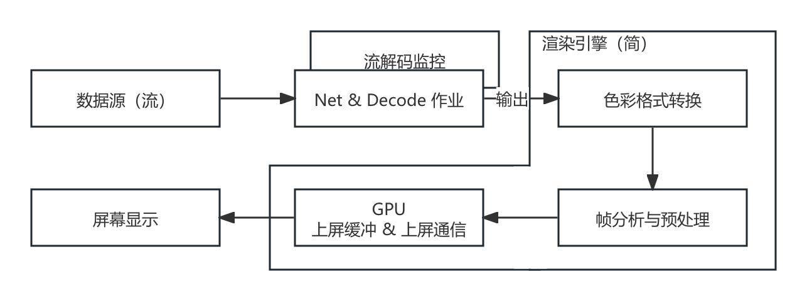
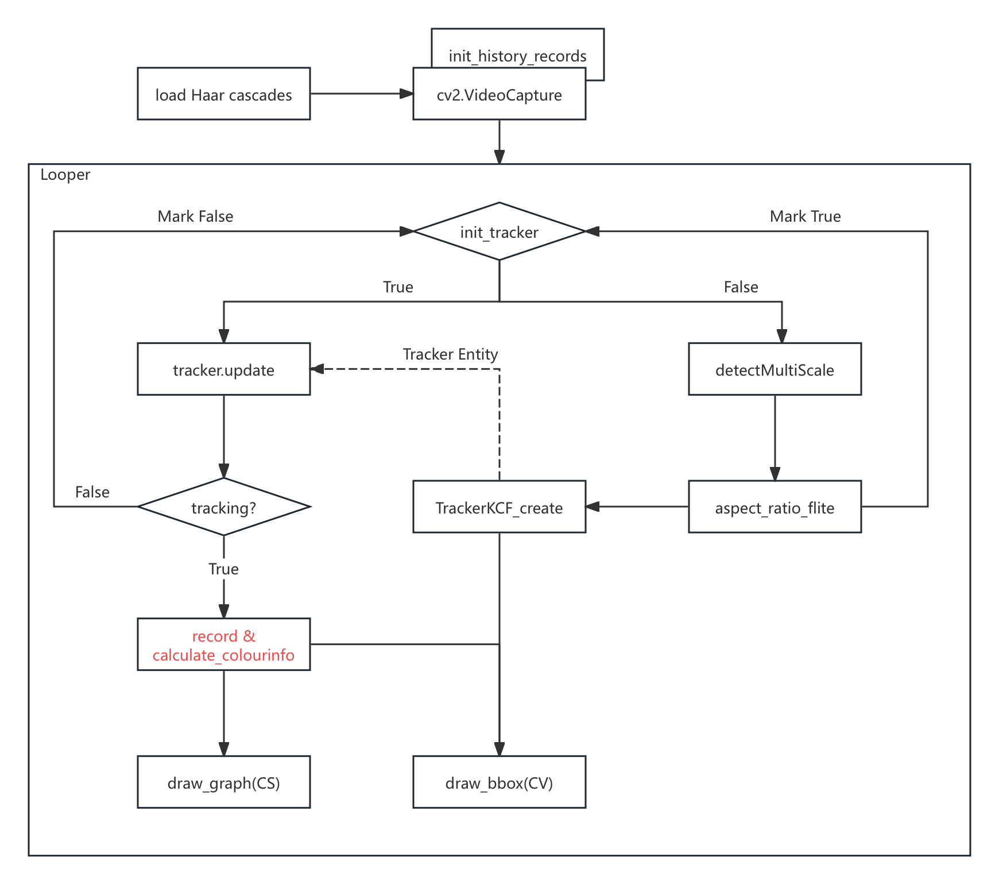
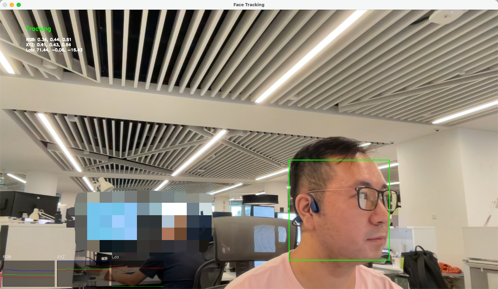

# 5.1.3 视频分析库（PyOpenCV、Color-Science）

和音频一样，外部工程里，对视频的分析处理焦点多在于 **帧分析**，并非于流分析。或者说，有关音视频编解码与网络流的评估，是属于完整编解码工程内部范畴。其更多的是与网络子系统进行结合，并依托于诸如 ITU-T（或其他音视频组织，较少）提出的相关协议（如 H.264、H.265 等）约束之标准规格背景，来作为整体工程中的 **子评估系统**。所以，**音视频流分析（Audio/Video Stream Analysis）和编解码协议是强耦合的**，一般会将之归属于 **编解码器内部监测** 部分，**平行于项目的正常作业流水线**，来监控各个环节。

而 **视频帧分析（Video Frame Analysis）** 或 **帧处理（Frame Processing）** 的有效介入点，是在 **编码前（Before encoding）** 和 **解码后（After decoding）**。此时，我们用来处理的数据，已经是纯粹的 **[色彩格式（Color Format）](../../../Chapter_2/Language/cn/Docs_2_6_1.md)** 数据了。

以解码为例，在解码后的必要环节是什么样的呢？

<center>
<figure>
   
    <figcaption>
      <p>图 5-6 解码后必要环节流程示意图</p>
   </figcaption>
</figure>
</center>

首先，是 **颜色空间转换**，亦是大量使用第二章知识的地方。一般解码后的图像因为考虑到存储空间成本，会采用 **[传输格式（Transport Format）](../../../Chapter_2/Language/cn/Docs_2_6_3.md)**，即 **[YUV 体系色彩格式](../../../Chapter_2/Language/cn/Docs_2_6_3.md)**。

不过，**只凭借 YUV 是无法做为 唯一且足够泛化的 随后步骤起点的**。这并不是指 YUV体系的色彩格式 无法直接交由如 OpenGL、DirectX、Vulkan 等驱动处理，相反这些驱动内部往往已经通过 **模式编程方法**，完成了一些 **固定格式自硬件抽象层（HAL）的映射式转换工作**（原理同第二章中，已讲解并推导过的色彩空间转换，部分算子的硬件化实现在驱动层面的组合）。**同理于 RGB，在硬件支持的情况下，直接以 YUV 上屏在流程上会更简短**。可当我们的目的是需要对每一帧的图片，做 **基于传统图形学算法上的调整**，或 **为模型进行特征分析/提取的预处理** 时，未经存储空间压缩并贴近人自然感受的 **[原色格式（Primaries Format）](../../../Chapter_2/Language/cn/Docs_2_6_2.md)**，即 **[RGB 体系色彩格式](../../../Chapter_2/Language/cn/Docs_2_6_2.md)**，还是会更便于操作。

另外，并不一定是由 YUV 转 RGB，在某些场景，我们也会要求将 RGB 转 YUV，或完成两个体系内的其他细分类型互转。所以，**具体如何转换是 由后续步骤所需的输入而定**，相当灵活。

<br>

在色彩格式转换后，则是 **帧分析与预处理步骤**。这一步完成 **对前者输出帧数据的特征提取与解析**。将会使用到相关的分析方法，例如 **[二维傅立叶](../../../Chapter_3/Language/cn/Docs_3_1_2.md)** 或其他 **[基础图像算法](../../../Chapter_3/Language/cn/Apex_3_Introduce.md)**、**[滤波核](../../../Chapter_3/Language/cn/Docs_3_2.md)** 或 **[模型接入](../../../Chapter_4/Language/cn/Apex_4_Introduce.md)**。此处也是我们本节进行操作的重点。

<br>

最后一步是 **GPU 上屏缓冲和通信**，则需要由 **选定的图形驱动（Vulkan 等）来建立相应的信道，提供指令通信和显存更新功能**。本节中，这些相关的环境和上屏更新，是由 **Python 的 Tkinter 界面库走系统 UI 环境** 或 **常用视频分析库（如 OpenCV）在 库内自行维护**。暂不需要我们介入。

而当需要项目自行处理驱动和 GPU 通信环境上下文维护时，整个渲染引擎的部分，都应当在 **同一个主体环境下**（也可以用代表其通信句柄名的，实时上下文/通信上下文，来代指），辅助其他（如果需要）用于 **时间片复用** 或 **GPU 信令预封装** 的 **辅助环境**（如 延迟上下文 或 类似的自定义指令组装结构）使用。从而方便各个 **前后关联密切环节的处理结果**，在 **GPU 资源池中实现互通**。

这一涉及驱动资源协同和池化设计的部分，就属于 **图形引擎（Graphics Engine）** 的关键处理技术之一了。让我们在未来的进阶一册中再单独讲解。

常用的视频分析库主要有两个，为 **Colour-Science**、**PyOpenCV**，分别对应 \[ **颜色科学综合分析**、**图像处理与科学计算** \] 的需求。常被用于 **工程原型验证（即设计思路的验证）** 和 **外部（指工程外）帧分析**。

**尤其是 PyOpenCV，该库是重中之重。不仅是视频分析的核心库，在业务中也会经常直接使用到它的 C++ 内核。**

## **Colour-Science（Color-Science）**

**Colour-Science（Color-Science）** 是一个专注于 **色彩科学计算**、**光谱分析**、**色彩转换** 和 **色彩管理** 的 **Python 计算库**。其由 Colour Developers 开发和维护，旨在为色彩科学领域的研究和应用提供一个 **全面而强大的工具集** [\[8\]][ref] 。**注意区分库名为 Colour-Science 。**

#### 主要功能：

1. 色彩空间转换，支持 CIE 标准下的 **[RGB](../../../Chapter_2/Language/cn/Docs_2_5_3.md)**、**[XYZ](../../../Chapter_2/Language/cn/Docs_2_5_4.md)**、**[LAB](../../../Chapter_2/Language/cn/Docs_2_5_5.md)**、**[LUV](../../../Chapter_2/Language/cn/Docs_2_5_6.md)** 等各种 **[色彩空间](../../../Chapter_2/Language/cn/Docs_2_5.md)** **转换与互转**
2. 支持色彩科学如 **[黑体辐射](../../../Chapter_2/Language/cn/Docs_2_3_1.md)**、**[辐射亮度](../../../Chapter_2/Language/cn/Docs_2_3_1.md)**、**[色温](../../../Chapter_2/Language/cn/Docs_2_3_1.md)** 等的 **[物理量评估](../../../Chapter_2/Language/cn/Docs_2_3.md)**
3. 提供感官量与科学量间的换算，支持 **[配色函数](../../../Chapter_2/Language/cn/Docs_2_3_2.md)** 和 **[CIE 统一化色彩差异对比计算](../../../Chapter_2/Language/cn/Docs_2_4.md)**
4. 支持由设备制造商提供的 **LUT**、**CSV**、**XRite** 等 **不同种色彩配置文件** 校准、评估、转换
5. 能够提供完备的色彩学分析图表可视化能力

Colour-Science 是一个 **相当齐全的色彩科学库**，其方法基本涵盖了现行大部分通用（或较广范围使用）的色彩规格，并实现了相互间的联结。通过它，我们能够轻易的将不同色彩系统内的自定义变量等内部概念，**转换到统一 CIE 规格下衡量**。当然，也可以反向提供相应的配置内容。

由于库的体量过于巨大，此处仅列出部分相对高频次使用的函数，仅供参考。

#### 核心模块（colour.）的常用函数（简，仅列出名称）：

1. 色彩空间：
   [RGB_COLOURSPACES](https://colour.readthedocs.io/en/latest/generated/colour.RGB_COLOURSPACES.html), 
   [RGB_to_XYZ](https://colour.readthedocs.io/en/latest/generated/colour.RGB_to_XYZ.html), 
   [XYZ_to_RGB](https://colour.readthedocs.io/en/latest/generated/colour.XYZ_to_RGB.html), 
   [XYZ_to_Lab](https://colour.readthedocs.io/en/latest/generated/colour.XYZ_to_Lab.html), 
   [Lab_to_XYZ](https://colour.readthedocs.io/en/latest/generated/colour.Lab_to_XYZ.html), 
   [xyY_to_XYZ](https://colour.readthedocs.io/en/latest/generated/colour.xyY_to_XYZ.html), 
   [XYZ_to_xyY](https://colour.readthedocs.io/en/latest/generated/colour.XYZ_to_xyY.html), 
   [LMS_to_XYZ](https://colour.readthedocs.io/en/latest/generated/colour.LMS_to_XYZ.html), 
   [XYZ_to_LMS](https://colour.readthedocs.io/en/latest/generated/colour.XYZ_to_LMS.html), 
   [UCS_to_XYZ](https://colour.readthedocs.io/en/latest/generated/colour.UCS_to_XYZ.html), 
   [XYZ_to_UCS](https://colour.readthedocs.io/en/latest/generated/colour.XYZ_to_UCS.html)
2. 色彩比对：
   [XYZ_to_xy](https://colour.readthedocs.io/en/latest/generated/colour.XYZ_to_xy.html), 
   [xy_to_XYZ](https://colour.readthedocs.io/en/latest/generated/colour.xy_to_XYZ.html), 
   [XYZ_to_uv](https://colour.readthedocs.io/en/latest/generated/colour.XYZ_to_uv.html), 
   [uv_to_XYZ](https://colour.readthedocs.io/en/latest/generated/colour.uv_to_XYZ.html)
3. 色温转换：
   [xy_to_CCT](https://colour.readthedocs.io/en/latest/generated/colour.xy_to_CCT.html), 
   [CCT_to_xy](https://colour.readthedocs.io/en/latest/generated/colour.CCT_to_xy.html)
4. 色彩感知：
   [chromatic_adaptation](https://colour.readthedocs.io/en/latest/generated/colour.chromatic_adaptation.html), 
   [contrast_sensitivity_function](https://colour.readthedocs.io/en/latest/generated/colour.contrast_sensitivity_function.html), 
   [corresponding_chromaticities_prediction](https://colour.readthedocs.io/en/latest/generated/colour.corresponding_chromaticities_prediction.html)
5. 色差计算：
   [delta_E](https://colour.readthedocs.io/en/latest/generated/colour.delta_E.html) (CIE 1976, CIE 1994, CIE 2000, CMC etc.), 
   [index_stress](https://colour.readthedocs.io/en/latest/generated/colour.index_stress.html) (Kruskal’s Standardized Residual Sum of Squares)
6. 光度计算：
   [lightness](https://colour.readthedocs.io/en/latest/generated/colour.lightness.html), 
   [whiteness](https://colour.readthedocs.io/en/latest/generated/colour.whiteness.html), 
   [yellowness](https://colour.readthedocs.io/en/latest/generated/colour.yellowness.html), 
   [luminance](https://colour.readthedocs.io/en/latest/generated/colour.luminance.html), 
   [luminous_flux](https://colour.readthedocs.io/en/latest/generated/colour.luminous_flux.html), 
   [luminous_efficacy](https://colour.readthedocs.io/en/latest/generated/colour.luminous_efficacy.html),
   [luminous_efficiency](https://colour.readthedocs.io/en/latest/generated/colour.luminous_efficiency.html), 
7. 光谱处理：
   [&lt;SpectralDistribution&gt;](https://colour.readthedocs.io/en/latest/generated/colour.SpectralDistribution.html) 光谱分析的主体类, 
   [sd_to_XYZ](https://colour.readthedocs.io/en/latest/generated/colour.sd_to_XYZ.html), 
   [sd_blackbody](https://colour.readthedocs.io/en/latest/generated/colour.sd_blackbody.html), 
   [sd_ones](https://colour.readthedocs.io/en/latest/generated/colour.sd_ones.html), 
   [sd_zeros](https://colour.readthedocs.io/en/latest/generated/colour.sd_zeros.html), 
   [sd_gaussian](https://colour.readthedocs.io/en/latest/generated/colour.sd_gaussian.html), 
   [sd_CIE_standard_illuminant_A](https://colour.readthedocs.io/en/latest/generated/colour.sd_CIE_standard_illuminant_A.html)
   [sd_CIE_illuminant_D_series](https://colour.readthedocs.io/en/latest/generated/colour.sd_CIE_illuminant_D_series.html)
8. 颜色代数：
   [table_interpolation](https://colour.readthedocs.io/en/latest/generated/colour.table_interpolation.html), 
   [kernel_nearest_neighbour](https://colour.readthedocs.io/en/latest/generated/colour.kernel_nearest_neighbour.html), 
   [kernel_linear](https://colour.readthedocs.io/en/latest/generated/colour.kernel_linear.html), 
   [kernel_sinc](https://colour.readthedocs.io/en/latest/generated/colour.kernel_sinc.html), 
   [kernel_lanczos](https://colour.readthedocs.io/en/latest/generated/colour.kernel_lanczos.html), 
   [kernel_cardinal_spline](https://colour.readthedocs.io/en/latest/generated/colour.kernel_cardinal_spline.html), 
9. 数据读写：
   [read_image](https://colour.readthedocs.io/en/latest/generated/colour.read_image.html), 
   [write_image](https://colour.readthedocs.io/en/latest/generated/colour.write_image.html), 
   [read_LUT](https://colour.readthedocs.io/en/latest/generated/colour.read_LUT.html), 
   [write_LUT](https://colour.readthedocs.io/en/latest/generated/colour.write_LUT.html), 
   [read_sds_from_csv_file](https://colour.readthedocs.io/en/latest/generated/colour.read_sds_from_csv_file.html), 
   [write_sds_to_csv_file](https://colour.readthedocs.io/en/latest/generated/colour.write_sds_to_csv_file.html), 
   [read_spectral_data_from_csv_file](https://colour.readthedocs.io/en/latest/generated/colour.read_spectral_data_from_csv_file.html), 
   [read_sds_from_xrite_file](https://colour.readthedocs.io/en/latest/generated/colour.read_sds_from_xrite_file.html), 

#### 辅助模块（colour.&lt;扩展前缀&gt;.）的常用函数（简，仅列出名称）：

1. 绘图可视化（**plotting.**）：
   [plot_single_colour_swatch](https://colour.readthedocs.io/en/latest/generated/colour.plotting.plot_single_colour_swatch.html), 
   [plot_multi_colour_swatches](https://colour.readthedocs.io/en/latest/generated/colour.plotting.plot_multi_colour_swatches.html), 
   [plot_single_sd](https://colour.readthedocs.io/en/latest/generated/colour.plotting.plot_single_sd.html), 
   [plot_multi_sds](https://colour.readthedocs.io/en/latest/generated/colour.plotting.plot_multi_sds.html), 
   [plot_single_illuminant_sd](https://colour.readthedocs.io/en/latest/generated/colour.plotting.plot_single_illuminant_sd.html), 
   [plot_multi_illuminant_sds](https://colour.readthedocs.io/en/latest/generated/colour.plotting.plot_multi_illuminant_sds.html), 
   [plot_single_lightness_function](https://colour.readthedocs.io/en/latest/generated/colour.plotting.plot_single_lightness_function.html), 
   [plot_multi_lightness_functions](https://colour.readthedocs.io/en/latest/generated/colour.plotting.plot_multi_lightness_functions.html), 
   [plot_single_luminance_function](https://colour.readthedocs.io/en/latest/generated/colour.plotting.plot_single_luminance_function.html), 
   [plot_multi_luminance_functions](https://colour.readthedocs.io/en/latest/generated/colour.plotting.plot_multi_luminance_functions.html)
2. 读写扩展（**io.**）：
   [image_specification_OpenImageIO](https://colour.readthedocs.io/en/latest/generated/colour.io.image_specification_OpenImageIO.html)
   [LUT_to_LUT](https://colour.readthedocs.io/en/latest/generated/colour.io.LUT_to_LUT.html), 
3. 色彩模型（**models.**）：
   [RGB_COLOURSPACE_CIE_RGB](https://colour.readthedocs.io/en/latest/generated/colour.models.RGB_COLOURSPACE_CIE_RGB.html), 
   [RGB_COLOURSPACE_BT709](https://colour.readthedocs.io/en/latest/generated/colour.models.RGB_COLOURSPACE_BT709.html), 
   [RGB_COLOURSPACE_BT2020](https://colour.readthedocs.io/en/latest/generated/colour.models.RGB_COLOURSPACE_BT2020.html), 
   [RGB_COLOURSPACE_DCI_P3](https://colour.readthedocs.io/en/latest/generated/colour.models.RGB_COLOURSPACE_DCI_P3.html), 
   [RGB_COLOURSPACE_sRGB](https://colour.readthedocs.io/en/latest/generated/colour.models.RGB_COLOURSPACE_sRGB.html)
4. 色温扩展（**temperature.**）：
   [mired_to_CCT](https://colour.readthedocs.io/en/latest/generated/colour.temperature.mired_to_CCT.html), 
   [CCT_to_mired](https://colour.readthedocs.io/en/latest/generated/colour.temperature.CCT_to_mired.html), 
   [xy_to_CCT_CIE_D](https://colour.readthedocs.io/en/latest/generated/colour.temperature.xy_to_CCT_CIE_D.html), 
   [CCT_to_xy_CIE_D](https://colour.readthedocs.io/en/latest/generated/colour.temperature.CCT_to_xy_CIE_D.html)
5. 光谱恢复（**recovery.**）：
   [sd_Jakob2019](https://colour.readthedocs.io/en/latest/generated/colour.recovery.sd_Jakob2019.html), 
   [LUT3D_Jakob2019](https://colour.readthedocs.io/en/latest/generated/colour.recovery.LUT3D_Jakob2019.html), 
   [XYZ_to_sd_Jakob2019](https://colour.readthedocs.io/en/latest/generated/colour.recovery.XYZ_to_sd_Jakob2019.html), 
   [find_coefficients_Jakob2019](https://colour.readthedocs.io/en/latest/generated/colour.recovery.find_coefficients_Jakob2019.html)
6. 代数扩展（**algebra.**）：
   [euclidean_distance](https://colour.readthedocs.io/en/latest/generated/colour.algebra.euclidean_distance.html), 
   [manhattan_distance](https://colour.readthedocs.io/en/latest/generated/colour.algebra.manhattan_distance.html), 
   [eigen_decomposition](https://colour.readthedocs.io/en/latest/generated/colour.algebra.eigen_decomposition.html), 
   [vecmul](https://colour.readthedocs.io/en/latest/generated/colour.algebra.vecmul.html)

**Colour 开源项目** 位于：**[Github:colour-science/colour](https://github.com/colour-science/colour)** 。使用细节，可自行前往官方档案馆查阅：**[官方档案馆查阅](https://www.colour-science.org/)** 。

## **PyOpenCV（Python Entry of Open Source Computer Vision Library）**

**PyOpenCV（Python OpenCV）** 是 **计算机视觉和图像机器学习 OpenCV 库** 的 **官方 Python 套接接口**，项目自 Intel 奠基，现由 OpenCV 开源开发社区进行维护 [\[9\]][ref] 。其核心 OpenCV 覆盖了数百个计算机视觉算法，并 **官方预训练好了** 大量用于 **传统 CV 的 ML 功能线下模型**（详见 **[Github:OpenCV-contrib/Modules](https://github.com/opencv/opencv_contrib/tree/master/modules)** ），囊括从 **简单图像处理** 到 **复杂应用的视觉任务**，如边缘检测、图像滤波、基础变换（旋转、缩放、错切、仿射变换）、对象检测等，都可通过调用其方法功能实现。并且，考虑到机器学习拓展性，本身提供了 **对模型训练和推理的相关扩展接口**，方便处理中使用。

此外，OpenCV 有着对图片、视频文件、视频流（本地流、网络流）等数据源的完整支持，**使得基本大部分涉及视频的分析工作，都能够用该库一库解决**。非常强大。但其是一个以计算机视觉和 2D 图像处理为核心的库，具有 **有限** 的 3D 功能，**并不专注于全面的 3D 图形学处理**。

另外需要注意的是 OpenCV **并不是** 专门用于进行深度学习的框架，虽然能够进行推理，可 **并不能** 达到最好的资源利用效率和训练与推理性能。这点在应用或非分析工程中，当存在大量模型处理需求或模型流水线时，应该考虑。

#### 主要功能：

1. **图像处理**，支持图像读取、写入、滤波、变换、边缘检测等基本操作
2. **视频处理**，支持视频文件的读取、写入、帧捕获和视频流处理
3. **特征检测**，提供关键点检测和特征匹配，如 SIFT、SURF、ORB 等
4. **对象检测**，支持 Haar 级联分类器、深度学习模型（如 YOLO、SSD）等
5. **机器学习**，支持多种机器学习算法，如 SVM、KNN、决策树等
6. **三维重建**，提供立体匹配、相机标定、三维重建功能（有限）
7. **图像分割**，支持阈值分割、轮廓检测、分水岭算法等
8. **相机补偿**，支持镜头畸变校正和图像增强
9. **运动分析**，提供光流计算和运动跟踪功能
10. **图像拼接**，支持全景图像拼接和图像对齐
11. **GPU 加速**，部分算法支持 GPU 加速，提升计算性能
12. **高级图像处理**，支持图像金字塔、模板匹配、霍夫变换（Hough）等高级操作
13. **丰富的库和模块**，集成了大量的图像处理和分析工具
14. **良好的库兼容性**，可以与 NumPy、SciPy 等科学计算库结合使用
15. **多模型格式支持**，支持 Caffe、TensorFlow、ONNX（关键） 等多种框架的模型格式
16. **跨平台支持**，可以在主流操作系统（Windows、macOS、Linux）上运行

**由于 OpenCV 对 API 入口进行了统一，以下模块调用前缀皆为 “cv2.”，比如 “cv2.add”，后续如无特殊说明，则按此依据。**

因为 OpenCV 的复杂度，我们参考官方的 **核心库（对应 opencv-python）** 和 **扩展库（opencv-contrib-python）** 两大分类，将主要的常用函数和封装，也拆分为 **两部分描述**。

### 首先，是核心库（opencv-python）所包含的内部模块。

#### 核心模块（cv2.core）的常用函数（简，仅列出名称）：

1. 基本数据结构：
   [&lt;Mat&gt;](https://docs.opencv.org/4.x/d3/d63/classcv_1_1Mat.html)、 
   [&lt;Point&gt;](https://docs.opencv.org/4.x/d6/d50/classcv_1_1Point__.html)、 
   [&lt;Size&gt;](https://docs.opencv.org/4.x/d2/df9/classcv_1_1Size__.html)、 
   [&lt;Rect&gt;](https://docs.opencv.org/4.x/d2/d44/classcv_1_1Rect__.html)、 
   [&lt;Scalar&gt;](https://docs.opencv.org/4.x/d1/da0/classcv_1_1Scalar__.html)
2. 基本算法和操作：
   [add](https://docs.opencv.org/4.x/d2/de8/group__core__array.html#ga10ac1bfb180e2cfda1701d06c24fdbd6),
   [subtract](https://docs.opencv.org/4.x/d2/de8/group__core__array.html#gaa0f00d98b4b5edeaeb7b8333b2de353b),
   [multiply](https://docs.opencv.org/4.x/d2/de8/group__core__array.html#ga979d898a58d7f61c53003e162e7ad89f),
   [divide](https://docs.opencv.org/4.x/d2/de8/group__core__array.html#ga1f96b569cac4c286642b34eff098138e),
   [absdiff](https://docs.opencv.org/4.x/d2/de8/group__core__array.html#ga6fef31bc8c4071cbc114a758a2b79c14)
3. 线性代数：
   [solve](https://docs.opencv.org/4.x/d2/de8/group__core__array.html#ga12b43690dbd31fed96f213eefead2373),
   [invert](https://docs.opencv.org/4.x/d2/de8/group__core__array.html#gad278044679d4ecf20f7622cc151aaaa2),
   [determinant](https://docs.opencv.org/4.x/d2/de8/group__core__array.html#gaf802bd9ca3e07b8b6170645ef0611d0c),
   [eigen](https://docs.opencv.org/4.x/d2/de8/group__core__array.html#ga9fa0d58657f60eaa6c71f6fbb40456e3)
4. 随机数生成：
   [&lt;RNG&gt;](https://docs.opencv.org/4.x/d1/dd6/classcv_1_1RNG.html),
   [randu](https://docs.opencv.org/4.x/d2/de8/group__core__array.html#ga1ba1026dca0807b27057ba6a49d258c0),
   [randn](https://docs.opencv.org/4.x/d2/de8/group__core__array.html#gaeff1f61e972d133a04ce3a5f81cf6808)
5. 类型转换：
   [convertScaleAbs](https://docs.opencv.org/4.x/d2/de8/group__core__array.html#ga3460e9c9f37b563ab9dd550c4d8c4e7d),
   [normalize](https://docs.opencv.org/4.x/d2/de8/group__core__array.html#ga7bcf47a1df78cf575162e0aed44960cb)
6. 数据操作：
   [minMaxLoc](https://docs.opencv.org/4.x/d2/de8/group__core__array.html#ga8873b86a29c5af51cafdcee82f8150a7),
   [meanStdDev](https://docs.opencv.org/4.x/d2/de8/group__core__array.html#ga846c858f4004d59493d7c6a4354b301d),
   [reduce](https://docs.opencv.org/4.x/d2/de8/group__core__array.html#ga4b78072a303f29d9031d56e5638da78e)
7. 输入输出：
   [imread](https://docs.opencv.org/4.x/d4/da8/group__imgcodecs.html#gacbaa02cffc4ec2422dfa2e24412a99e2),
   [imwrite](https://docs.opencv.org/4.x/d4/da8/group__imgcodecs.html#ga8ac397bd09e48851665edbe12aa28f25),
   [imdecode](https://docs.opencv.org/4.x/d4/da8/group__imgcodecs.html#gaad518fe65098fd32446bd5b9c4f8b531),
   [imencode](https://docs.opencv.org/4.x/d4/da8/group__imgcodecs.html#ga4e9883ae1f619bcbe875b7038520ea78)
8. 时间操作：
   [getTickCount](https://docs.opencv.org/4.x/db/de0/group__core__utils.html#gae73f58000611a1af25dd36d496bf4487),
   [getTickFrequency](https://docs.opencv.org/4.x/db/de0/group__core__utils.html#ga705441a9ef01f47acdc55d87fbe5090c),
   [getCPUTickCount](https://docs.opencv.org/4.x/db/de0/group__core__utils.html#gaf3070efdcfef6f1e7ac28d2b6a29a7c0)
9. 图像克隆和复制：
   [copyMakeBorder](https://docs.opencv.org/4.x/d2/de8/group__core__array.html#ga2ac1049c2c3dd25c2b41bffe17658a36)
10. 数学函数：
   [exp](https://docs.opencv.org/4.x/d2/de8/group__core__array.html#ga3e10108e2162c338f1b848af619f39e5),
   [log](https://docs.opencv.org/4.x/d2/de8/group__core__array.html#ga937ecdce4679a77168730830a955bea7),
   [sqrt](https://docs.opencv.org/4.x/d2/de8/group__core__array.html#ga186222c3919657890f88df5a1f64a7d7),
   [pow](https://docs.opencv.org/4.x/d2/de8/group__core__array.html#gaf0d056b5bd1dc92500d6f6cf6bac41ef)

#### 图像处理模块（cv2.imgproc）的基础函数（简，仅列出名称）：

1. 基本图像变换：
   [resize](https://docs.opencv.org/4.x/da/d54/group__imgproc__transform.html#ga47a974309e9102f5f08231edc7e7529d), 
   [warpAffine](https://docs.opencv.org/4.x/da/d54/group__imgproc__transform.html#ga0203d9ee5fcd28d40dbc4a1ea4451983), 
   [warpPerspective](https://docs.opencv.org/4.x/da/d54/group__imgproc__transform.html#gaf73673a7e8e18ec6963e3774e6a94b87)
2. 颜色空间转换：
   [cvtColor](https://docs.opencv.org/4.x/db/d64/tutorial_js_colorspaces.html#autotoc_md1564), 
   [inRange](https://docs.opencv.org/4.x/db/d64/tutorial_js_colorspaces.html#autotoc_md1564)
3. 图像滤波：
   [GaussianBlur](https://docs.opencv.org/4.x/d4/d13/tutorial_py_filtering.html), 
   [medianBlur](https://docs.opencv.org/4.x/d4/d13/tutorial_py_filtering.html), 
   [bilateralFilter](https://docs.opencv.org/4.x/d4/d13/tutorial_py_filtering.html), 
   [blur](https://docs.opencv.org/4.x/d4/d86/group__imgproc__filter.html#ga8c45db9afe636703801b0b2e440fce37)
4. 阈值处理：
   [threshold](https://docs.opencv.org/4.x/d7/d4d/tutorial_py_thresholding.html), 
   [adaptiveThreshold](https://docs.opencv.org/4.x/d7/d4d/tutorial_py_thresholding.html)
5. 直方图处理：
   [calcHist](https://docs.opencv.org/4.x/d1/db7/tutorial_py_histogram_begins.html), 
   [equalizeHist](https://docs.opencv.org/4.x/d5/daf/tutorial_py_histogram_equalization.html)
6. 几何变换：
   [getRotationMatrix2D](https://docs.opencv.org/4.x/da/d54/group__imgproc__transform.html#gafbbc470ce83812914a70abfb604f4326), 
   [getAffineTransform](https://docs.opencv.org/4.x/da/d54/group__imgproc__transform.html#ga8f6d378f9f8eebb5cb55cd3ae295a999), 
   [getPerspectiveTransform](https://docs.opencv.org/4.x/da/d54/group__imgproc__transform.html#gae66ba39ba2e47dd0750555c7e986ab85)
7. 图像金字塔：
   [pyrUp](https://docs.opencv.org/4.x/d4/d86/group__imgproc__filter.html#gada75b59bdaaca411ed6fee10085eb784), 
   [pyrDown](https://docs.opencv.org/4.x/d4/d86/group__imgproc__filter.html#gaf9bba239dfca11654cb7f50f889fc2ff)
8. 图像插值：
   [linearPolar](https://docs.opencv.org/4.x/da/d54/group__imgproc__transform.html#gaa38a6884ac8b6e0b9bed47939b5362f3), 
   [remap](https://docs.opencv.org/4.x/da/d54/group__imgproc__transform.html#gab75ef31ce5cdfb5c44b6da5f3b908ea4)
9. 直线与形状绘制：
   [line](https://docs.opencv.org/4.x/d6/d6e/group__imgproc__draw.html#ga7078a9fae8c7e7d13d24dac2520ae4a2), 
   [rectangle](https://docs.opencv.org/4.x/d6/d6e/group__imgproc__draw.html#ga07d2f74cadcf8e305e810ce8eed13bc9), 
   [circle](https://docs.opencv.org/4.x/d6/d6e/group__imgproc__draw.html#gaf10604b069374903dbd0f0488cb43670), 
   [ellipse](https://docs.opencv.org/4.x/d6/d6e/group__imgproc__draw.html#ga57be400d8eff22fb946ae90c8e7441f9), 
   [putText](https://docs.opencv.org/4.x/d6/d6e/group__imgproc__draw.html#ga5126f47f883d730f633d74f07456c576)

#### 图像处理模块（cv2.imgproc）的结构分析与形态学（Morphology）函数（简，仅列出名称）：

1. 边缘检测：
   [Canny](https://docs.opencv.org/4.x/da/d22/tutorial_py_canny.html), 
   [Sobel](https://docs.opencv.org/4.x/d2/d2c/tutorial_sobel_derivatives.html), 
   [Laplacian](https://docs.opencv.org/4.x/d5/db5/tutorial_laplace_operator.html), 
   [Scharr](https://docs.opencv.org/4.x/d4/d86/group__imgproc__filter.html#gaa13106761eedf14798f37aa2d60404c9)
2. 霍夫变换：
   [HoughLines](https://docs.opencv.org/4.x/d3/de6/tutorial_js_houghlines.html), 
   [HoughLinesP](https://docs.opencv.org/4.x/d3/de6/tutorial_js_houghlines.html), 
   [HoughCircles](https://docs.opencv.org/4.x/da/d53/tutorial_py_houghcircles.html)
3. 轮廓检测：
   [findContours](https://docs.opencv.org/4.x/d4/d73/tutorial_py_contours_begin.html), 
   [drawContours](https://docs.opencv.org/4.x/d4/d73/tutorial_py_contours_begin.html)
4. 形态学操作：
   [morphologyEx](https://docs.opencv.org/4.x/d9/d61/tutorial_py_morphological_ops.html), 
   [erode](https://docs.opencv.org/4.x/d9/d61/tutorial_py_morphological_ops.html), 
   [dilate](https://docs.opencv.org/4.x/d9/d61/tutorial_py_morphological_ops.html)
5. 矩形拟合：
   [boundingRect](https://docs.opencv.org/4.x/dd/d49/tutorial_py_contour_features.html), 
   [minAreaRect](https://docs.opencv.org/4.x/dd/d49/tutorial_py_contour_features.html)
6. 圆形拟合：
   [minEnclosingCircle](https://docs.opencv.org/4.x/dd/d49/tutorial_py_contour_features.html)
7. 椭圆拟合：
   [fitEllipse](https://docs.opencv.org/4.x/dd/d49/tutorial_py_contour_features.html)
8. 多边形拟合：
   [approxPolyDP](https://docs.opencv.org/4.x/dd/d49/tutorial_py_contour_features.html)
9. 凸闭包计算：
   [convexHull](https://docs.opencv.org/4.x/dd/d49/tutorial_py_contour_features.html), 
   [convexityDefects](https://docs.opencv.org/4.x/d3/dc0/group__imgproc__shape.html#gada4437098113fd8683c932e0567f47ba)
10. 形状匹配：
   [matchShapes](https://docs.opencv.org/4.x/d5/d45/tutorial_py_contours_more_functions.html)

#### 视频读写模块（cv2.videoio）的常用函数（简，仅列出名称）：

1. 视频捕获：
   [&lt;VideoCapture&gt;](https://docs.opencv.org/4.x/d8/dfe/classcv_1_1VideoCapture.html), 
   [isOpened](https://docs.opencv.org/4.x/d8/dfe/classcv_1_1VideoCapture.html#a9d2ca36789e7fcfe7a7be3b328038585), 
   [read](https://docs.opencv.org/4.x/d8/dfe/classcv_1_1VideoCapture.html#a473055e77dd7faa4d26d686226b292c1), 
   [release](https://docs.opencv.org/4.x/d8/dfe/classcv_1_1VideoCapture.html#afb4ab689e553ba2c8f0fec41b9344ae6)
2. 视频写入：
   [&lt;VideoWriter&gt;](https://docs.opencv.org/4.x/dd/d9e/classcv_1_1VideoWriter.html), 
   [write](https://docs.opencv.org/4.x/dd/d9e/classcv_1_1VideoWriter.html#a30ebbc09c122332f62bd706b43f02a98), 
   [release](https://docs.opencv.org/4.x/dd/d9e/classcv_1_1VideoWriter.html#a667f737e56d5ba6b0533c6c7bf941140)
3. 视频属性：
   [get](https://docs.opencv.org/4.x/d8/dfe/classcv_1_1VideoCapture.html#a4751a18e10b6a1a7e4f7f8b5a2332b56), 
   [set](https://docs.opencv.org/4.x/d8/dfe/classcv_1_1VideoCapture.html#a0f3f8481c4de9038b78ebd0b331d7ab4) （归属 [&lt;VideoCapture&gt;](https://docs.opencv.org/4.x/d8/dfe/classcv_1_1VideoCapture.html) 创建的流句柄所有）
4. 视频编码：
   [&lt;VideoWriter_fourcc&gt;](https://docs.opencv.org/4.x/dd/d9e/classcv_1_1VideoWriter.html#afec93f94dc6c0b3e28f4dd153bc5a7f0)

#### 图形用户界面模块（cv2.highgui）的常用函数（简，仅列出名称）：

1. 创建窗口：
   [namedWindow](https://docs.opencv.org/4.x/d7/dfc/group__highgui.html#ga5afdf8410934fd099df85c75b2e0888b)
2. 显示图像：
   [imshow](https://docs.opencv.org/4.x/d7/dfc/group__highgui.html#ga453d42fe4cb60e5723281a89973ee563)
3. 等待键盘事件：
   [waitKey](https://docs.opencv.org/4.x/d7/dfc/group__highgui.html#ga5628525ad33f52eab17feebcfba38bd7)
4. 销毁窗口：
   [destroyWindow](https://docs.opencv.org/4.x/d7/dfc/group__highgui.html#ga851ccdd6961022d1d5b4c4f255dbab34), 
   [destroyAllWindows](https://docs.opencv.org/4.x/d7/dfc/group__highgui.html#ga6b7fc1c1a8960438156912027b38f481)
5. 鼠标事件：
   [setMouseCallback](https://docs.opencv.org/4.x/d7/dfc/group__highgui.html#ga89e7806b0a616f6f1d502bd8c183ad3e)
6. 滑动条（Trackbar）：
   [createTrackbar](https://docs.opencv.org/4.x/d7/dfc/group__highgui.html#gaf78d2155d30b728fc413803745b67a9b), 
   [getTrackbarPos](https://docs.opencv.org/4.x/d7/dfc/group__highgui.html#ga122632e9e91b9ec06943472c55d9cda8), 
   [setTrackbarPos](https://docs.opencv.org/4.x/d7/dfc/group__highgui.html#ga67d73c4c9430f13481fd58410d01bd8d)

#### 传统机器学习对象检测模块（cv2.objdetect）的常用函数（简，仅列出名称）：

1. 分类器实例：
   [&lt;CascadeClassifier&gt;](https://docs.opencv.org/4.x/db/d28/classcv_1_1CascadeClassifier.html)
2. 使用分类器检测对象：
   [detectMultiScale](https://docs.opencv.org/4.x/db/d28/classcv_1_1CascadeClassifier.html#a8a6e981de494fcd32a0b48578a35a75d)
3. 保存和加载 XML 分类器文件：
   [save](https://docs.opencv.org/4.x/db/d28/classcv_1_1CascadeClassifier.html#a5e7a3c3d4ca3f0c7ca3c78a7f6a16c5d), 
   [load](https://docs.opencv.org/4.x/db/d28/classcv_1_1CascadeClassifier.html#a1f6cbd39bf5d7ea0e503bdc0e8814eda) （为 [&lt;CascadeClassifier&gt;](https://docs.opencv.org/4.x/db/d28/classcv_1_1CascadeClassifier.html) 加载分类器）
4. 官方提供的 XML 分类器文件，位于 OpenCV 的安装目录，主要有两类，加载方式一致：
   - [data/haarcascades](https://github.com/opencv/opencv/tree/4.x/data/haarcascades) 为 Haar 分类器（矩形像素差）的指定目标训练所得分类特征
   - [data/lbpcascades](https://github.com/opencv/opencv/tree/4.x/data/lbpcascades) 为 LBP 分类器（纹理描述符）的指定目标训练所得分类特征

#### 特征检测与匹配模块（cv2.features2d）的常用函数（简，仅列出名称）：

1. 特征检测对象：
   [&lt;SIFT&gt;](https://docs.opencv.org/4.x/da/df5/tutorial_py_sift_intro.html#autotoc_md1256)、 
   [&lt;SURF&gt;](https://docs.opencv.org/4.x/df/dd2/tutorial_py_surf_intro.html#autotoc_md1259)、 
   [&lt;ORB&gt;](https://docs.opencv.org/4.x/d1/d89/tutorial_py_orb.html#autotoc_md1244)、 
   [&lt;FAST&gt;](https://docs.opencv.org/4.x/df/d0c/tutorial_py_fast.html#autotoc_md1223)、 
   [&lt;BRISK&gt;](https://docs.opencv.org/4.x/de/dbf/classcv_1_1BRISK.html)
2. 特征匹配对象：
   [&lt;BFMatcher&gt;](https://docs.opencv.org/4.x/d3/da1/classcv_1_1BFMatcher.html)、 
   [&lt;FlannBasedMatcher&gt;](https://docs.opencv.org/4.x/dc/de2/classcv_1_1FlannBasedMatcher.html)
3. 特征检测创建：
   [SIFT_create](https://docs.opencv.org/4.x/d7/d60/classcv_1_1SIFT.html), 
   [SURF_create](https://docs.opencv.org/4.x/d5/df7/classcv_1_1xfeatures2d_1_1SURF.html), 
   [ORB_create](https://docs.opencv.org/4.x/db/d95/classcv_1_1ORB.html), 
   [FastFeatureDetector_create](https://docs.opencv.org/4.x/df/d74/classcv_1_1FastFeatureDetector.html), 
   [BRISK::create](https://docs.opencv.org/4.x/de/dbf/classcv_1_1BRISK.html#ad3b513ded80119670e5efa90a31705ac)
4. 特征描述获取：
   [compute](https://docs.opencv.org/4.x/d0/d13/classcv_1_1Feature2D.html#ab3cce8d56f4fc5e1d530b5931e1e8dc0), 
   [detect](https://docs.opencv.org/4.x/d0/d13/classcv_1_1Feature2D.html#aa4e9a7082ec61ebc108806704fbd7887)（由 [xx]_create 创造的对应特征检测方法的对象调用）
5. 特征匹配：
   [match](https://docs.opencv.org/4.x/db/d39/classcv_1_1DescriptorMatcher.html#a0f046f47b68ec7074391e1e85c750cba), 
   [knnMatch](https://docs.opencv.org/4.x/db/d39/classcv_1_1DescriptorMatcher.html#a378f35c9b1a5dfa4022839a45cdf0e89)（由 [&lt;BFMatcher&gt;](https://docs.opencv.org/4.x/d3/da1/classcv_1_1BFMatcher.html) 等特征匹配对象调用）
6. 关键点绘制：
   [drawKeypoints](https://docs.opencv.org/4.x/d4/d5d/group__features2d__draw.html#ga5d2bafe8c1c45289bc3403a40fb88920), 
   [drawMatches](https://docs.opencv.org/4.x/d4/d5d/group__features2d__draw.html#gaf92cd1c6e9400e4753ce393d2fdc06b0)

#### 相机校正与三维映射模块（cv2.calib3d）的常用函数（简，仅列出名称）：

1. 相机校正：
   [findChessboardCorners](https://docs.opencv.org/4.x/d9/d0c/group__calib3d.html#ga93efa9b0aa890de240ca32b11253dd4a), 
   [cornerSubPix](https://docs.opencv.org/4.x/dd/d1a/group__imgproc__feature.html#ga354e0d7c86d0d9da75de9b9701a9a87e), 
   [calibrateCamera](https://docs.opencv.org/4.x/d9/d0c/group__calib3d.html#ga687a1ab946686f0d85ae0363b5af1d7b), 
   [initUndistortRectifyMap](https://docs.opencv.org/4.x/d9/d0c/group__calib3d.html#ga7dfb72c9cf9780a347fbe3d1c47e5d5a), 
   [undistort](https://docs.opencv.org/4.x/d9/d0c/group__calib3d.html#ga69f2545a8b62a6b0fc2ee060dc30559d), 
   [undistortPoints](https://docs.opencv.org/4.x/d9/d0c/group__calib3d.html#ga887960ea1bde84784e7f1710a922b93c), 
   [getOptimalNewCameraMatrix](https://docs.opencv.org/4.x/d9/d0c/group__calib3d.html#ga7a6c4e032c97f03ba747966e6ad862b1)
2. 立体校正：
   [stereoCalibrate](https://docs.opencv.org/4.x/d9/d0c/group__calib3d.html#ga91018d80e2a93ade37539f01e6f07de5), 
   [stereoRectify](https://docs.opencv.org/4.x/d9/d0c/group__calib3d.html#ga617b1685d4059c6040827800e72ad2b6), 
   [stereoBM_create](https://docs.opencv.org/4.x/d9/dba/classcv_1_1StereoBM.html), 
   [stereoSGBM_create](https://docs.opencv.org/4.x/d2/d85/classcv_1_1StereoSGBM.html)
3. 匹配校正：
   [correctMatches](https://docs.opencv.org/4.x/d9/d0c/group__calib3d.html#gaf32c99d17908e175ac71e7a08fad587b)
4. 3D 重建：
   [reprojectImageTo3D](https://docs.opencv.org/4.x/d9/d0c/group__calib3d.html#ga1bc1152bd57d63bc524204f21fde6e02)
5. 基本矩阵与本质矩阵（重要）：
   [findFundamentalMat](https://docs.opencv.org/4.x/d9/d0c/group__calib3d.html#ga59b0d57f46f8677fb5904294a23d404a), 
   [findEssentialMat](https://docs.opencv.org/4.x/d9/d0c/group__calib3d.html#gab705726dc6b655acf50bc936942824ef), 
   [recoverPose](https://docs.opencv.org/4.x/d9/d0c/group__calib3d.html#ga2ee9f187170acece29c5172c2175e7ae)
6. 三角化：
   [triangulatePoints](https://docs.opencv.org/4.x/d9/d0c/group__calib3d.html#gad3fc9a0c82b08df034234979960b778c)

#### 图像分割模块（cv2.segmentation）的常用函数（简，仅列出名称）：
1. 阈值分割：
   [threshold](https://docs.opencv.org/4.x/d7/d4d/tutorial_py_thresholding.html), 
   [adaptiveThreshold](https://docs.opencv.org/4.x/d7/d4d/tutorial_py_thresholding.html#autotoc_md1416)（同 [结构分析与形态学函数] 已并入基础库）
2. 路径分割：
   [findContours](https://docs.opencv.org/4.x/d4/d73/tutorial_py_contours_begin.html), 
   [drawContours](https://docs.opencv.org/4.x/d4/d73/tutorial_py_contours_begin.html)（同 [结构分析与形态学函数] 已并入基础库）
3. 形态学分割：
   [morphologyEx](https://docs.opencv.org/4.x/d9/d61/tutorial_py_morphological_ops.html)（套接，基于图像形状 膨胀、腐蚀、开/闭运算，增减益）
4. 分水岭算法：
   [watershed](https://docs.opencv.org/4.x/d3/db4/tutorial_py_watershed.html)
5. 图割（Graph Cut）算法：
   [grabCut](https://docs.opencv.org/4.x/d8/d83/tutorial_py_grabcut.html)
6. 超像素分割（需引入 opencv-contrib-python 扩展的 **cv2.ximgproc** 模块）：
   - [ximgproc.createSuperpixelLSC](https://docs.opencv.org/4.x/df/d6c/group__ximgproc__superpixel.html#ga713f45545332289d43abcb6878455ffd) 为创建 **线性光谱聚类（LSC）** 超像素分割器
   - [ximgproc.createSuperpixelSLIC](https://docs.opencv.org/4.x/df/d6c/group__ximgproc__superpixel.html#ga503d462461962668b3bffbf2d7b72038) 为创建 **简单线性迭代聚类（SLIC）** 超像素分割器
   - [ximgproc.createSuperpixelSEEDS](https://docs.opencv.org/4.x/df/d6c/group__ximgproc__superpixel.html#ga99234c30e4c9e711867d8088783dfde5) 为创建 **能量驱动采样（SEEDS）** 超像素分割器

#### 图像拼接模块（cv2.stitching）的常用函数（简，仅列出名称）：

1. 图像拼接对象：
   [&lt;Stitcher&gt;](https://docs.opencv.org/4.x/d2/d8d/classcv_1_1Stitcher.html)
2. 图像拼接创建：
   [create](https://docs.opencv.org/4.x/d2/d8d/classcv_1_1Stitcher.html#a94ea28f7f5005571aeb3f75a6de59484), 
   [createStitcher](https://docs.opencv.org/4.x/d1/d46/group__stitching.html#gae96b5068d3b50d7d3a03a4cb5026111e)
3. 设置参数：
   [setPanoConfidenceThresh](https://docs.opencv.org/4.x/d2/d8d/classcv_1_1Stitcher.html#a6f5e62bc1dd5d7bdb5f9313a2c21c558), 
   [setWaveCorrection](https://docs.opencv.org/4.x/d2/d8d/classcv_1_1Stitcher.html#a968a2f4a1faddfdacbcfce54b44bab70)（由 [&lt;Stitcher&gt;](https://docs.opencv.org/4.x/d2/d8d/classcv_1_1Stitcher.html) 对象调用）
4. 图像拼接：
   [stitch](https://docs.opencv.org/4.x/d2/d8d/classcv_1_1Stitcher.html#a3156a44286a7065ba9e8802023ad2074)（由 [&lt;Stitcher&gt;](https://docs.opencv.org/4.x/d2/d8d/classcv_1_1Stitcher.html) 对象调用）
5. 特征检索：
   [featuresFinder](https://docs.opencv.org/4.x/d2/d8d/classcv_1_1Stitcher.html#a81b3c104e13f9d23a7f5803e8dfa613b)（由 [&lt;Stitcher&gt;](https://docs.opencv.org/4.x/d2/d8d/classcv_1_1Stitcher.html) 对象调用）

#### 图像修复与 HDR 模块（cv2.photo）的常用函数（简，仅列出名称）：
1. 图像修复：
   [inpaint](https://docs.opencv.org/4.x/df/d3d/tutorial_py_inpainting.html)
2. 去噪：
   [fastNlMeansDenoising](https://docs.opencv.org/4.x/d1/d79/group__photo__denoise.html#ga8c5d4e4f8974255b18f2837f94a08375), 
   [fastNlMeansDenoisingColored](https://docs.opencv.org/4.x/d1/d79/group__photo__denoise.html#ga44b8dd2d24f2a8826c685fdfed9817ac)
3. HDR 合成：
   [createMergeDebevec](https://docs.opencv.org/4.x/d6/df5/group__photo__hdr.html#gab2c9fc25252aee0915733ff8ea987190), 
   [createMergeMertens](https://docs.opencv.org/4.x/d6/df5/group__photo__hdr.html#ga5b47e51f0df49349dfa75d3cd4088e02), 
   [createMergeRobertson](https://docs.opencv.org/4.x/d6/df5/group__photo__hdr.html#gaf16f8881a274f98f2113d18c30c40eb6)
4. 色调映射：
   [createTonemap](https://docs.opencv.org/4.x/d6/df5/group__photo__hdr.html#ga35801537a741f0d6f8fa12dada5eb5cf), 
   [createTonemapDrago](https://docs.opencv.org/4.x/d6/df5/group__photo__hdr.html#gabee085b5aa954d11c882099596606348), 
   [createTonemapMantiuk](https://docs.opencv.org/4.x/d6/df5/group__photo__hdr.html#gaad4a1210a770e4e7841a8e4321191755), 
   [createTonemapReinhard](https://docs.opencv.org/4.x/d6/df5/group__photo__hdr.html#ga6dbf067773f51401ba49e822fdad0644)
5. 辐射校正：
   [createCalibrateDebevec](https://docs.opencv.org/4.x/d6/df5/group__photo__hdr.html#ga670bbeecf0aac14abf386083a57b7958), 
   [createCalibrateRobertson](https://docs.opencv.org/4.x/d6/df5/group__photo__hdr.html#ga35f1652aa5e908c91a8d4a1fd78502c4)

#### 图像质量评估模块（cv2.quality）的常用函数（简，仅列出名称）：
1. 图像质量评估对象（重要）：
   - [&lt;QualityBRISQUE&gt;](https://docs.opencv.org/4.x/d8/d99/classcv_1_1quality_1_1QualityBRISQUE.html) **无参考图像空间质量评估（BRISQUE）** 评估实例
   - [&lt;QualityGMSD&gt;](https://docs.opencv.org/4.x/d8/d81/classcv_1_1quality_1_1QualityGMSD.html) **梯度幅度相似性偏差（GMSD）** 评估实例
   - [&lt;QualityMSE&gt;](https://docs.opencv.org/4.x/d7/d80/classcv_1_1quality_1_1QualityMSE.html) **通用像素点间均方误差（MSE）** 评估实例
   - [&lt;QualityPSNR&gt;](https://docs.opencv.org/4.x/d8/d0c/classcv_1_1quality_1_1QualityPSNR.html) **像素峰值信噪比（PSNR）** 评估实例
   - [&lt;QualitySSIM&gt;](https://docs.opencv.org/4.x/d9/db5/classcv_1_1quality_1_1QualitySSIM.html) **结构相似性指数（SSIM）** 评估实例
2. 图像质量评估创建：
   [create](https://docs.opencv.org/4.x/d9/db5/classcv_1_1quality_1_1QualitySSIM.html#a4ec6e4557fd24782e619f00852ea3289)
3. 图像质量评估计算：
   [compute](https://docs.opencv.org/4.x/d9/db5/classcv_1_1quality_1_1QualitySSIM.html#a49d5ecc72e83b8876c8293244c3667e4)
4. 预训练模型加载：
   [load](https://docs.opencv.org/4.x/d3/d46/classcv_1_1Algorithm.html#a86c6f0f5d41e382831e7a69afe1a16c4)（继承自 [&lt;cv::Algorithm&gt;](https://docs.opencv.org/4.x/d3/d46/classcv_1_1Algorithm.html) 的关键方法）

#### 文本处理模块（cv2.text）的常用函数（简，仅列出名称）：

1. 文本检测对象：
   [&lt;ERFilter&gt;](https://docs.opencv.org/4.x/da/def/classcv_1_1text_1_1ERFilter.html)
2. 文本识别对象：
   [&lt;OCRHMMDecoder&gt;](https://docs.opencv.org/4.x/d0/d74/classcv_1_1text_1_1OCRHMMDecoder.html), 
   [&lt;OCRTesseract&gt;](https://docs.opencv.org/4.x/d7/ddc/classcv_1_1text_1_1OCRTesseract.html)
3. 文本检测创建：
   [createERFilterNM1](https://docs.opencv.org/4.x/da/d56/group__text__detect.html#ga55ceace3712e9b97c3d0192e27e4b646), 
   [createERFilterNM2](https://docs.opencv.org/4.x/da/d56/group__text__detect.html#gac108f079a9bf8baa367b46079e0398d4)
4. 文本识别创建：
   [createOCRHMMDecoder](https://docs.opencv.org/4.x/d0/d74/classcv_1_1text_1_1OCRHMMDecoder.html#aaa9442992b0889dc947f235e0178265c), 
   [createOCRHMMTransitionsTable](https://docs.opencv.org/4.x/d8/df2/group__text__recognize.html#gadfc8fe61325b04caf837633f36f74c77)
5. 文本检测：
   [detectRegions](https://docs.opencv.org/4.x/da/d56/group__text__detect.html#gacead6485d0966726892094fc4aaf9dc6)
6. 文本识别：
   [run](https://docs.opencv.org/4.x/d0/d74/classcv_1_1text_1_1OCRHMMDecoder.html#a9212b8054453d8c90b4f2f31196f0403)（由所创建 [&lt;识别对象&gt;](https://docs.opencv.org/4.x/d0/d74/classcv_1_1text_1_1OCRHMMDecoder.html) 调用）
7. 字符识别：
   [loadOCRHMMClassifierNM](https://docs.opencv.org/4.x/d8/df2/group__text__recognize.html#ga290880e14c5d2d744020068a2b91f161), 
   [loadOCRHMMClassifierCNN](https://docs.opencv.org/4.x/d8/df2/group__text__recognize.html#ga769fa62768bb2e19c1f0390c00f014d5)

#### 视频分析模块（cv2.video）的常用函数（简，仅列出名称）：

1. 背景建模：
   [&lt;BackgroundSubtractorMOG2&gt;](https://docs.opencv.org/4.x/d7/d7b/classcv_1_1BackgroundSubtractorMOG2.html), 
   [&lt;BackgroundSubtractorKNN&gt;](https://docs.opencv.org/4.x/db/d88/classcv_1_1BackgroundSubtractorKNN.html)
2. 光流计算：
   [calcOpticalFlowFarneback](https://docs.opencv.org/4.x/dc/d6b/group__video__track.html#ga5d10ebbd59fe09c5f650289ec0ece5af)（**[HS 法](../../../Chapter_3/Language/cn/Docs_3_4_1.html?h=Horn–Schunck)**）, 
   [calcOpticalFlowPyrLK](https://docs.opencv.org/4.x/dc/d6b/group__video__track.html#ga473e4b886d0bcc6b65831eb88ed93323)（**[LK 法](../../../Chapter_3/Language/cn/Docs_3_4_1.html?h=Lucas-Kanade%20Method)**）
3. 运动检测：
   [CamShift](https://docs.opencv.org/4.x/d7/d00/tutorial_meanshift.html#autotoc_md1140), 
   [meanShift](https://docs.opencv.org/4.x/d7/d00/tutorial_meanshift.html#autotoc_md1138)
4. 视频稳定化：
   [estimateRigidTransform](https://docs.opencv.org/4.x/dc/d6b/group__video__track.html#ga762cbe5efd52cf078950196f3c616d48), 
   [findTransformECC](https://docs.opencv.org/4.x/dc/d6b/group__video__track.html#ga1aa357007eaec11e9ed03500ecbcbe47)

#### 轨迹跟踪模块（cv2.tracking）的常用函数，用于物体跟踪（重要，节省算力），仅列出名称：

1. 跟踪器对象：
   [&lt;Tracker&gt;](https://docs.opencv.org/4.x/d0/d0a/classcv_1_1Tracker.html)、 
   [&lt;MultiTracker&gt;](https://docs.opencv.org/4.x/df/d4a/classcv_1_1legacy_1_1MultiTracker.html)
2. 单目标跟踪（[&lt;Tracker&gt;](https://docs.opencv.org/4.x/d0/d0a/classcv_1_1Tracker.html) 跟踪器）：
   [Tracker_create](https://docs.opencv.org/4.x/d0/d0a/classcv_1_1Tracker.html), 
   [TrackerKCF_create](https://docs.opencv.org/4.x/d2/dff/classcv_1_1TrackerKCF.html), 
   [TrackerMIL_create](https://docs.opencv.org/4.x/d0/d26/classcv_1_1TrackerMIL.html), 
   [TrackerBoosting_create](https://docs.opencv.org/4.x/db/df1/classcv_1_1legacy_1_1TrackerBoosting.html), 
   [TrackerMedianFlow_create](https://docs.opencv.org/4.x/dd/d94/classcv_1_1legacy_1_1TrackerMedianFlow.html), 
   [TrackerTLD_create](https://docs.opencv.org/4.x/d0/d3e/classcv_1_1TrackerTLD.html#a2fb60f8c8c57b0dcd2a9b8c04d5e1b67), 
   [TrackerGOTURN_create](https://docs.opencv.org/4.x/dc/d3c/classcv_1_1TrackerGOTURN.html#aebd8507b8d4d55ae6b0e3c9ff4b6d1f9), 
   [TrackerMOSSE_create](https://docs.opencv.org/4.x/d0/d20/classcv_1_1legacy_1_1TrackerMOSSE.html), 
   [TrackerCSRT_create](https://docs.opencv.org/4.x/d2/da2/classcv_1_1TrackerCSRT.html)
3. 多目标跟踪（[&lt;MultiTracker&gt;](https://docs.opencv.org/4.x/df/d4a/classcv_1_1legacy_1_1MultiTracker.html) 跟踪器集）：
   [MultiTracker_create](https://docs.opencv.org/4.x/df/d4a/classcv_1_1legacy_1_1MultiTracker.html#a7a6e469ed6a3acf87c5cd5ae34ef4b94), 
   [add](https://docs.opencv.org/4.x/df/d4a/classcv_1_1legacy_1_1MultiTracker.html#a63700e4f7291959acc1eee87e03a8e39)
4. 跟踪初始化：
   [init](https://docs.opencv.org/4.x/d0/d0a/classcv_1_1Tracker.html#a7793a7ccf44ad5c3557ea6029a42a198)
5. 跟踪当前帧：
   [update](https://docs.opencv.org/4.x/d0/d0a/classcv_1_1Tracker.html#a92d2012f576e6c06eb2e257d110a6529)

<br>

### 其次，是扩展库（opencv-contrib-python）所包含的额外模块。

扩展库涵盖了较多 **传统计算机视觉（CV）高级算法**，部分使用配参会较核心库更为复杂。同时，其中涉及 **3D 匹配** 的功能，大部分会用到 **空间位姿计算（Spatial Posture Calculation）** 来表示物体 **在场景中的定位情况**。而对于此类涉及具有实际意义 3D 场景或物体的算法，**想要展示其处理结果，一般都需要用构建空间化的渲染管线完成**，而无法再直接使用 Matplotlib 做快速绘制（除非引入外部位姿库，或自实现）。介于此，有关 3D 绘制的部分，我们于未来再行讨论。

现在，让我们来看都有哪些 **功能扩展**。

#### 生物识别扩展模块（cv2.bioinspired）的常用函数（简），用于感知模拟（重要）：

1. 视网膜模型（需 opencv-contrib-python 扩展的 **cv2.bioinspired_Retina** 模块），通过[（cv2.）bioinspired_Retina.create](https://docs.opencv.org/4.x/dc/d54/classcv_1_1bioinspired_1_1Retina.html#aaf627494d7758eeb10d09c8fa5fd098b) 创建实例：
   - [&lt;Retina&gt;](https://docs.opencv.org/4.x/dc/d54/classcv_1_1bioinspired_1_1Retina.html) 视网膜模拟类型实例
   - [&lt;Retina&gt;.clearBuffers](https://docs.opencv.org/4.x/dc/d54/classcv_1_1bioinspired_1_1Retina.html#a09603d1ed6c8f82459526bbe2ac4eac6) 初始化清空模型历史缓冲
   - [&lt;Retina&gt;.run](https://docs.opencv.org/4.x/dc/d54/classcv_1_1bioinspired_1_1Retina.html#a9d18358b520c4dd7931a9154cc053649) 运行模型分析传入数据
   - [&lt;Retina&gt;.getParvo](https://docs.opencv.org/4.x/dc/d54/classcv_1_1bioinspired_1_1Retina.html#a89bbd0119f52b9936cabdfba97561c0f) 获取视网膜小细胞（Parvo Cells）的感知模拟
   - [&lt;Retina&gt;.getMagno](https://docs.opencv.org/4.x/dc/d54/classcv_1_1bioinspired_1_1Retina.html#ad8ec45e39a333eeb759e0925357f4ec5) 获取视网膜大细胞（Magno Cells）的感知模拟
   - [&lt;Retina&gt;.write](https://docs.opencv.org/4.x/dc/d54/classcv_1_1bioinspired_1_1Retina.html#af0fb1fda44face9993785ef41b38430d) 配置视网膜模型参数，需要 .xml 格式的模型参数配置文件
   - [&lt;Retina&gt;.setupIPLMagnoChannel](https://docs.opencv.org/4.x/dc/d54/classcv_1_1bioinspired_1_1Retina.html#acfec2a2bef33e6ef73a38576f645278b) 设置视网膜大细胞通道数
   - [&lt;Retina&gt;.setupOPLandIPLParvoChannel](https://docs.opencv.org/4.x/dc/d54/classcv_1_1bioinspired_1_1Retina.html#ac6d6767e14212b5ebd7c5bbc6477fa7a) 设置视网膜小细胞通道数
2. 脉冲神经网络对象（需 opencv-contrib-python 扩展的 **cv2.bioinspired** 模块），通过[（cv2.）bioinspired.TransientAreasSegmentationModule.create](https://docs.opencv.org/4.x/da/d6e/classcv_1_1bioinspired_1_1TransientAreasSegmentationModule.html#a0dee76bf05a2918cdd0ac92060f52774) 创建实例：
   - [&lt;TransientAreasSegmentationModule&gt;](https://docs.opencv.org/4.x/da/d6e/classcv_1_1bioinspired_1_1TransientAreasSegmentationModule.html) 脉冲神经网络进行瞬态区域检测实例
   - [&lt;TransientAreasSegmentatio&gt;.run](https://docs.opencv.org/4.x/da/d6e/classcv_1_1bioinspired_1_1TransientAreasSegmentationModule.html#a843674ce05963fc006b0639eb6f2c6d4) 运行模型分析传入数据
   - [&lt;TransientAreasSegmentatio&gt;.getSegmentationPicture](https://docs.opencv.org/4.x/da/d6e/classcv_1_1bioinspired_1_1TransientAreasSegmentationModule.html#ac1bd67fe5739616e317cdcec339c1d58) 获取检测结果

#### 结构光扩展模块（cv2.structured_light）的常用函数（简，仅列出名称）：

1. 扫描蒙皮光栅生成器（需 opencv-contrib-python 扩展的 **cv2.structured_light** 模块），通过（cv2.）structured_light.<光栅器实例类型名>.create 创建实例：
   - [&lt;GrayCodePattern&gt;](https://docs.opencv.org/4.x/d1/dec/classcv_1_1structured__light_1_1GrayCodePattern.html)、 
     [&lt;SinusoidalPattern&gt;](https://docs.opencv.org/4.x/d6/d96/classcv_1_1structured__light_1_1SinusoidalPattern.html)
   - [&lt;Entity&gt;.setWhiteThreshold](https://docs.opencv.org/4.x/d1/dec/classcv_1_1structured__light_1_1GrayCodePattern.html#aeaf08cd487c5d2894eda4ebd1eea6322) 设置白色阈值
   - [&lt;Entity&gt;.setBlackThreshold](https://docs.opencv.org/4.x/d1/dec/classcv_1_1structured__light_1_1GrayCodePattern.html#a3607cba801a696881df31bbd6c59c4fd) 设置黑色阈值
   - [&lt;Entity&gt;.getImagesForShadowMasks](https://docs.opencv.org/4.x/d1/dec/classcv_1_1structured__light_1_1GrayCodePattern.html#ae67bd95cfab3a78721d978f6ba0fd3f3) 获取阴影校验图像（用于结构光解码）
   - [&lt;Entity&gt;.generate](https://docs.opencv.org/4.x/d9/dbb/classcv_1_1structured__light_1_1StructuredLightPattern.html#aa7170486475603d4756f2c23990b7668) 生成用于投影到被扫描物体上的光栅化蒙皮（锚点定位，必须）
2. 扫描结果范式解码（需 opencv-contrib-python 扩展的 **cv2.structured_light** 模块），方法提供自 <扫描蒙皮光栅生成器> 继承的 [&lt;StructuredLightPattern&gt;](https://docs.opencv.org/4.x/d9/dbb/classcv_1_1structured__light_1_1StructuredLightPattern.html) 父类：
   - [&lt;StructuredLightPattern&gt;](https://docs.opencv.org/4.x/d9/dbb/classcv_1_1structured__light_1_1StructuredLightPattern.html) 实物结构光光栅化投影解码器
   - [&lt;Entity&gt;.decode](https://docs.opencv.org/4.x/d9/dbb/classcv_1_1structured__light_1_1StructuredLightPattern.html#a4cc409edf8a330eeccba6737d391da34) 解码捕获的光栅投影
3. 三维重建，**需要用到核心库三维映射模块（cv2.calib3d）能力**：
   [triangulatePoints](https://docs.opencv.org/4.x/d9/d0c/group__calib3d.html#gad3fc9a0c82b08df034234979960b778c), 
   [reprojectImageTo3D](https://docs.opencv.org/4.x/d9/d0c/group__calib3d.html#ga1bc1152bd57d63bc524204f21fde6e02), 
   [convertPointsFromHomogeneous](https://docs.opencv.org/4.x/d9/d0c/group__calib3d.html#gac42edda3a3a0f717979589fcd6ac0035)

#### 表面检测点对特征匹配（PPF）扩展模块（cv2.ppf_match_3d）的常用函数，简：

1. 点云模型（需 opencv-contrib-python 扩展的 **cv2.ppf_match_3d** 模块），通过（cv2.） ppf_match_3d.loadPLYSimple 加载 **多边形点云格式（PLY [Polygon File Format]）文件（.ply）**，来创建点云模型实例：
   - [&lt;Mat&gt;](https://docs.opencv.org/4.x/d3/d63/classcv_1_1Mat.html) 模型被加载 PLY 文件的光栅化与法线等信息，以 OpenCV 的 Mat 格式储存
2. 模型检测器（基于局部几何特征匹配），即粗配准（Coarse Global Registration）。需要在使用[（cv2.）ppf_match_3d.&lt;PPF3DDetector&gt;](https://docs.opencv.org/4.x/db/d25/classcv_1_1ppf__match__3d_1_1PPF3DDetector.html) 创建时指定 关联采样步长（relativeSamplingStep）决定使用时的模型检测精度，值越小则越严格（精确匹配）：
   - [&lt;PPF3DDetector&gt;](https://docs.opencv.org/4.x/db/d25/classcv_1_1ppf__match__3d_1_1PPF3DDetector.html) 采用点对特征匹配（Point Pair Features）算法的场景模型检测
   - [&lt;Entity&gt;.trainModel](https://docs.opencv.org/4.x/db/d25/classcv_1_1ppf__match__3d_1_1PPF3DDetector.html#acd125802f8339b1ecb67316318a4670d) 将点云模型传入检测器训练，制作指定模型的场景内检测器
   - [&lt;Entity&gt;.match](https://docs.opencv.org/4.x/db/d25/classcv_1_1ppf__match__3d_1_1PPF3DDetector.html#a13757c035f9c95841f7f14f6170c8ffc) 使用训练好的模型检测器实例，检测 3D 场景内模型/位姿匹配
3. 位姿匹配器（基于初始位姿特征匹配），即精配准（Fine Local Registration）。需要在使用[（cv2.）surface_matching.&lt;ICP&gt;](https://docs.opencv.org/4.x/dc/d9b/classcv_1_1ppf__match__3d_1_1ICP.html) 创建时，对使用的 **临近点迭代（ICP [Iterative Closest Point]）** 算法进行初始设定 [\[10\]][ref] 。位姿匹配器是对 粗配准 结果的进一步优化，用于细化点位，需要注意，&lt;ICP&gt; 有这些参数：
   - **iterations** 为 ICP 算法的最大迭代次数
   - **tolerance** 为 ICP 算法的收敛容差，变换矩阵更新差值小于该值时，停止迭代
   - **rejectionScale** 为 ICP 剔除放缩因子，剔除点对距离大于该因子乘平均距离时的点对
   - **numLevels** 为 ICP 点云对齐时的分辨率像素金字塔层数，层数越多越耗时，越精确
   - **sampleType** 为 ICP 点云对齐 采样类型，一般为 0 默认值
   - **numMaxCorr** 为 ICP 算法的最大对应点对（Point Pairs）数，可调节模型结果精度
4. 位姿匹配器执行后，可以取得 **源模型（Model）在场景（Scene）中的具体点位的场景内位置情况**。常被用于 SLAM、场景重建、3D 环境分析。以：
   - [&lt;ICP&gt;.registerModelToScene](https://docs.opencv.org/4.x/dc/d9b/classcv_1_1ppf__match__3d_1_1ICP.html#accd9744cedf9cd9cd175d2c5bd77951e) 注册物体点云到场景，来获取关键点在场景内的位姿矩阵
   
   得到经过 ICP 校准后的 PPF 结果（需要在调用 [&lt;ICP&gt;.registerModelToScene](https://docs.opencv.org/4.x/dc/d9b/classcv_1_1ppf__match__3d_1_1ICP.html#accd9744cedf9cd9cd175d2c5bd77951e) 方法时，传入 PPF 返回的各点位姿矩阵数组）。

#### 二维条码定位校准 ArUco 标记模块（cv2.aruco）的常用函数（简，仅列出名称）：

1. 创建标记字典：
   [aruco.Dictionary_create](https://docs.opencv.org/4.x/d5/d0b/classcv_1_1aruco_1_1Dictionary.html), 
   [aruco.getPredefinedDictionary](https://docs.opencv.org/4.x/de/d67/group__objdetect__aruco.html#ga68e0379bcf3799b1ff7145769f8a09c8)
2. 标记检测：
   [aruco.detectMarkers](https://docs.opencv.org/4.x/d2/d1a/classcv_1_1aruco_1_1ArucoDetector.html#a0c1d14251bf1cbb06277f49cfe1c9b61)
3. 标记绘制：
   [aruco.drawDetectedMarkers](https://docs.opencv.org/4.x/de/d67/group__objdetect__aruco.html#ga2ad34b0f277edebb6a132d3069ed2909), 
   [aruco.drawDetectedCornersCharuco](https://docs.opencv.org/4.x/de/d67/group__objdetect__aruco.html#ga7225eee644190f791e1583c499b7ab10)
4. 标记校准：
   [aruco.calibrateCameraAruco](https://docs.opencv.org/4.x/d9/d6a/group__aruco.html#ga9952135f6bf4ec17894a103c238f6979)
5. 姿态估计：
   [aruco.estimatePoseSingleMarkers](https://docs.opencv.org/4.x/d9/d6a/group__aruco.html#gaba7f1e107f93451e2bc43b8ea96eef8c), 
   [aruco.estimatePoseBoard](https://docs.opencv.org/4.x/d9/d6a/group__aruco.html#ga366993d29fdddd995fba8c2e6ca811ea), 
   [aruco.estimatePoseCharucoBoard](https://docs.opencv.org/4.x/d9/d6a/group__aruco.html#ga21b51b9e8c6422a4bac27e48fa0a150b)
6. 标记板创建：
   [aruco.GridBoard_create](https://docs.opencv.org/4.x/d9/d6a/group__aruco.html#ga9ddc2255d1f7b25c252a9f0e4f0f1f0f), 
   [aruco.CharucoBoard_create](https://docs.opencv.org/4.x/d0/d3c/classcv_1_1aruco_1_1CharucoBoard.html)
7. 坐标面绘制：
   [aruco.drawPlanarBoard](https://docs.opencv.org/4.x/d9/d6a/group__aruco.html#gac67daa408c85fe7faf8baf4a045ec09f)
8. Charuco 标记：
   [aruco.drawCharucoDiamond](https://docs.opencv.org/4.x/d9/d6a/group__aruco.html#gaf71fb897d5f03f7424c0c84715aa6228), 
   [aruco.detectCharucoDiamond](https://docs.opencv.org/4.x/d9/d6a/group__aruco.html#ga28e187562a007d9ff94c4e9ca005ce12), 
   [aruco.interpolateCornersCharuco](https://docs.opencv.org/4.x/d9/d6a/group__aruco.html#gadcc5dc30c9ad33dcf839e84e8638dcd1)

#### 机器学习模块（cv2.ml）常用方法封装（简，仅列出名称），提供传统机器学习分类算法：

1. 数据准备：
   [ml.TrainData_create](https://docs.opencv.org/4.x/dc/d32/classcv_1_1ml_1_1TrainData.html)
2. 支持向量机：
   [ml.SVM_create](https://docs.opencv.org/4.x/d1/d2d/classcv_1_1ml_1_1SVM.html), 
   [&lt;Entity&gt;.trainAuto](https://docs.opencv.org/4.x/d1/d2d/classcv_1_1ml_1_1SVM.html#a533d3d3f950fed3f75be0d8692eeff58), 
   [&lt;Entity&gt;.predict](https://docs.opencv.org/4.x/db/d7d/classcv_1_1ml_1_1StatModel.html#a1a7e49e1febd10392452727498771bc1)
3. K 近邻：
   [ml.KNearest_create](https://docs.opencv.org/4.x/dd/de1/classcv_1_1ml_1_1KNearest.html), 
   [&lt;Entity&gt;.train](https://docs.opencv.org/4.x/db/d7d/classcv_1_1ml_1_1StatModel.html#af96a0e04f1677a835cc25263c7db3c0c), 
   [&lt;Entity&gt;.findNearest](https://docs.opencv.org/4.x/dd/de1/classcv_1_1ml_1_1KNearest.html#a312f975c24725b57200e221a97474b45)
4. 决策树：
   [ml.DTrees_create](https://docs.opencv.org/4.x/d8/d89/classcv_1_1ml_1_1DTrees.html), 
   [&lt;Entity&gt;.train](https://docs.opencv.org/4.x/db/d7d/classcv_1_1ml_1_1StatModel.html#af96a0e04f1677a835cc25263c7db3c0c), 
   [&lt;Entity&gt;.predict](https://docs.opencv.org/4.x/db/d7d/classcv_1_1ml_1_1StatModel.html#a1a7e49e1febd10392452727498771bc1)
5. 随机森林：
   [ml.RTrees_create](https://docs.opencv.org/4.x/d0/d65/classcv_1_1ml_1_1RTrees.html), 
   [&lt;Entity&gt;.train](https://docs.opencv.org/4.x/db/d7d/classcv_1_1ml_1_1StatModel.html#af96a0e04f1677a835cc25263c7db3c0c), 
   [&lt;Entity&gt;.predict](https://docs.opencv.org/4.x/db/d7d/classcv_1_1ml_1_1StatModel.html#a1a7e49e1febd10392452727498771bc1)
6. 加速树分类：
   [ml.Boost_create](https://docs.opencv.org/4.x/d6/d7a/classcv_1_1ml_1_1Boost.html), 
   [&lt;Entity&gt;.train](https://docs.opencv.org/4.x/db/d7d/classcv_1_1ml_1_1StatModel.html#af96a0e04f1677a835cc25263c7db3c0c), 
   [&lt;Entity&gt;.predict](https://docs.opencv.org/4.x/db/d7d/classcv_1_1ml_1_1StatModel.html#a1a7e49e1febd10392452727498771bc1)
7. 正态贝叶斯分类器：
   [ml.NormalBayesClassifier_create](https://docs.opencv.org/4.x/d4/d8e/classcv_1_1ml_1_1NormalBayesClassifier.html), 
   [&lt;Entity&gt;.train](https://docs.opencv.org/4.x/db/d7d/classcv_1_1ml_1_1StatModel.html#af96a0e04f1677a835cc25263c7db3c0c), 
   [&lt;Entity&gt;.predict](https://docs.opencv.org/4.x/db/d7d/classcv_1_1ml_1_1StatModel.html#a1a7e49e1febd10392452727498771bc1)
8. 神经网络：
   [ml.ANN_MLP_create](https://docs.opencv.org/4.x/d0/dce/classcv_1_1ml_1_1ANN__MLP.html), 
   [&lt;Entity&gt;.train](https://docs.opencv.org/4.x/db/d7d/classcv_1_1ml_1_1StatModel.html#af96a0e04f1677a835cc25263c7db3c0c), 
   [&lt;Entity&gt;.predict](https://docs.opencv.org/4.x/db/d7d/classcv_1_1ml_1_1StatModel.html#a1a7e49e1febd10392452727498771bc1)
9. EM 聚类：
   [ml.EM_create](https://docs.opencv.org/4.x/d1/dfb/classcv_1_1ml_1_1EM.html), 
   [&lt;Entity&gt;.trainEM](https://docs.opencv.org/4.x/d1/dfb/classcv_1_1ml_1_1EM.html#a5a6a7badbc0c85a8c9fa50a41bf1bcd2), 
   [&lt;Entity&gt;.trainM](https://docs.opencv.org/4.x/d1/dfb/classcv_1_1ml_1_1EM.html#ac21fbae3a09972de0a0a1cb4c2c434d0), 
   [&lt;Entity&gt;.predict](https://docs.opencv.org/4.x/db/d7d/classcv_1_1ml_1_1StatModel.html#a1a7e49e1febd10392452727498771bc1)

#### 深度学习模块（cv2.dnn）常用方法封装（简，仅列出名称），提供深度学习单一模型前向推理：

1. 模型加载：
   [&lt;Net&gt;](https://docs.opencv.org/4.x/db/d30/classcv_1_1dnn_1_1Net.html), 
   [dnn.readNet](https://docs.opencv.org/4.x/d6/d0f/group__dnn.html#ga138439da76f26266fdefec9723f6c5cd), 
   [dnn.readNetFromCaffe](https://docs.opencv.org/4.x/d6/d0f/group__dnn.html#ga946b342af1355185a7107640f868b64a), 
   [dnn.readNetFromTensorflow](https://docs.opencv.org/4.x/d6/d0f/group__dnn.html#gacdba30a7c20db2788efbf5bb16a7884d), 
   [dnn.readNetFromTorch](https://docs.opencv.org/4.x/d6/d0f/group__dnn.html#ga73785dd1e95cd3070ef36f3109b053fe), 
   [dnn.readNetFromONNX](https://docs.opencv.org/4.x/d6/d0f/group__dnn.html#ga9198ecaac7c32ddf0aa7a1bcbd359567), 
   [dnn.readNetFromDarknet](https://docs.opencv.org/4.x/d6/d0f/group__dnn.html#ga351c327837e9e2d98035487695f74836)
2. 输入处理：
   [dnn.blobFromImage](https://docs.opencv.org/4.x/d6/d0f/group__dnn.html#ga29f34df9376379a603acd8df581ac8d7), 
   [dnn.blobFromImages](https://docs.opencv.org/4.x/d6/d0f/group__dnn.html#ga0b7b7c3c530b747ef738178835e1e70f)
3. 输入设置：
   [&lt;Entity&gt;.setInput](https://docs.opencv.org/4.x/db/d30/classcv_1_1dnn_1_1Net.html#a5586b0bb38700bd7294133e81eea6219)
4. 推理后端：
   [&lt;Entity&gt;.setPreferableBackend](https://docs.opencv.org/4.x/db/d30/classcv_1_1dnn_1_1Net.html#a7f767df11386d39374db49cd8df8f59e), 
   [&lt;Entity&gt;.setPreferableTarget](https://docs.opencv.org/4.x/db/d30/classcv_1_1dnn_1_1Net.html#a9dddbefbc7f3defbe3eeb5dc3d3483f4)
5. 模型推理：
   [&lt;Entity&gt;.forward](https://docs.opencv.org/4.x/db/d30/classcv_1_1dnn_1_1Net.html#a98ed94cb6ef7063d3697259566da310b)

#### GPU 加速扩展模块（cv2.cuda）的常用函数，是同名基础模块算法 CUDA 加速版，简：

1. GPU 信息：
   [cuda.getCudaEnabledDeviceCount](https://docs.opencv.org/4.x/d8/d40/group__cudacore__init.html#gaaa93892f9189163e5d53790b4b1e88db), 
   [cuda.printCudaDeviceInfo](https://docs.opencv.org/4.x/d8/d40/group__cudacore__init.html#gaa37afdfb8efe85b6252ca2bb8bea8ff2)
2. 内存管理：
   [&lt;GpuMat&gt;](https://docs.opencv.org/4.x/d0/d60/classcv_1_1cuda_1_1GpuMat.html), 
   [cuda.registerPageLocked](https://docs.opencv.org/4.x/d9/d41/group__cudacore__struct.html#ga6d25da8194cc95035994ae98e9eebc02), 
   [cuda.unregisterPageLocked](https://docs.opencv.org/4.x/d9/d41/group__cudacore__struct.html#ga68dd974fb5e19f6306122a4b49c6a428)
3. 图像处理：
   [cuda.cvtColor](https://docs.opencv.org/4.x/db/d8c/group__cudaimgproc__color.html#ga48d0f208181d5ca370d8ff6b62cbe826), 
   [cuda.resize](https://docs.opencv.org/4.x/db/d29/group__cudawarping.html#ga4f5fa0770d1c9efbadb9be1b92a6452a), 
   [cuda.threshold](https://docs.opencv.org/4.x/d8/d34/group__cudaarithm__elem.html#ga40f1c94ae9a9456df3cad48e3cb008e1), 
   [cuda.warpAffine](https://docs.opencv.org/4.x/db/d29/group__cudawarping.html#gac8f09935373800353afc90dd2f74866e), 
   [cuda.warpPerspective](https://docs.opencv.org/4.x/db/d29/group__cudawarping.html#ga7a6cf95065536712de6b155f3440ccff)
4. 图像滤波：
   [cuda.createBoxFilter](https://docs.opencv.org/4.x/dc/d66/group__cudafilters.html#ga87a9e866fad3af00aadd35f97691f46e), 
   [cuda.createGaussianFilter](https://docs.opencv.org/4.x/dc/d66/group__cudafilters.html#gaff23afdd5f0e3732be55aff958b2887f), 
   [cuda.createSobelFilter](https://docs.opencv.org/4.x/dc/d66/group__cudafilters.html#ga8d316d4867b295332501c85f67516ac5), 
   [cuda.createLaplacianFilter](https://docs.opencv.org/4.x/dc/d66/group__cudafilters.html#ga89a6f97f1ca9b7a6cfe10571ff70a476), 
   [cuda.createCannyEdgeDetector](https://docs.opencv.org/4.x/d0/d05/group__cudaimgproc.html#ga3d69684eb04e0517cf32fc01ecbc3935)
5. 特征检测：
   [cuda.ORB_create](https://docs.opencv.org/4.x/da/d44/classcv_1_1cuda_1_1ORB.html), 
   [cuda.SURF_CUDA_create](https://docs.opencv.org/4.x/db/d06/classcv_1_1cuda_1_1SURF__CUDA.html#ac6522a440dea4b95807d3a3b3417e6a0)
6. 立体匹配：
   [cuda.createStereoBM](https://docs.opencv.org/4.x/dd/d47/group__cudastereo.html#ga878eb3ce77274540fa51d24046b778c2), 
   [cuda.createStereoBeliefPropagation](https://docs.opencv.org/4.x/dd/d47/group__cudastereo.html#ga1ab9b8570f0f490f921a92195475cd39), 
   [cuda.createStereoConstantSpaceBP](https://docs.opencv.org/4.x/dd/d47/group__cudastereo.html#ga993eaa25ccab472186452c86e95a43ec)
7. 视频处理：
   [cuda.createBackgroundSubtractorMOG](https://docs.opencv.org/4.x/d6/d17/group__cudabgsegm.html#ga64bcfdf675ef277bd642ca8176bf5735), 
   [cuda.createBackgroundSubtractorMOG2](https://docs.opencv.org/4.x/d6/d17/group__cudabgsegm.html#ga74b11316d24dda57b75978cf8d3effdf)
8. 光流计算：
   [cuda.calcOpticalFlowFarneback](https://docs.opencv.org/4.x/dc/d6b/group__video__track.html#ga5d10ebbd59fe09c5f650289ec0ece5af), 
   [cuda.calcOpticalFlowPyrLK](https://docs.opencv.org/4.x/dc/d6b/group__video__track.html#ga473e4b886d0bcc6b65831eb88ed93323)
9. 空频变换：
   [cuda.dft](https://docs.opencv.org/4.x/d9/d88/group__cudaarithm__arithm.html#gadea99cb15a715c983bcc2870d65a2e78)（1D/2D 离散傅立叶）, 
   [cuda.mulSpectrums](https://docs.opencv.org/4.x/d9/d88/group__cudaarithm__arithm.html#gab3e8900d67c4f59bdc137a0495206cd8)（频域乘）
10. 图像金字塔：
   [cuda.pyrUp](https://docs.opencv.org/4.x/db/d29/group__cudawarping.html#ga2048da0dfdb9e4a726232c5cef7e5747), 
   [cuda.pyrDown](https://docs.opencv.org/4.x/db/d29/group__cudawarping.html#ga9c8456de9792d96431e065f407c7a91b)

**以上只列出了少部分常用的函数，仅覆盖了 OpenCV 的部分常用基础能力。** 更多的使用细节，可自行前往项目 **[官方档案馆查阅](https://docs.opencv.org/4.x/index.html)** 。

<br>

注意，上文中，**并行计算扩展模块（cv2.parallel）并未例入其中**。因为其主要为库内部加速，且对外的自定义函数自由度太高，使用时应对可能存在数据访问冲突进行自管理。考虑到必要程度不高（存在替代方案且库本身的 CUDA 加速就能满足性能要求），**不太建议使用**。

仍然如前，让我们用它们做些简单的实践。

---

## **简单练习：用 常用视频库 完成 带有均色分析的简易单人脸跟踪识别**

这次，我们尝试完成，用 OpenCV 的 **传统机器学习对象检测** 和 **视频分析对象跟踪算法** 来实现对 **单一人脸的识别与跟踪**。且对人脸区域的 RGB、XYZ、LAB 三类色彩空间通道均值进行实时监测，绘制历史图表并显示在 UI 界面。

由于 OpenCV 提供了部分图形功能，能够做基础绘图（点、线、几何面等）。我们直接选用 OpenCV 来创建练习的图形用户界面（GUI）。而色彩分析则用在此领域更专业的 Colour-Science 完成。

练习示例按照标准工程工作流进行。

#### 第一步，确立已知信息：

1. 数据来源：使用电脑自带（或默认外接）摄像头的采样作为输入
2. 处理环境：依赖 <常用数学库>、<常用视频库>，Python 脚本执行
3. 工程目标：
      1) 提供一个具有 GUI 的简易单人脸（Single Face）区域监测，并在监测到人脸后跟踪
      2) 对人脸区域内的像素值进行关于 RGB、XYZ、LAB 色彩空间的区域内均值分析

#### 第二步，准备执行环境：

检测是否已经安装了 **Python** 和 **pip（对应 Python 版本 2.x）** 或 **pip3（对应 Python 版本 3.x）** 包管理器。此步骤同我们在 **[&lt;常用数学库&gt; 的练习](Docs_5_1_1.md)** 中的操作一致，执行脚本即可：

```bash
	python install_pip.py
	python install_math_libs.py
```

完成对 **Python 环境** 的准备和 **<常用数学库>** 的安装。具体脚本实现，可回顾上一节。

同理，对于 **<常用视频库>** 的准备工作，我们也按照脚本方式进行流程化的封装。创建自动化脚本 **<a href="../../Examples/env_prepare/install_graphic_libs.py" target="_blank">install_graphic_libs.py</a>** 如下：

```python
import subprocess
import sys

def is_package_installed(package_name):
    try:
        subprocess.run([sys.executable, "-m", "pip", "show", package_name], check=True, stdout=subprocess.PIPE,
                       stderr=subprocess.PIPE)
        return True
    except subprocess.CalledProcessError:
        return False

def install_package(package_name):
    print(f"Installing {package_name}...")
    try:
        subprocess.run([sys.executable, "-m", "pip", "install", package_name], check=True)
        print(f"{package_name} has been installed.")
    except subprocess.CalledProcessError:
        print(f"Failed to install {package_name}. Please try installing it manually.")

def main():
    packages = ["colour-science", "opencv-python", "opencv-contrib-python"]

    for package in packages:
        if is_package_installed(package):
            print(f"{package} is already installed.")
        else:
            install_package(package)

if __name__ == "__main__":
    main()
```
这套脚本流程应该相当熟悉了。随后，使用 Python 执行脚本：

```bash
   python install_graphic_libs.py
```

如果包已安装，则会输出 **"[基础视频库] is already installed."**。如果包未安装，则会安装该包并输出 **"[基础视频库] has been installed."**，并显示包的详细信息。

到此，完成视频库的环境准备工作。

#### 第三步，搭建人脸检测分析 Demo：

实际上，这一次的 Demo 较上节的 <简易音频播放器> 来说，在交互逻辑上会少很多内容（基本没有操作上的交互）。但其功能逻辑链路，会比 <简易音频播放器> 要深一些。所以，我们可以把 **功能上的诉求按照同一条执行流水线**，进行概念原型设计。

而细化的两个 <工程目标> 就是执行流水线的 **“必要目标节点”**，有关键步骤图：

<center>
<figure>
   
    <figcaption>
      <p>图 5-7 人脸检测分析 Demo 处理过程节点示意图</p>
   </figcaption>
</figure>
</center>

至此，我们获得了此播放器的基本运行逻辑。根据上图节点作函数封装，**构建实时处理流水线**。编写代码：

```python
import cv2
import numpy as np
import colour
from collections import deque

# 加载 Haar 级联分类器用于人脸检测
face_cascade = cv2.CascadeClassifier(cv2.data.haarcascades + 'haarcascade_frontalface_default.xml')

# 打开摄像头
cap = cv2.VideoCapture(0)

# 初始化跟踪器标志
init_tracker = False
tracker = None

# 定义一个队列来保存历史颜色数据
history_length = 100  # 只保留最近 100 帧的数据
history_rgb = [deque(maxlen=history_length) for _ in range(3)]
history_xyz = [deque(maxlen=history_length) for _ in range(3)]
history_lab = [deque(maxlen=history_length) for _ in range(3)]


def calculate_colour_metrics(frame, bounding_box):
    x, y, w, h = bounding_box
    face_roi = frame[int(y):int(y + h), int(x):int(x + w)]

    # 计算 RGB 平均值
    mean_rgb = np.mean(face_roi, axis=(0, 1)) / 255.0  # 归一化到 [0, 1] 范围

    # 获取 D65 光源的色度坐标
    illuminant = colour.CCS_ILLUMINANTS['CIE 1931 2 Degree Standard Observer']['D65']

    # 转换到 XYZ 颜色空间
    mean_xyz = colour.RGB_to_XYZ(mean_rgb, colour.RGB_COLOURSPACES['sRGB'], illuminant=illuminant)

    # 转换到 Lab 颜色空间
    mean_lab = colour.XYZ_to_Lab(mean_xyz, illuminant)

    return mean_rgb, mean_xyz, mean_lab


def draw_graph(frame, data, position, colors, title):
    """
    在 frame 上绘制图表
    :param frame: 要绘制图表的帧
    :param data: 要绘制的数据（deque）
    :param position: 图表的位置
    :param colors: 图表的颜色列表
    :param title: 图表的名称
    """
    graph_height = 100
    graph_width = 200
    x, y = position

    # 创建半透明背景
    overlay = frame.copy()
    cv2.rectangle(overlay, (x, y - graph_height), (x + graph_width, y), (0, 0, 0), -1) 
    alpha = 0.5  # 透明度
    cv2.addWeighted(overlay, alpha, frame, 1 - alpha, 0, frame)

    # 绘制坐标轴
    cv2.line(frame, (x, y), (x + graph_width, y), (0, 0, 0), 1)
    cv2.line(frame, (x, y), (x, y - graph_height), (0, 0, 0), 1)

    # 绘制图表名称
    cv2.putText(
        frame, title, (x, y - graph_height - 10),
        cv2.FONT_HERSHEY_SIMPLEX, 0.5, (255, 255, 255), 1
    )

    # 绘制数据曲线
    for channel, color in enumerate(colors):
        if len(data[channel]) > 1:
            for i in range(1, len(data[channel])):
                cv2.line(
                    frame,
                    (x + int((i - 1) * graph_width / (history_length - 1)),
                     y - int(data[channel][i - 1] * graph_height)),
                    (x + int(i * graph_width / (history_length - 1)),
                     y - int(data[channel][i] * graph_height)),
                         color, 1
                )


while True:
    # 读取摄像头帧
    ret, frame = cap.read()
    if not ret:
        break

    # 转换为灰度图像
    gray = cv2.cvtColor(frame, cv2.COLOR_BGR2GRAY)

    if not init_tracker:
        # 检测人脸
        faces = face_cascade.detectMultiScale(
            gray,
            scaleFactor=1.1,
            minNeighbors=5,
            minSize=(120, 120),  # 增大最小尺寸以减少局部特征检测
            flags=cv2.CASCADE_SCALE_IMAGE
        )

        # 如果检测到人脸，选择最大的矩形框初始化跟踪器
        if len(faces) > 0:
            # 选择最大的矩形框
            largest_face = max(faces, key=lambda rect: rect[2] * rect[3])
            x, y, w, h = largest_face
            bounding_box = (x, y, w, h)

            # 确保检测到的是整张人脸而不是局部特征（例如通过宽高比）
            aspect_ratio = w / h
            if 0.75 < aspect_ratio < 1.5:  # 简单的宽高比过滤
                # 创建 KCF 跟踪器
                tracker = cv2.TrackerKCF_create()
                tracker.init(frame, bounding_box)
                # 绘制跟踪框
                p1 = (int(bounding_box[0]), int(bounding_box[1]))
                p2 = (int(bounding_box[0] + bounding_box[2]), 
                        int(bounding_box[1] + bounding_box[3]))
                cv2.rectangle(frame, p1, p2, (0, 0, 255), 2, 1)
                cv2.putText(
                    frame, "Detecting", (100, 80),
                    cv2.FONT_HERSHEY_SIMPLEX, 0.75, (0, 0, 255), 2
                )
                init_tracker = True
    else:
        # 确保 tracker 已初始化
        if tracker:
            # 更新跟踪器
            success, bounding_box = tracker.update(frame)
            if success:
                # 检查跟踪窗口是否仍然包含整张人脸
                x, y, w, h = bounding_box
                aspect_ratio = w / h
                # 绘制跟踪框
                p1 = (int(bounding_box[0]), int(bounding_box[1]))
                p2 = (int(bounding_box[0] + bounding_box[2]),
                      int(bounding_box[1] + bounding_box[3]))
                cv2.rectangle(frame, p1, p2, (0, 255, 0), 2, 1)
                cv2.putText(
                    frame, "Tracking", (100, 80),
                    cv2.FONT_HERSHEY_SIMPLEX, 0.75, (0, 255, 0), 2
                )

                # 计算并显示 Colour-Science 相关分析
                mean_rgb, mean_xyz, mean_lab = calculate_colour_metrics(
                    frame, bounding_box
                )
                text = (f"RGB: {mean_rgb[0]:.2f}, {mean_rgb[1]:.2f}, {mean_rgb[2]:.2f}\n"
                        f"XYZ: {mean_xyz[0]:.2f}, {mean_xyz[1]:.2f}, {mean_xyz[2]:.2f}\n"
                        f"Lab: {mean_lab[0]:.2f}, {mean_lab[1]:.2f}, {mean_lab[2]:.2f}")
                y0, dy = 20, 20
                for i, line in enumerate(text.split('\n')):
                    y = y0 + i * dy
                    cv2.putText(
                        frame, line, (100, y + 100),
                        cv2.FONT_HERSHEY_SIMPLEX, 0.5, (255, 255, 255), 2
                    )

                # 将数据添加到历史记录中
                for i in range(3):
                    history_rgb[i].append(mean_rgb[i])
                    history_xyz[i].append(mean_xyz[i] / max(mean_xyz))  # 归一化
                    history_lab[i].append(mean_lab[i] / 100.0)  # 归一化为 [0, 1]

                # 绘制图表
                draw_graph(frame, history_rgb,
                           (10, frame.shape[0] - 10), [(0, 0, 255), (0, 255, 0), (255, 0, 0)],
                           "RGB")  # R红色, G绿色, B蓝色
                draw_graph(frame, history_xyz,
                           (220, frame.shape[0] - 10), [(0, 0, 255), (0, 255, 0), (255, 0, 0)],
                           "XYZ")  # X红色, Y绿色, Z蓝色
                draw_graph(frame, history_lab,
                           (430, frame.shape[0] - 10), [(0, 0, 255), (0, 255, 0), (255, 0, 0)],
                           "Lab")  # L红色, A绿色, B蓝色

            else:
                cv2.putText(
                    frame, "Tracking failure detected", (100, 80),
                    cv2.FONT_HERSHEY_SIMPLEX,
                    0.75, (0, 0, 255), 2
                )
                init_tracker = False

    # 显示结果
    cv2.imshow('Face Tracking', frame)

    # 按 'q' 键退出
    if cv2.waitKey(1) & 0xFF == ord('q'):
        break

cap.release()
cv2.destroyAllWindows()
```

有运行效果如下：

<center>
<figure>
   
    <figcaption>
      <p>图 5-8 带有均色分析的简易单人脸跟踪识别 Demo 效果图</p>
   </figcaption>
</figure>
</center>


完成针对视频分析库的练习。


[ref]: References_5.md