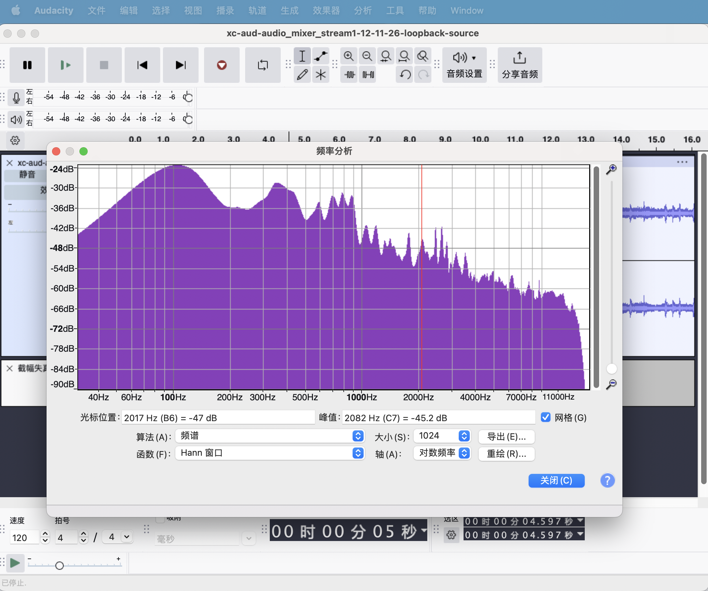
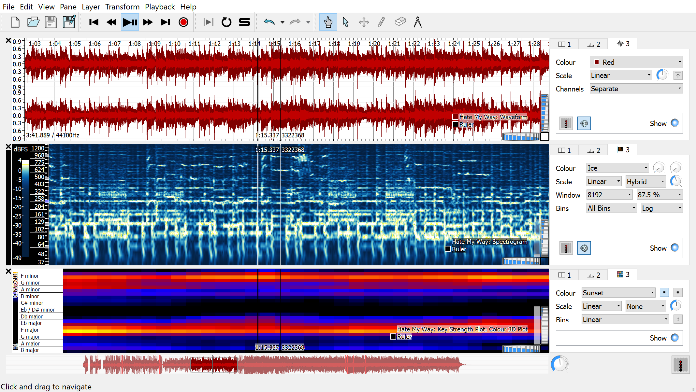
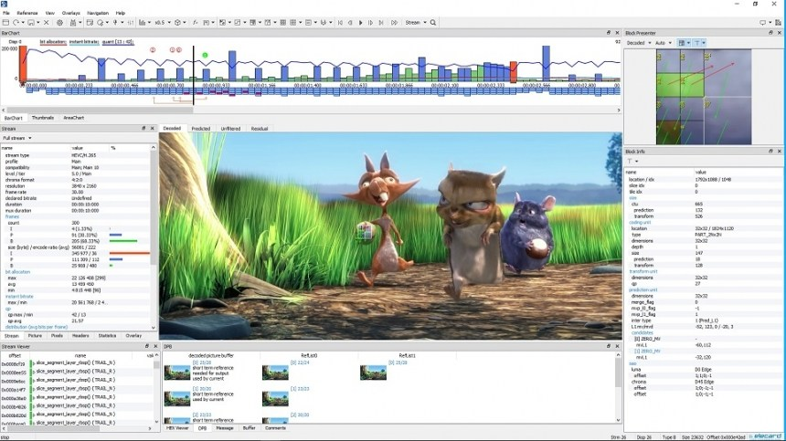

# 5.1.4 其他分析软件

除了使用前三节提及的开源库，以自编辑脚本的方式进行分析外。工作中也能采用其他收费或免费的 **第三方分析软件**，处理需要查验的数据。

那么，有哪些音视频常用的此类工具软件呢？这里我们做下简单罗列和介绍。

## **Audacity**

**Audacity** 是一款全球广受欢迎且 **免费的全平台音频编辑/录音软件**。虽然一般常用它来做音乐编辑、声音设计、播客制作等实用需求，但其功能完善，也可以处理类似 **音频修复**、**简单音频信号分解** 等分析场景。

<figure>
   
    <figcaption>
      
图 5-9 Audacity 界面展示

   </figcaption>
</figure>

对于一些音频基础信息分析，比如：**[绘制频响切面（FLS）](../../../Chapter_1/Language/cn/Docs_1_4_5.md)**、测算 RMS 等。此外，Audacity 也支持插件能力扩展，我们可以去 **[Audacity 的 官网插件入口](https://plugins.audacityteam.org/)**，查询我们需要的 **额外扩展**。

软件获取自 **[Audacity 的 官网地址](https://www.audacityteam.org/)**，下载其最新版本。

## **Sonic Visualiser**

**Sonic Visualiser（SV）** 是一款专门用于音频科学分析的工具软件，由 **英国伦敦大学（Queen Mary University of London）** 的 **音频和音乐技术研究小组** 开发，并选择了 **GNU 通用公共许可证（GPL）开放免费使用**。相比 Audacity，SV 更为的强大而专业，能轻易做到 Audacity 不能做到的事情，比如：**[语谱图（Spectrogram）](../../../Chapter_1/Language/cn/Docs_1_4_5.md) 分析**、**和声分析**、**音高检测** 等高级功能。

<figure>
   
    <figcaption>
      
图 5-10 Sonic Visualiser 界面展示

   </figcaption>
</figure>

因此，对于需要 **更细化音频分析** 和 **深度可视化能力** 时，我们通常会 **优先选择采用 SV 协助解决问题**。类似 **音频杂音分析**、**外部噪声分析** 等，就可以用其初步处理。大部分时候，都可以通过 SV 的结果，判断出问题成因。

软件可自 **[Sonic Visualiser 的 官网地址](https://sonicvisualiser.org/index.html)** 获取，同样也是一款 **全平台软件**。

## **Elecard StreamEye Studio**

**Elecard StreamEye Studio（SES）** 是一套包含总共 5 个独立应用程序和命令行工具（CLI）的 **专业图像/视频分析工作中心**。中心包括了 **StreamEye**、**Stream Analyzer**、**Video Quality Estimator**、**Quality Gates** 和 **YUV Viewer**，分别被用于 \[**深入分析编码视频序列（流-序列）**、**计算视频质量指标（流-指标）**、**编码流语法分析（流-规格）**、**编码流参数分析（流-参数）**、**传输格式分析（YUV）**\]。由于提供了 CLI，使得 SES 能够被用来进行稳定的自动化测试，并用于生成数据报告。

<figure>
   
    <figcaption>
      
图 5-11 SES 的 StreamEye 界面展示

   </figcaption>
</figure>

大多数情况下，SES 是被用来做 **流分析（Stream Analysis）** 的工作的，不过因为其本身的完备程度，我们也可以用它来进行一些 **局部范围内的帧分析（Frame Analysis）**，比如 **光流检测**、**运动矢量检测**、**超像素分割情况及局部像素分割可视化** 的处理，或用来 **查验 YUV 数据的准确性**。

而要真正发挥 SES 的强大能力，则还需等到音视频编解码部分时，才能体现。

软件可自 **[Elecard StreamEye Studio 的官网](https://www.elecard.com/products/video-analysis/streameye)** 获取。作为专业软件，其 **基础功能是免费的**，高级功能会包含更多的编解码规格，并提供更精细的分析能力。

 

除了我们介绍的这 3 款软件之外，还存在大量的第三方软件，比如 **Adobe 系列** 的 **Adobe Audition** 和 **After Effects** 等也可以用于分析（当然费用也需要预备一定的开支）。而通过我们之前介绍的开源库，和 **诸如 FFMpeg 库等本身提供的命令行工具**，同样也能做到。

 

这些工具总的来说，可以按照两类划分：**综合分析** 和 **自动化运用**。
- 三方软件擅长的主要是综合分析，能够较为轻松的从整体视野来处理问题；
- 开源库和 CLI 则更多在工程中被用于，验证原型 和 音视频工程的自动化治理（质量/性能报告）。

所以，在具体的工程中，还需 **结合起来灵活使用**。

[ref]: References_5.md