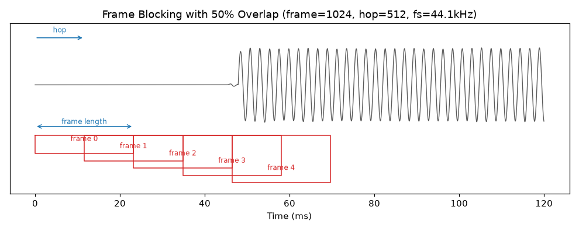
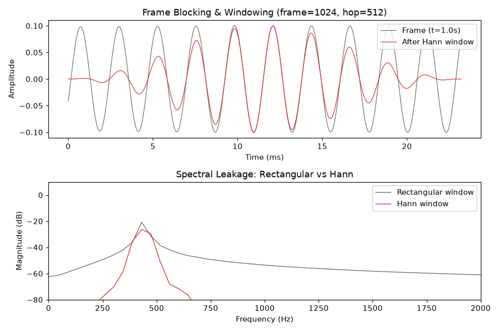

# 5.2.1 音频帧的切分与加窗（Frame Blocking & Windowing）

音频分析的第一个工程动作，几乎永远是 **切帧（Frame Blocking）**。为什么是 "几乎"？因为除了播放与试听，我们很少会把一整段音频当作一个不可分割的整体来处理。究其原因，要从音频信号的 **平稳性** 说起。

## **短时平稳假设（Short-Time Stationarity Assumption）**

在 **[第三章](../../../Chapter_3/Language/cn/Docs_3_1.md)** 中我们学过，傅立叶变换能够将信号从时域映射到频域。但直接对一整段音频做傅立叶变换，会得到一个 **所有时间信息都被平均掉的频谱**——我们能知道这段音频 "含有哪些频率"，却无法知道 "这些频率在什么时候出现"。对于一段音符不断变化的演奏，这样的频谱几乎没有分析价值。

幸运的是，音频信号虽然 **宏观上非平稳（Non-Stationary）**，但在足够短的时间窗内却可以近似看作 **平稳（Stationary）** 的。发声器官的机械运动速度决定了这个尺度的下限：无论是人声带振动还是乐器共鸣，其状态在 **20~40 毫秒** 内都不会发生显著改变。这就是 **短时平稳假设（Short-Time Stationarity Assumption）**，它是切帧操作的全部理论依据。

于是，切帧的数学描述非常直接。给定离散音频信号 $$x[n]$$ ，帧长为 $$N$$ 个采样点，帧移（Hop Size）为 $$H$$ 个采样点，则第 $$m$$ 帧为：

$$x_m[n] = x[mH + n], \quad 0 \le n < N$$

即每隔 $$H$$ 个采样点，取出长度为 $$N$$ 的一段。当 $$H < N$$ 时相邻帧之间存在 **重叠（Overlap）**，工程中通常取 **50% 重叠**（即 $$H = N/2$$ ）。重叠的意义在于 **平滑帧间过渡**：由于后面要讲的加窗会衰减帧的边缘，若不重叠，帧边缘的信息就会在分析中丢失。

<figure>
   
    <figcaption>
      
图 5-12 50% 重叠的切帧示意图（帧长 1024、帧移 512、采样率 44.1kHz）

   </figcaption>
</figure>

## **帧长的取舍：时间分辨率与频率分辨率**

帧长 $$N$$ 是切帧的第一个关键参数，它的选择本质上是一对 **不可兼得的分辨率权衡**：

- **帧越长**，频率分辨率越高，但时间分辨率越低——帧内若发生音符切换，分析结果会被 "平均" 掉
- **帧越短**，时间定位越精确，但频率分辨越粗糙

这里的频率分辨率，指的是离散傅立叶变换相邻频点（Bin）的间隔。对长度为 $$N$$ 的帧做 DFT，采样率为 $$f_s$$ 时：

$$\Delta f = \frac{f_s}{N}$$

以一个具体例子感受它：在 $$f_s = 44.1\ \text{kHz}$$ 下取 $$N = 1024$$ （约 23.2ms），则 $$\Delta f \approx 43.07\ \text{Hz}$$ 。这意味着频谱上 **440Hz 的 A4 标准音** 恰好落在第 10 个频点（430.66Hz）与第 11 个频点（473.73Hz）之间——直接对单帧做 FFT 并取峰值，得到的将是 **430.7Hz**，与真实值偏差近 10Hz。这个实测结果我们会在 **[5.2.3](Docs_5_2_3.md)** 的工程中看到。也正因如此，精确的基频估计不能依赖单帧峰值，而需要专门的基频跟踪算法（见 5.2.2 与 5.2.3）。

工程上的惯例是取 **20~40ms** 的帧长。在 44.1kHz 采样率下，对应 $$N$$ 为 1024（23.2ms）或 2048（46.4ms）这样的 2 的幂——这是为了配合 **[FFT 的快速计算](../../../Chapter_3/Language/cn/Docs_3_1_3.md)**。

## **加窗（Windowing）与频谱泄漏（Spectral Leakage）**

直接截取一帧，等价于给信号乘上一个 **矩形窗（Rectangular Window）**。而时域的截断相乘，对应频域的卷积：矩形窗的频谱是 sinc 函数，其 **旁瓣（Side Lobe）** 衰减缓慢（仅约 -13dB），会把帧内各频率分量的能量 "涂抹" 到邻近频点上。这种现象称为 **频谱泄漏（Spectral Leakage）** [\[11\]][ref] 。

抑制泄漏的办法，是在切帧的同时乘上一个两端平滑衰减的 **窗函数（Window Function）**，即：

$$x_m[n] = x[mH + n] \cdot w[n], \quad 0 \le n < N$$

最常用的 **汉宁窗（Hann Window）** 定义为：

$$w[n] = 0.5 \left( 1 - \cos \left( \frac{2\pi n}{N - 1} \right) \right)$$

它的思路很朴素：把帧的两端压到零，消除截断带来的突变，旁瓣衰减便可提升到约 -31.5dB。代价是 **主瓣（Main Lobe）变宽**——频率的分辨精度略有下降。这正是窗函数设计的核心权衡：**主瓣宽度与旁瓣衰减不可兼得**。汉明窗（Hamming）、布莱克曼窗（Blackman）等经典窗函数，都是在这个权衡曲线上选取的不同工作点 [\[11\]][ref] 。

<figure>
   
    <figcaption>
      
图 5-13 加窗前后的频谱泄漏实测对比（A4 标准音单帧，工程实现见 5.2.3）

   </figcaption>
</figure>

上图是 A4 标准音同一帧在矩形窗与汉宁窗下的实测频谱对比。可以清楚看到：矩形窗（灰线）的能量从 440Hz 主峰一直拖尾到 2000Hz 仍有 -60dB；而汉宁窗（红线）在约 700Hz 处便衰减到 -80dB 以下，主峰更为集中。这就是加窗的价值。

所以，切帧与加窗往往是音频帧分析最先进行的两个动作：切帧决定了在信号的什么位置、以多大的尺度去观察，而加窗则保证了观察到的频谱尽量干净。

理解了帧的切分方式后，接下来的问题就是：对切出的每一帧，我们 **提取什么**？这就是下一节要建立的音频帧特征体系。

[ref]: References_5.md
