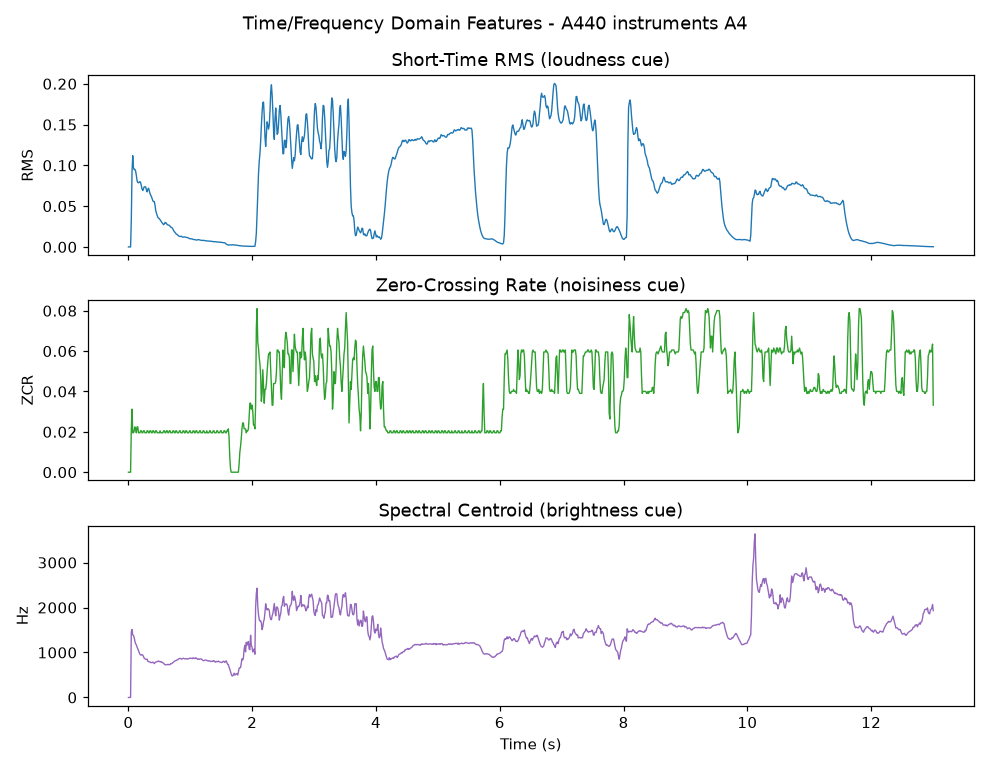
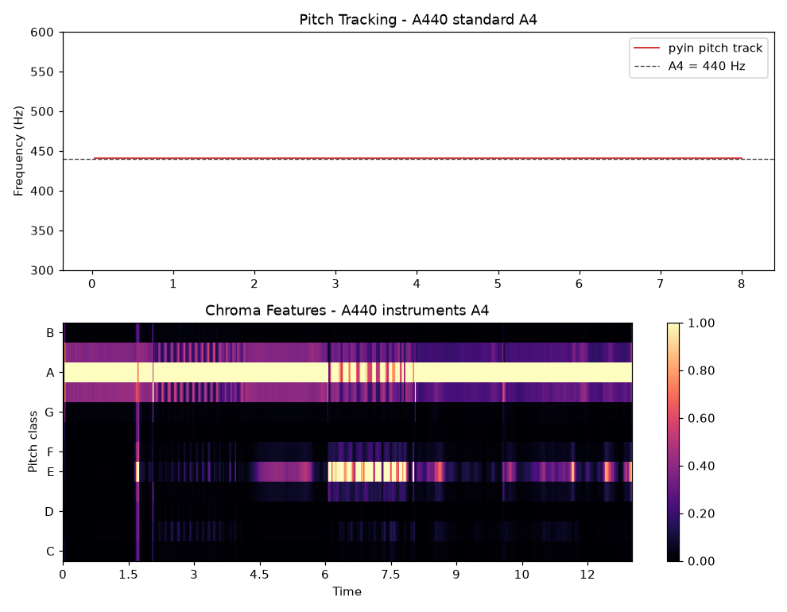

# 5.2.3 实战：A4 标准音的特征分析工程

前两节完成了理论储备：我们知道如何切帧加窗，也知道该提取哪些特征。本节将按照标准工程工作流，搭建一条完整的 **音频帧分析流水线（Audio Frame Analysis Pipeline）**，并用它分析一段真实素材。

## **任务定义与素材**

分析对象，直接选用我们在第一章使用过的 **A440 标准音素材**：

- **<a href="../../../Chapter_1/Examples/A440_standard_A4.wav" target="_blank">A440_standard_A4.wav</a>**：标准 A4 音叉/正弦合成音，44.1kHz / 16bit / 双声道，约 22.7s
- **<a href="../../../Chapter_1/Examples/A440_instruments_A4.wav" target="_blank">A440_instruments_A4.wav</a>**：多种乐器先后演奏的 A4（440Hz），44.1kHz / 16bit / 双声道，约 13s

选择它们的理由有三：其一，素材已在 **[1.4.5 节](../../../Chapter_1/Language/cn/Docs_1_4_5.md)** 的频谱分析中使用过，读者对其频谱形态已有印象，便于对照；其二，标准音的基频真值已知（440Hz），分析结果 **自带标准答案**，方便验证流水线的正确性；其三，乐器版包含多件乐器的先后发声，可以观察特征随音色的变化。

## **流水线设计**

沿用 **5.1** 的工程封装习惯，我们将分析流程组织为四个阶段：

1. **加载（Load）**：SoundFile 读取并混合为单声道浮点信号
2. **切帧加窗（Frame & Window）**：手写 NumPy 实现——帧长 1024（23.2ms）、帧移 512（50% 重叠）、汉宁窗，与 5.2.1 的理论一一对应
3. **特征提取（Feature Extraction）**：Librosa 提取 RMS、过零率、频谱质心、色度特征，pYIN 进行基频跟踪
4. **报告（Report）**：Matplotlib 输出分析报告图

创建自动化脚本 **<a href="../../Examples/practice_4_audio_frame_analysis.py" target="_blank">practice_4_audio_frame_analysis.py</a>**。其中切帧的核心实现，仅用两行 NumPy 索引即可完成——这正是数组化计算的优雅之处：

```python
def frame_blocking(y, frame_len, hop_len):
    """Split a 1-D signal into overlapping frames: (n_frames, frame_len)."""
    n_frames = 1 + (len(y) - frame_len) // hop_len
    idx = np.arange(frame_len)[None, :] + hop_len * np.arange(n_frames)[:, None]
    return y[idx]
```

特征提取部分则直接复用 Librosa 的封装（见 **[5.1.2](Docs_5_1_2.md)**）：

```python
rms  = librosa.feature.rms(y=y, frame_length=FRAME_LEN, hop_length=HOP_LEN)[0]
zcr  = librosa.feature.zero_crossing_rate(y=y, frame_length=FRAME_LEN, hop_length=HOP_LEN)[0]
cent = librosa.feature.spectral_centroid(y=y, sr=sr, n_fft=FRAME_LEN, hop_length=HOP_LEN)[0]
f0, voiced, _ = librosa.pyin(y_seg, fmin=100, fmax=1000, sr=sr,
                             frame_length=FRAME_LEN * 2, hop_length=HOP_LEN)
```

## **运行结果与解读**

执行脚本后，将在 `Chapter_5/Pictures/` 下生成三张报告图，并在终端输出验证数据：

```bash
   python practice_4_audio_frame_analysis.py
```

```text
[frames] standard A4 -> 1955 frames x 1024 samples (23.2 ms frame, 11.6 ms hop)
[verify] FFT peak of one frame : 430.7 Hz
[verify] pyin median pitch     : 441.27 Hz (voiced 100%)
[verify] beat track tempo      : 92.3 BPM, 16 beats
```

**首先验证 5.2.1 的理论预言。** 对单帧直接取 FFT 峰值，得到 **430.7Hz**——恰为第 10 个频点（$10 \times 43.07 = 430.7$Hz），与 440Hz 真值偏差近 10Hz。而 pYIN 基频跟踪给出 **441.27Hz**，100% 的帧判定为有声段，与真值偏差仅 0.3%（乐器实录的正常音分误差范围）。两组数字并置，便是 "为什么需要专门基频算法" 最直观的答案。

**图 5-13（见 5.2.1）** 已展示了加窗对频谱泄漏的抑制效果，此处不再重复。剩余两张报告图如下：

<center>
<figure>
   
    <figcaption>
      <p>图 5-14 乐器版 A4 的时域与频域特征曲线（RMS / 过零率 / 频谱质心）</p>
   </figcaption>
</figure>
</center>

图 5-14 中，RMS 曲线的台阶状起伏清晰标记了各件乐器的进入与退出；过零率在强奏段（约 2~4s）显著抬升，对应更丰富的谐波与瞬态成分；频谱质心则在 500~3300Hz 之间摆动——约 10s 处质心的尖峰，正对应一件高音乐器的进入。三条曲线构成了这段音频的 **特征肖像**。

<center>
<figure>
   
    <figcaption>
      <p>图 5-15 基频跟踪（上，紧贴 440Hz 参考线）与色度特征热力图（下）</p>
   </figcaption>
</figure>
</center>

图 5-15 上半部分的基频轨道几乎与 440Hz 参考线重合。下半部分的色度热力图更有意思：**A 音级上横贯着一条明亮主带**——无论换哪件乐器演奏，响的都是 A4。而 E 音级（A 的纯五度，见 **[1.4.1](../../../Chapter_1/Language/cn/Docs_1_4_1.md)**）的次级亮带，则来自各乐器泛音列中的五度泛音成分。这正是色度特征 "折叠八度、直指音名" 的能力展示。

**可见，一条不到百行的流水线，便完成了从原始 PCM 到可解释音乐特征的完整跨越。**

## **小结与延伸**

本节工程虽小，却已具备生产级音频分析的全部骨架：加载、切帧、加窗、特征、报告。需要批量处理时，只需将加载环节替换为文件遍历；需要实时分析时，将数据源替换为 PyAudio 的流式回调即可（5.1.2 的播放器工程已经演示过流控的基本形态）。

如果想立刻上手把玩切帧与加窗的效果，本章还提供了配套的 **在线演示（见【在线演示】页）**：可以直接在浏览器里上传任意音频，拖动滑块调整帧长与窗函数，实时观察频谱泄漏的变化。

下一节，我们将视线从音频转向视频：视频帧的分析，既有与音频相通的思路，也有图像维度带来的新问题。

[ref]: References_5.md
