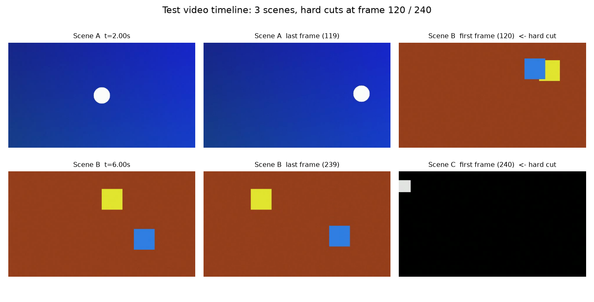
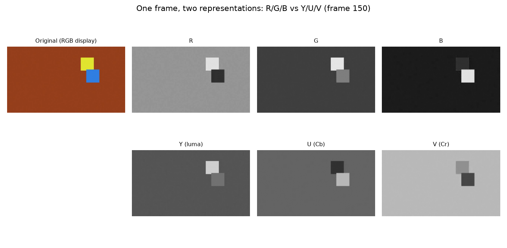

# 5.3.1 视频帧的提取与表示（Frame Extraction & Representation）

音频分析从 "切帧" 开始，视频分析则从 "取帧" 开始。一段存储在磁盘上的视频文件，并不是一连串可以直接访问的图像——它是经过 **封装（Muxing）** 的压缩码流。要对其进行分析，第一步永远是 **解码出原始帧**。

## **从容器到帧：解码链路的最小图景**

一个常见的视频文件（如 MP4）内部是一个 **容器（Container）**，其中装着至少一路经过编码的 **视频码流（Video Elementary Stream）**。从文件到帧的完整链路是：

<center>
   <b>解封装（Demux）→ 解码（Decode）→ 原始帧（Raw Frame）</b>
</center>

其中编码与解码的全部细节——帧内预测、变换量化、熵编码——正是 **第六章** 的主题。本节我们站在 "已经拿到解码后的原始帧" 的视角，直接使用 OpenCV 的 [VideoCapture](https://docs.opencv.org/4.x/d8/dfe/classcv_1_1VideoCapture.html) 接口 [\[9\]][ref] ，它把上述链路封装为一次 `read()` 调用：每调用一次，返回一帧的像素矩阵。

工程实现详见 **[5.3.3](Docs_5_3_3.md)** 的 practice_5 工程。为了让分析对象完全可控、结论可以精确验证，该工程首先 **用代码合成了一段测试视频**：640×360 分辨率、30fps、共 12 秒 360 帧，由三个场景拼接而成，场景之间为 **硬切（Hard Cut）**——第 120 帧与第 240 帧处画面内容瞬间切换：

<center>
<figure>
   
    <figcaption>
      <p>图 5-16 测试视频的时间线结构：三个场景与两次硬切（工程实现见 5.3.3）</p>
   </figcaption>
</figure>
</center>

三个场景的运动特征被刻意设计为不同：**场景 A** 是一个沿正弦轨迹平滑运动的圆形；**场景 B** 有两个运动目标（一个漂移、一个弹跳）；**场景 C** 是一个沿对角线快速冲刺的小方块。同时，所有帧都叠加了少量高斯噪声，模拟真实摄像头的传感器噪声。这些设计将在 5.3.2 与 5.3.3 中逐一派上用场。

## **帧率（FPS）与显示时间戳（PTS）**

视频帧在时间轴上的位置由两个量刻画：**帧率（Frame Rate）** 与 **显示时间戳（PTS [Presentation Timestamp]）**。

帧率描述 **每秒包含多少帧**，它决定了名义上的帧间隔。对 30fps 的视频，相邻帧的名义间隔为：

$$
\Delta t = \frac{1}{fps} = \frac{1}{30} \approx 33.33\ \text{ms}
$$

而 PTS 是容器为每一帧记录的 **实际显示时刻**。理想情况下第 $$i$$ 帧的 PTS 就是 $$i \times \Delta t$$ ，但工程中 PTS 才是唯一可信的时间依据——网络传输、可变帧率（VFR）录制、音画同步修复等场景都会让帧的实际时刻偏离名义值。播放器正是按照 PTS 来决定每一帧何时上屏，音视频同步也依赖它。

practice_5 的实测输出验证了这一关系（完整输出见 5.3.3）：

```
container props : fps=30.00  frames=360  resolution=640x360  duration=12.00s
PTS samples (ms): frame0=0.0  frame1=33.3  frame120=4000.0  last=11966.7
```

可以看到，第 120 帧的 PTS 恰为 4000ms——这正是第一个硬切发生的时刻。帧号、PTS、秒三种坐标之间的换算，是视频分析中最常用的基本功。

## **像素的两种表示：RGB 与 YUV**

解码得到的原始帧是一块像素矩阵。在 OpenCV 中，它以 **BGR 顺序** 的三通道 `uint8` 数组存在（注意不是 RGB，这是 OpenCV 的历史惯例 [\[9\]][ref] ）。而在编码与传输领域，帧更多以 **YUV** 的形式存在——我们在 **[2.6.3](../../../Chapter_2/Language/cn/Docs_2_6_3.md)** 中已经学过，YUV 将像素分离为 **亮度（Y [Luma]）** 与两个 **色度分量（U/V [Chroma]）**。

两种表示各有所长，分析任务也各有偏好：

- **RGB/BGR** 贴近显示与人眼直觉，适合颜色相关的分析与可视化
- **YUV** 的亮度通道集中了图像的主要结构信息，且与人类视觉对亮度更敏感的特性匹配——第三章讨论的空域/时域冗余控制，绝大多数只在 Y 与 U/V 上分别施加

practice_5 对测试视频的第 150 帧（场景 B 中段）做了两种表示的通道分解：

<center>
<figure>
   
    <figcaption>
      <p>图 5-17 同一帧的 RGB 与 YUV 通道分解对比（第 150 帧，工程实现见 5.3.3）</p>
   </figcaption>
</figure>
</center>

观察上图可以直观验证 **2.6** 章的理论：Y 通道几乎保留了原图的全部结构（两个方块清晰可辨），而 U、V 通道只携带色度差异——暖色背景在两个色度通道上呈现为平缓的中间灰。这正是编码器敢于对色度通道做 **降采样（Chroma Subsampling，如 4:2:0）** 而不显著损伤观感的根本原因。

所以，取帧与表示构成了视频帧分析的基础：VideoCapture 负责把帧取出来，帧率与 PTS 规定了帧在时间轴上的位置，而 RGB 与 YUV 则决定了我们从什么角度去观察帧的内容。

拿到了帧之后，视频分析真正的独特问题才出现：相邻帧之间是什么关系？这就是下一节要建立的帧间分析体系。

[ref]: References_5.md
