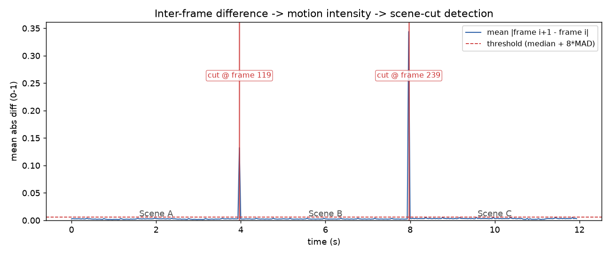
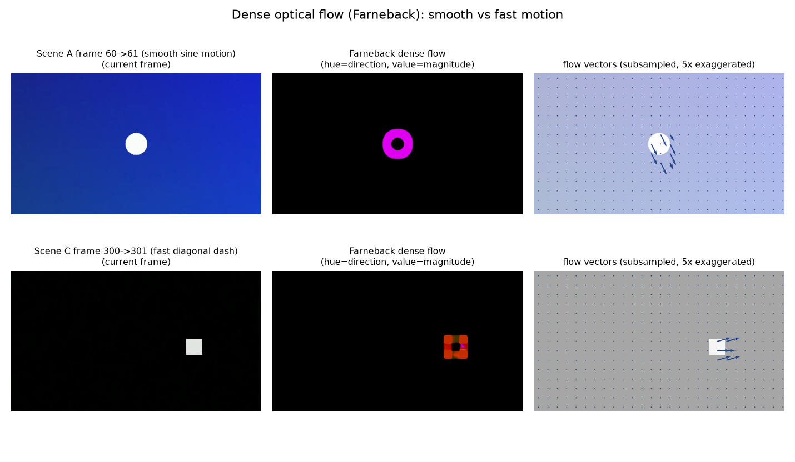

# 5.3.2 帧间分析：帧差、光流与场景切分（Frame Difference, Optical Flow & Scene-Cut Detection）

视频与单张图像的本质区别，在于帧与帧之间的 **时间相关性**。我们在 **[第三章](../../../Chapter_3/Language/cn/Docs_3_3.md)** 已经知道：相邻视频帧通常高度相似，这就是 **时域冗余（Temporal Redundancy）**。本节换一个方向利用它——不为压缩，而为 **分析**：帧间的差异里，藏着运动、事件与结构边界。

## **帧差法（Frame Difference）：最简单的运动度量**

最直接的帧间度量是 **帧差**：将相邻两帧转为灰度后逐像素求差的绝对值，再取全图平均，得到标量序列：

$$
d[i] = \frac{1}{WH} \sum_{x,y} \left| g_{i+1}(x, y) - g_i(x, y) \right|
$$

其中 $$g_i$$ 为第 $$i$$ 帧的灰度图， $$W \times H$$ 为分辨率。 $$d[i]$$ 的物理含义是 **这一秒画面 "变了多少"**——它就是一条 **运动强度曲线（Motion Intensity Curve）**。

这条曲线的形态直接反映内容结构：

- **平稳镜头**： $$d[i]$$ 低而平缓（只有噪声与微小运动）
- **剧烈运动**： $$d[i]$$ 整体抬升
- **硬切（Hard Cut）**： $$d[i]$$ 出现一根 **孤立的尖峰**——画面内容在相邻两帧间整体替换
- **渐变转场（Dissolve/Wipe）**： $$d[i]$$ 出现一段 **持续抬升的平台或斜坡**——新旧画面在若干帧内混合过渡

practice_5 在三场景测试视频上的实测结果如下图。两个硬切（第 119→120 帧、第 239→240 帧）表现为两根高耸的尖峰，峰值 0.34，是场景内运动强度（约 0.002~0.01）的数十倍：

<figure>
   
    <figcaption>
      
图 5-18 帧差运动强度曲线与场景切分检测（红色竖线为检出的切点，工程实现见 5.3.3）

   </figcaption>
</figure>

## **场景切分检测（Scene-Cut Detection）**

既然硬切在帧差曲线上是显著尖峰，检测它就归结为一个 **阈值判定** 问题。这也是 **[3.3 节](../../../Chapter_3/Language/cn/Docs_3_3.md)** 朴素阈值处理思想在视频结构分析中的直接应用。

固定阈值的问题是：不同视频的内容、噪声水平、压缩质量差异巨大，没有一个放之四海皆准的数值。工程上更稳健的做法是 **自适应阈值**——用视频自身的统计量来定标。practice_5 采用的是 **中位数 + k 倍 MAD（Median Absolute Deviation，中位数绝对偏差）**：

$$
\text{threshold} = \mathrm{median}(d) + k \cdot \mathrm{MAD}(d), \quad \mathrm{MAD}(d) = \mathrm{median}\left( \left| d[i] - \mathrm{median}(d) \right| \right)
$$

中位数与 MAD 都是 **鲁棒统计量**，不会被切点本身的尖峰带偏。实测中 $$k = 8$$ 时阈值为 0.006，两个真实切点（第 119、239 帧，0 基索引下为切前最后一帧）被精确检出，且 360 帧全程 **零误检**。

需要强调的是，帧差法对 **硬切** 有相当高的检出率，但对 **渐变转场** 与 **剧烈全局运动**（如快速摇镜）会失效——前者抬升平缓不越阈，后者整条曲线被抬高淹没切点。工业级场景切分还会结合 **颜色直方图距离**、**特征点匹配** 等多特征投票。但对入门工程而言，帧差 + 自适应阈值已经是一条可以跑通的完整链路。

## **光流估计（Optical Flow Estimation）：逐像素的运动矢量**

帧差告诉我们 "变了多少"，却不能回答 "往哪里变"。要获得 **每个像素的运动方向与速度**，就需要 **光流（Optical Flow）**。

我们在 **[3.4.1](../../../Chapter_3/Language/cn/Docs_3_4_1.md)** 中已经系统学过光流的理论：从亮度恒定假设出发的 **HS 法（Horn-Schunck）** 与 **LK 法（Lucas-Kanade）**。OpenCV 的工程实现中，除了这两类经典方法，还有一个在精度与速度间取得良好平衡的稠密光流算法——**Farneback 法** [\[15\]][ref] 。它的核心思路是将图像邻域用 **二次多项式展开** 逼近，通过比较两帧多项式系数的差异，估计每个像素的位移向量。

practice_5 用 `cv2.calcOpticalFlowFarneback` 计算了测试视频中两个代表性帧对的 **稠密光流场（Dense Optical Flow Field）**，并按照惯例用 HSV 色彩编码可视化：**色相（Hue）表示运动方向，明度（Value）表示运动幅度**：

<figure>
   
    <figcaption>
      
图 5-19 Farneback 稠密光流可视化：平滑运动（场景 A）与快速运动（场景 C）对比（工程实现见 5.3.3）

   </figcaption>
</figure>

实测数据值得逐条解读（完整输出见 5.3.3）：

- **平滑运动对（场景 A，60→61 帧）**：全图平均幅度仅 0.12 px/帧（背景占绝大多数像素且静止），但 **最大幅度 7.08 px/帧**，集中在圆形目标的边缘——光流场精确地圈出了运动物体的轮廓
- **快速运动对（场景 C，300→301 帧）**：目标冲刺速度约 7.5 px/帧，实测最大幅度 9.50 px/帧，已经逼近算法参数（3 层金字塔、15 像素窗）的捕获范围上限

第二点引出了稠密光流的一个重要工程约束：**金字塔层数与窗口尺寸共同决定了可捕获的最大位移**。当物体一帧移动的距离超过窗口邻域时，多项式展开便无从匹配，光流会低估甚至漏检。这也是第三章编码器在帧间预测中要设计 **多参考帧、可变块尺寸与搜索范围** 的现实原因之一。

## **从分析到编码：关键帧的预告**

场景切分检测还有一层更深远的意义：它天然地为编码器划分了 **随机访问点**。试想编码器如何对待一个切点——切后的第一帧与切前毫无时域相关性，帧间预测完全失效，只能 **帧内编码**。这就是为什么视频编码以 **GOP（Group of Pictures，图像组）** 组织码流、以 **关键帧（Key Frame / I-Frame）** 作为独立解码入口。分析侧的 "场景切分"，正是编码侧 "GOP 划分" 的依据。这条线索我们将在 **第六章** 展开。

至此，帧间分析的工具已经齐备：帧差负责量化整体变化，阈值检测负责定位结构边界，光流则负责刻画逐像素的运动细节。

下一节，我们将把这些工具组装成一条完整的视频帧分析流水线，并在完全可控的合成视频上验证每一个环节。

[ref]: References_5.md
