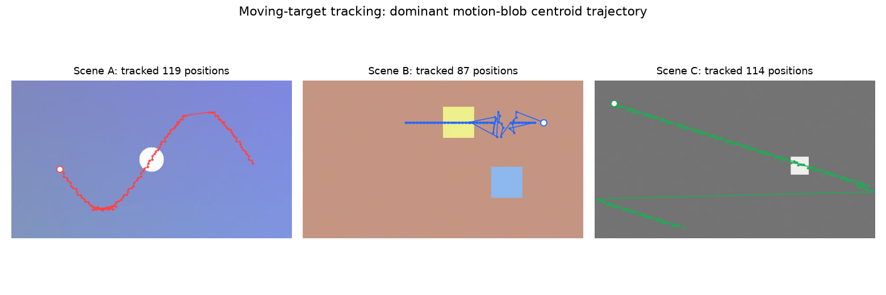

# 5.3.3 实战：测试视频的场景切分与目标跟踪工程

前两节完成了理论储备：我们知道如何从视频中取帧、以何种表示看待帧，也知道帧差、光流与场景切分的原理。本节将搭建一条完整的 **视频帧分析流水线（Video Frame Analysis Pipeline）**，并在一段 **自带标准答案** 的测试视频上验证它。

## **任务定义与素材**

与音频实战直接使用既有素材不同，视频实战我们选择 **先用代码合成测试视频，再对其分析**。理由与 5.2.3 选择标准音一脉相承：**真值已知，结论可验证**。

- **<a href="../../Examples/practice_5_test_video.mp4" target="_blank">practice_5_test_video.mp4</a>**：OpenCV 合成的三场景测试视频，640×360 / 30fps / 12s / 360 帧，硬切点位于第 120、240 帧，叠加少量高斯传感器噪声

三个场景的运动复杂度逐级递增：场景 A 为单目标平滑正弦运动，场景 B 为双目标漂移与弹跳，场景 C 为单目标快速对角冲刺。这样，帧差检测的 **正确答案**（两个切点）、跟踪的 **正确答案**（正弦轨迹）都是已知的。

## **流水线设计**

沿用 **5.1** 的工程封装习惯，分析流程组织为五个阶段：

1. **合成（Synthesize）**：`cv2.VideoWriter` 逐帧渲染三个场景并写入 MP4（mp4v 编码）
2. **解码取帧（Decode）**：`cv2.VideoCapture` 逐帧读回，同时记录每帧 PTS
3. **帧间分析（Inter-Frame Analysis）**：灰度帧差曲线 → median + 8·MAD 自适应阈值 → 切点检测；Farneback 稠密光流 → HSV 编码可视化
4. **目标跟踪（Tracking）**：帧差阈值化 → 形态学去噪 → 最大轮廓质心 → 逐帧轨迹
5. **报告（Report）**：Matplotlib 输出分析报告图

创建自动化脚本 **<a href="../../Examples/practice_5_video_frame_analysis.py" target="_blank">practice_5_video_frame_analysis.py</a>**。合成阶段的核心是一个场景函数表——每帧按帧号分发到对应场景的渲染函数：

```python
for i in range(TOTAL_FRAMES):
    scene_idx = i // (FPS * SCENE_LEN)
    t = (i % (FPS * SCENE_LEN)) / FPS
    frame = SCENES[scene_idx](t)
    frame += rng.normal(0.0, 0.012, frame.shape).astype(np.float32)  # sensor noise
    writer.write((np.clip(frame, 0, 1) * 255).astype(np.uint8))
```

帧差曲线的计算同样只需数组化操作（与 5.2.3 的切帧异曲同工）：

```python
g = np.stack([cv2.cvtColor(f, cv2.COLOR_BGR2GRAY).astype(np.float32) / 255.0
              for f in frames])
diff = np.mean(np.abs(np.diff(g, axis=0)), axis=(1, 2))
```

光流估计则直接复用 OpenCV 的封装（见 **[5.1.3](Docs_5_1_3.md)** 的视频分析模块）：

```python
flow = cv2.calcOpticalFlowFarneback(prev, next, None,
                                    pyr_scale=0.5, levels=3, winsize=15,
                                    iterations=3, poly_n=5, poly_sigma=1.2,
                                    flags=0)
mag, ang = cv2.cartToPolar(flow[..., 0], flow[..., 1])
```

## **运行结果与解读**

执行脚本后，将在 `Chapter_5/Pictures/` 下生成五张报告图，并在终端输出验证数据：

```bash
   python practice_5_video_frame_analysis.py
```

```text
[1] synthesize test video
    written: Chapter_5/Examples/practice_5_test_video.mp4 (504 KB)
[2] decode & inspect
    container props : fps=30.00  frames=360  resolution=640x360  duration=12.00s
    PTS samples (ms): frame0=0.0  frame1=33.3  frame120=4000.0  last=11966.7
[4] inter-frame analysis: frame difference & scene-cut detection
    diff stats: median=0.0025  threshold=0.0060  max=0.3439
    ground-truth cuts at frames: [120, 240]
    detected cuts at frames  : [119, 239] (0-based index of the last pre-cut frame)
[5] dense optical flow (Farneback)
    pair   60->61  : mean |flow|=0.12 px/frame, max=7.08 px/frame, moving pixels(>1px)=1.8%
    pair  300->301 : mean |flow|=0.09 px/frame, max=9.50 px/frame, moving pixels(>1px)=1.5%
[6] moving-target tracking (motion-blob centroid)
    scene A: 119 tracked positions, x range [110, 551], y range [72, 295]
    scene B: 87 tracked positions, x range [234, 549], y range [70, 128]
    scene C: 114 tracked positions, x range [4, 636], y range [52, 335]
```

**首先验证解码与时间体系。** 360 帧、30fps、12 秒与合成参数完全一致；第 120 帧 PTS 恰为 4000ms，名义帧间隔 33.33ms 与实测吻合——5.3.1 的理论在工程接口中得到了印证。

**再看场景切分的精确性。** 自适应阈值 0.006，而切点峰值 0.344，信噪比接近 60 倍。检出的 119、239 是 **切前最后一帧的 0 基索引**，换算后即真值 120、240——360 帧全程 **零误检、零漏检**。帧差法对硬切的可靠性，由此可见一斑。

**光流数据则揭示了 "平均" 与 "极值" 的分工。** 两个帧对的全图平均幅度都只有 0.1 px/帧 量级——因为 98% 以上的像素是静止背景；而最大幅度（7.08 与 9.50 px/帧）才对应运动目标的真实速度。分析运动时，**局部统计往往比全局均值更有信息量**。

**最后是跟踪。** 朴素质心法的三张轨迹图如下：

<center>
<figure>
   
    <figcaption>
      <p>图 5-20 三个场景的运动目标质心轨迹（红：场景 A 正弦；蓝：场景 B 双目标；绿：场景 C 对角冲刺）</p>
   </figcaption>
</figure>
</center>

三条轨迹恰好构成一组 **递进的对照实验**：

- **场景 A** 的轨迹是一条平滑的正弦曲线，与圆形目标的真实运动完全吻合——单目标、匀速、无遮挡时，朴素方法足够好用
- **场景 B** 的轨迹则明显凌乱：两个运动目标交替成为 "最大运动块"，质心在两者之间跳变。这正是 **"最大轮廓" 假设的固有缺陷**——它无法表达多目标
- **场景 C** 的轨迹整体是对角直线，但当方块冲出版面边缘并 **从另一侧回绕** 时，轨迹出现长距离的瞬移连线。这暴露了朴素方法的另一软肋：**没有身份一致性**——目标消失再出现时，方法并不知道 "这是同一个它"

可见，朴素帧差跟踪是一把很好的 **教学尺**：它能量出真实世界的复杂度，也量出了自己的边界。要跨越这些边界——多目标、遮挡、重现识别——就需要 **[5.1.3](Docs_5_1_3.md)** 中介绍的 `cv2.Tracker` 族专业跟踪器，乃至第四章的检测+跟踪学习范式。

**可见，一条百余行的流水线，完成了从像素到结构（切点）、从结构到运动（光流）、从运动到目标（轨迹）的完整跨越。**

## **小结与延伸**

本节工程覆盖了视频帧分析的三个经典层次：结构分析（场景切分）、运动场分析（光流）、目标分析（跟踪）。需要分析真实视频时，只需跳过合成阶段、直接以文件路径初始化 `VideoCapture` 即可，其余环节原样复用。

如果想立刻上手把玩帧差与场景切分的效果，本章还提供了配套的 **在线演示（见【在线展示】页）**：可以直接在浏览器里打开任意本地视频，拖动阈值滑块，实时观察运动强度曲线上的切点检出。

下一节，我们将从 "分析帧" 走向 "处理帧"——滤镜、增强与几何变换，让帧按照我们的意图改变。

[ref]: References_5.md
