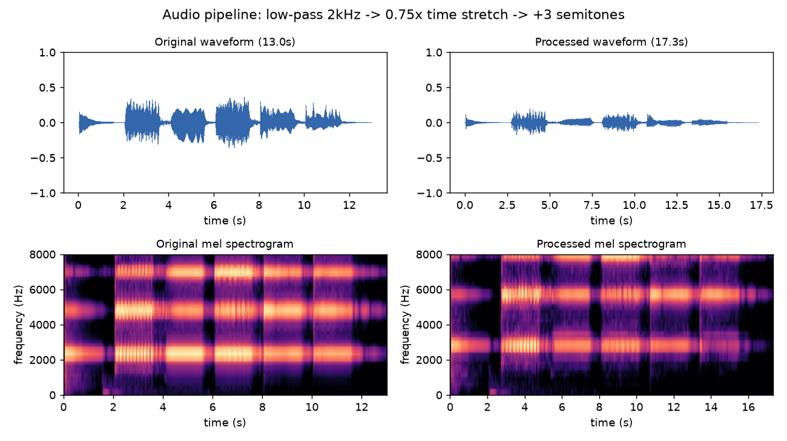
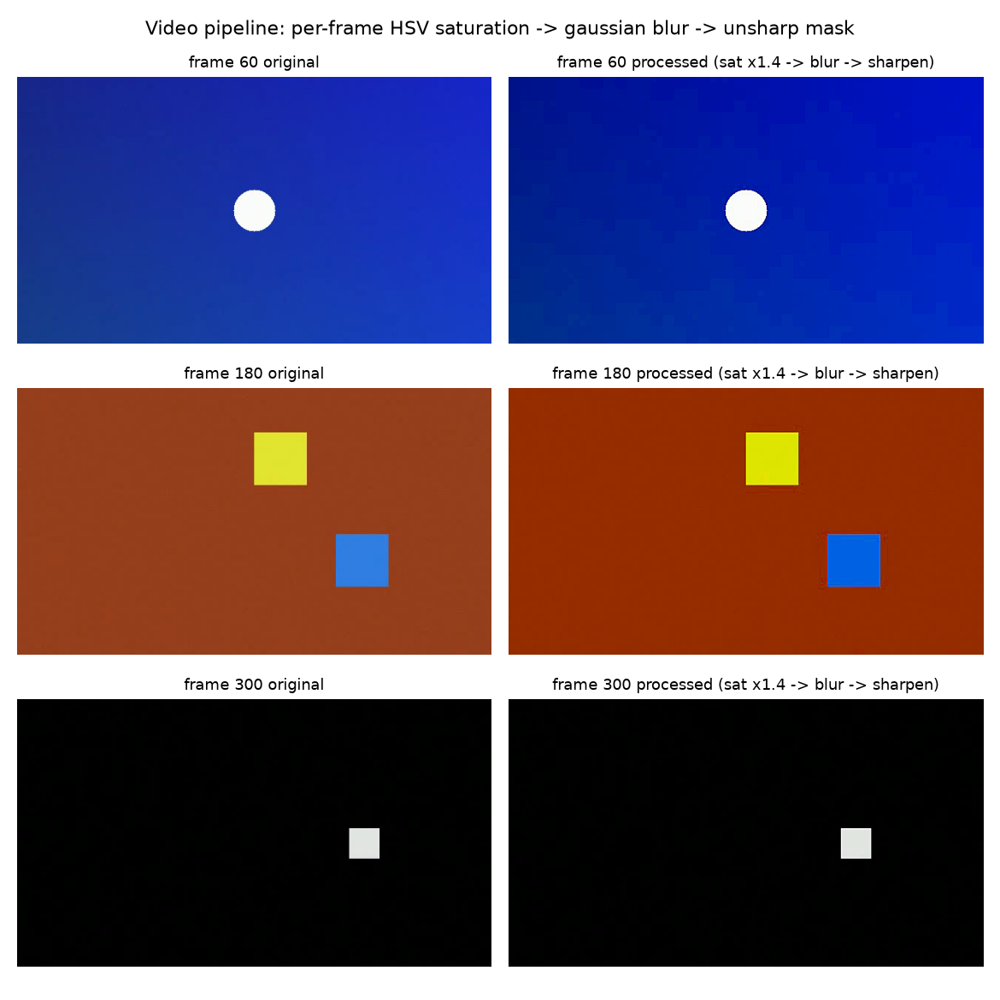

# 5.4.3 实战：音视频帧批量处理工程

前两节分别建立了音频与视频的帧处理工具箱。本节将它们组装为两条完整的 **批量处理管线（Batch Processing Pipeline）**，在真实素材上执行，并用前后对比验证每个环节的效果。

## **任务定义与素材**

- **音频管线**：以 **<a href="../../../Chapter_1/Examples/A440_instruments_A4.wav" target="_blank">A440_instruments_A4.wav</a>**（多乐器演奏的 A4，44.1kHz / 13.0s，5.2.3 的分析对象）为输入，依次执行 **2kHz 低通滤波 → 0.75× 变速 → 升 3 半音变调**，输出处理后的 WAV
- **视频管线**：以 **<a href="../../Examples/practice_5_test_video.mp4" target="_blank">practice_5_test_video.mp4</a>**（5.3.3 合成的三场景测试视频）为输入，逐帧执行 **HSV 饱和度 ×1.4 → 5×5 高斯模糊 → USM 锐化（α=0.8）**，输出处理后的 MP4

选择这两个素材的理由不变：**真值已知**——音频的音高与时长的期望变化可以精确计算，视频三场景的画面内容完全可控。

## **流水线设计**

创建自动化脚本 **<a href="../../Examples/practice_6_frame_processing.py" target="_blank">practice_6_frame_processing.py</a>**。两条管线共享同一个骨架——**读入 → 逐单元处理 → 写出 → 报告**，这正是 5.2/5.3 分析流水线的对偶形态。

音频链的核心调用（SciPy 设计滤波器 + filtfilt 零相位滤波，Librosa 执行变速变调）：

```python
sos = butter(6, 2000, btype="low", fs=sr, output="sos")
y_lp   = sosfiltfilt(sos, y)                       # 低通，零相位
y_slow = librosa.effects.time_stretch(y_lp, rate=0.75)
y_out  = librosa.effects.pitch_shift(y_slow, sr=sr, n_steps=3)
```

视频链的帧函数（对应 5.4.2 的三步）：

```python
def process_frame(frame):
    hsv = cv2.cvtColor(frame, cv2.COLOR_BGR2HSV).astype(np.float32)
    hsv[..., 1] = np.clip(hsv[..., 1] * 1.4, 0, 255)          # 饱和度
    out  = cv2.cvtColor(hsv.astype(np.uint8), cv2.COLOR_HSV2BGR)
    blur = cv2.GaussianBlur(out, (5, 5), 0)                   # 模糊
    return cv2.addWeighted(out, 1.8, blur, -0.8, 0)           # USM 锐化
```

## **运行结果与解读**

```bash
   python practice_6_frame_processing.py
```

```text
[A] audio frame processing
    input : Chapter_1/Examples/A440_instruments_A4.wav (13.00s @ 44100Hz)
    chain : low-pass 2000Hz (butter6) -> time_stretch x0.75 -> pitch +3 st
    output: Chapter_5/Examples/practice_6_audio_processed.wav (17.34s)
    RMS   : in=0.0949  after lowpass=0.0917  final=0.0347
[B] video frame processing
    input : Chapter_5/Examples/practice_5_test_video.mp4 (640x360 @ 30fps)
    chain : HSV saturation x1.4 -> gaussian 5x5 -> unsharp 0.8
    output: Chapter_5/Examples/practice_6_video_processed.mp4
    perf  : 360 frames in 0.59s (1.65 ms/frame)
```

先看音频链中每一项可以预先计算的预期。时长上， $$13.00 / 0.75 = 17.33$$ 秒，实测输出 17.34 秒（尾部采样点舍入），变速精确成立；变调只改音高不改时长，也符合 Phase Vocoder 组合的设计。能量上，低通后 RMS 从 0.0949 降至 0.0917（仅 -3.4%）——这是因为 A4 乐音的绝大部分能量集中在 2kHz 以下的基频与低次泛音，滤波削掉的主要是高频泛音与噪声；而变速变调后 RMS 降至 0.0347，这是相位声码器在帧重排叠加时的正常能量重分布，听感响度会由归一化与后续增益环节负责。

<center>
<figure>
   
    <figcaption>
      <p>图 5-21 音频处理管线前后对比：波形（上）与梅尔频谱（下）</p>
   </figcaption>
</figure>
</center>

图 5-21 同时验证了三个环节：波形时间轴从 13s 拉长到 17.3s，而包络形态保持不变；梅尔频谱中，2kHz 以上的泛音亮带在 **处理后明显变暗但没有消失**——这正是 5.4.1 强调的 Butterworth 过渡带特性；同时各音带的频率位置整体上移约 $$2^{3/12}$$ 倍，这是变调在频谱上留下的直接特征，而时间结构保持等比拉伸。

处理后的音频可以在 **<a href="../../Examples/practice_6_audio_processed.wav" target="_blank">practice_6_audio_processed.wav</a>** 直接试听：乐器音色变得闷柔（低通），节奏放慢（变速），而音高反而升高了三个半音（变调）——三个效果独立可辨。

视频链的验证同样直接。360 帧全程无丢帧地写出，耗时 0.59s，单帧成本 1.65ms——远低于 30fps 实时预算的 33.3ms，印证了 5.4.2 对实时预算的讨论。

<center>
<figure>
   
    <figcaption>
      <p>图 5-22 视频处理管线逐帧对比（左列原帧，右列处理后：饱和度提升 + 柔化 + 锐化）</p>
   </figcaption>
</figure>
</center>

图 5-22 中，三个场景的处理帧呈现一致的变化：**背景色彩更浓郁**（场景 B 的暖红与方块色明显更艳，HSV 饱和度增益的效果）；**噪声颗粒被柔化**（高斯模糊）；**目标边缘保持清晰**（USM 把模糊损失的高频加了回来）。三步各有分工，叠加之后，画面在保持细节的同时变得鲜艳而干净。处理后的完整视频见 **<a href="../../Examples/practice_6_video_processed.mp4" target="_blank">practice_6_video_processed.mp4</a>**。

至此可以看到，两条管线共用了同一副骨架：读入、逐单元加工、写出、报告。分析与处理，本质上就是同一套工程方法的两个方向。

## **小结与延伸**

本节的两条管线虽然简单，使用时却可以按需扩展：批量处理更多素材时，只需把输入替换为文件遍历；要做实时处理时，把数据源换成采集回调，并按 5.4.2 的预算方法评估帧函数成本即可。

配套的 **在线演示（见【在线展示】页）** 提供了帧处理的交互版本：音频区可以实时切换原声与低通滤波效果并调节截止频率；图像区可以拖动滑块组合饱和度、模糊与锐化，左右对比原图与处理结果。

到这里，音视频帧的分析与处理实践就全部完成了。而当我们把这一路走来的概念、工具与工程串联起来时，会发现它们正指向同一个方向——编码。这正是下一节全章小结与进阶指引要梳理的内容。

[ref]: References_5.md
