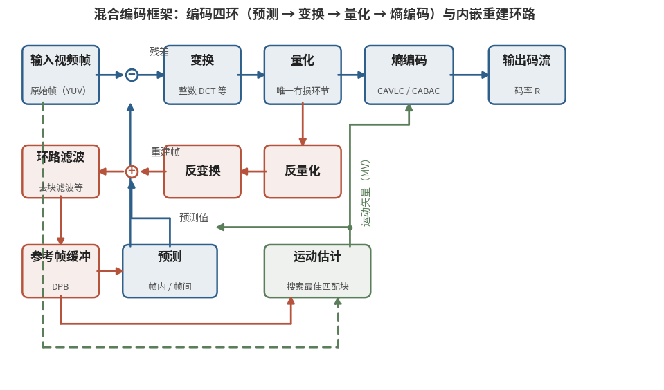

# 6.1.3 编码四环：混合编码框架（The Hybrid Coding Framework）

有了冗余的地图，就可以设计压缩的机器了。从 1990 年的 H.261 到 2020 年的 H.266，所有主流视频编码规格共享同一套顶层架构——**混合编码框架（Hybrid Video Coding Framework）**。所谓 "混合"，是指它把 **预测编码** 与 **变换编码** 两种范式组合使用：预测负责消除帧间与帧内的相关性，变换负责把残余的相关性进一步压实。

框架的核心流程，可以概括为 **编码四环**：

   <b>预测（Prediction）→ 变换（Transform）→ 量化（Quantization）→ 熵编码（Entropy Coding）</b>

四环之外，还有一条保证编解两端基准一致的 **重建环路**，以及为它服务的参考帧缓冲与运动估计。全貌如下图所示：

<figure>
   
    <figcaption>
      
图 6-1 混合编码框架：编码四环与内嵌重建环路（蓝：正向主通路；红：重建环路；绿：运动估计支路）

   </figcaption>
</figure>

下面逐环拆解。

## **第一环：预测（Prediction）**

预测的哲学是 "能猜就不存"。编码器为当前块生成一份 **预测值**，只把真实值与预测值的差——**残差（Residual）**——送往后续环节。猜得越准，残差越小，要存的比特就越少。

预测有两条路线，分别对应 6.1.2 的两类冗余：

- **帧内预测（Intra Prediction）**：利用空间冗余。用同一帧内已编码的相邻像素，沿某个方向外推出当前块。H.264 提供 9 种 4×4 亮度预测方向，到 H.266 已扩展到 65 种角度模式外加若干非方向模式
- **帧间预测（Inter Prediction）**：利用时间冗余。在已编码的 **参考帧** 中为当前块搜索最相似的匹配块，只需记录两者间的位移——**运动矢量（Motion Vector, MV）**。这个搜索过程就是 **运动估计（Motion Estimation）**

这里值得呼应第五章的一项功夫。我们在 **[5.3.2](../../../Chapter_5/Language/cn/Docs_5_3_2.md)** 学过的 **光流**，与运动估计是一对 "近亲"：光流追求逐像素、物理上真实的运动场；而运动估计只为压缩服务——**它找到的匹配块不必是真实运动，只要残差足够小、代价足够低**。目标不同，算法的设计取向自然不同。

## **第二环：变换（Transform）**

残差虽然数值小了，能量却仍然散布在整块像素上。变换的任务是把这份能量 **集中到少数系数上**，为量化与熵编码制造 "稀疏性"。

主角是老朋友——**[3.5](../../../Chapter_3/Language/cn/Docs_3_5.md)** 详细推导过的 **离散余弦变换（DCT）**。二维 DCT 把像素块映射到频域：左上角是直流与低频分量，右下角是高频分量。自然图像的能量天然集中于低频，于是一个残差块经过 DCT 后，往往只有少数左上角的系数显著非零。

工程上还有两个细节值得留意：

- 现代编码器使用 **整数 DCT**（**[3.5.1](../../../Chapter_3/Language/cn/Docs_3_5_1.md)** 的 IDCT）：全程整数运算，编解两端结果严格一致，避免浮点误差累积
- 变换块尺寸从 H.261 的固定 8×8，演进到 H.265 的 4×4~32×32 可变，H.266 甚至允许非正方形——变换的形状在追随内容的形状

## **第三环：量化（Quantization）**

量化是四环中 **唯一有损** 的一环，也是码率控制的总阀门：

$$
F_Q(u, v) = \mathrm{round}\left( \frac{F(u, v)}{Q_{step}} \right)
$$

量化步长 $$Q_{step}$$ 越大，系数被 "抹零" 得越多，码率越低，失真越大。编码器通过调节步长，在 **码率（Rate）** 与 **失真（Distortion）** 之间权衡——这就是 **率失真优化（Rate-Distortion Optimization, RDO）** 的核心问题：

$$
\min \ D \quad \text{s.t.} \quad R \le R_{budget}
$$

6.1.2 说过，量化是有意利用视觉冗余：高频系数对应更粗的量化粒度，因为人眼对高频误差不敏感。

## **第四环：熵编码（Entropy Coding）**

最后一环把量化后的系数、运动矢量、模式标记等一切符号，按统计冗余的原理压成最终比特流。技术路线从哈夫曼式的 **变长编码（VLC）** 演进到 **算术编码（Arithmetic Coding）**：H.264 同时提供 CAVLC 与 CABAC 两种方案，后者的压缩效率高出约一成——6.2.4 会展开。

量化系数的重排也是本环的学问：经过 **Zig-Zag 扫描**，二维系数块按 "从低频到高频" 的顺序拉成一维，大量零值自然连成 **零游程（Run of Zeros）**，游程编码即可高效表示。

## **隐藏角色：编码器里的 "解码器"**

图 6-1 中有一条容易被忽视的回路：量化后的系数会立刻被 **反量化、反变换** 重建回像素，经 **环路滤波（In-loop Filtering）** 后存入 **参考帧缓冲（DPB, Decoded Picture Buffer）**——编码器内部嵌着一个完整的解码器。

为什么要多此一举？因为帧间预测参考的必须是 **解码端真正能看到的那一帧**。如果编码器拿原始帧做参考，而解码端只能看到量化后的重建帧，两端的预测基准就会逐帧偏离，误差像滚雪球一样 **漂移（Drift）**。内嵌重建环路保证了编解两端的参考永远一致——混合编码框架的可靠性，正建立在这个设计之上。

环路滤波则是为画质补救：分块处理会在块边界留下 **块效应（Blocking Artifact）**，去块滤波（Deblocking Filter）在环路内将其抹平，让参考帧更 "干净"，间接提升后续帧的预测效率。

## **帧的类型：I、P、B 与 GOP**

四环框架落地到码流上，体现为三种帧类型：

- **I 帧（Intra-coded Frame）**：只做帧内预测，独立可解。它就是码流的 **随机访问点**——**[5.3.2](../../../Chapter_5/Language/cn/Docs_5_3_2.md)** 的场景切分检测结果，正是编码器放置 I 帧的天然依据
- **P 帧（Predicted Frame）**：前向帧间预测，参考过去的 I/P 帧
- **B 帧（Bi-predicted Frame）**：双向预测，同时参考过去与未来（MPEG-1 引入），压缩效率最高

一个 I 帧到下一个 I 帧之间的帧序列，称为 **GOP（Group of Pictures，图像组）**。GOP 长度是压缩效率与随机访问延迟的权衡：GOP 越长，P/B 帧占比越高，码率越低，但拖动进度条时需要回退解码的距离也越远。

## **小结：一份写了四十年的升级清单**

至此，编码四环的全貌已经清晰。回看 6.1.1 的编年史，每一代规格的演进都可以翻译为四环的升级语言 [\[5\]][ref] [\[6\]][ref] ：

| 环节 | H.261（1990） | H.264（2003） | H.265（2013） | H.266（2020） |
|---|---|---|---|---|
| 预测 | 16×16 帧间、整像素精度 | 4×4~16×16 可变块、1/4 像素、多参考帧 | CTU 四叉树、35 种帧内模式 | 多类型树、67 种帧内模式 |
| 变换 | 固定 8×8 DCT | 4×4/8×8 整数 DCT | 4×4~32×32 + 帧内 DST | 最大 64×64 + 多变换核选择 |
| 量化 | 均匀量化 | 量化矩阵 + 率失真优化 | 更细的 QP 分级 | 依赖量化（DQ）等新机制 |
| 熵编码 | 变长编码（VLC） | CAVLC / CABAC | CABAC | 多核 CABAC |

这张表就是接下来三节（6.2~6.4）的阅读地图：**我们将逐代拆开这份升级清单，看清每一项工具背后的考量**。第一站，自然是把这套框架执行得最彻底、也最长寿的经典——H.264。

[ref]: References_6.md
