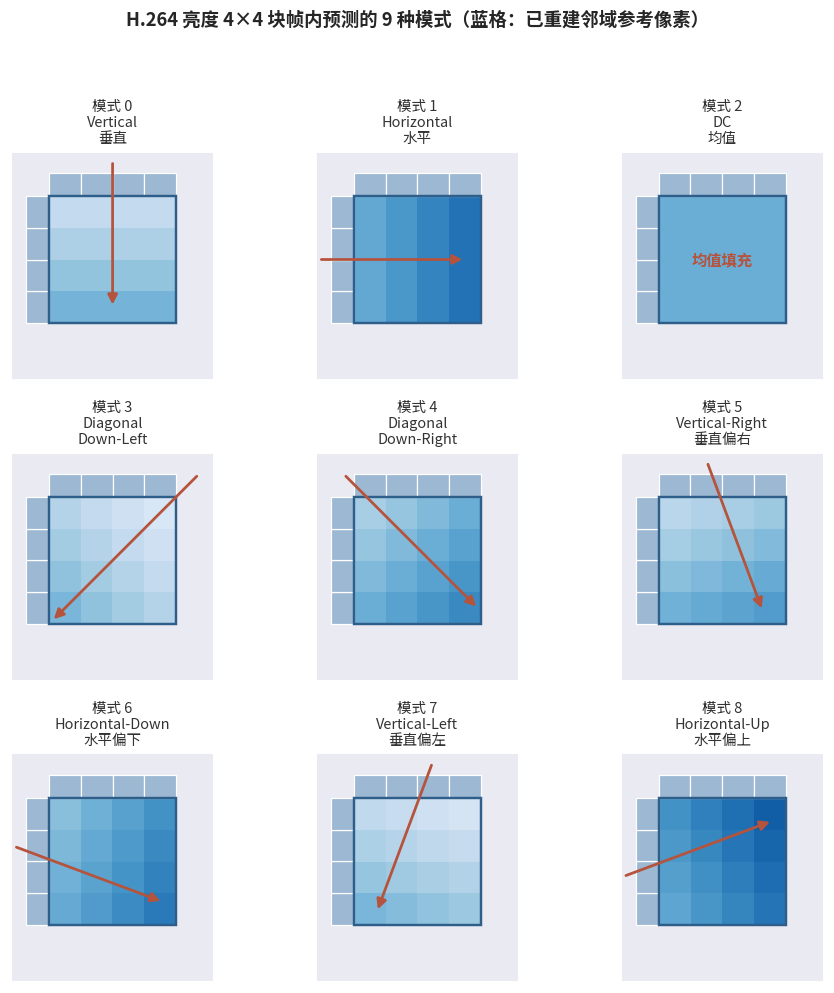

# 6.2.2 帧内预测（Intra Prediction）

## **为什么需要帧内预测**

帧内预测要对付的是 **空间冗余**（6.1.2）：单帧之内，相邻像素彼此相似。它的必要性来自三个场景：

- **I 帧** 没有参考帧可用，只能靠帧内信息编码，随机访问点的压缩效率全靠它
- 即使在 P/B 帧中，也总有 **帧间预测失效** 的块（新出现的物体、遮挡边界），需要帧内模式兜底
- 场景切分后的第一帧（回忆 **[5.3.2](../../../Chapter_5/Language/cn/Docs_5_3_2.md)** 的切点检测）天然是纯帧内编码的战场

帧内预测的思路直白而优雅：**用已经编码重建的邻域像素，沿某个方向 "涂" 进当前块**。编码器只需传送一个模式编号，解码端用同样的邻域像素、同样的规则，就能还原出同一份预测值，预测基准的一致性，正是 6.1.3 重建环路设计在帧内侧的体现。

## **4×4 亮度块：九种模式**

对纹理细腻的亮度分量，H.264 以 **4×4 块** 为粒度提供 **9 种预测模式** [\[5\]][ref] [\[8\]][ref]：

<figure>
   
    <figcaption>
      
图 6-2 H.264 亮度 4×4 块帧内预测的 9 种模式

   </figcaption>
</figure>

- **模式 0/1（垂直/水平）**：把上方一行（或左方一列）参考像素沿直线顺延，对付笔直的边缘与条纹
- **模式 2（DC）**：取全部参考像素的均值填充，对付平坦区域
- **模式 3~8（六个对角方向）**：沿 ±45°、±26.6° 附近的角度外推，对付倾斜纹理

为什么是 26.6°？因为 $$\arctan(1/2) \approx 26.57^{\circ}$$，按 1/2 像素斜率外推，参考像素的选取与插值都可以用简单的移位运算完成。规格的每一处设计，都在效率与实现成本之间精打细算。

## **16×16 亮度块与色度块：四种模式**

对于大面积平坦区域（天空、墙面），4×4 的模式标记开销反而成了浪费。H.264 于是提供整宏块粒度的 **16×16 帧内预测**，只有 4 种模式：**垂直、水平、DC、Plane（平面）**。其中 Plane 模式用左上参考像素拟合一个倾斜平面，对付缓慢变化的亮度渐变（如黄昏的天空）效果极好。

色度分量则统一按 **8×8 块** 使用与 16×16 类似的 4 种模式，呼应 2.6.3 的经验：人眼对色度细节不敏感，工具不必精细。

## **模式决策与编码**

有了 9+4 套候选方案，编码器如何选？答案是 **率失真优化（RDO）**：逐个模式试算 "码率 + λ × 失真" 的代价，取最小者。预测得越准，残差越小，传送残差的比特就越少，模式标记的 3~4 bit 开销，通常远小于省下的残差比特。

模式标记本身的编码也藏着心思：当前块的模式用相邻块的 **最可能模式（Most Probable Mode）** 做预测，相同则只传 1 bit。空间上的相关性，在模式层面又被榨了一遍。

帧内预测解决了 "一帧之内怎么省"，但视频的大头在帧与帧之间。6.2.3 我们就进入 H.264 压缩效率真正的主战场：帧间预测。

[ref]: References_6.md
