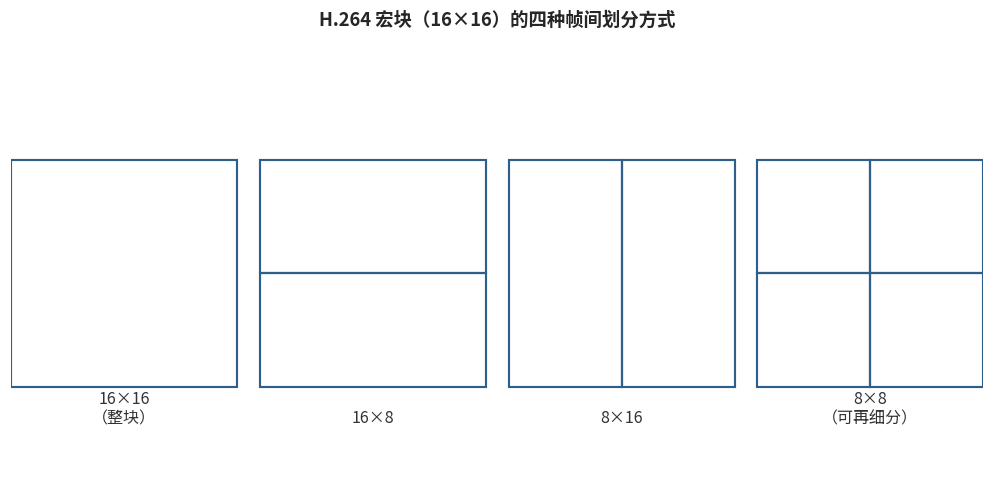

# 6.2.3 帧间预测与运动补偿（Inter Prediction & Motion Compensation）

帧间预测是视频压缩效率的真正主力——时间冗余（6.1.2）的体量远超空间冗余。H.264 在这一环投入了规格中最豪华的工具箱，可以概括为三把利器：**块要切得活、帧要参考得多、位移要量得准**。

## **利器一：树状分块（Tree-structured Partition）**

H.264 仍以 **16×16 宏块（Macroblock）** 为基本单元，但允许每个宏块按运动复杂度灵活拆分 [\[5\]][ref]：

<figure>
   
    <figcaption>
      
图 6-3 H.264 宏块的四种帧间划分方式（8×8 子宏块还可进一步拆为 8×4 / 4×8 / 4×4）

   </figcaption>
</figure>

- 平坦背景整块移动？一个 16×16 块、一个运动矢量就够
- 边缘处有物体交错？拆成 16×8、8×16，直至 8×8
- 8×8 还不够细？每个 **子宏块（Sub-macroblock）** 可再拆为 8×4、4×8 乃至 4×4

每个分块拥有独立的运动矢量与参考帧选择。其设计直觉与 6.2.2 的 4×4/16×16 帧内分档一脉相承：**让块的形状追随内容的运动结构**——静止区域用大省比特，运动边界用小保精度。分块方式与运动信息都由编码器经 RDO 仲裁后写入码流。

## **利器二：多参考帧（Multiple Reference Frames）**

前代规格的 P 帧只能参考紧邻的前一帧，B 帧参考前后各一帧。H.264 把这个限制放开到 **最多 16 个参考帧**，它们存放在 6.1.3 提到的参考帧缓冲（DPB）中，远近任意搭配。

多参考的价值在几类场景立竿见影：

- **周期性运动**（风扇、钟摆、交替字幕）：内容每隔若干帧重现，直接参考 "上一周期" 的那一帧，残差几乎为零
- **遮挡重现**：被短暂遮住的背景重新露出时，可以跳过遮挡帧，参考遮挡前的画面
- **镜头切换回切**：AB 镜头来回切换时，B 镜头帧可直接参考上一次的 B 镜头帧

代价是 DPB 内存与搜索开销——这也是 Level 体系（6.2.5）要约束参考帧数量的原因。

## **利器三：1/4 像素运动补偿（Quarter-pixel Motion Accuracy）**

真实世界的运动几乎从不对齐像素网格。如果运动矢量只能取整像素，预测块就会带着半格误差，残差白白增大。H.264 把运动精度细化到 **1/4 像素**：

- **半像素位置**：用 **6 抽头插值滤波器** $$(1, -5, 20, 20, -5, 1) / 32$$ 从整像素样本内插——相比双线性插值，它能更好地保留高频细节
- **1/4 像素位置**：对相邻的整像素与半像素样本做简单平均得到

亚像素精度的收益相当可观：相比整像素精度，它为 H.264 带来了显著（在低码率下可达两位数百分比）的码率节省 [\[5\]][ref]。这也让编码器在搜索匹配块时的计算量成倍上升——运动估计的搜索策略（全搜索、钻石搜索、六边形搜索……）属于编码器的实现自由，规格只保证解码端能按运动矢量精确取出预测块。

## **运动矢量本身的编码**

运动矢量也要占比特，H.264 对它同样 "能猜就不存"：以左、上、右上三个相邻块运动矢量的 **中值** 作为预测值（Median Predictor），只编码差值 **MVD（Motion Vector Difference）**。若当前块的运动与邻域一致，MVD 为零，熵编码后只需极少的比特。

在此基础上还有两个极端省比特的模式：**Skip（跳跃）模式**——整个宏块连 MVD 与残差都不传，完全沿用推断的运动矢量复制参考块；以及 **加权预测（Weighted Prediction）**——给参考块乘权重加偏移，专门对付淡入淡出（回忆 **[5.3.2](../../../Chapter_5/Language/cn/Docs_5_3_2.md)** 的渐变转场曲线）。

## **与前代的对比**

把三把利器放回 6.2.1 的升级清单，帧间环的代差一目了然：

| 能力 | MPEG-2 | H.264 |
|---|---|---|
| 分块尺寸 | 16×16 | 16×16 ~ 4×4 树状可变 |
| 参考帧数 | 前 1 后 1 | 最多 16，任意组合 |
| 运动精度 | 半像素 | 1/4 像素 |
| 特殊模式 | — | Skip、加权预测、多假设 |

至此，预测的两环已经讲完：猜得准之后，残差该交给变换与量化处理了。下一节，我们走完四环的后半程。

[ref]: References_6.md
