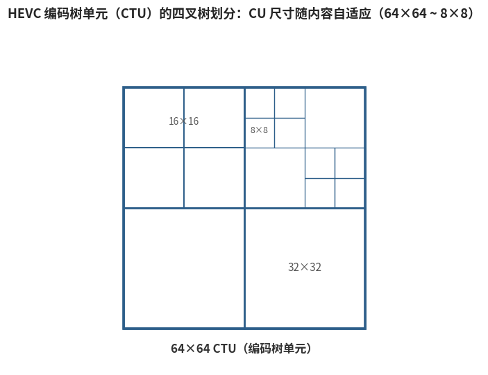

# 6.3.1 编码树单元：CTU 与四叉树划分（Coding Tree Unit & Quadtree）

## **宏块之死**

H.264 的 16×16 宏块，是为标清/高清时代设计的。到了 4K 画面，矛盾显而易见：一片 4K 的蓝天可能有数百个 16×16 宏块，内容却几乎完全一致——逐块传送模式信息，纯属浪费。HEVC 的答案是：**把基本单元放大，并让它可以像树一样递归拆分** [\[6\]][ref]。

宏块（Macroblock）的概念就此终结，取而代之的是 **CTU（Coding Tree Unit，编码树单元）**——尺寸可达 **64×64**（也可由码流声明为 32×32 或 16×16）。一个 CTU 通过 **四叉树（Quadtree）** 递归四等分，拆出尺寸从 64×64 到 8×8 不等的 **CU（Coding Unit，编码单元）**：

<figure>
   
    <figcaption>
      
图 6-4 HEVC 编码树单元（CTU）的四叉树划分示例

   </figcaption>
</figure>

设计直觉仍是 6.2.3 那句 "让块的形状追随内容"，只是尺度上了一个台阶：平坦区域用 64×64 整块表达，模式开销摊薄到最低；纹理复杂区域则逐级细分，直到 8×8。

## **一分为三：CU、PU、TU**

HEVC 比 H.264 走得更远的一步，是把 "编码、预测、变换" 三个维度从宏块这个单一容器里 **解耦** 出来 [\[6\]][ref] [\[9\]][ref]：

- **CU（编码单元）**：决定 **预测方式** 的粒度——这个块是帧内还是帧间？CU 是四叉树划分的叶子
- **PU（预测单元）**：决定 **预测信息** 的粒度。帧间 CU 可进一步划分为 2N×2N、2N×N、N×2N、N×N 的 PU，甚至支持 **非对称划分（AMP）**：2N×nU、2N×nD、nL×2N、nR×2N——运动边界不再必须是直线对半分，斜切的 1:3、3:1 也行。帧内 CU 则只有 2N×2N 与 N×N 两种
- **TU（变换单元）**：决定 **变换** 的粒度。残差四叉树（RQT）从 CU 出发再独立四等分，TU 尺寸可在 4×4~32×32 之间独立于 PU 选择——预测块与变换块终于可以不是同一个形状

三者解耦的意义在于：一个 32×32 的 CU 可以用 2 个 N×2N 的 PU 做运动补偿，同时把残差切成 4 个 16×16 的 TU 做变换——**预测追随运动结构，变换追随残差纹理**，各得其所。回忆 6.2.3：H.264 的分块与变换尺寸是绑定的，HEVC 把这条锁链也解开了。

## **代价：组合爆炸**

自由度的代价向来是复杂度。CTU 四层四叉树 × PU 八种形态 × TU 三层四叉树，编码器要评估的组合数量相比 H.264 暴增——这正是 HEVC 编码器（如 x265）在相同预设下比 x264 慢数倍的原因，也是 6.2.1 那个基本公式的又一次验证：**压缩效率与编码复杂度，从来都是同一枚硬币的两面**。

块结构搭好了台，接下来看预测环唱什么戏。下一节，我们看 HEVC 的预测工具如何进化。

[ref]: References_6.md
