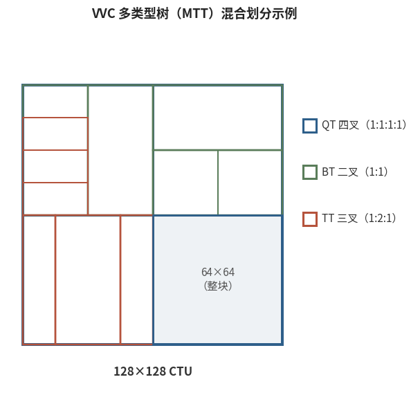

# 6.4.1 VVC：向压缩极限推进（Versatile Video Coding）

## **使命：不止于 "下一代 HEVC"**

2015 年 10 月，JVET（Joint Video Experts Team）成立，启动新一代规格的研究。2020 年 7 月，**H.266/VVC** 正式定稿（MPEG 侧为 MPEG-I Part 3，ISO/IEC 23090-3）[\[10\]][ref]。

它的名字值得玩味——"Versatile"（多功能）而非又一个 "效率"：VVC 的目标场景远不止传统广播电视，还包括 8K 超高清、HDR 高动态范围、360° 全景、屏幕内容等多样态视频。当然，最硬的指标没有变：**同等主观画质下，码率相比 HEVC 再省约 40%~50%** [\[10\]][ref]。

## **块结构：MTT 多类型树**

HEVC 的四叉树只有 "一分为四" 一种切法，遇到细长的运动边界（电线杆、球网）就显得笨拙——只能不断四等分去逼近一条直线。VVC 引入 **MTT（Multi-Type Tree，多类型树）**：四叉树（QT）之后，允许继续用 **二叉树（BT，水平/垂直对半）** 与 **三叉树（TT，水平/垂直 1:2:1）** 混合切分 [\[10\]][ref]：

<figure>
   
    <figcaption>
      
图 6-5 VVC 多类型树（MTT）划分示例：QT/BT/TT 三种切法混合使用，细长区域无需层层四等分

   </figcaption>
</figure>

CTU 尺寸上限也同步放宽到 **128×128**。块的形状对内容的追随，走到了迄今最灵活的程度。

## **预测：更密、更聪明**

- **帧内**：角度模式加密到 **65 种**（加 DC 与 Planar 共 67 种）；新增 **ISP（帧内子划分）** 与 **MIP（基于矩阵的帧内预测）**——后者用离线训练好的矩阵对参考像素做线性变换生成预测块，是机器学习思想正式进入规格的标志性工具
- **帧间**：**仿射运动补偿** 覆盖旋转、缩放等非平移运动；**MMVD**（带距离与方向偏移的 Merge）让候选继承更精细；双向预测的像素级精修交给 **BDOF** 与 **PROF**——正是 **[3.4.2](../../../Chapter_3/Language/cn/Docs_3_4_2.md)** 与 **[3.4.3](../../../Chapter_3/Language/cn/Docs_3_4_3.md)** 完整推导过的双向光流修正与仿射光流修正

## **变换与量化：多核选择与依赖量化**

- **MTS（多变换核选择）**：除经典 DCT-II 外，残差可在 **DST-VII、DCT-VIII** 等变换核间选择，显式标记或隐式推导；变换块最大 64×64（高频置零）
- **LFNST（低频不可分变换）**：对主变换后的低频系数再做一次不可分二次变换——即 **[3.5.3](../../../Chapter_3/Language/cn/Docs_3_5_3.md)** 的主角，把大块的低频相关性再压一遍
- **依赖量化（DQ，Dependent Quantization）**：前后系数的量化取整方向相互关联，等效于在矢量量化空间中更优的格点选择——用极小的解码代价换可观的率失真收益
- **LMCS（亮度映射与色度缩放）**：残差在映射后的亮度域编码，对抗 HDR 内容的非线性——老朋友 **[3.4.4](../../../Chapter_3/Language/cn/Docs_3_4_4.md)** 在此

## **环路滤波：ALF 登场**

VVC 的滤波链变为 **去块滤波 → SAO → ALF（Adaptive Loop Filter，自适应环路滤波）**。ALF 的思想是维纳滤波：编码器离线求解一组 7×7（亮度）/5×5（色度）的滤波器系数，使重建帧与原图的均方误差最小，系数按块分类自适应并写入码流——用线性滤波器对整帧做最后的 "精修"。色度还可借用亮度信息的 **CCALF（跨分量 ALF）**。

## **代价与现状**

效率登顶的代价延续了那条铁律：VVC 参考编码器（VTM）的编码复杂度是 HEVC 参考编码器（HM）的数倍，优化实现（VVenC/VVdeC）仍在追赶生态。叠加 6.4.3 将要谈的授权格局，VVC 的产业渗透至今仍在爬坡——这恰好给了下一位选手留出舞台。

[ref]: References_6.md
