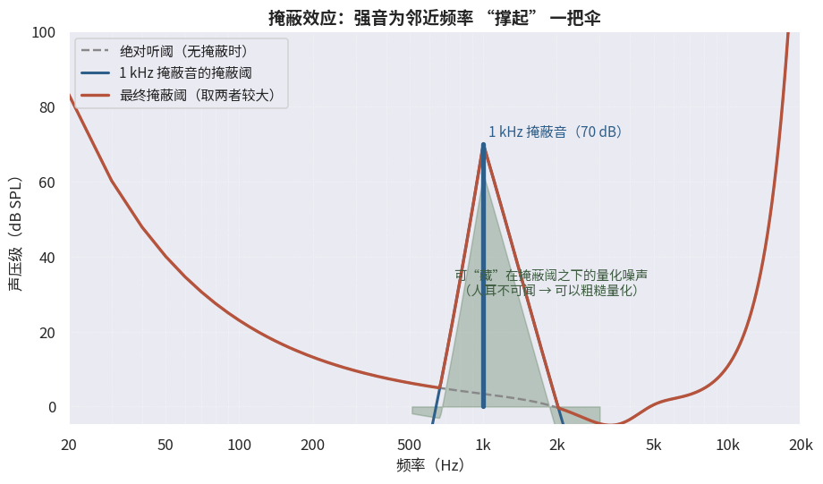

# 6.5.1 心理声学：音频压缩的地基（Psychoacoustics）

## **从等响曲线到掩蔽效应**

第一章的 **[1.4.3](../../../Chapter_1/Language/cn/Docs_1_4_3.md)** 中，等响曲线已经揭示过人耳的第一个局限：灵敏度随频率剧烈起伏——对 2~5 kHz 最敏锐，对极低频与极高频迟钝，20 Hz 与 20 kHz 之外更是直接 "失聪"。只凭这一点，音频编码就能扔掉一批听不见的成分。

但心理声学真正的王牌是 **掩蔽效应（Masking Effect）**：一个强音的存在，会抬高其邻近频率、邻近时刻的可闻阈值——**伞下的弱音，人耳根本听不见**。

<figure>
   
    <figcaption>
      
图 6-6 掩蔽效应示意：1 kHz 强音为邻近频率撑起一把 "伞"，伞下的量化噪声人耳不可闻

   </figcaption>
</figure>

掩蔽在两个维度上发生：

- **频域掩蔽（Simultaneous Masking）**：与强音同时出现的邻近频率弱音被掩蔽。掩蔽曲线呈不对称的 "帐篷"——低频侧陡峭（约 27 dB/Bark），高频侧平缓（约 -15 dB/Bark），即 **向上掩蔽远、向下掩蔽近**
- **时域掩蔽（Temporal Masking）**：强音出现 **之前** 的一瞬（前掩蔽，数毫秒量级）与 **之后** 的一段时间（后掩蔽，可达上百毫秒），听觉灵敏度都会下降——后掩蔽远长于前掩蔽

频率轴上的掩蔽还以 **临界频带（Critical Band）** 为单位组织：人耳的听觉滤波器组带宽随频率变化（低频窄、高频宽），同一临界频带内的强弱音才会互相掩蔽。

## **把噪声藏进伞下：感知编码的总纲**

掩蔽效应给编码器指了一条 "作弊" 之路 [\[12\]][ref]：

   <b>量化噪声不必消除，只要藏在掩蔽阈之下，人耳就无从察觉</b>

这就是 **感知音频编码（Perceptual Audio Coding）** 的总纲，与 6.1.2 的视觉冗余一脉相承，只是执行得更彻底。其标准工作流程为：

1. **分析滤波器组**：把 PCM 信号分解到一组频带（子带或 MDCT 谱线）——回忆 **[5.2.2](../../../Chapter_5/Language/cn/Docs_5_2_2.md)** 的频域分析，这里做的是同一件事，只是为压缩服务
2. **心理声学模型**：对每帧计算各频带的掩蔽阈（综合绝对听阈、频域与时域掩蔽）
3. **比特分配**：把可用比特优先分给 "掩蔽阈低、信号强" 的频带（需要精细量化），少分乃至不分配给 "掩蔽阈高" 的频带（噪声自然被掩蔽）
4. **量化与熵编码**：按分配的比特量量化各频带谱值，再做无损压缩

衡量每帧压缩质量的标尺是 **SMR（Signal-to-Mask Ratio，信号掩蔽比）**：信号能量与掩蔽阈的差值。SMR 越大的频带，量化信噪比就得越高——比特随感知价值流动。

## **与视频四环的对照**

音频感知编码与视频混合编码是同一哲学的两个方言：

| 环节 | 视频 | 音频 |
|---|---|---|
| 冗余利用 | 空间/时间/统计/视觉 | 统计/听觉（心理声学） |
| 变换 | 整数 DCT | 子带滤波器组 / MDCT |
| 有损环节 | 量化（按 QP） | 量化（按心理声学模型分配比特） |
| 熵编码 | CAVLC/CABAC | Huffman / 算术编码 |

有了总纲，接下来三节的规格史就是它的三次工程实现。第一位主角，是把数字音乐带进千家万户的 MP3。

[ref]: References_6.md
