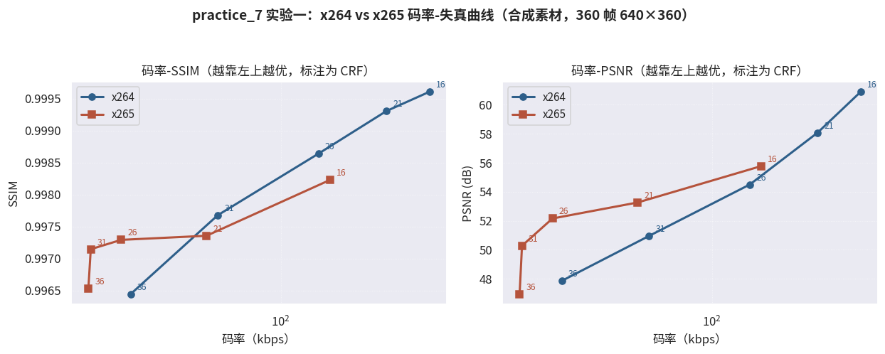
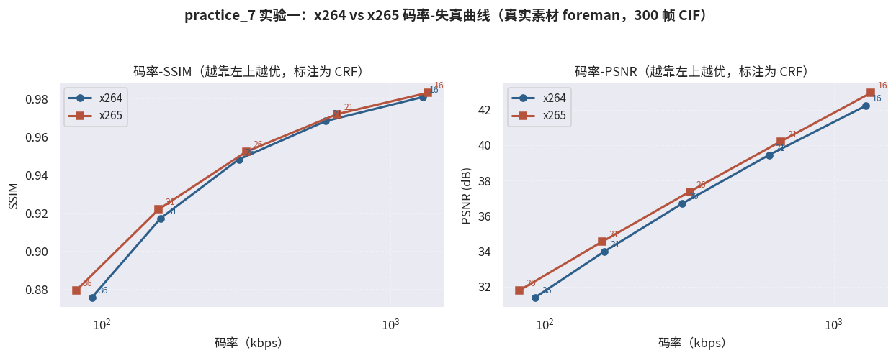
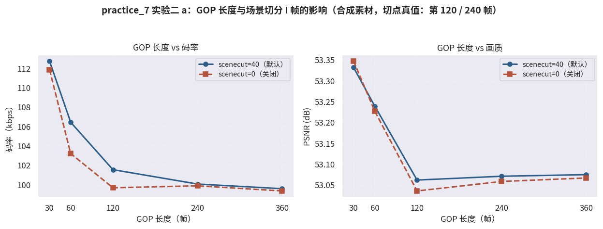
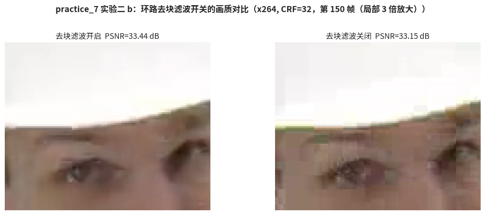

# 6.6 实战：编码器规格对比实验（practice_7）

理论清单已经足够长：四环框架、逐代升级、率失真权衡。本节让数据说话，把 **x264** 与 **x265** 这两台真实的编码器请上擂台，在双份素材上实测码率-失真表现，并对 GOP 与环路滤波做消融实验。6.2~6.4 讲过的每一项设计，都将在曲线中留下指纹。

## **任务定义与素材**

实验分两组，分别对应本章的两条主线：

- **实验一（规格对比）**：同一素材、多档 CRF 扫点，绘制 x264/x265 的 **码率-失真曲线（RD Curve）**，验证 6.3.3 的 "码率减半" 总账
- **实验二（环节消融）**：固定编码器（x264），分别消融 **GOP 长度 × 场景切分 I 帧**（回收 **[5.3.2](../../../Chapter_5/Language/cn/Docs_5_3_2.md)** 的切点检测）与 **环路去块滤波**（回收 6.2.4），观察单一环节对结果的影响

素材采用 "合成 + 真实" 双份，结论互相印证：

- **<a href="../../../Chapter_5/Examples/practice_5_test_video.mp4" target="_blank">practice_5_test_video.mp4</a>**：第五章合成的三场景测试视频（640×360 / 30 fps / 360 帧），切点真值已知（第 120、240 帧）
- **foreman_cif.y4m**：Xiph 公开标准测试序列 [\[15\]][ref]（CIF 352×288 / 300 帧），真实摄像机素材，人脸、工地机械、手持晃动俱全，是编码器评测的行业通行基准

## **工程实现**

创建自动化脚本 **<a href="../../Examples/practice_7_encoder_comparison.py" target="_blank">practice_7_encoder_comparison.py</a>**。工具链与第五章一脉相承，只是把 "分析帧" 换成了 "编码帧"：ffmpeg（libx264/libx265）负责编码，ffmpeg 内置的 `ssim`/`psnr` 滤镜负责质量度量，Matplotlib 负责绘图。

核心流程相当直白，编码、测量、绘图三段式：

```bash
# 编码：libx264/libx265，CRF 扫点，preset=medium
ffmpeg -i <素材> -c:v libx264 -crf 26 -preset medium -an out.mp4

# 质量度量：编码结果与源素材逐帧比对
ffmpeg -i out.mp4 -i <素材> -lavfi "[0:v][1:v]ssim;[0:v][1:v]psnr" -f null -
```

脚本支持分实验运行：`python practice_7_encoder_comparison.py [exp1|exp2a|exp2b|all]`。

## **实验一：RD 曲线，CRF 不可直接对比**

CRF 从 16 到 36 扫五档，双素材的实测结果如下（完整数据见 Pictures/practice_7_results.json）：

| 素材 | 编码器 | CRF=21 | CRF=26 | CRF=31 | CRF=36 |
|---|---|---|---|---|---|
| 合成 | x264 | 231.5 kbps / 58.08 dB | 135.1 / 54.50 | 60.7 / 50.96 | 30.4 / 47.86 |
| 合成 | x265 | 55.5 kbps / 53.26 | 28.2 / 52.16 | 22.1 / 50.28 | 21.7 / 46.95 |
| foreman | x264 | 597.5 kbps / 39.44 dB | 298.8 / 36.70 | 160.2 / 33.98 | 92.7 / 31.40 |
| foreman | x265 | 655.6 kbps / 40.21 | 317.4 / 37.37 | 157.9 / 34.54 | 81.8 / 31.80 |

<center>
<figure>
   
    <figcaption>
      <p>图 6-7 码率-失真曲线（合成素材）：横轴对数刻度，曲线越靠左上越优</p>
   </figcaption>
</figure>
</center>

<center>
<figure>
   
    <figcaption>
      <p>图 6-8 码率-失真曲线（真实素材 foreman）：x265 曲线全程位于 x264 左上</p>
   </figcaption>
</figure>
</center>

三组数据教给我们三件事。

**第一，同名 CRF 不可直接比较。** 合成素材上，同为 CRF=21，x264 产出 231.5 kbps，x265 只有 55.5 kbps，CRF 只是各自编码器内部的质量标尺，跨编码器没有可比性。**编码器对比必须画在 RD 曲线上看**，单点对单点是最常见的业余错误。

**第二，x265 的 RD 曲线整体占优，但优势幅度因素材而异。** 真实素材上（图 6-8），x265 曲线全程位于 x264 左上：同为 300 kbps 上下，PSNR 高约 0.7 dB；同为 CRF=36，码率省约 12% 且画质更高。但这是 CIF 分辨率、10 秒短片段的实测，6.3.3 引用的 "40%~50%" 是 4K 长时测试的官方口径 [\[6\]][ref]。分辨率越高、平坦区域越多，HEVC 大块结构（6.3.1）的摊薄效应越充分。**规格的代差优势，是会随内容缩放的**。

**第三，极高画质端出现交叉。** 合成素材上（图 6-7），追求极致保真（PSNR > 55 dB）时 x264 反而贴源更近，x265 默认的更强平滑在高保真区间会多丢一点细节。RD 曲线的形态，本身就是编码器设计取向的画像。

## **实验二 a：GOP 长度与场景切分 I 帧**

固定 x264、CRF=28，GOP 长度从 30 扫到 360，并对比场景切分检测（scenecut）开关：

<center>
<figure>
   
    <figcaption>
      <p>图 6-9 GOP 长度与场景切分 I 帧的影响（合成素材，切点真值第 120 / 240 帧）</p>
   </figcaption>
</figure>
</center>

数据给出了清晰的收益曲线与一条诚实的注解：

- **GOP 30 → 120，码率下降约 11%**（112.7 → 101.5 kbps）：I 帧昂贵（纯帧内编码），减少 I 帧占比立竿见影；**120 之后边际收益趋零**，P 帧链越长，残差累积与漂移控制的负担越重，编码器自己也会 "撑不住"
- **scenecut 的代价与价值都不大**：开启后短 GOP 下码率略增 1%~3%（切点处多两个 I 帧），全局 PSNR 几乎不变。这份 "平淡" 需要正确解读：合成素材的三个场景都极为简单，切后画面用 P 帧也能廉价表达；场景切分 I 帧真正的价值是 **结构性的**，随机访问点、错误恢复锚点，以及真实素材上防止切后画质塌陷。它在码率表上省不出风头，却是每一部可拖动进度条的视频的幕后功臣

## **实验二 b：去块滤波消融**

固定 x264、CRF=32，对真实素材（foreman）开关环路去块滤波：

| 设置 | 码率 | SSIM | PSNR |
|---|---|---|---|
| 去块滤波开启 | 143.2 kbps | 0.9097 | 33.44 dB |
| 去块滤波关闭 | 145.2 kbps | 0.9033 | 33.15 dB |

<center>
<figure>
   
    <figcaption>
      <p>图 6-10 去块滤波开关对比（第 150 帧局部 3 倍放大）：关闭时块边界断层清晰可见</p>
   </figcaption>
</figure>
</center>

真实素材上的结果干净利落：开启去块滤波 **同时** 带来更低的码率（143.2 < 145.2 kbps）、更高的 SSIM 与 PSNR，参考帧更干净，后续帧预测更准，6.2.4 所说的 "一举多得" 被数据完整兑现。放大图中（图 6-10 右），关闭滤波后头盔边缘与人脸区域的块边界断层肉眼可见；开启后（左）则过渡自然。值得一提的花絮：同一实验在平坦的合成素材上 PSNR 反而微降，滤波会磨掉一点高频细节，而合成素材本无块效应可修。**滤波器修的是病，没病时它也是药三分毒。**

三组实验合起来，构成了对全章理论的一次实测巡检：RD 曲线验证了规格代差（6.2~6.4），GOP 消融验证了帧组织方式（6.1.3），去块消融验证了环路滤波（6.2.4）。编码器不再是黑盒，它的每个旋钮背后，都是我们亲手拆过的原理。

**在线演示（见【[在线展示](Playground_6.md)】页）** 备好了本章的交互版本：DCT 变换与量化演示器。任选一块 8×8 纹理，拖动量化步长滑块，就能亲眼看着高频系数一个个归零、PSNR 一路下滑，6.1.3 那句 "量化是四环中唯一有损的环节"，亲手拖一遍就懂了。

[ref]: References_6.md
