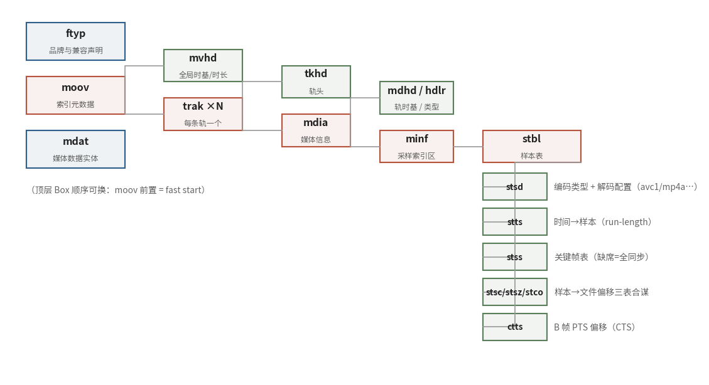

# 7.1.2 MP4：为随机访问而生的索引树（MP4 & The Index Tree）

上一节的四个困境里，MP4 对 "索引" 这一题给出了教科书级的答案。我们日常见到的 `.mp4` 文件，规范血统可以追溯到两条线：Apple 在 2001 年公开的 **QuickTime 文件格式（QTFF）** [\[4\]][ref]，以及以此为母体演进而来的国际标准 **ISO BMFF（ISO/IEC 14496-12）**——后者正是 MP4、3GP、CMAF 乃至 fMP4 的共同底座 [\[5\]][ref]。两份文档的术语几乎一一对应（QTFF 叫 Atom，ISO BMFF 叫 Box），下文统称为 Box。

## **Box 通用头：八个字节打天下**

MP4 文件在物理上就是一串首尾相接的 Box，每个 Box 的头部长这样：

<b>size（32 bit） + type（32 bit，四字符代码 fourcc）</b>

`size` 计入头部自身，`type` 是可读的四字符标识（`'moov'`、`'mdat'`……）。仅靠这两条字段，格式就拿到了三个漂亮的性质：

- **size = 1**：真实长度放不下 32 bit，头部后随一个 64 bit 的 extended size——4 GB 以上的大文件由此而来
- **size = 0**：仅顶层 Box 允许，表示 "从这里一直到文件末尾"
- **遇到不认识的 type？按 size 整体跳过即可**——新字段可以加、旧软件不崩溃，前向兼容性就藏在这句轻描淡写里

顺带辟一个经典误会：mdat 前面常见一个 8 字节的 `'wide'` 占位 Box，它 **没有任何内容**，纯粹是预留的空位——日后若想把 32 位尺寸扩成 64 位，直接占掉这个位置改写即可，不必挪动后面几 GB 的媒体数据。QTFF 规范专门澄清过：wide 里并不装 extended size [\[4\]][ref]。

## **顶层结构：索引与数据分家**

一个典型 MP4 的顶层只有三四个 Box：

<b>ftyp（品牌声明） → moov（索引） + mdat（媒体数据），free/skip 填空</b>

`ftyp` 声明文件的主品牌与兼容品牌列表——它是 ISO BMFF 时代才引入的，QTFF 2001 里并没有，引用出处时别张冠李戴 [\[5\]][ref]。`mdat` 装的是全部音视频样本数据本体，通常是文件里体积的绝对主角；`moov` 则是全部的元数据与索引——**播放一个 MP4，本质上就是先读懂 moov，再按图索骥去 mdat 里取数**。

moov 的位置因此成了一个真实的工程决策：放在文件头部（**fast start**），播放器下载到开头就能开播；放在尾部，则要等文件基本下载完才知道里面是什么。转码工具里的 "moov 前置" 选项，说的就是这件事。

## **moov 子树与 stbl 五表**

moov 内部是一棵层级分明的树：

<b>moov → mvhd → trak → tkhd / mdia → mdhd / hdlr → minf → stbl</b>

`mvhd` 登记全文件的时间基准（timescale）与总时长；每条 `trak` 是一路轨（视频轨、音频轨、字幕轨……），`mdhd` 给出该轨自己的 timescale，`hdlr` 标明轨的类型（`'vide'` / `'soun'`）。树的末梢 `stbl`（sample table）才是索引的真正所在——**五张表合谋，回答 "某时刻的某个样本在文件哪里" 这一个问题**：

| 表 | 职责 | 关键性质 |
|---|---|---|
| stsd | sample description：编码类型（avc1/mp4a）与解码配置（avcC/esds） | 自描述职责的落点 |
| stts | time-to-sample：解码时间 → 样本序号的映射 | run-length 压缩存储，delta 非负 |
| stss | sync sample：关键帧序号表 | **可选；缺席 = 全部样本皆关键帧** |
| stsc + stsz + stco | 样本 → chunk → 文件偏移的定位链 | 三表缺一不可 |
| ctts | composition time offset：B 帧的 PTS 补偿 | PTS = DTS + CTS，ISO BMFF 引入 |

<figure>
   
    <figcaption>
      
图 7-1 MP4 的 Box 树：顶层 ftyp/moov/mdat 分家，stbl 五表构成索引脊柱（蓝：容器骨架；绿：索引五表）

   </figcaption>
</figure>

几张表里有两处值得停下来细看。**stts** 用 "多少个连续样本共享同一时长" 的游程编码，把解码时间轴压成寥寥数行——规则帧率的视频，整张表可能只有一条记录；**stss** 的缺席语义尤其容易讲反：它是一张 "可选" 表，**不在场时意味着所有样本都可以独立解码**（比如全 I 帧的素材），而非 "没有关键帧" [\[4\]][ref]。至于 B 帧带来的显示顺序问题，ISO BMFF 用 ctts 给每个样本补一个偏移量，**PTS = DTS + CTS**——我们在 **[5.3.1](../../../Chapter_5/Language/cn/Docs_5_3_1.md)** 建立的时间戳概念，在这里落到了具体的字段上。

## **串一遍 seek：五表如何接力**

把五张表串起来，一次拖动进度条的完整旅程是这样的：目标时刻 → 查 **stts** 找到该时刻附近的样本序号 → 查 **stss** 向前回退到最近的关键帧 → 查 **stsc** 确定样本住在哪个 chunk → 查 **stco**（或 64 位的 co64）拿到 chunk 的文件偏移 → 查 **stsz** 取出样本精确长度。五次查表，全是 O（表长） 的内存操作，一次磁盘寻道到位——这正是 7.1.1 里 "索引职责" 的完全体形态。

最后埋一个伏笔：moov 集中索引的设计对 "文件完整在手" 的点播场景近乎完美，可一旦要边生产边消费（直播），集中索引就成了绊脚石——索引都还没写完，怎么给你查？fMP4 的答案是 **把索引拆散**：`moof + mdat` 分片对，每片自带索引（traf/trun），moov 退化为一份只含初始化的 "说明书"。这个改造是 DASH 与 LL-HLS 的物理基础，7.4 节我们会亲眼看到它的字节形态。

MP4 把索引做到了极致，代价是结构复杂、头部笨重。下一种容器 FLV 走向了另一个极端：把结构削到不能再简，只为一件事服务——顺着网络流下去。

[ref]: References_7.md
