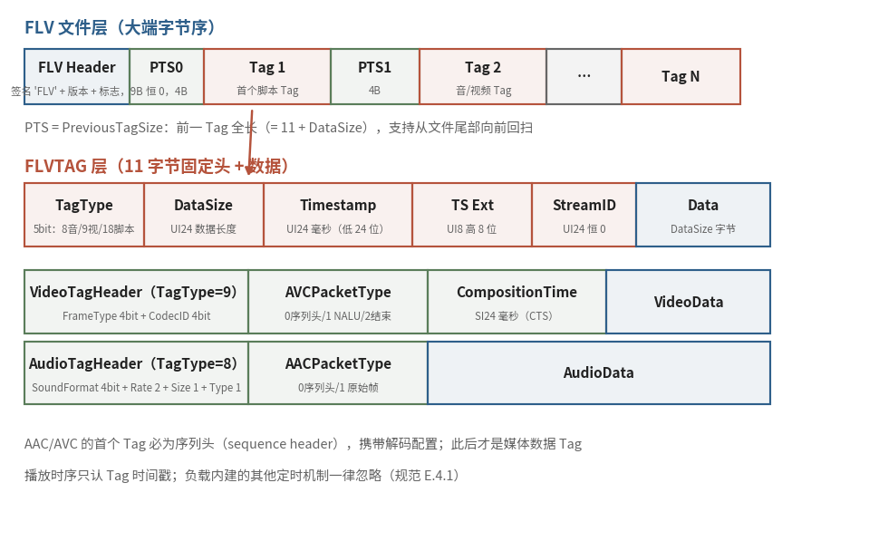

# 7.1.3 FLV：为流式传输而生的标签序列（FLV & The Tag Stream）

MP4 把索引做到了极致，代价是结构复杂、头部笨重，一个 moov 子树十几层嵌套，显然不是为 "边收边播" 准备的。FLV 走向了另一个极端。这个随 Flash 平台而生的格式，公开规范停在 2010 年的 v10.1 [\[2\]][ref]，设计上把 "简单" 二字贯彻到了每个字节：**整个文件就是一条从头到尾的标签（Tag）序列，没有树，没有表，没有集中索引**。Flash 虽已谢幕，FLV 却远未退场，它是 RTMP 协议的母语容器（7.3 节的主角），直到今天，你仍然能在不少直播平台的拉流地址里看到 `.flv` 后缀。

## **文件级：九个字节的见面礼**

FLV 文件的头部只有 9 个字节：

<b>签名 'F' 'L' 'V' + Version（0x01） + TypeFlags（音/视频存在位） + DataOffset（= 9）</b>

这里埋着一个经典陷阱：**FLV 通体大端字节序，与它的娘家 SWF 恰好相反**。规范在 E.1 节特意举例叮嘱：数值 300（0x12C）在 SWF 里存成 `2C 01`，在 FLV 里存成 `01 2C` [\[2\]][ref]，从 Flash 生态的其他格式转战 FLV 的解析器，十之八九都在这儿栽过跟头。

## **Tag 流与回退链**

9 字节头之后，文件体就是一条单向的 Tag 流水线：

<b>PreviousTagSize0（恒 0） → Tag1 → PreviousTagSize1 → Tag2 → …</b>

每个 PreviousTagSize 记录前一个 Tag 的全长（含 11 字节 Tag 头）。这个看似冗余的字段给出一个实用能力：**从文件中任意位置，都可以向前回退着遍历**，顺序消费是 FLV 的主航道，回退链则是它给 "索引职责" 交出的一半答卷（7.1.1 的伏笔在此回收）。7.3 节我们还会再见它一次：RTMP 的 Aggregate Message 里，同样的 Back Pointer 结构原样出现，文件格式与传输协议本是同根生。

每个 Tag 顶着一个 11 字节头：

| 字段 | 位宽 | 含义 |
|---|---|---|
| TagType | 5 bit | 8 = 音频 / 9 = 视频 / 18 = Script 数据 |
| DataSize | 24 bit | Tag 数据区长度（全长 − 11） |
| Timestamp | 24 + 8 bit | 毫秒时间戳（低 24 位 + 扩展高 8 位） |
| StreamID | 24 bit | 恒为 0 |

时间基准一目了然：毫秒级绝对时间戳，首 Tag 恒为 0。规范还补了一条霸道的注脚：**播放时序只认 FLV 时间戳，负载内建的任何定时机制一律忽略** [\[2\]][ref]，同步职责在 FLV 里被压缩成这 32 个比特，多一个都不要。

## **三类 Tag：各管一段**

TagType 只有三个取值，对应三路数据，而 FLV 文件 **至多容纳一路音频加一路视频**，复用职责同样被削到极简：

**Script 数据（18）**：AMF0 编码的 ECMA 数组，第一个通常就是 `onMetaData`，时长、分辨率、码率、帧率全在这张键值表里。自描述职责的落点。先记住它的样子：7.6 节抓包时，我们会在 RTMP 通道里活捉一条 308 字节的同款 `@setDataFrame`，文件里叫 Script Tag，协议里叫 Data 消息，内容一模一样。

**音频（8）**：头一个字节高 4 位是 SoundFormat（2 = MP3，**10 = AAC**）。AAC 有个特例：规范里的采样率、声道数字段会被播放器忽略（惯例填 44.1 kHz 立体声），真实参数以 **AAC 序列头（AudioSpecificConfig）** 为准，它由 AACPacketType = 0 的 sequence header Tag 单独运送，随后的 raw Tag（type = 1）就只装纯数据了。

**视频（9）**：头一个字节拆成 FrameType（1 = 关键帧，AVC 下可 seek）与 CodecID（**7 = AVC**）各 4 位。AVC 同样走 "先送配置、再流数据" 的两段式：AVCPacketType = 0 的 sequence header 先行，NALU 数据随后。B 帧的显示补偿则交给 24 位有符号的 **CompositionTime**，单位毫秒，与 MP4 的 ctts 异曲同工：播放器把 Tag 时间戳加上 CTS，就得到了显示时刻 [\[2\]][ref]。

<figure>
   
    <figcaption>
      
图 7-2 FLV 的三层拆解：9 字节文件头 → Tag 流 + PreviousTagSize 回退链 → 三类 Tag 的头部字段（蓝：文件层与数据区；红：Tag 头字段；绿：音/视频 TagHeader 特例字段）

   </figcaption>
</figure>

## **简到极致，也留了一道天花板**

把三类 Tag 的头部字段摊开看，FLV 的取舍清晰可见：字节数能省则省（DataSize 24 位、时间戳 24+8 位），类型号能少则少（TagType 5 位、CodecID 仅 4 位）。极简换来了极低的解析成本，顺序读、顺序播，十几行代码就能写一个 demuxer，而这恰是流式传输场景最看重的品质。

但 4 位的 CodecID 也封死了它的未来：7 = AVC 已经用到顶，**H.265、AV1 根本无处安放**。业界后来的解法是在保持 Tag 结构不变的前提下，把 CodecID 扩成 FourCC，enhanced-RTMP 规范（v2，2024）做的正是这件事 [\[6\]][ref]，7.3 与 7.5 节我们还会提到它。

FLV 用一条 Tag 流回答了流式传输，但它的前提依然是 "数据按序到达、完好无损"。如果信道本身会丢包、会出错、观众随时从半途切入（比如无线电波里的电视广播）又该怎么办？MPEG-TS 给出的第三种答案，连 "文件" 这个概念都一并扔掉了。

[ref]: References_7.md
