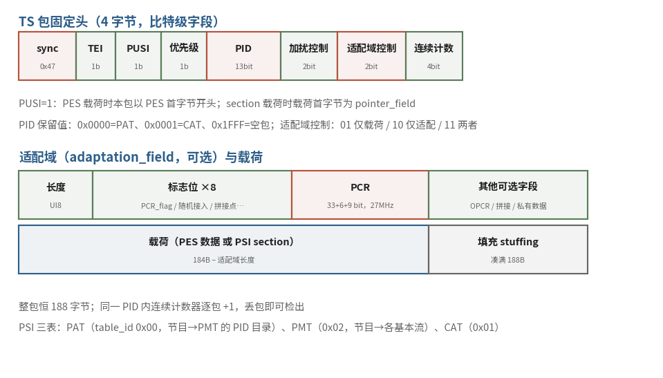

# 7.1.4 MPEG-TS：为容错传输而生的定长包（MPEG-TS & The Fixed-Length Packets）

FLV 的 Tag 流有一个隐秘的前提：数据按序到达、完好无损。这在磁盘与 TCP 上成立，换一条信道就不一定了，电视广播走的是无线电波，**一次发出、无法重来**，误码丢包是家常便饭；观众还随时可能在任意时刻打开电视，要求"从半途立刻看懂"。MPEG-TS（Transport Stream，规范本体是 ITU-T H.222.0，与 ISO/IEC 13818-1 双生 [\[3\]][ref]）就是为这样的信道准备的：它的答案激进到底，**连 "文件" 的概念都扔掉，整条流由 188 字节的定长小包首尾相接而成**。

## **为什么是定长：同步、检丢与随时切入**

定长是 TS 一切容错能力的物理基础。每个包以同步字节 **0x47** 开头：接收端一旦与流失去对齐，不必求助于任何外部信息，只要在字节流里找到 0x47，再验证其后每隔 188 字节仍是 0x47，连续命中几个即可宣告重新同步，**从流的任意位置切入，都能在几个包的代价内恢复解析**。188 这个数的来历（184 字节载荷 + 4 字节头；以及它与早年 ATM 信元、RS(204,188) 纠错码的历史渊源）在业界流传甚广，规范本身并未着墨，当作背景故事听即可 [\[3\]][ref]。

定长之外，4 字节固定头里还藏着两件容错利器：

| 字段 | 位宽 | 职责 |
|---|---|---|
| sync_byte | 8 bit | 恒 0x47，重同步的锚点 |
| transport_error_indicator | 1 bit | 标记本包有误；置 1 后不得自行清 0，除非错误已被纠正 |
| payload_unit_start_indicator（PUSI） | 1 bit | 本包是否以 PES/section 的起点开头 |
| PID | 13 bit | 包的 "门牌号"，复用与寻址的核心 |
| transport_scrambling_control | 2 bit | 加扰标记；头部与适配域永不加扰 |
| adaptation_field_control | 2 bit | 01 仅载荷 / 10 仅适配域 / 11 两者皆有 |
| continuity_counter | 4 bit | 同一 PID 内逐包 +1，丢包即刻检出 |

**continuity_counter** 尤其值得记住：同一个 PID 的包流里，计数器连续跳号就说明中间丢了包，不需要任何上层协议，接收端单看包头就能感知传输质量。抓包分析时，它往往是你最先检查的字段。

## **PID 与 PSI：多节目复用的寻址系统**

FLV 至多装一音一视，TS 却能同时携带几十路节目，靠的就是 13 位的 **PID（Packet Identifier）**。每个包只回答一个问题："我属于哪条流"，答案就是 PID。其中几个门牌被规范永久预留 [\[3\]][ref]：

<b>0x0000 = PAT　0x0001 = CAT　0x1FFF = 空包（填充码率用）</b>

新切入的接收端按一条固定的寻宝路线建立全景：先守 **PAT**（Program Association Table，table_id 0x00），它是全流的节目目录，登记每个节目号对应的 PMT 的 PID；再按图索骥找到 **PMT**（Program Map Table，table_id 0x02），它列出该节目的全部基本流：每一路的 stream_type（**0x1B = H.264、0x24 = H.265、0x0F = AAC**）与 elementary_PID，外加该节目参考时钟所在的 PCR_PID。两张表都带版本号与 CRC_32 校验，且发送端会周期性地反复广播，**随时开机、随时补齐**，这是广播场景 "无请求-响应" 假设下的必然设计。

## **适配域与 PCR：把发送端的钟搬过来**

适配域（adaptation_field）是 TS 包里的 "可选附件舱"，由 adaptation_field_control 宣告存在。它的常客是 **PCR（Program Clock Reference）**：33 位基准 + 6 位保留 + 9 位扩展，合计对 **27 MHz** 系统时钟采样，基准部分走 90 kHz，扩展部分再细分 300 倍 [\[3\]][ref]。接收端用 PCR 锁相本地时钟，音视频的全部 PTS/DTS 都挂在这口被 "搬运" 过来的钟上，广播信道没有双向协商，发送端只能把自己的时钟随包寄出。适配域里另一个实用标志是 random_access_indicator：标记随机接入点，抓包时找关键帧位置可以先筛它。

## **PES：定长包里的变长内容**

TS 包定长，装载的内容却变长，这个矛盾由 **PES（Packetized Elementary Stream）** 调和。一帧视频或一段音频先打成一个 PES 包：`0x000001` 前缀 + stream_id + 长度字段（视频流允许写 0，表示不限长），可选头里携带各 33 位的 **PTS 与 DTS**（90 kHz 基准），**[5.3.1](../../../Chapter_5/Language/cn/Docs_5_3_1.md)** 的时间戳概念，在广播世界的落点就在这两个字段上。PES 包再被切成若干段，顺次装进一串同 PID 的 TS 包，PUSI 在首个分段置 1。顺带排一条流传甚广的讹误："PES 最大 64 KB" 在规范里并无硬性上限（长度字段为 0 即不限长），本书不采用这个说法 [\[3\]][ref]。

<figure>
   
    <figcaption>
      
图 7-3 TS 包的解剖：4 字节固定头（含 sync/PID/连续计数器）+ 可选适配域（PCR 所在）+ 载荷与填充，整包恒 188 字节（红：固定头与 PCR；绿：适配域；蓝：载荷与填充）

   </figcaption>
</figure>

回看 TS 的设计：定长包换来任意点重同步，continuity_counter 换来丢包自检，PSI 周期重播换来随时切入，PCR 换来单向信道下的时钟对齐，**每一处冗余都是在替 "无法重传" 还债**。代价也明明白白：188 字节里最多 4+ 字节的头部开销（空包、填充、周期 PSI 还没算），复用越灵活、冗余越可观。三种容器至此全部登场。7.1.5 我们把它们摆上同一张桌子，看看场景是如何一寸寸塑造格式的。

[ref]: References_7.md
