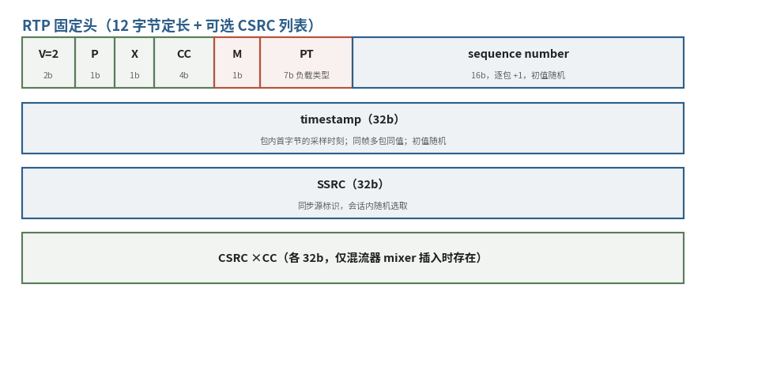

# 7.2.2 RTP 固定头：十二字节的自描述（The 12-Byte Self-Describing Header）

上一节说过，RTP 把可靠性请出了协议，代价是接收方必须自己恢复秩序：哪些包丢了、哪个先播、属于哪路流、该用什么解码。恢复秩序所需的信息，RTP 选择全部缝在每个包的头部——**每个包都是自描述的，不依赖任何先验的连接状态**。这份自描述的完全体，只有 12 字节固定头外加一段可选的 CSRC 列表。

<figure>
   
    <figcaption>
      
图 7-4 RTP 固定头布局：四行 32 位字（红：M/PT 负载标记；绿：控制标志位与 CSRC 列表；蓝：序号、时间戳、SSRC 三大主字段）

   </figcaption>
</figure>

## **第一行：杂项字段，各管一寸**

头部第一个 32 位字里塞了六个小字段，我们快速过一遍 [\[7\]][ref]：

- **V（2 bit）**：版本号，恒为 2。历史化石：0 留给早年的 vat 工具，1 是草案版
- **P（1 bit）**：包尾有填充时置位，填充区最后一个字节记录填充长度（含自身）
- **X（1 bit）**：固定头之后还跟着一个头扩展。扩展机制留给 profile 自定义，点到为止
- **CC（4 bit）**：CSRC 计数。**CSRC 列表只有混流器（mixer）才会插入**——多路会议混成一路时，用来登记 "这路混合流里原本有谁"，点对点场景恒为空
- **M（1 bit）**：标记位，语义交给 profile 定义——视频负载的惯例是标记一帧的最后一个包，接收端凭它拼帧，不必等下一包到场
- **PT（7 bit）**：负载类型。RFC 3551 给了一张静态映射表（0 = PCMU、8 = PCMA 等），动态负载类型则经信令等非 RTP 途径协商。两条纪律值得记住：**不许用不同的 PT 在同一会话里复用多条媒体流**（多路流请各开各的 SSRC）；**收到不认识的 PT 必须忽略**，而不是报错 [\[7\]][ref]

## **序号：秩序的锚**

**sequence number（16 bit）**，逐包加一。它是接收方感知传输质量的第一仪器：跳号即丢包，倒序即重排，配合缓冲即可完成流恢复——我们在 TS 的 continuity_counter 里见过同款思路，RTP 把它放大了四千倍（16 位对 4 位）。

反常识的是它的 **初值：随机**。为什么不让序列从 0 开始？规范的答案是安全：可预测的序号会助长已知明文攻击——即便你自己的实现没加密，包在途中也可能经过加密的 translator，为别人的安全留一手 [\[7\]][ref]。这个 "初值随机" 的原则，后面还会再出现一次。

## **时间戳：采样的时刻，而非发送的时刻**

**timestamp（32 bit）**，记录的是 **包内载荷首字节的采样时刻**，不是发包时间——这个区分在重传和抖动计算时性命攸关（7.2.3 的抖动公式全靠它）。时钟频率随负载格式而定：音频按采样周期递增，视频则通行 90 kHz——注意，90 kHz 是 RFC 3551 及后续负载格式定下的惯例，并非 RFC 3550 本体的强制要求 [\[7\]][ref]。

围绕时间戳有三条容易踩空的规则，条条都有实战意义：

1. **初值同样随机**：与序号同理，别指望任何流的第一个时间戳是 0
2. **同一帧的多个包，时间戳相同**：一帧视频拆成几个 RTP 包发送时，它们共享同一个采样时刻——拼帧的另一块拼图
3. **B 帧场景下，时间戳可以不单调**：按解码顺序发包时，B 帧的显示时刻早于它前后的 P 帧，时间戳随之 "倒退"——但序号依然严格单调。**秩序的锚是序号，不是时间戳**，二者分工在此显现（回收 **[6.2](../../../Chapter_6/Language/cn/Docs_6_2.md)** 的 B 帧重排）

## **SSRC：无名社会里的身份证**

**SSRC（32 bit）**，同步源标识，会话内随机选取、不得冲突。7.2.1 说过，RTP 的世界里没有入会仪式——你的 SSRC 就是你的全部身份。两条流的 SSRC 撞了怎么办？规范专门安排了一套冲突检测与重选机制，细节留给协议实现者；对读者而言，记住 "随机、唯一、可重生" 三个关键词即可。

## **小结：各就各位，以及一个悬而未决的问题**

十二字节盘点完毕，分工泾渭分明：**序号管秩序、时间戳管时刻、SSRC 管归属、PT 管内容**，外加一圈各有用途的标志位。

但细心的读者可能已经发现一个不谐和音：时间戳 "初值随机" 意味着每路流的时钟偏移各不相同，音频走 8 kHz、视频走 90 kHz，速率也不一致——**两路流的时间戳根本无法直接互比**。那唇同步还怎么做？RTP 把答案留给了它的孪生兄弟：RTCP 用一份低频发送的报告，把各路流的时间戳统一钉到一口共享的参考钟上。下一节，我们拆开这份报告。

[ref]: References_7.md
