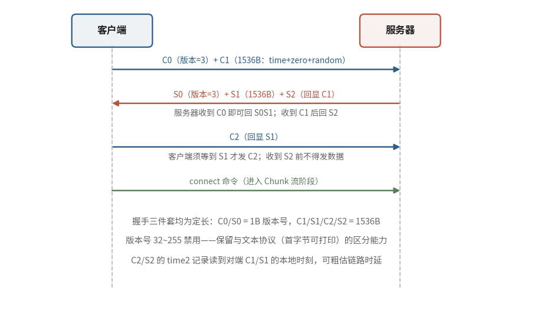

# 7.3.2 握手：C0/C1/C2 与 S0/S1/S2（The RTMP Handshake）

上一节的结尾埋了一个说法：RTMP 的握手 "不太像握手"。这不是修辞，规范开篇就承认，握手阶段与协议其余部分格格不入：**它由三个定长数据块组成，不带任何头部** [\[1\]][ref]。握手之后，线上跑的全是下一节要讲的变长 Chunk；而握手这三板斧，每个方向固定 1 + 1536 + 1536 = 3073 字节，一个 bit 都不多。客户端发出的三块记作 C0、C1、C2，服务器对应回以 S0、S1、S2。

## **C0/S0：一个字节的版本默契**

握手由客户端发起，C0 与 C1 接连送出。打头的 C0 只有 **1 个字节**：客户端请求的协议版本号。规范定义的版本是 **3**；0~2 是更早私有产品使用过的废弃值；4~31 保留给未来；**32~255 则被明令禁止** [\[1\]][ref]。

禁用区间的理由透着一股务实的老练：文本协议（HTTP、SMTP 之流）的报文总以可打印字符开头，而可打印字符的 ASCII 码恰好落在 32 以上。把 32~255 划为禁区，等于给 RTMP 留了一条永不与文本协议混淆的分界线，任何一个中间设备看到首字节小于 32，都能断定这不是文本流量。

服务器若不认识客户端请求的版本，规范给的台阶是 **回一个 3**，由客户端决定降级继续还是放弃握手 [\[1\]][ref]。一个字节，完成了版本协商的全部工作。

## **C1/S1：时间、全零与 1528 字节随机**

C1 与 S1 各长 **1536 字节**，结构三段式：

- **time（4 字节）**：一个时间戳。规范说它 *应当* 作为本端后续所有 Chunk 的时间原点，但也允许填 0 或任意值，实际实现里填 0 的比比皆是 [\[1\]][ref]
- **zero（4 字节）**：*必须* 全为 0，一个纯粹的占位符
- **random（1528 字节）**：任意随机数据。规范特意安慰读者：**无需密码学级别的随机**，甚至不需要每次连接都变 [\[1\]][ref]

既然不需要真随机，这 1528 字节存在的意义是什么？答案在 C2/S2 里。

## **C2/S2：回显即确认**

C2 与 S2 同样 1536 字节，字段是对 C1/S1 的 **近乎原样回显**：

- **time（4 字节）**：*必须* 等于对端在 S1（对 C2 而言）或 C1（对 S2 而言）里发来的时间戳，**原样奉还**
- **time2（4 字节）**：*必须* 填本端读到对端那个数据包时的本地时刻
- **random echo（1528 字节）**：*必须* 等于对端发来的那段随机数据 [\[1\]][ref]

至此真相大白：C1/S1 的随机块是 **一枚一次性的挑战信物**。把对端的随机数据原样回显，就是在字节层面证明 "我收到的确实是你的包，而不是撞上了另一条连接"，协议不需要安全随机，因为它防的不是攻击者，只是歧义。

time 与 time2 这对组合还附赠一个小功能：两端拿着对方的时间戳和自己读到包的本地时刻，可以快速估算链路的时延与带宽。不过规范对这句赠言的评价相当耿直，"但估计也没什么用"（unlikely to be useful）[\[1\]][ref]。规范文本里难得的幽默感，照单收下。

## **时序约束与状态机**

三块数据的交换顺序不是随意的，规范用一组 MUST 把节奏钉死 [\[1\]][ref]：

- **客户端**：C0、C1 接连发出；*必须等到 S1* 才能发 C2；*必须等到 S2* 才能发任何其他数据
- **服务器**：收到 C0 即可回 S0、S1（也允许等 C1 到了再一起回）；*必须等到 C1* 才能发 S2；*必须等到 C2* 才能发任何其他数据

<figure>
   
    <figcaption>
      
图 7-5 RTMP 握手时序：三个定长块的交换与发送约束（蓝：客户端发出；红褐：服务器应答；绿：握手完成后的首条命令）

   </figcaption>
</figure>

配合这张时序图，规范还给双方各定义了一台四态状态机：

<b>Uninitialized（发版本） → Version Sent（等对端 1 号块） → Ack Sent（等对端 2 号块） → Handshake Done（开始交换消息）</b>

注意这台状态机只认 "第几块" 不认内容：进入 Handshake Done 的条件是收到对端的 C2/S2，规范并未要求逐字节校验回显。**约束的意义在于节奏而非内容**，它保证双方在动手传消息之前，各自都完整走完了一遍收发循环，TCP 连接的双向可用性由此得到最便宜的一次验证。

握手解决的是 "你是谁、版本几、线路通不通"。门一推开，真正的主角才登场：握手完成后的 RTMP 连接，开始在一条 TCP 上 **多路复用若干条 Chunk 流**，音视频、命令、控制消息挤在同一根管道里，大消息切片让路，小消息见缝插针 [\[1\]][ref]。这套切分机制是 RTMP 全部灵活性的来源，也是 7.3.3 的主题。

[ref]: References_7.md
