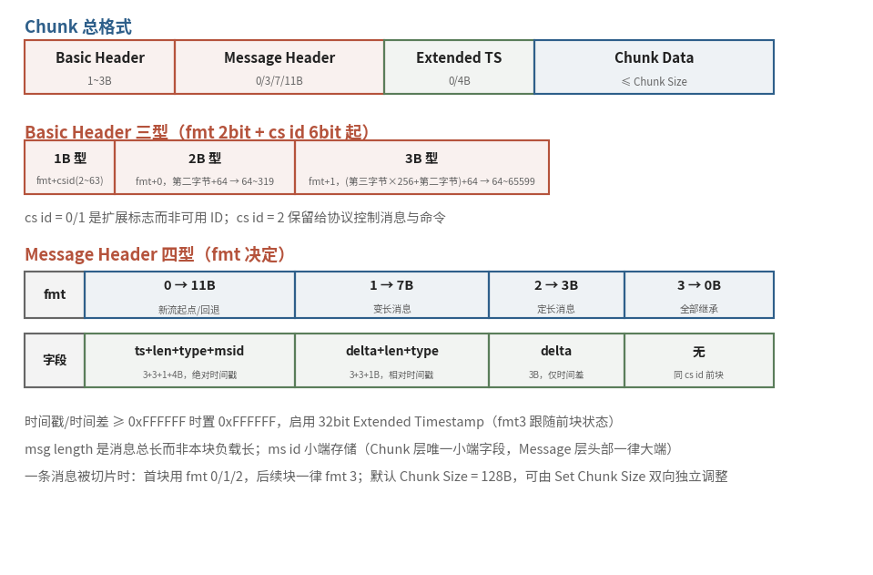

# 7.3.3 Chunk 封包：一次消息，多次封装（Chunking & Header Compression）

上一节握完手，门后的世界豁然开朗：RTMP 连接开始在一条 TCP 上 **多路复用** 若干条 Chunk 流。音视频消息动辄几十 KB，命令消息却只有几十字节，它们挤在同一根管道里，凭什么互不耽误？答案就是本节的主角：Chunk 封包机制。它是 RTMP 全部灵活性的来源，也是这套协议里最考验字节功夫的部分。

## **为什么要切：大消息必须学会让路**

规范把动机讲得很直白：高层的大消息要切成小片交错发送，**防止低优先级的大消息（比如视频）堵住高优先级的小消息（比如音频与控制消息）** [\[1\]][ref]。直播时声音永远比画面金贵，画面卡一帧未必察觉，声音断百毫秒立刻出戏。切片的另一重收益是 **头部压缩**：消息的属性（时间戳、长度、类型、流 ID）不必每片都带，Chunk 头只携带增量信息。

切多大，是一门生意。**默认 Chunk Size 为 128 字节**，双端可用 Set Chunk Size 控制消息各自调整本方向的切片大小，注意是 **双向独立**，上行下行的切片尺寸可以不同 [\[1\]][ref]。规范对取值的提点很实在：大片省 CPU，但一次写入大，低带宽下会延误其他内容；小片则扛不住高码率流。工程上的常见做法是把推流方向的切片大幅调高，7.6 节的实战抓包里，我们会亲眼看到 ffmpeg 把它协商到 65536 字节的实例。

## **总格式：四段式**

每个 Chunk 由头部与数据组成，头部再分三段 [\[1\]][ref]：

<b>Basic Header（1~3B） → Message Header（0/3/7/11B） → Extended Timestamp（0/4B） → Chunk Data（≤ Chunk Size）</b>

<figure>
   
    <figcaption>
      
图 7-6 Chunk 封包总览：总格式、Basic Header 三型与 Message Header 四型（红褐：Basic Header；米黄：Message Header；绿：扩展时间戳与字段构成；蓝：负载与 fmt 型别）

   </figcaption>
</figure>

三段头部的长度全是变量：Basic Header 随 chunk stream ID 伸缩，Message Header 随 fmt 型别伸缩，Extended Timestamp 只在时间戳溢出时现身。逐段拆开看。

## **Basic Header：fmt 与 cs id 的变长编码**

Basic Header 的第一字节永远长一个模样：**高 2 位是 fmt**（决定 Message Header 的型别），**低 6 位是 cs id**（chunk stream ID）。6 个 bit 最多表达到 63，超出怎么办？RTMP 的解法是拿低值当标志位，于是有了三种形态 [\[1\]][ref]：

| 形态 | 首字节低 6 位 | ID 计算 | 可表达的 cs id 范围 |
|---|---|---|---|
| 1 字节 | 2~63 | 即 cs id 本身 | 2~63 |
| 2 字节 | **0**（扩展标志） | 第二字节 + 64 | 64~319 |
| 3 字节 | **1**（扩展标志） | 第三字节 × 256 + 第二字节 + 64 | 64~65599 |

这张表有三个易错点，务必一次记清：**cs id 0 与 1 是扩展标志，不是可用 ID**；**cs id 2 保留给协议控制消息与命令**，不可挪作他用；扣除三者，协议实际支持 3~65599 共 65597 条 Chunk 流 [\[1\]][ref]。规范建议永远使用能容下 ID 的最小形态，64~319 这段两型皆可，选 2 字节即可。

cs id 在 RTMP 里是个值得建立直觉的概念：**一条 Chunk 流通常专送一种类型的消息**，同一 Chunk 流里 multiplex 多条消息流虽被允许，却会让头部压缩失效，规范劝你别这么干 [\[1\]][ref]。

## **Message Header：头部压缩的四级阶梯**

fmt 字段从四种型别里挑一种，压缩程度逐级加深：

| fmt | 头长 | 携带字段 | 时间基准 | 典型用途 |
|---|---|---|---|---|
| 0 | 11B | timestamp(3) + msg length(3) + msg type(1) + ms id(4) | **绝对**时间戳 | Chunk 流起点必用；时间戳回退（如回退 seek）必用 |
| 1 | 7B | timestamp delta(3) + msg length(3) + msg type(1) | 相对前块的差值 | **变长**消息（如视频）每条新消息的首块 |
| 2 | 3B | timestamp delta(3) | 相对前块的差值 | **定长**消息（如音频、数据）每条新消息的首块 |
| 3 | 0B | 无 | 全部继承前块 | 同一消息的后续块；或属性可从前块推出的新消息 |

几个字段的语义要点：**msg length 是整条消息的总长，不是本块的负载长**，除最后一片外，每片负载都顶满 Chunk Size，最后一片装余数 [\[1\]][ref]。timestamp delta 记录与前一块的时间差。而 Type 3 有个容易漏看的规则：若紧跟在 Type 0 之后，它继承的 delta 就等于那个 Type 0 的绝对时间戳，规范甚至允许在满足此条件时跳过 Type 2 直接用 Type 3 开新消息 [\[1\]][ref]。

3 字节的时间字段能表达约 1677 万毫秒（4.6 小时），超长直播溢出怎么办？**溢出即置 0xFFFFFF，并追加 4 字节的 Extended Timestamp**，完整编码 32 位时间戳或差值；Type 3 块是否携带该扩展字段，跟随同 cs id 最近的 Type 0/1/2 的状态 [\[1\]][ref]。

## **官方示例：压缩收益的实证**

空说压缩不如看账。规范给了两组示例 [\[1\]][ref]，第一组是四条 32 字节的音频消息（ms id 12345，type 8，时间戳 1000 起、间隔 20ms），在同一条 cs id = 3 的 Chunk 流上依次发出：

| Chunk | fmt | 头部字节 | 负载 | 总字节 | 说明 |
|---|---|---|---|---|---|
| #1 | 0 | 1 + 11 | 32 | **44** | 新流起点，全字段报到 |
| #2 | 2 | 1 + 3 | 32 | **36** | 定长消息，只报 delta = 20 |
| #3 | 3 | 1 + 0 | 32 | **33** | 尺寸、间隔全同，头部归零 |
| #4 | 3 | 1 + 0 | 32 | **33** | 每消息开销稳定在 1 字节 |

头部占比从 27% 一路压到 3%，定长、等间隔的音频流几乎实现了零开销传输。第二组是一条 307 字节的视频消息（type 9），在默认 128 字节切片下拆成三片：

<b>首片 fmt 0（1 + 11 + 128 = 140B） → 续片 fmt 3（1 + 0 + 128 = 129B） → 末片 fmt 3（1 + 0 + 51 = 52B）</b>

首片的 msg length 写明全长 307，后续两片凭 cs id 认领归队，Type 3 的双重身份在此显形：它既是 "同一条消息的续片"，也能当 "属性可推的新消息的首块" [\[1\]][ref]。

## **一个字节序陷阱**

最后留一个抓包时必踩的坑：Chunk 头里 4 字节的 **ms id 是小端存储** [\[1\]][ref]，而它是这一层唯一的小端字段，到了 Message 层，头部一律大端（下一节即见）。同一份协议里两种字节序并存，初次手写解析器的人十有八九在这里栽过。

账算到这里，规则已齐。本章【[在线展示](Playground_7.md)】备了一台 **RTMP Chunk 切片模拟器**：亲手调整消息长度与 Chunk Size，观察切片数量、fmt 选择与头部开销的此消彼长，比盯着表格更能长出直觉。

Chunk 机制回答的是 "怎么切、怎么拼"：四段式格式、三型 Basic Header、四级 Message Header 压缩阶梯，外加 128 字节起步的可调切片。可拼回去的消息究竟是什么，type 8、9 之外还有哪些类型，命令消息里的字符串又是用什么编码写的？7.3.4 我们打开 Message 的类型族与 AMF 编码。

[ref]: References_7.md
