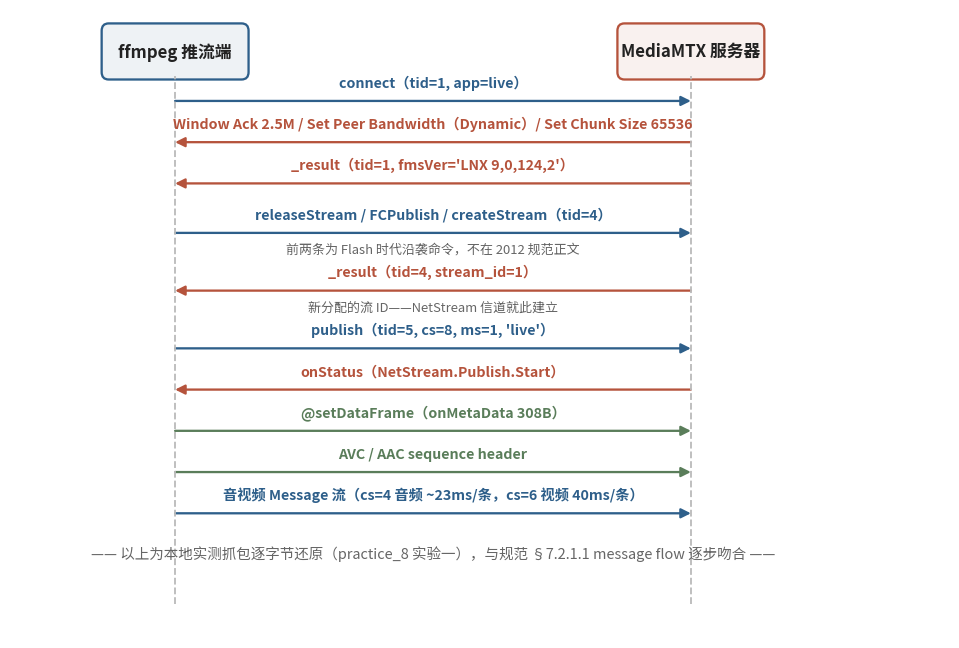

# 7.3.5 命令消息与流管理时序（Commands & Stream Management）

上一节结尾许诺了一场 "完整舞步"：从建立连接到开播，RTMP 的命令如何依次登场。本节兑现它——先立起双层信道的概念骨架，再按规范的官方时序走一遍，最后用一份真实抓包印证：文本与实现，一步不差。

## **双层信道：NetConnection 与 NetStream**

RTMP 的会话管理是两层结构 [\[1\]][ref]：

- **NetConnection**：客户端应用与服务器之间的双向连接本体，同时承载异步远程方法调用。规范里有一句极易读反的话——**NetConnection 本身就是 stream ID 0 的默认信道**；协议控制消息与少数命令消息（包括 createStream）都走这条默认信道
- **NetStream**：架在 NetConnection 之上的逻辑流信道，音视频与数据消息经此流动。一条 NetConnection 可以撑起多条 NetStream，多路流并行不悖

**createStream** 就是两层之间的桥：客户端在默认信道（stream ID 0）上发出该命令，服务器以 `_result` 应答，返回值是 **新分配的非零 stream ID**——一条 NetStream 信道就此诞生，后续的 publish、play 与媒体消息全部以这个新 ID 为坐标。记住这个分工：ID 0 归连接层，媒体信道一律使用新分配的非零 ID。

## **connect：六步建立应用连接**

会话的第一条命令永远是 connect，它请求接入服务器上的某个应用实例。命令对象里最受关注的参数是 `app`（应用名）与 `tcUrl`（形如 `rtmp://host:port/app/instance` 的服务器地址）。规范给出的执行时序是教科书级的六步 [\[1\]][ref]：

<b>connect → 服务器回 Window Ack Size → 服务器回 Set Peer Bandwidth → 客户端回 Window Ack Size → 服务器发 User Control（StreamBegin） → 服务器回 _result</b>

两个细节值得圈点。其一，connect 的 Transaction ID **恒为 1**——它是每条连接的第一笔交易，编号没有悬念；应答的 `_result` 里捎带服务器自报家门的信息（fmsVer 版本串、capabilities 能力位）与连接状态（level/code/description、objectencoding 等）。其二，第 2~4 步正是 7.3.4 那套流控五件套的实战亮相：连接一建立，双方便先交换窗口与限速参数，把发送节奏的笼头戴好，再谈正事。

顺带交代 NetConnection 命令集的另外三名成员：call 是通用 RPC 入口（不需应答时 Transaction ID 传 0）；**close 虽在规范命令集之列，却未定义报文格式**，实际行为需双端协定 [\[1\]][ref]；createStream 已如前述。

## **NetStream 命令族与 onStatus 应答**

流信道上的客户端命令共九条：play、play2、deleteStream、closeStream、receiveAudio、receiveVideo、publish、seek、pause [\[1\]][ref]。其中几条的要点：

- **publish**：以某个名字把流发布到服务器，任何客户端凭此名即可播放。Publishing Type 三选一——live（直播不落盘）、record（录制为新文件，同名覆盖）、append（追加录制，无文件则新建）。Transaction ID 置 0，服务器以 onStatus 标记发布开始
- **play**：播放请求的应答流程同样程式化——服务器先发 Set Chunk Size，再发 User Control（StreamIsRecorded，仅录制流时）与 StreamBegin，随后 onStatus 报告 NetStream.Play.Start（带 reset 标志时先报 Play.Reset；流不存在则报 NetStream.Play.StreamNotFound），最后音视频数据长驱直入
- **play2**：play 的码率切换版——不换时间轴即可切到另一档码率的流，服务器为同一内容备有多档文件。算是自适应码率的远古先声

服务器的所有流状态通知，统一走 **onStatus** 命令：Transaction ID 恒为 0、无命令对象、信息对象至少含 level（warning/status/error）、code（如 NetStream.Play.Start）、description 三要素 [\[1\]][ref]。推流、拉流、寻址、报错，全部经这一扇门通报。

## **规范之外的 "行规"**

把抓包软件架到真实推流现场，你会看到几条规范里查无此文的命令：**releaseStream、onFCPublish、onFCUnpublish、unpublish**。它们源自 Flash Media Server 时代的文档与实现惯例，**未被收录进 RTMP v1.0 规范**——但几乎所有服务器都照单实现，推流端也就照单发送 [\[1\]][ref]。这是 7.3.1 说过的 "文本只是下限，实现才是现实" 的最佳注脚：读 RTMP 流量时见到它们，不必惊慌，知道是历史沿袭的行规即可。

## **实测时序：把规范走一遍**

空谈不如实证。我们在本地架起 MediaMTX 服务器，用 ffmpeg 推一路直播流，把线上的字节逐段还原成时序（完整抓包分析留待 7.6 节展开）：

<figure>
   
    <figcaption>
      
图 7-7 推流会话实测时序：从 connect 到媒体流（蓝：推流端命令；红褐：服务器应答；绿：元数据与媒体数据）

   </figcaption>
</figure>

对照规范逐条认领，吻合度令人满意：connect（tid = 1，app = live）之后，服务器按剧本回以 Window Ack（2.5M）、Set Peer Bandwidth（2.5M，Dynamic）与 Set Chunk Size（**65536**——7.3.3 提过的调大切片，在此现形）；`_result` 里 fmsVer 自报 `LNX 9,0,124,2`、capabilities = 31。随后的 releaseStream 与 FCPublish 正是上文说的行规两条；createStream（tid = 4）换回 **stream_id = 1**，新信道就位。

publish（tid = 5，走 cs = 8、ms = 1）得到 onStatus（NetStream.Publish.Start）确认后，推流端先送 **@setDataFrame 元数据**（308 字节，时长、分辨率、码率、帧率一应俱全），再送 **AVC / AAC 的 sequence header**——7.1.3 讲 FLV 时见过的 "先送配置、再流数据" 两段式，在线上原样复刻。此后媒体流源源不绝：音频走 cs = 4、约 23 毫秒一条，视频走 cs = 6、每 40 毫秒一条（25 fps），各占一条 Chunk 流，互不阻塞——7.3.3 的 "一条 Chunk 流专送一类消息"，在抓包里同样是铁律。

## **小结：TCP 王朝的全景，与它的天花板**

回看 7.3 全节：握手定身份，Chunk 管切拼，Message 分类型，命令排时序——四层叠起，一场直播在 TCP 上运转如飞。这套设计的代价也同样清晰：队头阻塞悬在头顶，秒级延迟写在基因里，而浏览器播放端早已投 HTTP 怀抱。当行业想要更低成本的分发、更普惠的播放，把直播搬进 HTTP 就成了历史的必然——下一节的主角 HLS，把这场搬家做到了极致。

[ref]: References_7.md
