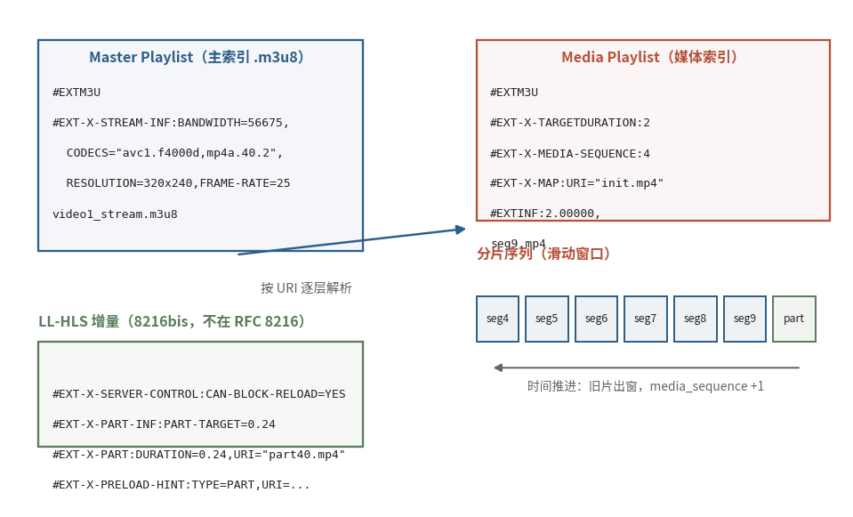

# 7.4.2 两级播放列表：Master 与 Media（Master & Media Playlists）

上一节说，播放器的工作退化为 "定时拉列表、按列表拉分片"。那份列表就是 HLS 的骨架，一份纯文本的 m3u8，却承担着指路、协商、容错三重职责。打开它之前，先建立第一个认知：HLS 的列表是 **两级** 的。

## **为什么不是一张表**

一路直播通常备有多档码率（高清、标清、省流），客户端要按网络状况随时切换。若把全部信息塞进一张表，切换时就得重新解析所有分片条目，臃肿且易错。HLS 的解法是分层：

<center><b>Master Playlist（主索引：有哪些变体流） → Media Playlist（媒体索引：这条流有哪些分片） → Media Segment（分片本体）</b></center>

主索引只管 "花名册"，媒体索引只管 "流水账"，逐层按 URI 解析。客户端凭 URI 后缀（.m3u8/.m3u）或 Content-Type（application/vnd.apple.mpegurl）认出 "这是一份播放列表"；至于是哪一级，看内容便知，**出现 EXT-X-STREAM-INF 的就是主索引**，后缀从来不是判据 [\[8\]][ref]。

## **主索引：变体流的花名册**

这是一份真实的 Master Playlist（来自本书 7.6 节实战的本地推流，LL-HLS 版本，已略去会话参数）：

```
#EXTM3U
#EXT-X-VERSION:10
#EXT-X-INDEPENDENT-SEGMENTS
#EXT-X-MEDIA:TYPE=AUDIO,GROUP-ID="audio",NAME="audio2",AUTOSELECT=YES,DEFAULT=YES,URI="audio2_stream.m3u8"
#EXT-X-STREAM-INF:BANDWIDTH=56675,AVERAGE-BANDWIDTH=56675,CODECS="avc1.f4000d,mp4a.40.2",RESOLUTION=320x240,FRAME-RATE=25.000,AUDIO="audio"
video1_stream.m3u8
```

逐行认领：`#EXTM3U` 是雷打不动的文件头；`#EXT-X-VERSION:10` 声明用到的最高协议版本；`#EXT-X-MEDIA` 登记了一条独立音轨（多语言、多音轨都靠它编组）；主角 `#EXT-X-STREAM-INF` 用一行属性描述一条 **Variant Stream（变体流）**，峰值码率、编码格式、分辨率、帧率，紧跟的下一行 URI 指向它的媒体索引 [\[8\]][ref]。这行属性是客户端选档的全部依据，每个字段的精确口径留到 7.4.4 细算。

## **媒体索引：分片的流水账**

跟进 `video1_stream.m3u8`，同一实测的 Media Playlist 长这样：

```
#EXTM3U
#EXT-X-VERSION:10
#EXT-X-TARGETDURATION:2
#EXT-X-SERVER-CONTROL:CAN-BLOCK-RELOAD=YES,PART-HOLD-BACK=0.60000
#EXT-X-PART-INF:PART-TARGET=0.24000
#EXT-X-MEDIA-SEQUENCE:1
#EXT-X-MAP:URI="c20fa4464e78_video1_init.mp4"
#EXTINF:1.92000,
c20fa4464e78_video1_seg7.mp4
```

结构一望而知：头部一串 `#EXT-X-` 标签交代全局规则，最大分片时长、列表起始序号、fMP4 初始化段的 URI；此后每个分片占两行，`#EXTINF` 报时长（秒，可小数），下一行是 URI [\[8\]][ref]。其中 EXT-X-SERVER-CONTROL 与 EXT-X-PART-INF 两行是 LL-HLS 的增量标签（不属于 RFC 8216，出自 8216bis 草案），7.4.5 再拆；EXT-X-MAP 指向的初始化段则牵出 fMP4 分片的容器学问，7.4.3 细讲。

## **一图看全骨架**

<center>
<figure>
   
    <figcaption>
      <p>图 7-8 HLS 两级播放列表与直播滑动窗口（蓝：主索引与分片序列；红褐：媒体索引；绿：LL-HLS 增量标签与分片内 part）</p>
   </figcaption>
</figure>
</center>

图右下角的 "滑动窗口" 是直播场景的灵魂：媒体索引不是一份只增不改的档案，而是一个随时间推移的窗口，新分片在尾部追加，旧分片从头部移除，`EXT-X-MEDIA-SEQUENCE` 随之递增。播放器定时重拉列表，比对序号就知道哪些分片是新面孔。这套窗口机制的运转规则，全写在 TARGETDURATION 与 MEDIA-SEQUENCE 两个标签的精确语义里。

两级体系至此清晰：主索引登记变体流、媒体索引流水记账，文本格式换来了无与伦比的调试与代理友好性，任何抓包工具、任何文本编辑器都能读懂一场直播的目录。但列表里的标签个个有脾气：TARGETDURATION 写错了会卡顿，MEDIA-SEQUENCE 错位了会丢片。7.4.3 我们逐字拆解这些标签的语义，顺便把 TS 与 fMP4 两种分片载体的容器知识接回 7.1。

[ref]: References_7.md
