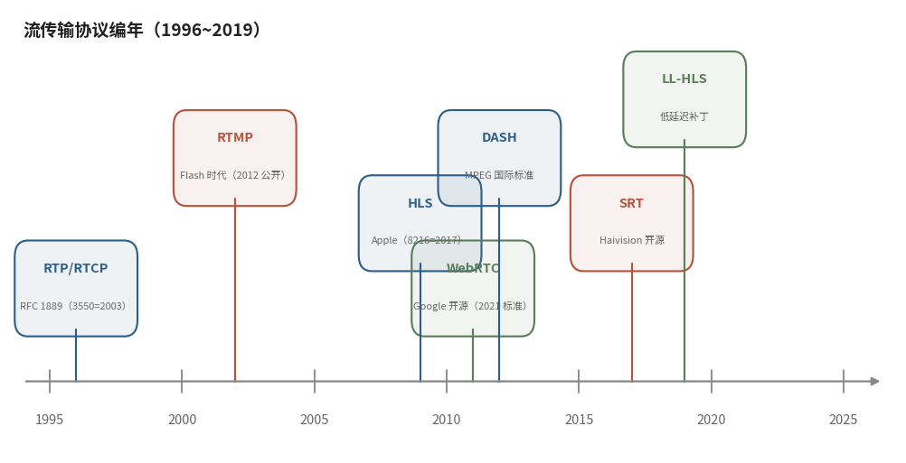

# 7.5.4 编年史与全景对照（A Chronicle & The Big Picture）

7.5.3 的结尾邀请我们退后一步。这个距离是必要的，贴着看，每个协议都是一堆字段与状态机；拉开四分之一个世纪的纵深，它们其实是一场接力：每一代接过上一代的痛点，交出自己时代的答案。

## **二十四年，六代协议**

<figure>
   
    <figcaption>
      
图 7-9 流传输协议编年（1996~2019）：每一代协议都在回答自己时代的痛点（蓝：基石与 HTTP 分发系；红褐：推流回传系；绿：实时互动系与低延迟补丁）

   </figcaption>
</figure>

**1996 年，RTP** 为组播会议室而生，定下 "实时压倒一切" 的价值观，此后三十年成为一切实时系统的地基。**2002 年前后，RTMP** 随 Flash 王朝统治直播，抱住 TCP 的可靠性，用秒级延迟换一路安稳。**2009 年，HLS** 把直播切成文件搬进 HTTP，生态红利尽收，延迟账单也高悬。**2011 年，WebRTC** 让实时通话跑进浏览器，RTP 血缘穿上 ICE 与加密的新衣。**2012 年，DASH** 以国际标准的身份把自适应流纳入厂商中立的轨道。**2017 年，SRT** 开源，用 UDP+ARQ 攻克公网弱网回传。**2019 年，LL-HLS** 给老将 HLS 打上低延迟补丁，分片之内再切片，亚秒俱乐部迎来 HTTP 系成员。

细看这张编年图，一条暗线若隐若现：**没有哪一代协议真正死去**。RTP 活在 WebRTC 的骨髓里，RTMP 守着推流端的长尾，TS 容器在 HLS 分片里服役至今，新技术更多是分工的细化，而非王朝的清零。

## **全景对照表**

| 协议 | 年代 | 传输层 | 延迟量级 | 典型场景 | 现状 |
|---|---|---|---|---|---|
| RTP/RTCP | 1996（RFC 3550 = 2003） | UDP | 亚秒 | 会议、监控、WebRTC 底座 | 实时基石 |
| RTMP | 2002（Flash 时代）→ 2012 公开 | TCP | 3~5 s | 直播推流 | 推流存量大，播放端退役 |
| HLS | 2009（RFC 8216 = 2017） | HTTP/TCP | 10~30 s（LL- 后 2~3 s） | 移动端点播与直播分发 | 分发主流 |
| DASH | 2012 | HTTP/TCP | 同 HLS | 厂商中立分发 | 与 HLS 经 CMAF 合流 |
| WebRTC | 2011（2021 标准） | UDP/SRTP | <1 s | 连麦互动、实时通信 | 互动首选 |
| SRT | 2013 推出、2017 开源 | UDP+ARQ | 亚秒~秒级可配 | 公网回传、第一公里 | 回传主流 |

把这张表竖着读是编年，横着读则是分工：**推流回传**看 RTMP 与 SRT，**大规模分发**看 HLS 与 DASH，**实时互动**看 WebRTC，一场现代直播，常常是三者同框的混合架构。

## **演进的内在逻辑**

二十四年的接力里，藏着三条值得带走的逻辑。

**其一，天平配重的光谱化。** 从 7.2 的 "可靠性 - 实时性" 天平出发，每个协议都是光谱上的一个配重点：RTP 押极端实时，SRT 在 UDP 上加回可控的可靠，RTMP 退到秒级换安稳，HLS 用文件粒度换生态，LL-HLS 再把配重往回拨。没有最优解，只有场景的解。

**其二，分层解耦的复利。** 容器、编码、传输三层各自演进，接口却保持默契：FLV 的 CodecID 顶到天花板，enhanced-RTMP 用 FourCC 扩展字段把 HEVC、AV1 接进老协议 [\[6\]][ref]，7.1.3 与 7.3.1 的伏笔在此兑现；CMAF 则让 HLS 与 DASH 共享同一套分片。层与层解耦得越干净，单点升级的成本就越低，老兵也就越不必退役。

**其三，生态决定存亡。** RTMP 的播放端随 Flash 殉葬，推流端却靠存量部署长生不老；HLS 的技术新意有限，却凭 HTTP 生态三十年积累的基础设施通吃分发。协议之争的胜负手，往往不在协议文本之内。

第七章的协议巡礼到此收官：容器的秩序、RTP 的价值观、RTMP 的四层叠构、HLS 的文件哲学、现代群像的分工与编年。但纸面上的字段终归要在线上跑起来才算数。7.6 我们就推一路真实的 RTMP 流、逐字节拆解抓包，再拉起一条 LL-HLS 流量量一量延迟成色，用两个实验给全章盖上实践的印章。

[ref]: References_7.md
