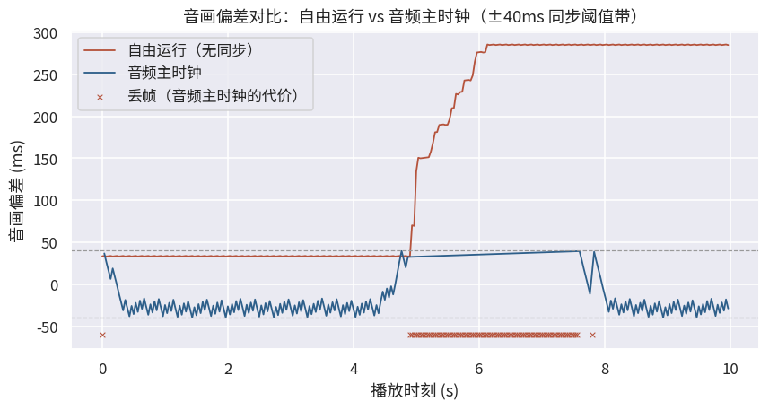

# 8.3 实战：音画同步策略对比实验（practice_9）

8.2 把播放器核心系统拆成了理论零件：水位、主时钟、缓冲、渲染。本节让这些零件转动起来——用 PyAV（FFmpeg 的 Pythonic 绑定 [\[7\]][ref]）造一台播放器骨架，灌入真实素材，再给它施加受控的解码压力，亲眼看看：**有同步策略与没有同步策略，音画偏差的命运相差多远**。

## **任务定义与素材**

实验围绕一个对照展开：

- **自由运行（free-run）**：解出即播，帧间隔固定，不看音频时钟——放任 8.2.1 第三问的漂移发生
- **音频主时钟（audio-master）**：复刻 8.2.2 的 ffplay 规则——落后超 40ms 丢帧，超前超 40ms 等待，阈值取 `AV_SYNC_THRESHOLD_MIN`

素材是特制的同步测试片 **<a href="../../Examples/practice_9_av_sync_test.mkv" target="_blank">practice_9_av_sync_test.mkv</a>**（300 帧 / 30 fps / 10 秒）：画面中嵌着九次节拍闪动，音轨里嵌着九声节拍音，声画出厂偏差仅 0.3ms——仪器级对齐。用这样的素材做实验，任何偏差的帐都只能算在播放策略头上。

## **工程实现：一台离散事件播放器**

创建仿真脚本 **<a href="../../Examples/practice_9_player.py" target="_blank">practice_9_player.py</a>**（约两百行）。它不是真机播放器，而是一台**离散事件仿真的播放器骨架**——真素材、真 PTS、真音频节拍，唯解码耗时用受控模型注入。为什么要仿真而不实测真机？因为实验需要精确制造压力场景：真实机器的解码耗时不可控，而模型可以让第 3~6 秒恰好处于 "算力不足" 状态，让落后的发生与恢复都可复现（随机种子固定）。

模型的每一档设定都与 8.2 的机制一一对应：

- **音频是不可压缩的时间基准**：虚拟声卡每消费 1024 个采样走一个节拍（44.1kHz 下约 23ms），四百余个节拍构成主时钟的时间轴
- **解码有代价且不均**：常规帧 15~35ms，8% 的重帧 50~80ms；第 3~6 秒为持续压力段，解码均耗 1.5 倍——段内必然跟不上 33.3ms 的显示节拍，段后恢复，考验策略的追回能力
- **同步判决按 ffplay 规则**：`diff = 音频时钟 - 帧 PTS`，超阈即丢、负向超阈即等

## **实验结果：两种命运的偏差曲线**

同一份素材、同一份解码压力，两种策略的实测统计如下（完整逐帧记录见 practice_9_sync_results.json）：

| 策略 | 显示帧数 | 丢帧 | 偏差均值 | 偏差标准差 | 偏差极值 |
|---|---|---|---|---|---|
| 自由运行 | 300 | 0 | +150.8ms | 120.1ms | +285.5ms |
| 音频主时钟 | 217 | 83 | -22.3ms | 16.9ms | ±39.8ms |

<figure>
   
    <figcaption>
      
图 8-1 音画偏差对比（红色：自由运行单调爬升；蓝色：音频主时钟被摁在 ±40ms 阈值带内；红叉：丢帧时刻）

   </figcaption>
</figure>

数据替 8.2.2 的理论交出三份证词。

**第一，漂移不是风险，是必然。** 自由运行下，压力段（第 3~6 秒）一开始，偏差便以每帧数毫秒的速度单调爬升，段末已积到 285ms——画面比声音慢了近三分之一秒，口型与台词彻底分家。更残酷的是平台期：压力解除后偏差**不会自己回来**，欠下的时间债无人讨还，就这么一直拖到片尾。没有主时钟的播放器，不是 "可能" 不同步，是 "迟早" 不同步。

**第二，主时钟把偏差摁进阈值带，代价明码标价。** 音频主时钟下，偏差全程锁在 ±39.8ms 以内、标准差仅 16.9ms——人耳对 40ms 以内的音画偏差基本无感。代价写在丢帧列：83 帧候补在压力段被丢弃，换取队列不再积压。图 8-1 里那片密集的红叉，就是 "看得见的丢帧换听不出的同步" 这句账目的可视化。

**第三，追回是有弹性的。** 压力段结束后，蓝色曲线并未停在底部——随着解码恢复正常，超前帧被 "等待" 机制自然消化，偏差缓缓回到零轴附近。丢帧应对的是 "当下追不上"，等待消化的是 "曾经欠下的"，两个粗粒度动作一攻一守，覆盖了落后与恢复的全周期。

## **小结与延伸**

三百帧的小实验，把 8.2 的四块理论全部点亮了一遍：PTS 是判决的标尺（5.3.1），主时钟是纠偏的舵（8.2.2），队列水位是压力的缓冲区（8.2.3），丢与重是视频侧的粗粒度追随（8.2.2）。播放器不再是黑盒——它的每一次丢帧背后，都是一笔算得清的账。

**在线演示（见【在线展示】页）** 备好了本章的交互版本：音画同步模拟器。拖动偏差滑块、切换三种主时钟策略，亲耳听听 ±500ms 之间的世界差别——8.2.2 那句 "人耳对音频断续远比人眼对丢帧敏感"，亲手拨一遍就信了。

[ref]: References_8.md
