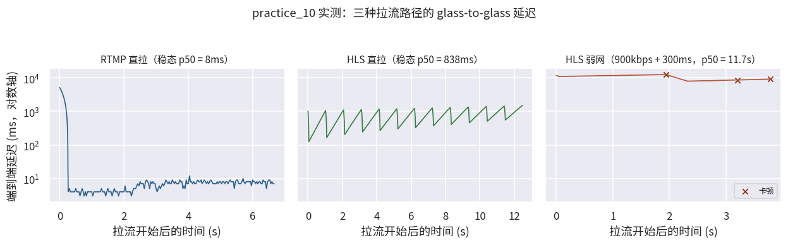

# 9.3 实战：链路搭建与质量分析（practice_10）

9.1 画好了链路地图，9.2 立好了度量体系，本节把它们同时按进真实流量里。我们在本机搭建一条完整直播链路，用条码测延法量出三种拉流路径的 glass-to-glass 延迟，再请弱网中继上场，亲眼看体验如何崩塌。7.4 关于分片延迟的全部论断、9.1.2 的四级分类、9.2.1 的指标口径，都将在数据里对账。

## **任务定义与链路**

实验链路全部本机闭环（角色与 9.1.1 的七站接力一一对应）：

<b>条码帧生成（采集） → ffmpeg 推流（RTMP） → MediaMTX（源站） → 三路拉流：RTMP 直拉 / HLS 直拉 / HLS 经弱网中继</b>

三相位各 12 秒采集窗，回答三个问题：

- **A1（RTMP 直拉）**：流式协议的延迟基线长什么样？
- **A2（HLS 直拉）**：分片机制的延迟税是多少？（验证 7.4 的论断）
- **B（HLS 经弱网中继）**：900kbps 限速 + 300ms 附加时延下，体验指标如何恶化？（9.2.1 口径的实战应用）

## **工程实现：条码测延与弱网中继**

**测延的依据**来自 9.1.2 的定义深意：glass-to-glass 的锚点钉在内容上而非报文上，所以我们让内容自己报时。推流端把真实墙钟**烧进画面**：顶部一条 56 格黑白点阵条码（8 格同步头 + 32bit 墙钟毫秒 + 16bit 帧序号），拉流端解码后按阈值判决读回，与本地墙钟相减即得端到端延迟。条码的健壮性已预验证：H.264 crf 23/28 两档往返 300 帧，56bit 全部精确恢复。一个小工程细节：纯静态画面的码率仅约 22kbps，弱网中继无压可施，帧底部加了一条噪声带，把码率抬到约 1.5Mbps，实验才有对照意义。

**弱网的注入**不走 netem（需 root 且 macOS 繁琐），而用自写的**用户态中继**（<a href="../../Examples/throttle_relay.py" target="_blank">throttle_relay.py</a>）：令牌桶限速只作用于下行，固定时延线保序转发，播放器连上中继，即置身于弱网。中继本身已过校验：1Mbps 下 512KB 耗时 3.81s（偏差 -9%，来自令牌桶初始满桶突发），100ms 附加时延下 RTT 从 0.7ms 抬到 110.9ms。

完整脚本见 **<a href="../../Examples/practice_10_link_quality.py" target="_blank">practice_10_link_quality.py</a>**（约 270 行，MediaMTX + ffmpeg + PyAV 全自动编排）。

## **实验结果：三条路径，三种命运**

实测统计如下（稳态口径：剔除各相位前 3 秒的追帧回放；完整逐帧记录见 practice_10_results.json）：

| 相位 | 延迟 p50 | 延迟 p95 | 卡顿（回放仿真） |
|---|---|---|---|
| A1 RTMP 直拉 | **8ms** | 9ms | 0 次 |
| A2 HLS 直拉 | **838ms** | 1303ms | 1 次 / 0.05s |
| B HLS 弱网 | **11.7s**（全程口径） | 12.6s | 4 次 / 1.51s（卡顿率 66%） |

<figure>
   
    <figcaption>
      
图 9-1 三种拉流路径的端到端延迟时间线（对数轴；左：RTMP 追帧曲线；中：HLS 分片节拍锯齿；右：弱网积压与卡顿）

   </figcaption>
</figure>

三组曲线教给我们三件事。

**第一，流式与分片的延迟差两个数量级。** RTMP 稳态 p50 仅 8ms，本机环回虽近，但数量级的差距是结构性的：流式协议帧到即转，分片协议必须等片段封口。图 9-1 左屏那条从 5 秒急速下坠的曲线也是一笔财富：拉流启动瞬间，播放器收到的是服务器 GOP 缓存里的积压帧，随后一路追帧到稳态，**稳态统计必须剔除追帧段**，否则均值会被这段尾巴彻底绑架（9.2.4 的口径教训，自己先踩一遍）。

**第二，HLS 的延迟曲线自带分片节拍。** 图 9-1 中屏的锯齿不是噪声：每次新分片（part）到达，延迟骤降一截，随后缓缓爬升，等待下一次到达，**分片机制的到达节奏，就刻在延迟曲线的齿距里**。稳态 p50 838ms，坐实了 7.4.5 的 LL-HLS 量级：分片税从传统 HLS 的十几秒压到了亚秒级，但对照 RTMP 的 8ms，"低延迟" 与 "流式" 的鸿沟依然肉眼可见。

**第三，弱网之下没有稳态，只有积压。** B 相位的延迟从 8 秒起步一路爬到 12.7 秒，供给速度追不上消费速度，缓冲不是稳定的水位而是不断决堤的循环：积压、卡死、重新起播、再积压。卡顿回放仿真同步恶化：4 次播放中断、累计 1.51 秒，有效播放占比不足四成。注意这条相位没有 "稳态" 可言，统计口径只能走全程，**弱网场景的 QoE 报表若只报稳态数字，会把最惨的真相过滤掉**。

一条本机链路，把第二大阶段的知识全部点亮了一遍：RTMP 与 HLS 的协议性格（第七章）化作两个数量级的延迟差，端到端延迟的定义（9.1.2）化作一根 56 格的条码，QoE 的指标口径（9.2.1）化作卡顿表里的 4 次中断。链路不再是地图上的箭头，它是一根可以被掐表、被施压、被解剖的真实管道。

**在线演示（见【[在线展示](Playground_9.md)】页）** 可以把 9.2.1 的双目标权衡亲手跑一遍：ABR 切换策略模拟器。同一段带宽波动曲线，保守与激进两种选档会走出截然不同的档位轨迹、换来不同的卡顿代价，那句 "最高画质与最低卡顿不可兼得"，拨几下参数便有分寸。

[ref]: References_9.md
